# Lab 01: Get Started with Azure AI Services

### Estimated Duration: 45 Minutes

## Overview

In this exercise, you'll get started with Azure AI Services by creating an **Azure AI Services** resource in your Azure subscription and using it from a client application. The goal of the exercise is not to gain expertise in any particular service, but rather to become familiar with a general pattern for provisioning and working with Azure AI services as a developer.

## Objectives

In this lab, you will complete the following tasks:

+ **Task 1:** Open the cloned folder in Visual Studio Code
+ **Task 2:** Provision an Azure AI Services resource
+ **Task 3:** Use a REST Interface
+ **Task 4:** Use an SDK

## Architecture diagram

.JPG)

## Task 1: Open the cloned folder in Visual Studio Code

In this task, you will learn how to **open the cloned folder in Visual Studio Code** to work with the project files for further development or modifications.

1. Double-click the **Visual Studio Code** shortcut on the desktop.

    .png)

1. Click on **Explorer (1)** from the left navigation bar, then select **Open Folder (2)**.

    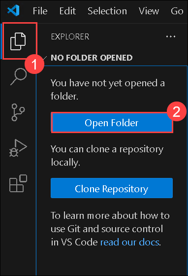

1. Open **`C:\AllFiles\AI-102-AIEngineer-stage` (1)** and then click on **Select Folder (2)**.

    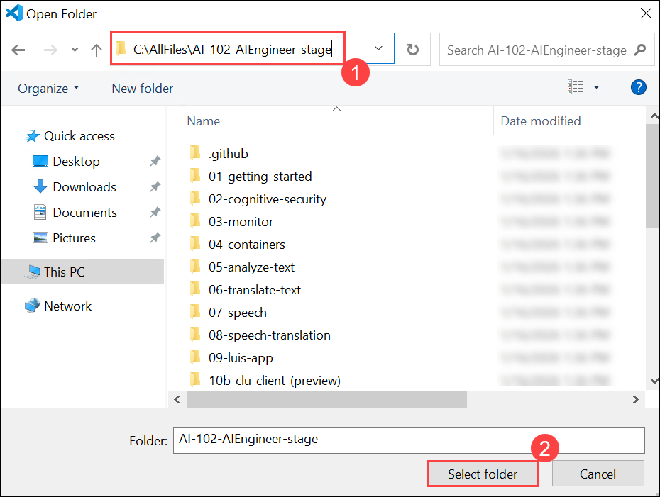

    >**Note:** On the **Do you trust the authors of the files in this folder?** pop-up, select **Yes, I trust the authors**.

    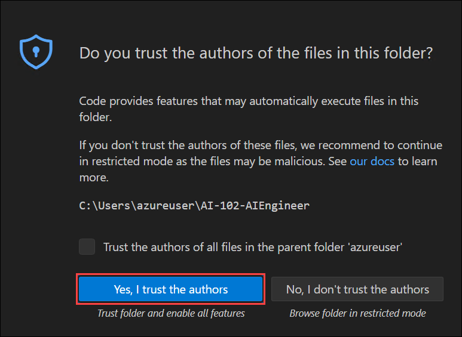

## Task 2: Provision an Azure AI Services resource

In this task, you will learn how to provision an Azure AI Services resource to enable AI-driven capabilities in your applications.

Azure AI Services are cloud-based services that encapsulate artificial intelligence capabilities you can incorporate into your applications. You can provision individual Azure AI services resources for specific APIs (for example, **Language** or **Vision**), or you can provision a single **Azure AI Services** resource that provides access to multiple Azure AI services APIs through a single endpoint and key. In this case, you'll use a single **Azure AI Services** resource.

1. Double-click the **Azure Portal** icon on the desktop.

    .png)

1. In the top search bar, search for **Microsoft Foundry (1)**, select **Microsoft Foundry (2)** from the result.

    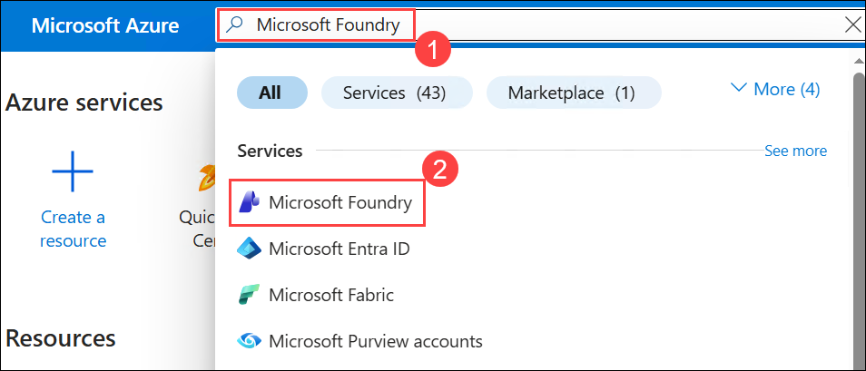

1. On the **Microsoft Foundry** home page, from the left navigation menu, under **Classic AI services (1)**, select **Azure AI services multi-service account (classic) (2)**, and then click **+ Create (3)**.

    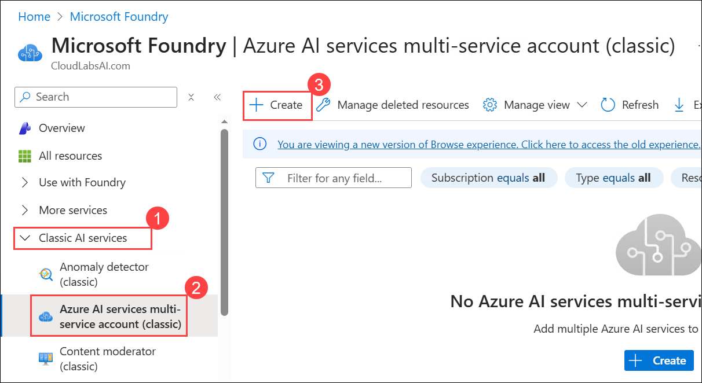

1. Create the resource with the following settings, then click on **Review + create (7)**.
    
    - **Subscription**: **Your Azure subscription (1)**
    
    - **Resource group**: **ai-102-<inject key="DeploymentID" enableCopy="false"/> (2)**
    
    - **Region**: **<inject key="Region" enableCopy="false"/> (3)**
    
    - **Name**: **azureai<inject key="DeploymentID" enableCopy="false"/> (4)**
    
    - **Pricing tier**: **Standard S0 (5)**

    - **By checking this box, I acknowledge that I have read and understood all the terms below**: Select the checkbox **(6)**

      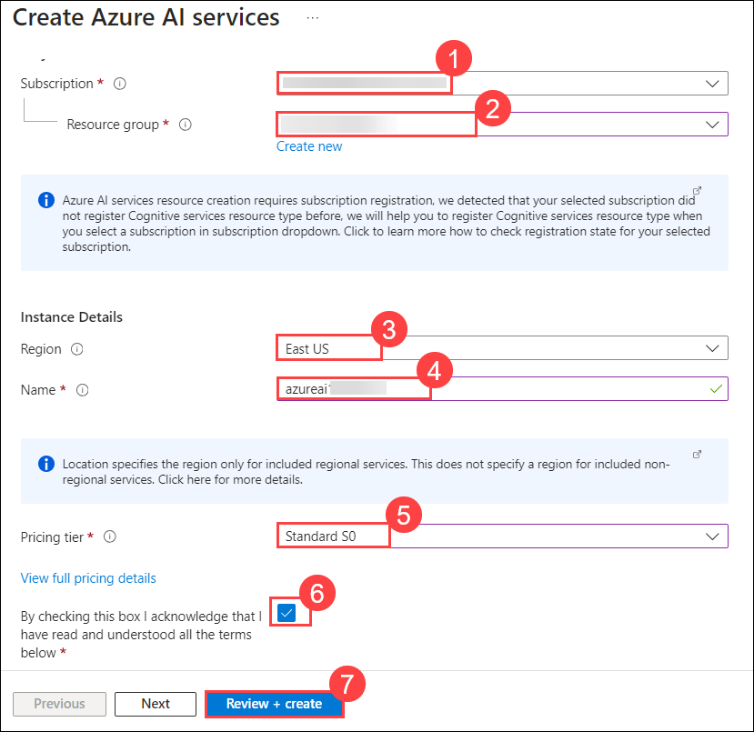    

1. Once the validation passes, click **Create**.

    .png) 

1. Wait for the deployment to complete, and then view the deployment details.

1. Click on **Go to resource**.

    .png)

1. From the left navigation menu, select **Resource management (1)** and then click **Keys and Endpoint (2)** under. This page contains the information that you will need to connect to your resource and use it from applications you develop. Specifically:
    
    - An HTTP **Endpoint** to which client applications can send requests.
    
    - Two **Keys** that can be used for authentication (client applications can use either key to authenticate).
    
    - The **location** where the resource is hosted. This is required for requests to some (but not all) APIs.

      >**Note:** Copy the values of **Endpoint (3)** and **Key 1 (4)**, in a notepad. You will use this in the next task.

      .png)        


> **Congratulations** on completing the task! Now, it's time to validate it. Here are the steps:
>
> - Hit the Validate button for the corresponding task. If you receive a success message, you can proceed to the next task.
> - If not, carefully read the error message and retry the step, following the instructions in the lab guide.
> - If you need any assistance, please contact us at cloudlabs-support@spektrasystems.com. We are available 24/7 to help.

<validation step="fe4194bf-9530-4184-8b85-c29e2532b9b6" />

## Task 3: Use a REST Interface

In this task, you will learn how to use a REST interface to interact with Azure services by making HTTP requests to manage resources and retrieve data.

The Azure AI services APIs are REST-based, so you can consume them by submitting JSON requests over HTTP. In this example, you'll explore a console application that uses the **Language** REST API to perform language detection, but the basic principle is the same for all of the APIs supported by the Azure AI services resource.

1. Open Visual Studio Code, in the **Explorer (1)** pane, browse to the **01-getting-started (2)** folder and expand the **C-Sharp (3)** folder.

    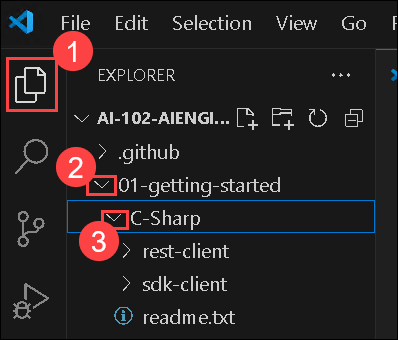

1. View the contents of the **rest-client** folder, and note that it contains a file for configuration settings:
    
    - **C#**: appsettings.json **(1)**

1. Open the configuration file and update the configuration values it contains to reflect the **endpoint (2)** and an authentication **key (3)** for your Azure AI services resource that you had copied earlier. **Save your changes**, by pressing **CTRL + S** on the keyboard.

    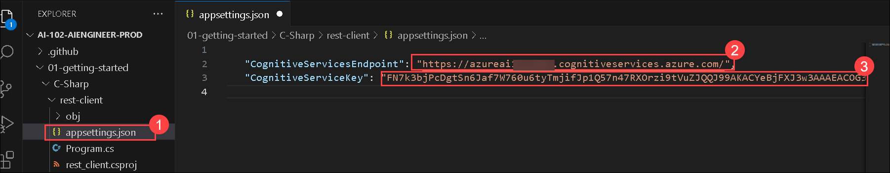

1. Note that the **rest-client** folder contains a code file for the client application:

    - **C#**: Program.cs **(1)**

1. Open the code file and review the code it contains, the following details:
    
    - Various namespaces are imported to enable HTTP communication
    
    - Code in the **Main (2)** function retrieves the endpoint and key for your Azure AI services resource - these will be used to send REST requests to the Text Analytics service.

      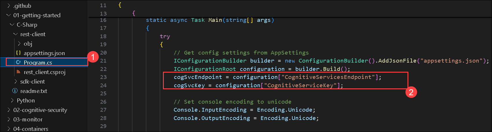    
    
    - The program accepts user input and uses the **GetLanguage** function to call the Text Analytics language detection REST API for your Azure AI services endpoint to detect the language of the text that was entered.
    
    - The request sent to the API consists of a JSON object containing the input data - in this case, a collection of **document** objects, each of which has an **id** and **text**.

      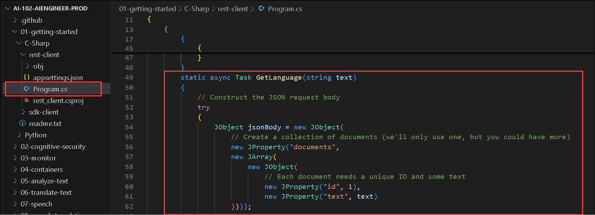        
    
    - The key for your service is included in the request header to authenticate your client application.
    
    - The response from the service is a JSON object, which the client application can parse.

1. Right-click on the **rest-client (1)** folder and then select **Open in Integrated Terminal (2)**. Then enter the following language-specific command to run the program:

    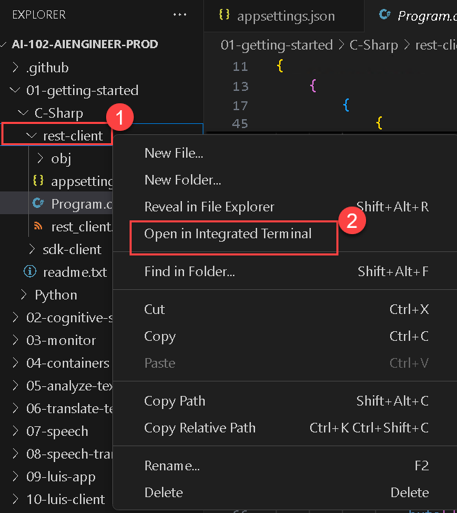

    **C#**

    ```
    dotnet run
    ```

1. When prompted, enter some text and review the language that is detected by the service, which is returned in the JSON response. For example, try entering "**Hello**", "**Bonjour**", and "**Hola**".

    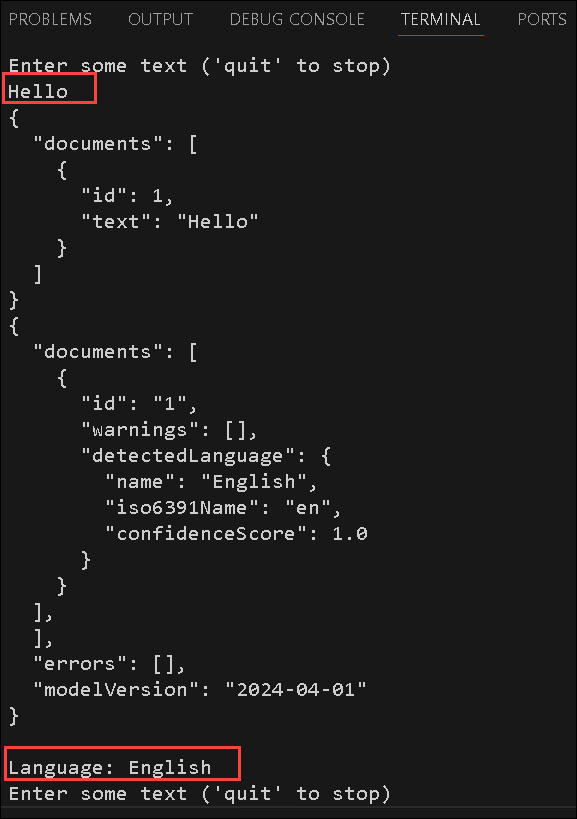

1. When you have finished testing the application, enter **`quit`** to stop the program.

## Task 4: Use an SDK

In this task, you will learn how to use an SDK to interact with Azure services programmatically, simplifying the process of managing resources and performing operations.

You can write code that consumes Azure AI services REST APIs directly, but there are software development kits (SDKs) for many popular programming languages, including Microsoft C#, Python, and Node.js. Using an SDK can greatly simplify the development of applications that consume Azure AI services.

1. In Visual Studio Code, in the **Explorer (1)** pane, in the **01-getting-started (2)** folder, expand the **C-Sharp (3)** folder. Right-click the **sdk-client (4)** folder and then select **Open in Integrated Terminal (5)**.

    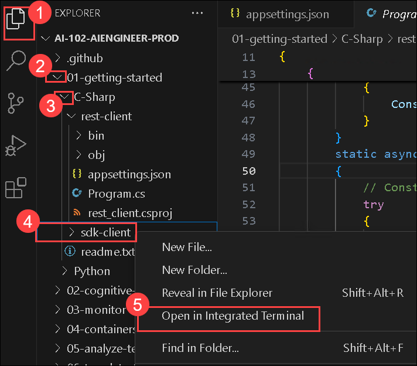

1. Then install the Text Analytics SDK package by running the appropriate command for your language preference:

    **C#**

    ```
    dotnet add package Azure.AI.TextAnalytics --version 5.3.0
    ```

1. View the contents of the **sdk-client** folder, and note that it contains a file for configuration settings:
    
    - **C#**: appsettings.json **(1)**

1. Open the configuration file and update the configuration values it contains to reflect the **endpoint (2)** and an authentication **key (3)** for your Azure AI services resource that you had copied earlier. **Save your changes** by pressing **Ctrl+S**.

    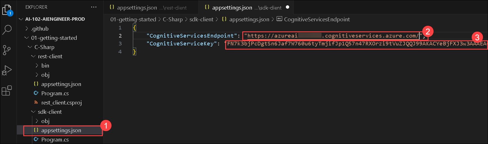
    
1. Note that the **sdk-client** folder contains a code file for the client application:

    - **C#**: **Program.cs**

1. Open the code file and review the code it contains, noting the following details:
    
    - The namespace for the SDK you installed is imported
    
    - Code in the **Main** function retrieves the endpoint and key for your Azure AI services resource - these will be used with the SDK to create a client for the Text Analytics service.

      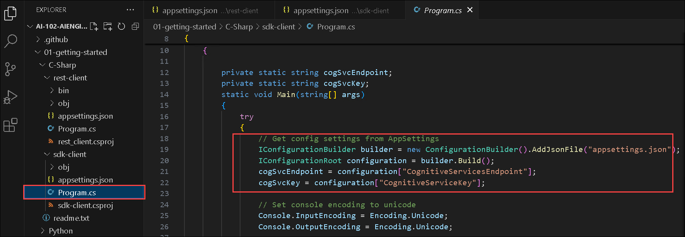        
    
    - The **GetLanguage** function uses the SDK to create a client for the service, and then uses the client to detect the language of the text that was entered.

      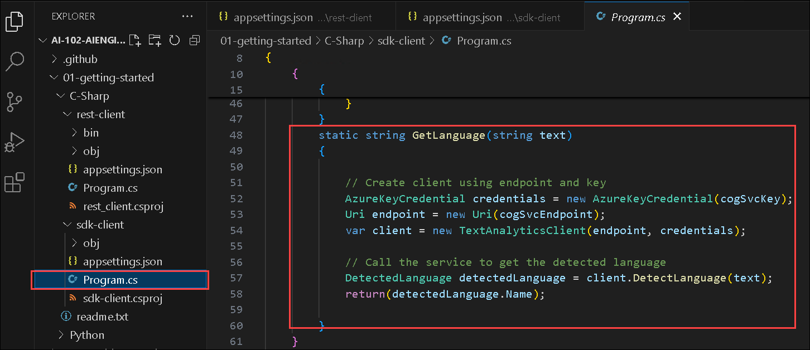        

1. Return to the integrated terminal for the **sdk-client** folder, and enter the following command to run the program:

    **C#**

    ```
    dotnet run
    ```

1. When prompted, enter some text and review the language that is detected by the service. For example, try entering "**Goodbye**", and "**Au revoir**".

    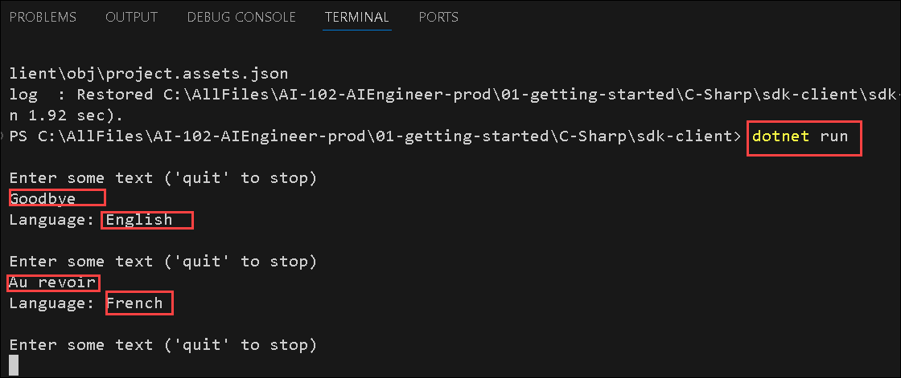

1. When you have finished testing the application, enter **`quit`** to stop the program.

    > **Note**: Some languages that require Unicode character sets may not be recognized in this simple console application.

## Summary
In this lab, you have completed:

- Opened the cloned folder in Visual Studio Code
- Provisioned an Azure AI services resource
- Used a REST Interface
- Used an SDK

### You have successfully completed the lab, click on Next >>.

.png)
