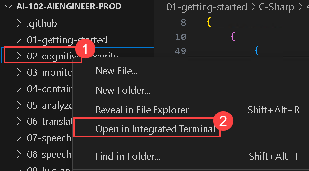
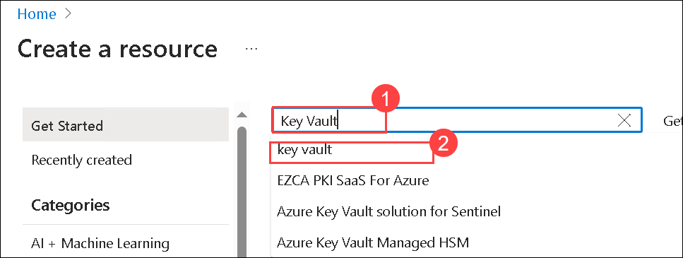
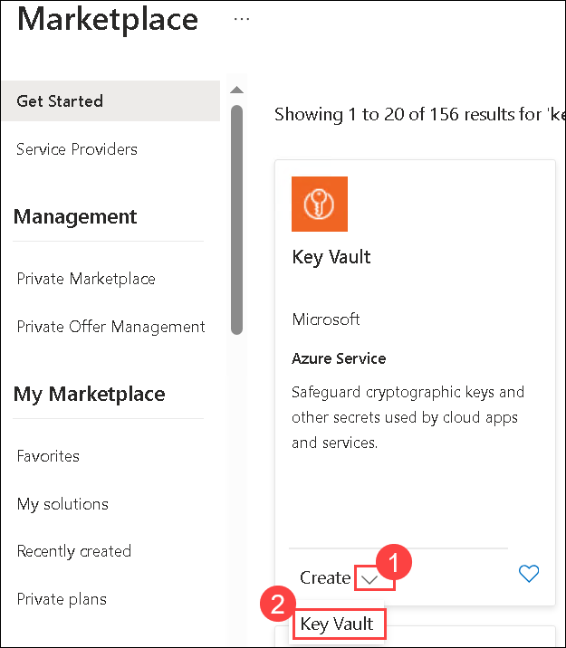
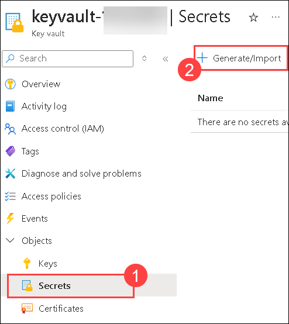
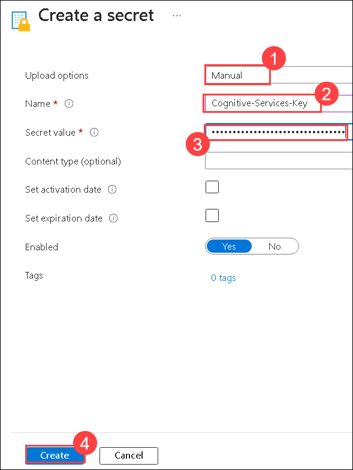

# Exercise 02: Manage Azure AI Services Security

## Lab scenario

Security is a critical consideration for any application, and as a developer you should ensure that access to resources such as Azure AI services is restricted to only those who require it.

Access to Azure AI services is typically controlled through authentication keys, which are generated when you initially create an Azure AI services resource.

## Objectives

In this lab, you will complete the following tasks:

+ Task 1: Manage authentication keys
+ Task 2: Secure key access with Azure Key Vault

## Estimated timing: 45 minutes

## Architecture diagram

.JPG)

## Task 1: Manage authentication keys

When you created your Azure AI services resource, two authentication keys were generated. You can manage these in the Azure portal or by using the Azure command line interface (CLI).

1. In Visual Studio Code, right-click the **02-cognitive-security (1)** folder and right click on it then select **Open an integrated terminal (2)**.

    

1. Then enter the following command to sign into your Azure subscription by using the Azure CLI.

    ```
    az login
    ```

    - If the **sign-in pop-up** doesn’t appear immediately, wait for **1-2 minutes**. Then, **minimize all tabs**, and you should find the pop-up on the desktop for signing in..
    - If prompted select **Work or school account** then click on **Continue**.

        

    - Enter the Email address and Password provided in the **Environment** tab.

    - Click on **No, sign in to this app only** to **Stay signed in ti all your apps**.

1. Navigate back to the VS code, If prompted **Select a subscription and tenant (Type a number or Enter for no changes):** press **Enter**.                   

1. Now you can use the following command to get the list of Azure AI services keys.

    ```
    az cognitiveservices account keys list --name azureai<inject key="DeploymentID" enableCopy="false"/> --resource-group ai-102-<inject key="DeploymentID" enableCopy="false"/>
    ```

    >**Note:** The command returns a list of the keys for your Azure AI services resource - there are two keys, named **key1** and **key2**.

    .png)

1. To test your cognitive service, you can use **curl** - a command line tool for HTTP requests. In the **02-cognitive-security** folder, open **rest-test.cmd** and edit the **curl** command it contains (shown below), replacing *&lt;yourEndpoint&gt;* and *&lt;yourKey&gt;* with your endpoint URI and **Key1** key to use the Text Analytics API in your Azure AI services resource.

    ```
    curl -X POST "<yourEndpoint>/text/analytics/v3.0/languages?" -H "Content-Type: application/json" -H "Ocp-Apim-Subscription-Key: <yourKey>" --data-ascii "{'documents':[{'id':1,'text':'hello'}]}"
    ```

        

1. Save your changes, and then in the integrated terminal for the **02-cognitive-security** folder, run the following command:

    ```
    .\rest-test
    ```

    >**Note:** The command returns a JSON document containing information about the language detected in the input data (which should be English).

    .png)

1. If a key becomes compromised, or the developers who have it no longer require access, you can regenerate it in the portal or by using the Azure CLI. Run the following command to regenerate your **key1** key.

    ```
    az cognitiveservices account keys regenerate --name azureai<inject key="DeploymentID" enableCopy="false"/> --resource-group ai-102-<inject key="DeploymentID" enableCopy="false"/> --key-name key1
    ```

    >**Note:** The list of keys for your Azure AI services resource is returned - note that **key1** has changed since you last retrieved them.

1. Re-run the **.\rest-test** command with the old key (you can use the **^** key to cycle through previous commands), and verify that it now fails.

1. Edit the *curl* command in **rest-test.cmd** replacing the key with the new **key1** value, and save the changes. Then re-run the **.\rest-test** command and verify that it succeeds.

    > **Tip**: In this exercise, you used the full names of Azure CLI parameters, such as **--resource-group**.  You can also use shorter alternatives, such as **-g**, to make your commands less verbose (but a little harder to understand).  The [Azure AI services CLI command reference](https://docs.microsoft.com/cli/azure/cognitiveservices?view=azure-cli-latest) lists the parameter options for each Azure AI services CLI command.

## Task 2: Secure key access with Azure Key Vault

You can develop applications that consume Azure AI services by using a key for authentication. However, this means that the application code must be able to obtain the key. One option is to store the key in an environment variable or a configuration file where the application is deployed, but this approach leaves the key vulnerable to unauthorized access. A better approach when developing applications on Azure is to store the key securely in Azure Key Vault, and provide access to the key through a *managed identity* (in other words, a user account used by the application itself).

### Task 2.1: Create a key vault and add a secret

First, you need to create a key vault and add a *secret* for the Azure AI services key.

1. Make a note of the **key1** value for your Azure AI services resource (or copy it to the clipboard).

1. In the Azure portal, on the **Home** page, select the **&#65291;Create a resource** button, 

    

1. Search for **Key Vault (1)** then select it **(2)**.

    

1. Click on **Create (1)** drop down and then **Key Vault (2)**.

    

1. Create a **Key Vault** resource with the following settings:
    
    - **Subscription**: **Your Azure subscription (1)**
    
    - **Resource group**: **ai-102-<inject key="DeploymentID" enableCopy="false"/> (2)**
    
    - **Key vault name**: **keyvault-<inject key="DeploymentID" enableCopy="false"/> (3)**
    
    - **Region**: **The same region as your cognitive service resource (4)**
    
    - **Pricing tier**: **Standard (5)**

    - Select **Next (6)**

        

    - **Access configuration** tab
        -  **Permission model**: **Vault access policy (1)**
        
        - Scroll down to the **Access policies** section and select your user using the checkbox on the left **(2)**. Then click on **Review + create (3)**

            

    - Select **Review + create**, and **Create**.

1. Wait for deployment to complete and select **Go to resource**.

1. From the left navigation pane, select **Secrets (1)** under the **Objects** section. Select **+ Generate/Import (2)** 

    

1. Add a new secret with the following settings :
    
    - **Upload options**: Manual **(1)**
    
    - **Name**: **Cognitive-Services-Key (2)** *(it's important to match this exactly, because later you'll run code that retrieves the secret based on this name)*
    
    - **Secret Value**: *Your **key1** Azure AI services key* **(3)**

        >**Note:** The same key1 that you copied in the earlier step.

    - Select **Create (4)**.

      

<validation step="1e07fa06-8bcb-427e-910d-af8818d625e5" />

> **Congratulations** on completing the task! Now, it's time to validate it. Here are the steps:
> - Hit the Validate button for the corresponding task. If you receive a success message, you can proceed to the next task. 
> - If not, carefully read the error message and retry the step, following the instructions in the lab guide.
> - If you need any assistance, please contact us at labs-support@spektrasystems.com. We are available 24/7 to help
    
### Task 2.2: Use a service principal

To access the secret in the key vault, your application must use a service principal that has access to the secret. You'll use the Azure command line interface (CLI) to use the service principal, find its object ID, and grant access to the secret in Azure Vault.

1. Return to Visual Studio Code, and open the integrated terminal for the **02-cognitive-security** folder.

2. To get the **object ID** of your service principal, run the following Azure CLI command. If running the following command gives no response, you may be using a different version of Azure CLI; replace `objectId` with `id` if that is the case.

    ```
    az ad sp show --id <appId> --query objectId --out tsv
    ```

    >**Note:** Navigate to the **Environment (1)** page, and select the **Service Principal Details (2)** page. You will see the **Application Id (3)**; replace it with <appId>.

        

    >**Note:** Copy the **object ID**, and paste it inside the **Notepad**, you will use this in next step.

        

3. To assign permission for your new service principal to access secrets in your Key Vault, run the following Azure CLI command, replacing *&lt;keyVaultName&gt;* with the name of your Azure Key Vault resource and *&lt;objectId&gt;* with the value of your service principal's object ID.

    ```
    az keyvault set-policy -n <keyVaultName> --object-id <objectId> --secret-permissions get list
    ```

### Task 2.3: Use the service principal in an application

Now you're ready to use the service principal identity in an application, so it can access the secret Azure AI services key in your key vault and use it to connect to your Azure AI services resource.

> **Note**: In this exercise, we'll store the service principal credentials in the application configuration and use them to authenticate a **ClientSecretCredential** identity in your application code. This is fine for development and testing, but in a real production application, an administrator would assign a *managed identity* to the application so that it uses the service principal identity to access resources, without caching or storing the password.

1. In Visual Studio Code, expand the **02-cognitive-security** folder and the **C-Sharp** folder.

1. Right-click the **keyvault-client** folder and open an integrated terminal. Then install the packages you will need to use Azure Key Vault and the Text Analytics API in your Azure AI services resource by running the appropriate command for your language preference:

    **C#**

    ```
    dotnet add package Azure.AI.TextAnalytics --version 5.3.0
    dotnet add package Azure.Identity --version 1.5.0
    dotnet add package Azure.Security.KeyVault.Secrets --version 4.2.0-beta.3
    ```

    >**Note:** Please ensure press **Enter** after the last command.

1. View the contents of the **keyvault-client** folder, and note that it contains a file for configuration settings:
    
    - **C#**: appsettings.json

1. Open the configuration file and update the configuration values it contains to reflect the following settings:
    
    - **CognitiveServicesEndpoint**: Replace it with the endpoint value that you copied.
    
    - **KeyVault**: Replace it with the name of your key vault that you created.
    
    - **TenantID**: Replace it with the value of the **Tenant Id**, which you can find on the **Environment** page, and select the **Service Principal Details** page.
    
    - **AppId**: Replace it with the value of the **Application Id**, which you can find on the **Environment** page, and select the **Service Principal Details** page.
    
    - **AppPassword**: Replace it with the value of the **Secret Key**, which you can find on the **Environment** page, and select the **Service Principal Details** page.

    - **Save** your changes, by pressing **CTRL+S**.

          

1. Note that the **keyvault-client** folder contains a code file for the client application:

    - **C#**: Program.cs

1. Open the code file and review the code it contains, noting the following details:
    
    - The namespace for the SDK you installed is imported
    
    - Code in the **Main** function retrieves the application configuration settings, and then it uses the service principal credentials to get the Azure AI services key from the key vault.
    
    - The **GetLanguage** function uses the SDK to create a client for the service, and then uses the client to detect the language of the text that was entered.

1. Return to the integrated terminal for the **keyvault-client** folder, and enter the following command to run the program:

    **C#**

    ```
    dotnet run
    ```

1. When prompted, enter some text and review the language that is detected by the service. For example, try entering "**Hello**", "**Bonjour**", and "**Gracias**".

    

1. When you have finished testing the application, enter "**quit**" to stop the program.

### Review
In this lab, you have completed:

+ Managed authentication keys
+ Secured key access with Azure Key Vault

## You have successfully completed the lab, proceed with the next exercises.
