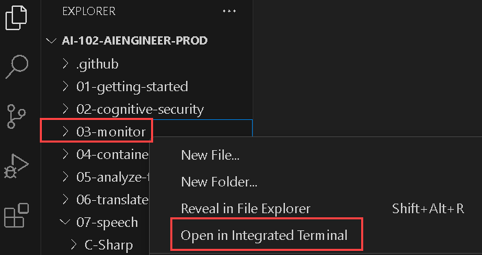
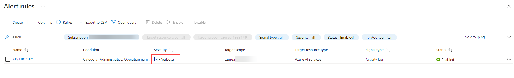
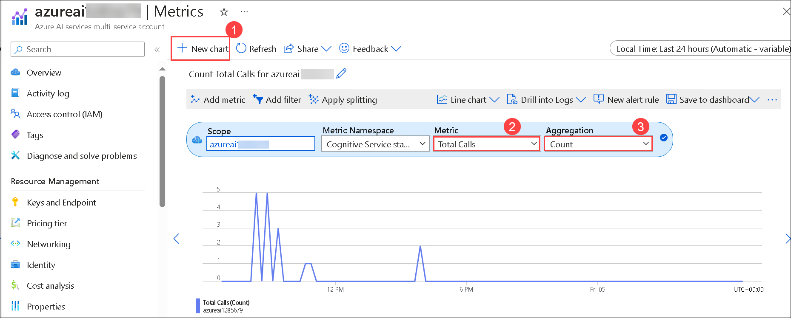

# Lab 03: Monitor Azure AI services

### Estimated Duration : 20 Minutes

## Overview

Azure AI Services can be a critical part of an overall application infrastructure. It's important to be able to monitor activity and get alerted to issues that may need attention.

## Objectives

In this lab, you will complete the following tasks:

+ Task 1: Configure an alert
+ Task 2: Visualize a metric

## Architecture diagram

.JPG)

## Task 1: Configure an alert

In this task, you will learn how to configure an alert in Azure to monitor resources and receive notifications when specific conditions or thresholds are met.

Let's start monitoring by defining an alert rule so you can detect activity in your Azure AI services resource.

1. In the Azure portal, navigate to your **Azure AI Service** resource created in the previous exercise, then under the **Monitoring (1)** section, select **Alerts (2)**.

    .png)

1. Select **+ Create (1)** drop-down, and click **Alert rule (2)**.

    .png)

1. In the **Create an alert rule** page, under **Scope**, verify that the your Azure AI services resource is listed.

    .png)

1. Select **Condition** tab, and click on **See all signals (1)**.On the **Select a signal** pane that appears on the right, where you can select a signal type to monitor. Search for **List (2)** then select **List keys (3)** under Activity log and then click on **Apply (4)**.

    .png)

1. Review the activity over the past 6 hours.

    

1. Select the **Actions** tab. Note that you can specify an *action group*. This enables you to configure automated actions when an alert is fired - for example, sending an email notification. We won't do that in this exercise; but it can be useful to do this in a production environment.

1. In the **Details** tab, set the **Alert rule name** to **Key List Alert (1)** and then select **Review + create (2)**.

    .png)

1. Review the configuration for the alert. Select **Create** and wait for the alert rule to be created. 

    .png)

1. In Visual Studio Code, right-click the **03-monitor** folder and then select **Open in Integrated Terminal**.

    

1. Switch back to the browser containing the Azure portal, and refresh your **Alerts page**.  Navigate to **Alert rules** from the top bar. You should see a **Sev 4** alert listed in the table.

    

    >**Note:** If it doesn't show up, wait up to five minutes and refresh again.

> **Congratulations** on completing the task! Now, it's time to validate it. Here are the steps:
> - Hit the Validate button for the corresponding task. If you receive a success message, you can proceed to the next task. 
> - If not, carefully read the error message and retry the step, following the instructions in the lab guide.
> - If you need any assistance, please contact us at labs-support@spektrasystems.com. We are available 24/7 to help

<validation step="e5e37da8-8734-4f3e-b645-a692151ad796" />

## Task 2: Visualize a metric

In this task, you will learn how to visualize a metric in Azure, enabling you to track and analyze resource performance through charts and dashboards.

As well as defining alerts, you can view metrics for your Azure AI services resource to monitor its utilization.

1. In the Azure portal, open your **Azure AI Services** resource, then from the left navigation menu, under the **Monitoring (1)** section, select **Metrics (2)**.

    .png)

1. If there is no existing chart, select **+ New chart (1)**. Then in the **Metric** list, review the possible metrics you can visualize and select **Total Calls (2)**.

1. In the **Aggregation** list, select **Count (3)**.  This will enable you to monitor the total calls to you Cognitive Service resource; which is useful in determining how much the service is being used over a period of time.

    

    >**Note:** Sometimes, you may not be able to select Total calls and Count; in such cases, please proceed to the next step.    

1. To generate some requests to your cognitive service, you will use **curl** - a command line tool for HTTP requests. In Visual Studio Code, in the **03-monitor** folder, open **rest-test.cmd** and edit the **curl** command it contains (shown below), replacing *&lt;yourEndpoint&gt;* and *&lt;yourKey&gt;* with your endpoint URI and **Key1** key to use the Text Analytics API in your Azure AI services resource.

    ```
    curl -X POST "<yourEndpoint>/text/analytics/v3.1/languages?" -H "Content-Type: application/json" -H "Ocp-Apim-Subscription-Key: <yourKey>" --data-ascii "{'documents':           [{'id':1,'text':'hello'}]}"
    ```

    .png)

1. Save your changes, and then in the integrated terminal for the **03-monitor** folder, run the following command:

    ```
    .\rest-test
    ```

    >**Note:** The command returns a JSON document containing information about the language detected in the input data (which should be English).

1. Re-run the **.\rest-test** command multiple times to generate some call activity (you can use the **^** key to cycle through previous commands).

1. Return to the **Metrics** page in the Azure portal and refresh the **Total Calls** count chart. It may take a few minutes for the calls you made using *curl* to be reflected in the chart - keep refreshing the chart until it updates to include them.

## Summary
In this lab, you have completed:

- Configured an alert
- Visualized a metric

### You have successfully completed the lab >> Click on Next

.png)
