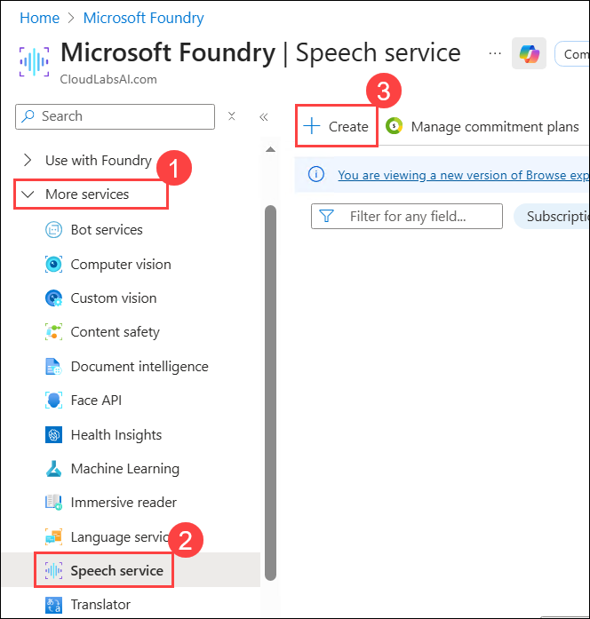
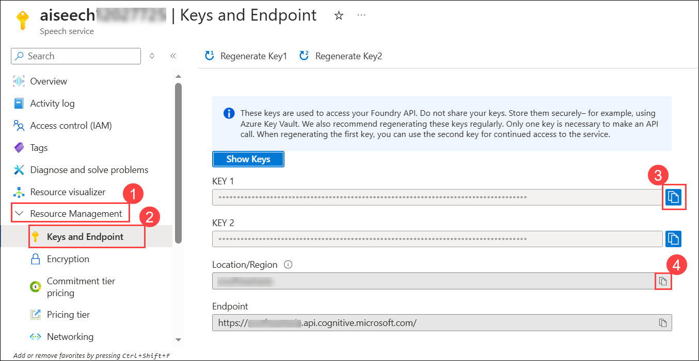
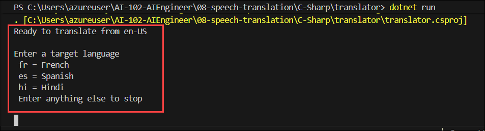

# Lab 02: Translate Speech

### Estimated Duration: 120 Minutes

## Overview
Azure AI Speech includes a speech translation API that you can use to translate spoken language. For example, suppose you want to develop a translator application that people can use when traveling in places where they don't speak the local language. They would be able to say phrases such as "Where is the station?" or "I need to find a pharmacy" in their own language, and have it translate them to the local language.

> **Note:** This exercise requires that you are using a computer with speakers/headphones. For the best experience, a microphone is also required. Some hosted virtual environments may be able to capture audio from your local microphone, but if this doesn't work (or you don't have a microphone at all), you can use a provided audio file for speech input. Follow the instructions carefully, as you'll need to choose different options depending on whether you are using a microphone or the audio file.

## Objectives

In this lab, you will complete the following tasks:

+ **Task 1:** Provision an Azure AI Speech resource
+ **Task 2:** Prepare to use the Azure AI Speech Translation service
+ **Task 3:** Implement speech translation
+ **Task 4:** Synthesize the translation to speech

## Architecture diagram

.JPG)

## Task 1: Provision an Azure AI Speech resource

In this task, you will provision an Azure AI Speech resource in the Azure portal. You will create a **Speech service** under **Azure AI services**, configure it with your subscription, a resource group, a unique name, a region, and select the **Standard S0** pricing tier. After deployment, you will retrieve the **keys and endpoint** for use in later steps.

1. Double-click the **Azure Portal** icon on the desktop.

    .png)

1. In the top search bar, search for **Microsoft Foundry (1)**, select **Microsoft Foundry (2)** from the result.

     

1. On the **Microsoft Foundry** blade, from the left navigation pane click **More services (1)** → select **Speech service (2)** → click **+ Create (3)**.

    .png)   

1. Create a resource with the following settings:
   
    - **Subscription**: **Your Azure subscription (1)**
    - **Resource group**: **A   i-102-<inject key="DeploymentID" enableCopy="false"/> (2)**
    - **Region**: **<inject key="Region" enableCopy="false"/> (3)**
    - **Name**: **aiseech1<inject key="DeploymentID" enableCopy="false"/> (4)**
    - **Pricing tier**: **Standard S0 (5)**
    - Click **Review + create (6)**

        .png) 

1. In the **Review + create** tab, click **Create**.

1. Wait for the deployment to complete, and then view the deployment details and click **Go to resource**.

    .png)

1. After the resource is deployed, navigate to it, open **Resource Management (1)** from the left pane, and select **Keys and Endpoint (2)**. From this page, copy the value of **KEY 1 (3)** and the **Location/Region (4)** where the service is provisioned, as you will use these values in the next task.

    

## Task 2: Prepare to use the Azure AI Speech Translation service

In this task, you'll complete a partially implemented client application that uses the Azure AI Speech SDK to recognize, translate, and synthesize speech.

1. In Visual Studio Code, in the **Explorer** pane, browse to the **07-speech (1)** folder and expand the **C-Sharp (2)** folder. Right-click on the **translator (3)** folder and then select **Open in Integrated Terminal (4)**.

    .png)

1. Then install the Speech SDK package by running the appropriate command for your language preference:

   **C#**

   ```csharp
   dotnet add package Microsoft.CognitiveServices.Speech --version 1.30.0
   ```
   
1. View the contents of the **translator** folder, and note that it contains a file for configuration settings:
   
    - **C#**: appsettings.json

1. Open the configuration file and update the configuration values it contains to include an authentication **key** for your Azure AI Speech resource, and the **location** where it is deployed. **Save your changes** by pressing **Ctrl+S**.

    .png)

1. Note that the **translator** folder contains a code file for the client application:

    - **C#**: Program.cs

 1. Open the code file and at the top, under the existing namespace references, find the comment **Import namespaces**. Then, under this comment, add the following language-specific code to import the namespaces you will need to use the Azure AI Speech SDK:

    **C#**

    ```csharp
    // Import namespaces
    using Microsoft.CognitiveServices.Speech;
    using Microsoft.CognitiveServices.Speech.Audio;
    using Microsoft.CognitiveServices.Speech.Translation;
    ```

    .png)

5. In the **Main** function, note that code to load the Azure AI Speech service key and region from the configuration file has already been provided. You must use these variables to create a **SpeechTranslationConfig** for your Azure AI Speech resource, which you will use to translate spoken input. Add the following code under the comment **Configure translation**:

    **C#**

    ```csharp
    // Configure translation
    translationConfig = SpeechTranslationConfig.FromSubscription(cogSvcKey, cogSvcRegion);
    translationConfig.SpeechRecognitionLanguage = "en-US";
    translationConfig.AddTargetLanguage("fr");
    translationConfig.AddTargetLanguage("es");
    translationConfig.AddTargetLanguage("hi");
    Console.WriteLine("Ready to translate from " + translationConfig.SpeechRecognitionLanguage);
    ```

    .png)

6. You will use the **SpeechTranslationConfig** to translate speech into text, but you will also use a **SpeechConfig** to synthesize translations into speech. Add the following code under the comment **Configure speech**:

    **C#**

    ```csharp
    // Configure speech
    speechConfig = SpeechConfig.FromSubscription(cogSvcKey, cogSvcRegion);
    ```
1. **Save your changes** and return to the integrated terminal for the **translator** folder, and enter the following command to run the program:

    **C#**

    ```csharp
    dotnet run
    ```
1. If you are using C#, you can ignore any warnings about using the **await** operator in asynchronous methods - we'll fix that later. The code should display a message that it is ready to translate from en-US. Press **ENTER** to end the program.

    

## Task 3: Implement speech translation

In this task, you will implement speech translation using Azure AI Speech. You will modify the program to recognize and translate spoken input from either a microphone or an audio file. The translation will be performed in real-time, supporting multiple target languages. You will then run the program, provide spoken input, and verify the translated output in different languages.

### Task 3.1: If you have a working microphone

1. In the **Main** function for your program, note that the code uses the **Translate** function to translate spoken input.

1. In the **Translate** function, under the comment **Translate speech**, add the following code to create a **TranslationRecognizer** client that can be used to recognize and translate speech using the default system microphone for input.

    **C#**

    ```csharp
    // Translate speech
    using AudioConfig audioConfig = AudioConfig.FromDefaultMicrophoneInput();
    using TranslationRecognizer translator = new TranslationRecognizer(translationConfig, audioConfig);
    Console.WriteLine("Speak now...");
    TranslationRecognitionResult result = await translator.RecognizeOnceAsync();
    Console.WriteLine($"Translating '{result.Text}'");
    translation = result.Translations[targetLanguage];
    Console.OutputEncoding = Encoding.UTF8;
    Console.WriteLine(translation);
    ```

    .png)

    > **Note:** The code in your application translates the input to all three languages in a single call. Only the translation for the specific language is displayed, but you could retrieve any of the translations by specifying the target language code in the **translations** collection of the result.

1. Now skip ahead to the **Run the program** section below.

### Task 3.2: Alternatively, use audio input from a file

1. In the terminal window, enter the following command to install a library that you can use to play the audio file:

    **C#**

    ```csharp
    dotnet add package System.Windows.Extensions --version 4.6.0 
    ```
2. In the code file for your program, under the existing namespace imports, add the following code to import the library you just installed:

    **C#**

    ```csharp
    using System.Media;
    ```
3. In the **Main** function for your program, note that the code uses the **Translate** function to translate spoken input. Then, in the **Translate** function, under the comment **Translate speech**, add the following code to create a **TranslationRecognizer** client that can be used to recognize and translate speech from a file.

    **C#**

    ```csharp
    // Translate speech
    string audioFile = "station.wav";
    SoundPlayer wavPlayer = new SoundPlayer(audioFile);
    wavPlayer.Play();
    using AudioConfig audioConfig = AudioConfig.FromWavFileInput(audioFile);
    using TranslationRecognizer translator = new TranslationRecognizer(translationConfig, audioConfig);
    Console.WriteLine("Getting speech from file...");
    TranslationRecognitionResult result = await translator.RecognizeOnceAsync();
    Console.WriteLine($"Translating '{result.Text}'");
    translation = result.Translations[targetLanguage];
    Console.OutputEncoding = Encoding.UTF8;
    Console.WriteLine(translation);
    ```

    .png)

   > **Note:** The code in your application translates the input to all three languages in a single call. Only the translation for the specific language is displayed, but you could retrieve any of the translations by specifying the target language code in the **translations** collection of the result.


### Task 3.3: Run the program

1. Save your changes and return to the integrated terminal for the **translator** folder, and enter the following command to run the program:

    **C#**

    ```csharp
    dotnet run
    ```
1. When prompted, enter a valid language code (*fr*, *es*, or *hi*), and then, if using a microphone, speak clearly and say "where is the station?" or some other phrase you might use when traveling abroad. The program should transcribe your spoken input and translate it to the language you specified (French, Spanish, or Hindi). Repeat this process, trying each language supported by the application. When you're finished, press ENTER to end the program.

    .png)

    > **Note:** The TranslationRecognizer gives you around 5 seconds to speak. If it detects no spoken input, it produces a "No match" result. The translation to Hindi may not always be displayed correctly in the Console window due to character encoding issues.

## Task 4: Synthesize the translation to speech

In this task, you will synthesize translated text into speech using neural voices, allowing the program to audibly respond in the selected language.

1. In the **Translate** function, under the comment **Synthesize translation**, add the following code to use a **SpeechSynthesizer** client to synthesize the translation as speech through the default speaker:

    **C#**

    ```csharp
    // Synthesize translation
    var voices = new Dictionary<string, string>
                    {
                        ["fr"] = "fr-FR-HenriNeural",
                        ["es"] = "es-ES-ElviraNeural",
                        ["hi"] = "hi-IN-MadhurNeural"
                    };
    speechConfig.SpeechSynthesisVoiceName = voices[targetLanguage];
    using SpeechSynthesizer speechSynthesizer = new SpeechSynthesizer(speechConfig);
    SpeechSynthesisResult speak = await speechSynthesizer.SpeakTextAsync(translation);
    if (speak.Reason != ResultReason.SynthesizingAudioCompleted)
    {
        Console.WriteLine(speak.Reason);
    }
    ```

    .png)

2. Save your changes and return to the integrated terminal for the **translator** folder, and enter the following command to run the program:

    **C#**

    ```csharp
    dotnet run
    ```
3. When prompted, enter a valid language code (*fr*, *es*, or *hi*), and then speak clearly into the microphone and say a phrase you might use when traveling abroad. The program should transcribe your spoken input and respond with a spoken translation. Repeat this process, trying each language supported by the application. When you're finished, press **ENTER** to end the program.

    .png)

    > **Note:** In this example, you've used a **SpeechTranslationConfig** to translate speech to text, and then used a **SpeechConfig** to synthesize the translation as speech. You can, in fact, use the **SpeechTranslationConfig** to synthesize the translation directly, but this only works when translating to a single language, and results in an audio stream that is typically saved as a file rather than sent directly to a speaker.

> **Congratulations** on completing the task! Now, it's time to validate it. Here are the steps:
>
> - Hit the Validate button for the corresponding task. If you receive a success message, you can proceed to the next task.
> - If not, carefully read the error message and retry the step, following the instructions in the lab guide.
> - If you need any assistance, please contact us at cloudlabs-support@spektrasystems.com. We are available 24/7 to help.

<validation step="ec7c2642-6d9e-45f0-b3b3-be16a1efc5a4" />

## Summary
In this lab, you have completed:

+ Provisioned an Azure AI Speech resource
+ Prepared to use the Azure AI Speech service
+ Implemented speech translation
+ Synthesized speech

## You have successfully completed the Hands-on lab!
