# Lab 01: Create a language understanding model with the Language service

### Estimated Duration: 60 Minutes

## Overview

The conversational language understanding feature of the Azure AI Language service is currently in preview and subject to change. In some cases, model training may fail - if this happens, try again.  

The Azure AI Language service enables you to define a *conversational language understanding* model that applications can use to interpret natural language input from users,  predict the users' *intent* (what they want to achieve), and identify any *entities* to which the intent should be applied.

For example, a conversational language model for a clock application might be expected to process input such as:

*What is the time in London?*

This kind of input is an example of an *utterance* (something a user might say or type), for which the desired *intent* is to get the time in a specific location (an *entity*); in this case, London.

> **Note**: The task of a conversational language model is to predict the user's intent and identify any entities to which the intent applies. It is <u>not</u> the job of a conversational language model to actually perform the actions required to satisfy the intent. For example, a clock application can use a conversational language model to discern that the user wants to know the time in London, but the client application itself must then implement the logic to determine the correct time and present it to the user.

## Objectives

In this lab, you will complete the following tasks:

+ **Task 1:** Create an Azure AI Language resource
+ **Task 2:** Create a conversational language understanding project
+ **Task 3:** Create intents
+ **Task 4:** Train and test the model
+ **Task 5:** Add entities
+ **Task 6:** Use the model from a client app
+ **Task 7:** Call the API from the Azure Cloud Shell
+ **Task 8:** Export the project

## Architecture diagram

.JPG)

## Task 1: Create an Azure AI Language resource

In this task, you will create an **Azure AI Language** resource in the Azure portal and configure its settings. Once deployed, you will review the deployment details.

1. On Azure Portal page, in **Search resources, services and docs (G+/)** box at the top of the portal, search **Azure AI Foundry (1)**, and then select **Azure AI Foundry (2)** under services.

      .png)

1. Then, in the **AI Foudnry** tab, from the left navigation pane, click on **More services (1)**, then select **Language Service (2)** and click on **+ Create (3)**.

      .png)

1. On the **Select additional features** page, scroll down to the bottom and select **Continue to create your resource**.

      .png)

1. Provision the resource using the following settings and then click on **Review + create (7)**. 
    
    - **Subscription**: **Leave the default Azure subscription (1)**
    - **Resource group**: **Ai-102-<inject key="DeploymentID" enableCopy="false" /></inject> (2)**
    - **Region**: **<inject key="Region" enableCopy="false" /></inject> (3)**
    - **Name**: **AIservice-<inject key="DeploymentID" enableCopy="false" /></inject> (4)**.
    - **Pricing tier**: Select either **Free (F0)** or **Standard (S)** tier if Free is not available **(5)**
    - **Responsible AI Notice**: Select the checkbox **(6)**

      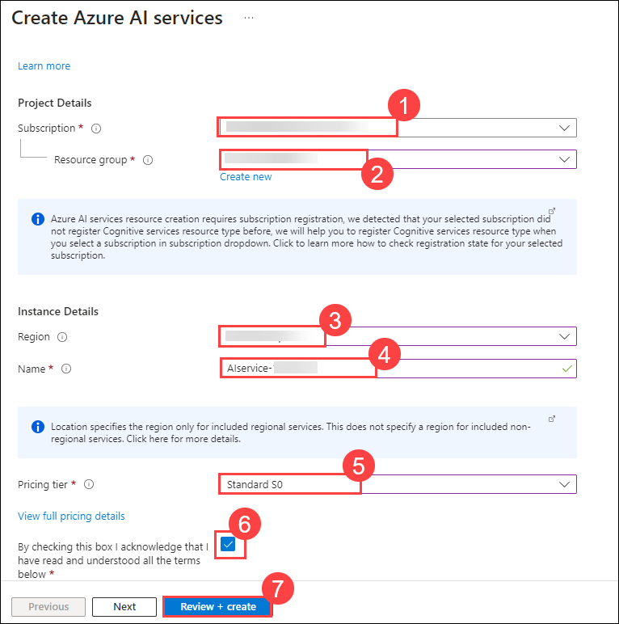    

1. On the **Review + create** tab, click on **Create**.

1. Wait for the deployment to complete, and then view the deployment details.

## Task 2: Create a conversational language understanding project

In this task, you will create a **Conversational Language Understanding** project in **Language Studio**. You will configure a language resource, set up a new project, and define its basic settings.

1. In a new browser tab, open the Language Studio portal at `https://language.cognitive.azure.com/`.

1. If you're not signed in yet, click **Sign in** located at the top-right corner.

      .png)

1. If prompted to choose a Language resource, select the following settings, and select **Done (5)**:

    - **Azure Directory**: Leave the Azure directory containing your subscription. **(1)**
    
    - **Azure subscription**: Leave the default Azure subscription **(2)**
    
    - **Resource type**: Select **Language (3)**.
    
    - **Language resource**: **AIservice-<inject key="DeploymentID" enableCopy="false" /></inject> (4)**.

      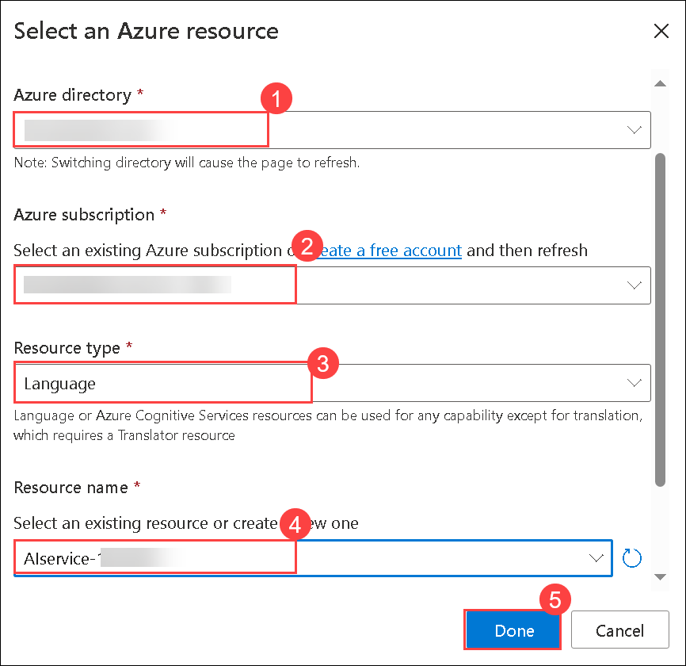  

1. If you are <u>not</u> prompted to choose a language resource, it may be because you have already assigned a different Azure AI Language resource; in which case:

1. On the bar at the top of the page, select the **Settings (&#9881;)** button.

      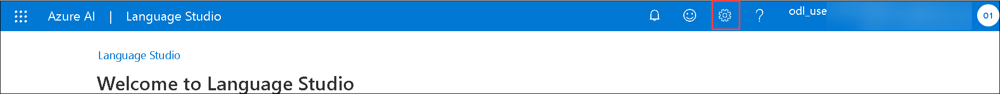
    
1. On the **Settings** page, view the **Resources (1)** tab. Select the language resource you just created **(2)**, and at the top of the page, select **Language Studio (3)** to return to the Language Studio home page.

      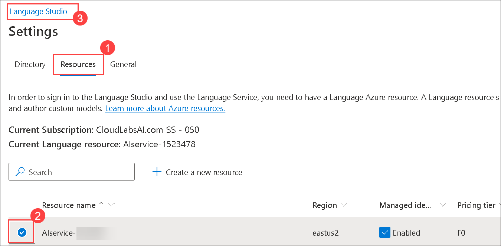

1. At the top of the portal, select the **Create new (1)** menu and from the dropdown select **Conversational language understanding (2)**.

      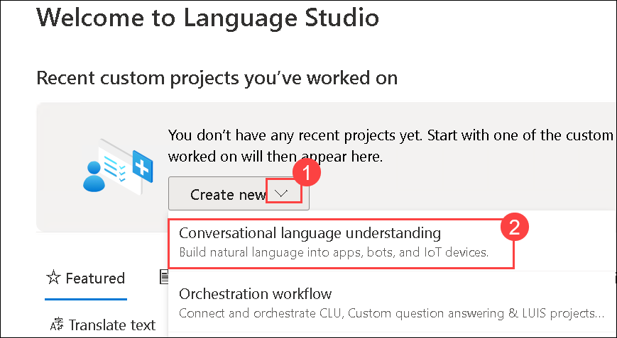

1. In the **Create a project** dialog box, on the **Enter basic information** page, enter the following details and then select **Next**:
    
    - **Name**: **Clock (1)**

    - **Utterances primary language**: **English (2)**   

    - **Enable multiple languages in project?**: **Unselected (3)**     
    
    - **Description**: **Natural language clock (4)**
       
    - Select **Next (5)**

      .png)    

1. On the **Review and finish** page, select **Create**.

## Task 3: Create intents

In this task, you will define **intents** for your Conversational Language Understanding project. You will create three intents—**GetTime**, **GetDay**, and **GetDate**—and add example utterances for each. Finally, you will save and review all intents in the **Schema definition** page.

1. On the **Schema definition** page, on the **Intents (1)** tab, select **&#65291; Add (2)**, and under **Intent name** type **GetTime (3)**, and select **Add intent (4)**.

      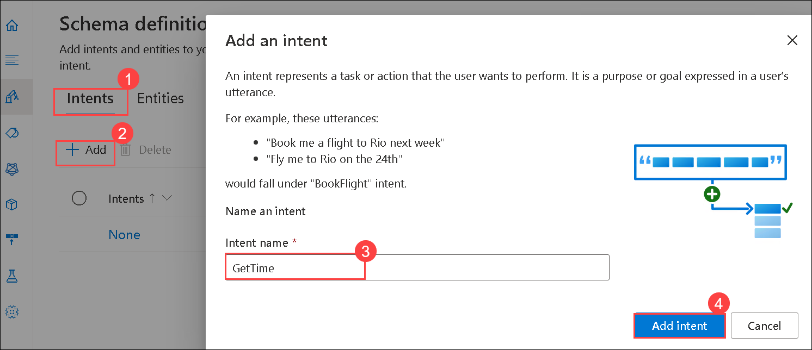

1. Select the **GetTime** intent from the **Intent** tab.

      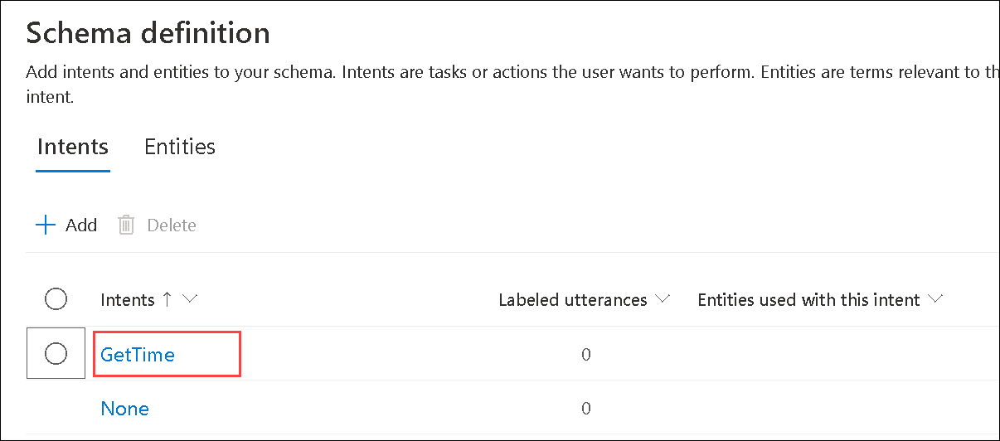

1. Under **Training set**. Select the **GetTime (1)** from the **intent** drop-down, add the following utterances as example user input **(2)**, and press **enter**.  After you've added these utterances, select **Save changes (3)** and go back to the **Schema definition** page.

    `what is the time?`

    `what's the time?`

    `what time is it?`

    `tell me the time`

    .png)    
   
1. On the **Schema definition** page, on the **Intents** tab, select **&#65291; Add**, and under **Intent name** type **GetDay**, and select **Add intent**.

1. Under **Training set**. Select the **GetDay** from the **intent** drop-down, add the following utterances as example user input, and press **enter**:

    `what day is it?`

    `what's the day?`

    `what is the day today?`

    `what day of the week is it?`

1. After you've added these utterances, select **Save changes** and go back to the **Schema definition** page.

      .png)

1. After you've added these utterances and saved them, go back to the **Schema definition** page and add another new intent named **GetDate** with the following utterances:

    `what date is it?`

    `what's the date?`

    `what is the date today?`

    `what's today's date?`

1. After you've added these utterances, save them and clear the **GetDate** filter on the utterances page so you can see all of the utterances for all of the intents. To do this, select the **Filter (1)** button on the top right of the Training set tab, then **unselect** *GetDate*. **(2)**.

      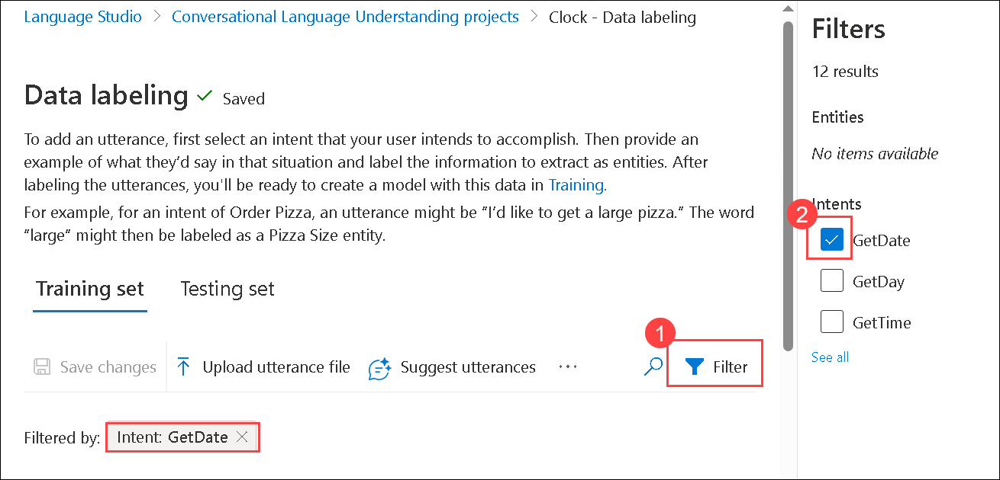

## Task 4: Train and test the model

In this task, you will train and test the **Clock** model by starting a training job, reviewing performance metrics, and deploying it as **production**. Validate its accuracy by testing sample queries and analyzing intent predictions with confidence scores.

1. In the pane on the left, select **Training jobs (1)**. Then select **+ Start a training job (2)**.

      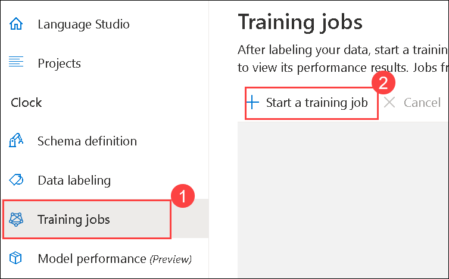

1. On the **Start a training job** dialog, select the option to **Train a new model (1)**, name it **Clock (2)**. To begin the process of training your model, select **Train (3)**.

      .png)

1. When training is complete (which may take several minutes), the job **Status** will change to **Training succeeded**.

      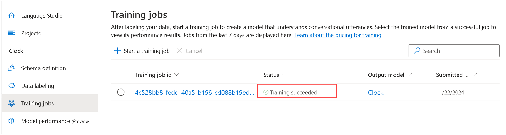

1. From the left navigation menu, select the **Model performance** page, and then select the **Clock** model. Review the overall and per-intent evaluation metrics (*precision*, *recall*, and *F1 score*) and the *confusion matrix* generated by the evaluation that was performed when training (note that due to the small number of sample utterances, not all intents may be included in the results).

      .png)

    > **Note**: To learn more about the evaluation metrics, refer to the [documentation](https://learn.microsoft.com/azure/ai-services/language-service/conversational-language-understanding/concepts/evaluation-metrics)

1. From the left navigation menu, go to the **Deploying a model (1)** page, then select **Add deployment (2)**.

      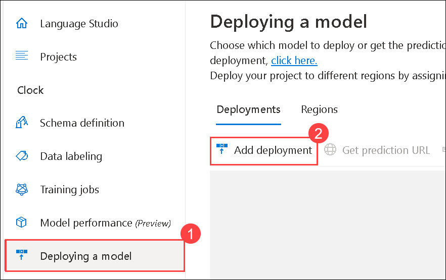

1. On the **Add deployment** dialog, select **Create a new deployment name (1)**, and then enter **production (2)**. Select the **Clock (3)** model in the **Model** field, then select **Deploy (4)**. The deployment may take some time.

      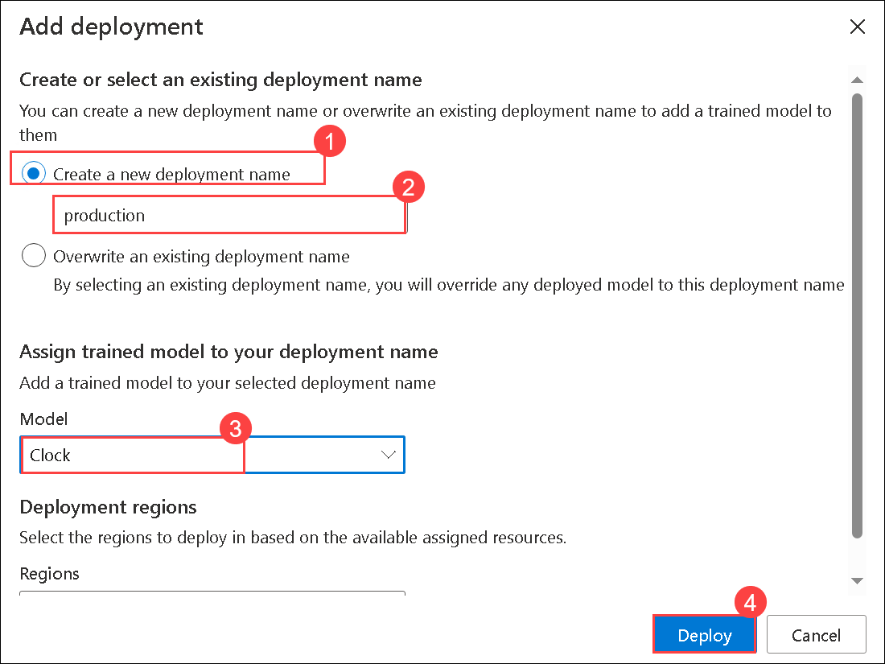

1. When the model has been deployed, select the **Testing deployments (1)** page, then select the **production (2)** deployment in the **Deployment name** field. Enter the following text in the **Enter your own text, or upload a text document (3)**, and then select **Run the test (4)**:

    `what's the time now?` **(3)**

      .png)    

1. Review the result that is returned, noting that it includes the predicted intent (which should be **GetTime**) and a confidence score that indicates the probability the model calculated for the predicted intent. The JSON tab shows the comparative confidence for each potential intent (the one with the highest confidence score is the predicted intent)

      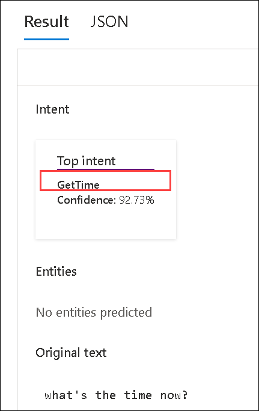

1. Clear the text box, and then run another test with the following text:

    `tell me the time`

    Again, review the predicted intent and confidence score.

1. Try the following text:

    `what's the day today?`

    Hopefully the model predicts the **GetDay** intent.

## Task 5: Add entities

In this task, you will add learned, list, and prebuilt entities to enhance model recognition. After training the model with example utterances, you will retrain, deploy, and test it for accuracy.

### Task 5.1: Add a learned entity

The most common kind of entity is a *learned* entity, in which the model learns to identify entity values based on examples.

1. In Language Studio, return to the **Schema definition (1)** page and then on the **Entities (2)** tab, select **&#65291; Add (3)** to add a new entity.

      .png)

1. In the **Add an entity** dialog box, enter the entity name **Location (1)** and ensure that the **Learned (2)** tab is selected. Then select **Add entity (3)**.

      .png)

1. After the **Location** entity has been created, return to the **Schema definition** page and then on the **Intents** tab, select the **GetTime** intent.

1. Enter the following new example utterance:

    `what time is it in London?`

1. When the utterance has been added, select the word **London (1)**, and in the drop-down list that appears, select **Location (2)** to indicate that "London" is an example of a location.

      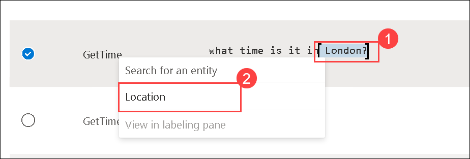

1. Add another example utterance:

    `Tell me the time in Paris?`

1. When the utterance has been added, select the word **Paris**, and map it to the **Location** entity.

1. Add another example utterance:

    `what's the time in New York?`

1. When the utterance has been added, select the words **New York**, and map them to the **Location** entity.

1. Select **Save changes** to save the new utterances.

### Task 5.2: Add a *list* entity

In some cases, valid values for an entity can be restricted to a list of specific terms and synonyms, which can help the app identify instances of the entity in utterances.

1. In Language Studio, return to the **Schema definition** page and then on the **Entities** tab, select **&#65291; Add** to add a new entity.

1. In the **Add an entity** dialog box, enter the entity name **Weekday (1)** and select the **List (2)** entity tab. Then select **Add entity (3)**.

      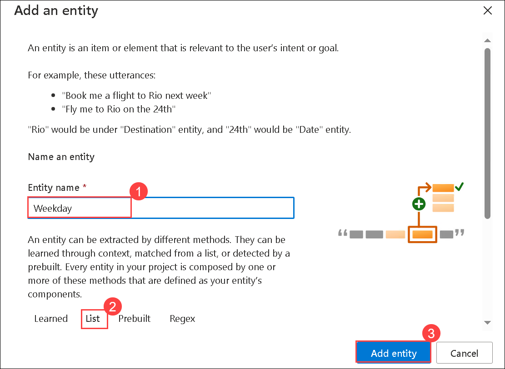

1. On the page for the **Weekday** entity, in the **List (1)** section, select **&#65291; Add new list (2)**. Then enter the following value and synonym and select **Save (5)**:

    | List key | synonyms|
    |-------------------|---------|
    | Sunday **(3)** | Sun **(4)** |

      .png)

      >**Note**: Type the synonyms and press enter.

1. Repeat the previous step to add the following list components:

    | Value | synonyms|
    |-------------------|---------|
    | Monday | Mon |
    | Tuesday | Tue, Tues |
    | Wednesday | Wed, Weds |
    | Thursday | Thur, Thurs |
    | Friday | Fri |
    | Saturday | Sat |

1. Return to the **Schema definition** page and then on the **Intents** tab, select the **GetDate** intent.

1. Enter the following new example utterance:

    `what date was it on Saturday?`

1. When the utterance has been added, select the word **Saturday (1)**, and in the drop-down list that appears, select **Weekday (2)**.

      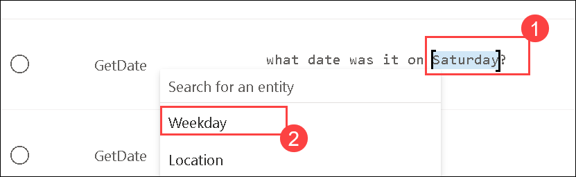

1. Add another example utterance:

    `what date will it be on Friday?`

1. When the utterance has been added, map **Friday** to the **Weekday** entity.

1. Add another example utterance:

    `what will the date be on Thurs?`

1. When the utterance has been added, map **Thurs** to the **Weekday** entity.

1. Select **Save changes** to save the new utterances.

### Task 5.3: Add a *prebuilt* entity

The Azure AI Language service provides a set of *prebuilt* entities that are commonly used in conversational applications.

1. In Language Studio, return to the **Schema definition** page and then on the **Entities** tab, select **&#65291; Add** to add a new entity.

1. In the **Add an entity** dialog box, enter the entity name **Date (1)** and select the **Prebuilt (2)** entity tab. Then select **Add entity (3)**.

      .png)

1. On the page for the **Date** entity, in the **Prebuilt (1)** section, select **&#65291; Add new prebuilt (2)**. In the **Select prebuilt** list, select **DateTime (3)** and then select **Save (4)**.

      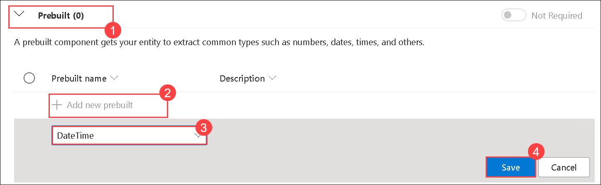

1. Return to the **Schema definition** page and then on the **Intents** tab, select the **GetDay** intent.

1. Enter the following new example utterance:

    `what day was 01/01/1901?`

1. When the utterance has been added, select ***01/01/1901***, and in the drop-down list that appears, select **Date**.

1. Add another example utterance:

    `what day will it be on Dec 31st 2099?`

1. When the utterance has been added, map **Dec 31st 2099** to the **Date** entity.

1. Select **Save changes** to save the new utterances.

### Task 5.4: Retrain the model

Now that you've modified the schema, you need to retrain and retest the model.

1. On the **Training jobs** page, select **+ Start a training job**.

1. On the **Start a training job** dialog,  select  **Overwrite an existing model (1)** and specify the **Clock (2)** model. Select **Train (3)** to train the model. If prompted, confirm you want to **Overwrite and train**.

      .png)

1. When training is completed the job **Status** will update to **Training succeeded**.

1. Select the **Model performance** page and then select the **Clock** model. Review the evaluation metrics (*precision*, *recall*, and *F1 score*) and the *confusion matrix* generated by the evaluation that was performed when training (note that due to the small number of sample utterances, not all intents may be included in the results).

1. On the **Deploying a model** page from the left Navigation pane, select **Add deployment**.

1. On the **Add deployment** dialog, select **Overwrite an existing deployment name (1)**, and then select **production (2)**. Select the **Clock (3)** model in the **Model** field and then select **Deploy (4)** to deploy it. This may take some time.

      .png)

1. When the model is deployed, on the **Testing deployments (1)** page, select the **production (2)** deployment under the **Deployment name** field, and then test it with the following text, and then click on **Run the test (4)**

    `what's the time in Edinburgh?` **(3)**

      .png)    

1. Review the result that is returned, which should hopefully predict the **GetTime (1)** intent and a **Location** entity with the text value `Edinburgh` **(2)**.

      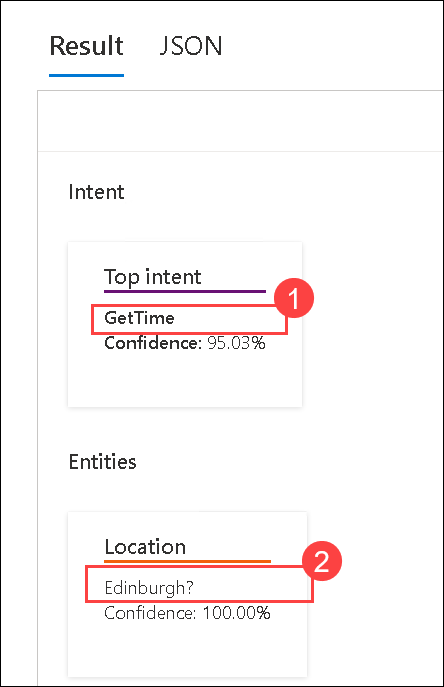

1. Try testing the following utterances:

    `what time is it in Tokyo?`

    `what date is it on Friday?`

    `what's the date on Weds?`

    `what day was 01/01/2020?`

    `what day will Mar 7th 2030 be?`

## Task 6: Use the model from a client app

In this task, you will obtain the prediction URL for your deployed model in Language Studio. You will retrieve the sample request, which includes an HTTP POST request with authentication headers, and save it for use in the next task.

1. In Language Studio, on the **Deploying a model (1)** page, select the **production (2)** deployment. Then select **Get prediction URL (3)**.

      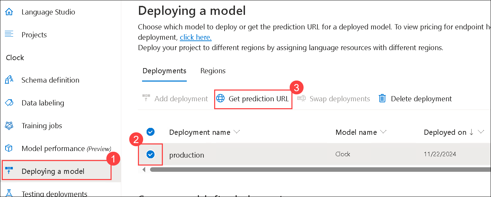

1. In the **Get prediction URL** dialog box, note that the URL for the prediction endpoint is shown along with a sample request, which consists of a **curl** command that submits an HTTP POST request to the endpoint, specifying the key for your Azure AI Language resource in the header and including a query and language in the request data. Paste the sample request in a notepad, we will be needing it in the next task of the lab. **(2)**

      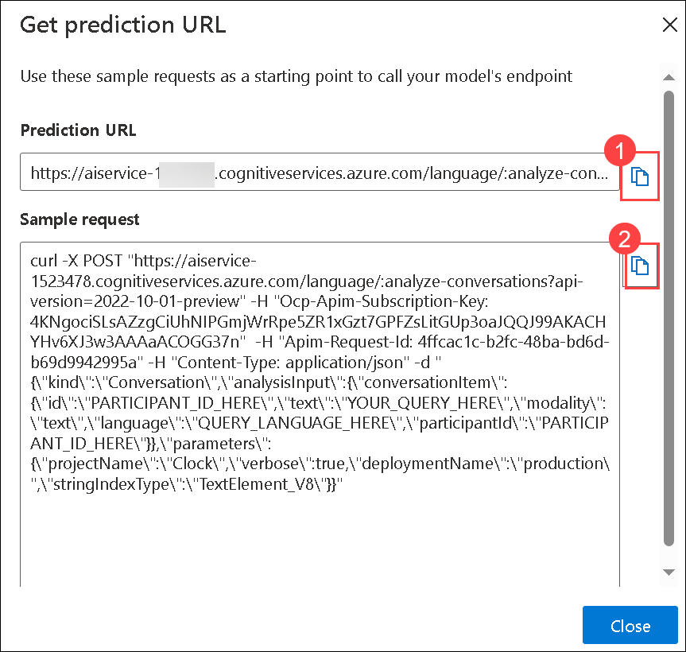

## Task 7: Call the API from the Azure Cloud Shell

In this task, you will use Azure Cloud Shell to call the prediction API. You will set up Cloud Shell, clone a repository, edit a script with your endpoint details, and execute it to retrieve intent predictions from your deployed model. Finally, you will test different queries and analyze the JSON responses.

1. In the [Azure portal](https://portal.azure.com?azure-portal=true), select the **[>_]** (*Cloud Shell*) button at the top of the page to the right of the search box. A Cloud Shell pane will open at the bottom of the portal.

      

1. The first time you open the Cloud Shell, you may be prompted to choose the type of shell you want to use (*Bash* or *PowerShell*). Select **Bash**. If you don't see this option, skip the step.  

      .png)

1. If you're prompted to create storage for your Cloud Shell, select **Mount storage account** and select your default **Subscription**, and then click on **Apply**.

      .png)
   
1. Select **I want to create a storage account**, click on **Apply**.

      .png)

1. On the **Create Storage account** page, provid the following details and then click on **Create (6)**.

    - Subscription: **Leave default Azure subscription (1)**

    - Resource Group: **Ai-102-<inject key="DeploymentID" enableCopy="false"/> (2)**

    - Region: **<inject key="Region" enableCopy="false" /></inject> (3)**
    
    - **Storage account**: Enter **blob<inject key="DeploymentID" enableCopy="false"/> (4)**
    
    - **File share**: Enter **fs<inject key="DeploymentID" enableCopy="false"/> (5)**
    
      .png)
    
      >**Note:** Wait a minute or so for the storage to be created.

1. Make sure the type of shell indicated on the top left of the Cloud Shell pane is switched to **Bash**. If it's *PowerShell*, switch to *Bash* by using the drop-down menu in the top left.

1. Once the terminal starts, run the following commands to download a copy of the repo into your Cloud Shell:

    ```bash
    rm -r azure-ai-eng -f
    git clone https://github.com/MicrosoftLearning/AI-102-AIEngineer azure-ai-eng
    ```

1. The files have been downloaded into a folder called **azure-ai-eng**. Let's change into that folder by running:

    ```bash
    cd azure-ai-eng/09-language-app
    ```

1. Then run `code send-call.sh` to open the file in the Cloud Shell editor. This file contains a script that will call the service with the question: **What's the time in Sydney?**.

      .png)

      > **Note**: If you asked for a switch to classic shell, please click on confirm.

      > **Note**: If you don't see the built-in code editor, please repeat steps 8 and 9 accordingly. 

1. Replace the following values with the corresponding values in the **Sample request** that you have copied earlier from Language Studio:

    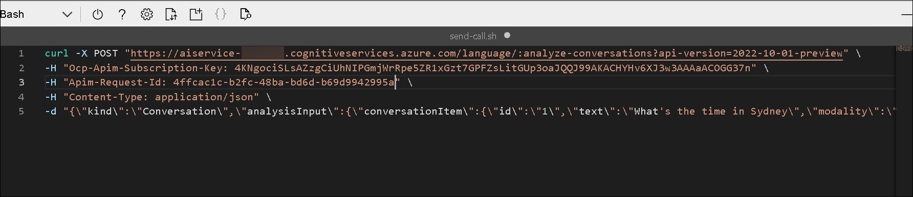

    - **<ENDPOINT_URL>**: Your endpoint URL.Looks like: `https://my-service.cognitiveservices.azure.com/language/:analyze-conversations?api-version=2022-10-01-preview` **(1)**
    - **<Apim-Subscription-Key>**: Your key looks like: `b11bcsbd50a149dfb6626791d20f514b` **(2)**
    - **<Apim-Request-Id>**: Your request ID looks like: `4vfdad1c-b2fc-48ba-bd7d-b59d2242395b` **(3)**

      .png)    

1. Press **CTRL + Save** to save your changes.

1. Make a call by running `sh send-call.sh`.
1. View the resulting JSON, which should include the predicted intent and entities, like this:

    ```json
    {
      "kind": "ConversationResult",
      "result": {
        "query": "What's the time in Sydney",
        "prediction": {
          "topIntent": "GetTime",
          "projectKind": "Conversation",
          "intents": [
            {
              "category": "GetTime",
              "confidenceScore": 0.9135122
            },
            {
              "category": "GetDay",
              "confidenceScore": 0.61633164
            },
            {
              "category": "GetDate",
              "confidenceScore": 0.601757
            },
            {
              "category": "None",
              "confidenceScore": 0
            }
          ],
          "entities": [
            {
              "category": "Location",
              "text": "Sydney",
              "offset": 19,
              "length": 6,
              "confidenceScore": 1
            }
          ]
        }
      }
    }
    ```

1. Review the JSON response returned by your model to ensure that the top scoring intent predicted is **GetTime**.

      .png)

1. Change the query in the curl command to `What's today's date?` and then run it and review the resulting JSON.

      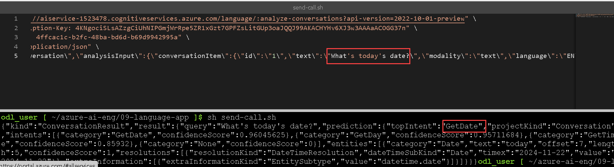

1. Try the following queries:

    `What day will Jan 1st 2050 be?`

    `What time is it in Glasgow?`

    `What date will next Monday be?`

## Task 8: Export the project

In this task, you will export your project from Azure AI Language Studio. You will select your project, export it as a JSON file, and review its structure in a code editor to understand the model's configuration.

1. In Azure AI | Language Studio, select the **Projects** tab from the left navigation pane, select the circle icon to select the **Clock (1)** project. and then Select the **&#x2913; Export (2)** button.

      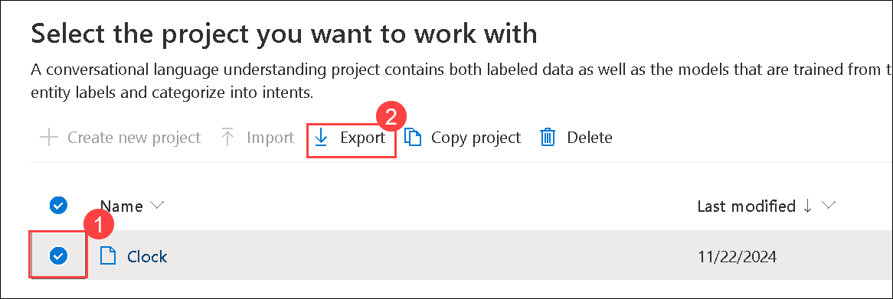

1. Save the **Clock.json** file that is generated (anywhere you like).

1. Open the downloaded file in your favorite code editor (for example, Visual Studio Code) to review the JSON definition of your project.

## Summary
In this lab, you have completed:

+ Created an Azure AI Language resource
+ Created a conversational language understanding project
+ Created intents
+ Trained and tested the model
+ Added entities
+ Used the model from a client app
+ Called the API from the Azure Cloud Shell
+ Exported the project

### You have successfully completed the lab, click on Next >>.

.png)
