# Lab 02: Create a Bot with Bot Framework Composer

### Estimated Duration: 60 Minutes

## Overview

Bot Framework Composer is a graphical designer that lets you quickly and easily build sophisticated conversational bots without writing code. The composer is an open-source tool that presents a visual canvas for building bots.

## Objectives

In this lab, you will complete the following tasks:

+ **Task 1:** Get an OpenWeather API key
+ **Task 2:** Update Bot Framework Composer
+ **Task 3:** Create a bot
+ **Task 4:** Add a dialog to get the weather
+ **Task 5:** Handle interruptions
+ **Task 6:** Enhance the user experience

## Architecture diagram


## Task 1: Get an OpenWeather API key

In this task, you will create a bot that uses the OpenWeather service to retrieve weather conditions for the city entered by the user. You will require an API key for the service to work.

1. In a web browser, go to the OpenWeather site at `https://openweathermap.org/price`.

1. In the OpenWeather page, click on **Sign In**.

    .png)

1. On the Sign In page, click on **Create an Account**.

   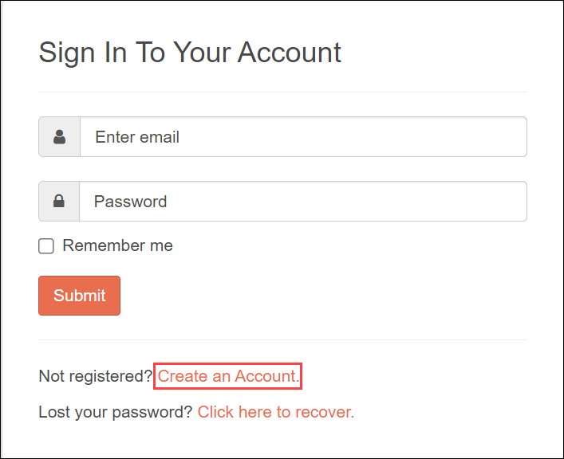

1. On **Create New Account** page enter the below details and click on **Create Account**

    - Username: **odl_user<inject key="DeploymentID" enableCopy="false"/> (1)**
    - Email : **<inject key="AzureAdUserEmail"></inject> (2)**
    - Password: **<inject key="AzureAdUserPassword"></inject> (3)**

    - Click on all the **checkboxes (4)** as shown in the image below.

    - Solve the puzzle to verify the you are not a robot **(5)**.

    - Click on **Create Account (6)**.

        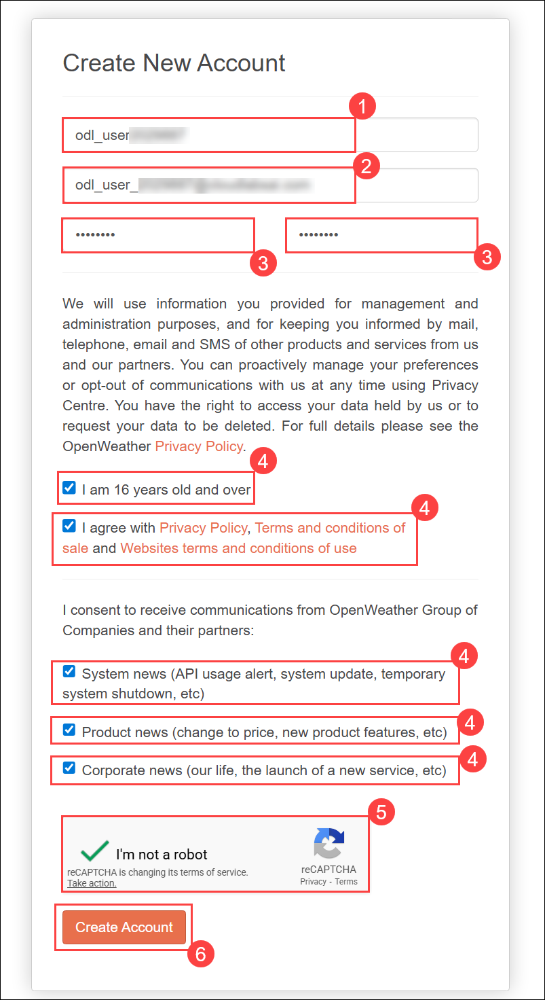

1. In the **How and where will you use our API?** pop-up, you can provide your **company name (1)** and select **Education/Science (2)** as the purpose and click on **Save (3)**.

   .png)

1. Select **API Keys (1)** tab and copy the **Key (2)** to the notepad.

    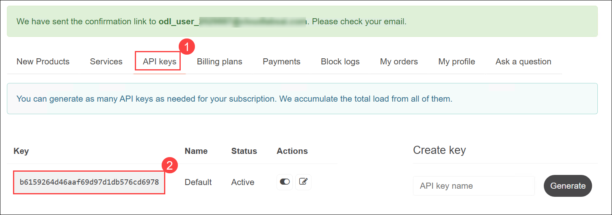

## Task 2: Update Bot Framework Composer

In this task, you're going to use the Bot Framework Composer to create your bot. This tool is updated regularly, so let's make sure you have the latest version installed.

> **Note:** Updates may include changes to the user interface that affect the instructions in this exercise.

1. On the Lab-VM, in the **Type here to search** bar, search for **Command Prompt (1)**, then right-click on it **(2)** , and select **Run as administrator (3)**.

    .png)

1. Run the following commands to add the path:

    ```
    setx PATH "%PATH%;C:\Program Files\nodejs;"
    ```

    .png)

1. Close the **Command Prompt**.

1. Open a new tab, copy and paste this link, `https://github.com/microsoft/BotFramework-Composer/releases/download/v2.1.2/BotFramework-Composer-2.1.2-windows-setup.exe`, and download the **Bot Framework Composer**.

1. From the downloads, click on **Open file**.
  
   .png)

1. On the **Choose Installation option** page click on **Next**.

1. On the **Choose Install Location** page click on **Install**.

   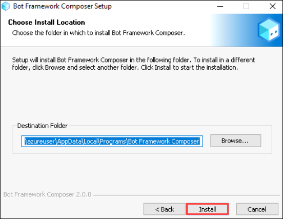

1. Start the **Bot Framework Composer** installation, and if you are not automatically prompted to install an update, use the **Check for updates** option on the **Help** menu to check for updates.

    .png)

1. If an update is available, choose the option to install it when the application is closed. Then close the Bot Framework Composer and install the update for the currently logged-in user, restarting the Bot Framework Composer after the installation is complete. Installation may take a few minutes.

    >**Note:** If **Help us improve?** pop-ups, select **Not now**.

1. Ensure that the version of Bot Framework Composer is **2.0.0** or later.

## Task 3: Create a bot

In this task, you will learn how to use the Bot Framework Composer to create a bot.

### Task 3.1: Create a bot and customize the "welcome" dialog flow

1. Start the Bot Framework Composer if it's not already open.

1. On the **Home** screen, select **+ Create new**.

    .png)

1. On the **Select a template** pop-up, on **Node (Preview)** tab, select **Empty Bot (1)** and click **Next (2)**.

    .png)

1. Name it as **`WeatherBot` (1)**, select **Location** as **`C:\` (2)** folder, and select **Create (3)**.

    .png)

    >**Note:** If the Node js required pop-up appears, select **Cancel**, and follow these steps:

    - Select the **Start** button.

    - Select the **Power** button, and click on **Restart**. Now, reconnect again with the **Lab-VM**.

1. Close the **Get Started** pane if it opens, and then in the navigation pane on the left, select **Greeting** to open the authoring canvas and show the *ConversationUpdate* activity that is called when a user initially joins a conversation with the bot. The activity consists of a flow of actions.

    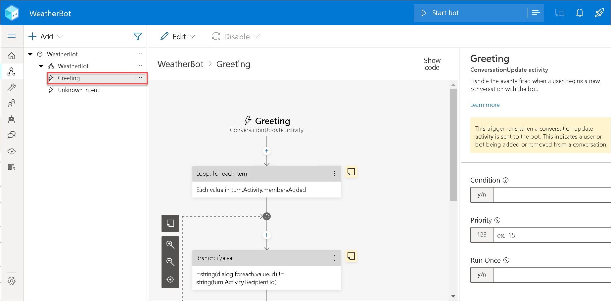

1. In the properties pane on the left, edit the title of **Greeting** by selecting the word **Greeting** at the top of the properties pane on the right top corner and changing it to **WelcomeUsers**.

   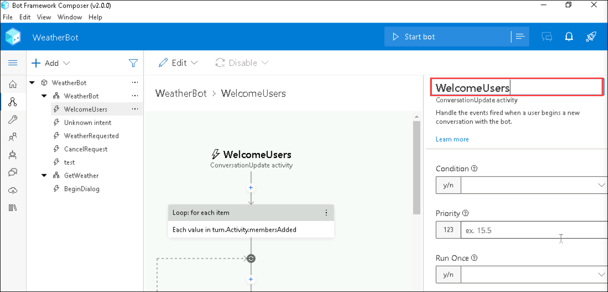

1. In the authoring canvas, select the **Send a response (1)** action. Then, in the properties pane, change the default text from **Welcome to your bot.**  to `Hi! I'm WeatherBot.` **(2)**.

    .png)

1. In the authoring canvas, select the final **+** symbol (just above the circle that marks the <u>end</u> of the dialog flow), and add a new **Ask a question (1)** action for a **Text (2)** response.

    .png)

    >**Note:** The new action creates two nodes in the dialog flow. The first node defines a prompt for the bot to ask the user a question, and the second node represents the response that will be received from the user. In the properties pane, these nodes have corresponding **Bot response** and **User input** tabs.

1. In the properties pane, on the **Bot response** tab, add a response with the text `What's your name?`. 

    .png)

1. Then, on the **User input** tab, set the **Property** value to `user.name` to define a variable that you can access later in the bot conversation.

    .png)

1. Back in the authoring canvas, select the **+** symbol under the **User input(Text)** action you just added, and add a **Send a response** action.

    .png)

1. Select the newly added **Send a response** action and in the properties pane, set the text value to `Hello ${user.name}, nice to meet you!`. The completed activity flow should look like this:

    .png)

### Task 3.2: Test the bot

In this task, you will learn how to test your basic bot.

1. Select **Start Bot** in the upper right-hand corner of Composer, and wait while your bot is compiled and started. This may take several minutes.

    .png)

    >**Note:** If a Windows Firewall message is displayed, enable access for all networks.

1. In the **Local bot runtime manager** pane, select **Open Web Chat**.

    .png)

1. In the **WeatherBot** web chat pane, after a short pause, you will see the welcome message and the prompt to enter your name.  Enter your name and press **Enter**.

1. The bot should respond with the **Hello *your_name*, nice to meet you!**.

    .png)

1. Close the web chat panel.

1. At the top right of Composer, next to **&#8635; Restart bot**, click **<u>=</u>** to open the **Local bot runtime manager** pane, and use the ⏹ icon to stop the bot.

## Task 4: Add a dialog to get the weather

In this task, you will learn how to add a dialog to your bot that responds when the user mentions "weather."

Now that you have a working bot, you can expand its capabilities by adding dialogs for specific interactions. In this case, you'll add a dialog that is triggered when the user mentions "weather".

### Task 4.1: Add a dialog

In this task, you will learn how to define a dialog flow to handle questions about the weather.

First, you need to define a dialog flow that will be used to handle questions about the weather.

1. In Composer, in the navigation pane, hold the mouse over the top-level node (**WeatherBot**) and in the **... (1)** menu, select **+ Add a dialog (2)**, as shown here:

    

1. Then create a new dialog named **GetWeather (1)** with the description **Get the current weather condition for the provided zip code (2)**, and select **OK (3)**.

    .png)

1. In the left-navigation pane, select the **BeginDialog** node for the new **GetWeather** dialog. Then, on the authoring canvas, use the **+** symbol to add an **Ask a question** action for a **Text** response.

1. In the properties pane, on the **Bot response** tab, add the response `Enter your city`.

    .png)

1. On the **User input** tab, set the **Property** field to `dialog.city`, and set the **Output format** field to the expression `=trim(this.value)` to remove any superfluous spaces around the user-provided value. The activity flow so far should look like this:

    

    >**Note:** So far, the dialog asks the user to enter a city. Now you must implement the logic to retrieve the weather information for the city that was entered.

1. On the authoring canvas, directly under the **User input** action for the city entry, select the **+** symbol to add a new action.

1. From the list of actions, select **Access external resources (1)** and then **Send an HTTP request (2)**.

    .png)

1. Set the properties for the **HTTP request** as follows, replacing **YOUR_API_KEY** with your [OpenWeather](https://openweathermap.org/price) API key:
    - **HTTP method**: GET **(1)**
    
    - **Url**: `http://api.openweathermap.org/data/2.5/weather?units=metric&q=${dialog.city}&appid=YOUR_API_KEY`**(2)**
    
    - **Result property**: `dialog.api_response` **(3)**

        .png)

        >**Note:** The result can include any of the following four properties from the HTTP response:

        - **statusCode**. Accessed via **dialog.api_response.statusCode**.
        
        - **reasonPhrase**. Accessed via **dialog.api_response.reasonPhrase**.
        
        - **content**. Accessed via **dialog.api_response.content**.
        
        - **headers**. Accessed via **dialog.api_response.headers**.

    >**Note:** Additionally, if the response type is JSON, it will be a deserialized object available via **dialog.api_response.content** property. For detailed information about the OpenWeather API and the response it returns, see the [OpenWeather API documentation](https://openweathermap.org/current).

    > Now you need to add logic to the dialog flow that handles the response, which might indicate success or failure of the HTTP request.

1. On the authoring canvas, under the **Send HTTP Request** action you created, add a **Create a condition (1)** > **Branch: if/else (2)** action. This action defines a branch in the dialog flow with **True** and **False** paths.

    .png)

1. In the **Properties** of the branch action, set the **Condition** field to **write an expression**:

    ```
    dialog.api_response.statusCode == 200
    ```

    .png)

1. If the call was successful, you need to store the response in a variable. On the authoring canvas, in the **True** branch, add a **Manage properties (1)** > **Set properties (2)** action. 

    .png)

1. Then, in the properties pane, add the following property assignments:

   | Property        | Value                                     |
   |-----------------|-------------------------------------------|
   | dialog.weather **(1)** | =dialog.api_response.content.weather[0].description **(2)** |
   | dialog.temp    | =round(dialog.api_response.content.main.temp)       |
   | dialog.icon    | =dialog.api_response.content.weather[0].icon      |

   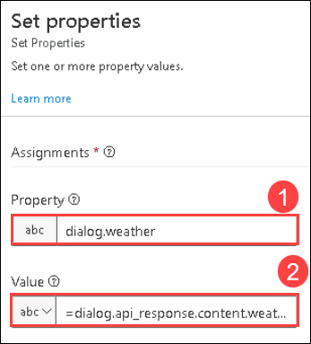

    .png)

1. Still in the **True** branch, add a **Send a response** action under the **Set a property** action and set its text to:

   ```
   The weather in ${dialog.city} is ${dialog.weather} and the temperature is ${dialog.temp}&deg;.
   ```

   >**Note:** This message uses the **dialog.city**, **dialog.weather**, and **dialog.temp** properties you set in the previous actions. Later, you'll also use the **dialog.icon** property.

1. You also need to account for a response from the weather service that is not 200, so in the **False** branch, add a **Send a response** action and set its text to `I got an error: ${dialog.api_response.content.message}.` The dialog flow should now look like this:

    

### Task 4.2: Add a trigger for the dialog

In this task, you will learn how to add a trigger for the new weather dialog, initiating it from the existing welcome dialog.

Now you need some way for the new dialog to be initiated from the existing welcome dialog.

1. In the navigation pane, select the **WeatherBot** dialog that contains **WelcomeUsers** (this is under the top-level bot node of the same name).

    

1. In the properties pane for the selected **WeatherBot** dialog, in the **Language Understanding** section, set the **Recognizer type** to **Regular expression**.

   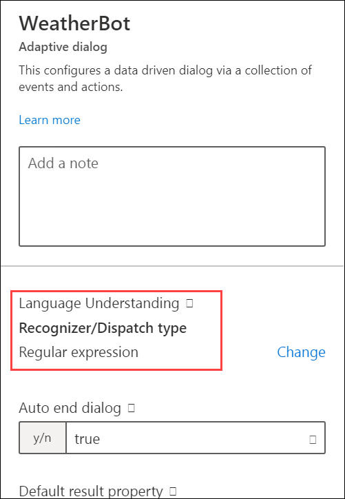

    >**Note:** The default recognizer type uses the Language Understanding service to produce the user's intent using a natural language understanding model. We're using a regular expression recognizer to simplify this exercise. In a real application, you should consider using Language Understanding to allow for more sophisticated intent recognition.

1. In the **...** menu for the **WeatherBot** dialog, select **+ Add new Trigger**.

    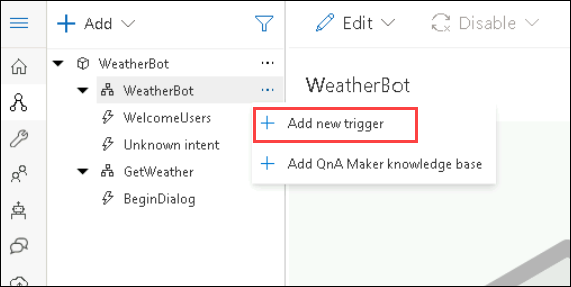

1. Then create a trigger with the following settings:

    - **What is the type of this trigger?**: Intent recognized **(1)**
    
    - **What is the name of this trigger (RegEx)**:  `WeatherRequested` **(2)**
    
    - **Please input regex pattern**: `weather` **(3)**

    - Select **Submit (4)**

      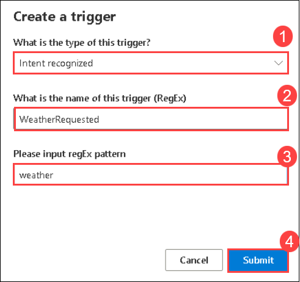

        > **Note:** The text entered in the regex pattern text box is a simple regular expression pattern that will cause the bot to look for the word *weather* in any incoming message.  If "weather" is present, the message becomes a **recognized intent** and the trigger is initiated.

1. Now that the trigger is created, you need to configure an action for it. In the authoring canvas for the trigger, select the **+ (1)** symbol under your new **WeatherRequested** trigger node. Then, in the list of actions, select **Dialog Management (2)** and select **Begin a new dialog (3)**.

    .png)

1. With the **Begin a new dialog** action selected, in the properties pane, select the **GetWeather** dialog from the **Dialog name** drop-down list to start the **GetWeather** dialog you defined earlier when the **WeatherRequested** trigger is recognized. The **WeatherRequested** activity flow should look like this:

    

1. Start the bot and open the web chat pane. Then restart the conversation, and after entering your name, enter `What is the weather like?`. Then, when prompted, enter a city, such as `Seattle`. The bot will contact the service and should respond with a small weather report statement.

   .png)

7. When you have finished testing, close the web chat pane and stop the bot.

## Task 5: Handle interruptions

In this task, you will learn how to handle interruptions in your bot, allowing users to change the flow of the conversation, such as canceling a request.

A well-designed bot should allow users to change the flow of the conversation, for example, by canceling a request.

1. In the Bot Composer, in the navigation pane, use the **...** menu for the **WeatherBot** dialog to add a new trigger (in addition to the existing **WelcomeUsers** and **WeatherRequested** triggers). The new trigger should have the following settings:

    - **What is the type of this trigger?**: Intent recognized **(1)**
    - **What is the name of this trigger (RegEx)**:  `CancelRequest` **(2)**
    - **Please input regex pattern**: `cancel`**(3)**
    - Click on **Submit** **(4)**

      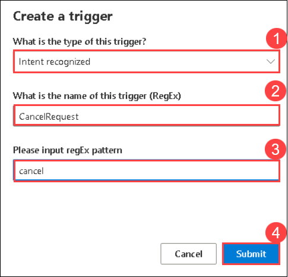

        > The text entered in the regex pattern text box is a simple regular expression pattern that will cause the bot to look for the word *cancel* in any incoming message.

1. In the authoring canvas for the trigger, add a **Send a response** action, and set its text response to `OK. Whenever you're ready, you can ask me about the weather.`

    .png)

1. Under the **Send a response** action, add a new action to end the dialog by selecting **Dialog management** and **End this dialog**. The **CancelRequest** dialog flow should look like this:

    .png)

    >**Note:** Now that you have a trigger to respond to a user's request to cancel, you must allow interruptions to dialog flows where the user might want to make such a request - such as when prompted for a zip code after asking for weather information.

1. In the navigation pane, select **BeginDialog** under the **GetWeather** dialog.

1. Select the **Prompt for text** action that asks the user to enter their city.

1. In the properties for the action, on the **Other** tab, expand **Prompt Configurations** and set the **Allow Interruptions** property to **true**.

   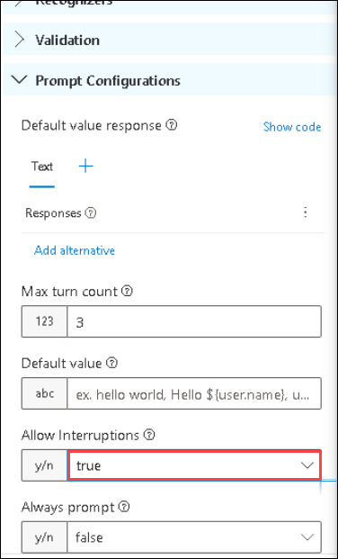

1. Start the bot and open the web chat pane. Restart the conversation, and after entering your name, enter `What is the weather like?`. Then, when prompted, enter `cancel`, and confirm that the request is canceled.

   .png)

1. After canceling the request, enter `What's the weather like?` and note that the appropriate trigger starts a new instance of the **GetWeather** dialog, prompting you once again to enter a city.

1. When you have finished testing, close the web chat pane and stop the bot.

## Task 6: Enhance the user experience

In this task, you will learn how to enhance the user experience of your weather bot by using buttons and cards to present information visually and initiate recommended actions.

The interactions with the weather bot so far have been through text. Users enter text for their intentions, and the bot responds with text. While text is often a suitable way to communicate, you can enhance the experience through other forms of user interface elements.  For example, you can use buttons to initiate recommended actions, or display a *card* to present information visually.

### Task 6.1: Add a button

In this task, you will learn how to add a button to your bot, allowing users to initiate actions through a simple click.

1. In the Bot Framework Composer, in the navigation pane, under the **GetWeather** action, select **BeginDialog**.

1. In the authoring canvas, select the **Prompt for text** action that contains the prompt for the city.

1. In the properties pane, select **Show code**, and replace the existing code with the following code.

    ```
    [Activity
        Text = What is your city?
        SuggestedActions = Cancel
    ]
    ```

    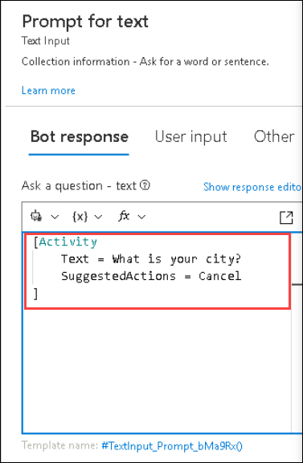

    >**Note:** This activity will prompt the user for their city as before, but also display a **Cancel** button.

### Task 6.2: Add a card

In this task, you will learn how to add a card to your bot, enabling the presentation of information visually in a structured format.

1. In the **GetWeather** dialog, in the **True** path after checking the response from the HTTP weather service, select the **Send a response** action that displays the weather report.

1. In the properties pane, select **Show code** and replace the existing code with the following code.

    ```
    [ThumbnailCard
        title = Weather for ${dialog.city}
        text = ${dialog.weather} (${dialog.temp}&deg;)
        image = http://openweathermap.org/img/w/${dialog.icon}.png
    ]
    ```

    .png)

    >**Note:** This template will use the same variables as before for the weather condition, but also adds a title to the card that will be displayed, along with an image for the weather condition.

### Task 6.3: Test the new user interface

In this task, you will learn how to test the new user interface of your bot, ensuring that buttons and cards are functioning as intended.

1. Restart the bot and open the web chat pane. Restart the conversation, and after entering your name, enter `What is the weather like?`. Then, when prompted, click the **Cancel** button to cancel the request.
   
      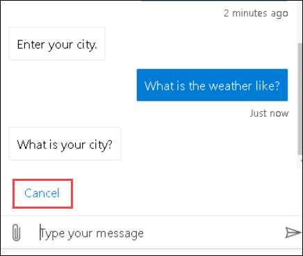
  
1. After canceling, enter `Tell me about the weather` and when prompted, enter a city, such as `London`. The bot will contact the service and should respond with a card indicating the weather conditions.

    .png)

1. When you have finished testing, close the emulator and stop the bot.

> **Congratulations** on completing the task! Now, it's time to validate it. Here are the steps:
>
> - Hit the Validate button for the corresponding task. If you receive a success message, you can proceed to the next task.
> - If not, carefully read the error message and retry the step, following the instructions in the lab guide.
> - If you need any assistance, please contact us at cloudlabs-support@spektrasystems.com. We are available 24/7 to help.

<validation step="b203f839-39fe-4f72-be23-81584c5b9093" />

## Summary
In this lab, you have completed:

+ Got an OpenWeather API key
+ Updated Bot Framework Composer
+ Created a bot
+ Created a bot and customized the "welcome" dialog flow
+ Tested the bot
+ Added a dialog to get the weather
+ Added a dialog
+ Added a trigger for the dialog
+ Handled interruptions
+ Enhanced the user experience
+ Added a button
+ Added a card
+ Tested the new user interface

### You have successfully completed the Hands-on lab!
