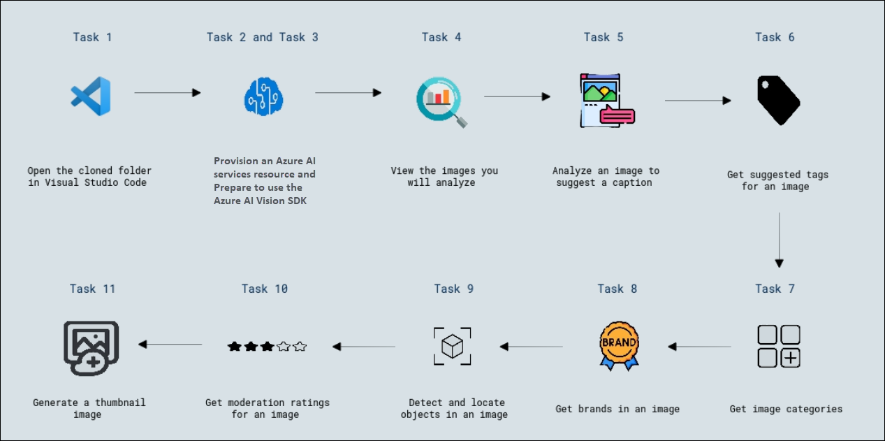

 # Lab 01: Analyze Images with Computer Vision
 
 ## Estimated Duration: 90 Minutes
 
 ## Overview
 
 Azure AI Vision is an artificial intelligence capability that enables software systems to interpret visual input by analyzing images. In Microsoft Azure, the **Vision** Azure AI service provides pre-built models for common computer vision tasks, including analysis of images to suggest captions and tags, detection of common objects, landmarks, celebrities, brands, and the presence of adult content. You can also use the Azure AI Vision service to analyze image color and formats, and to generate "smart-cropped" thumbnail images.
 
 ## Objectives
 
 In this lab, you will complete the following tasks:
 
 + **Task 1:** Open the cloned folder in Visual Studio Code
 + **Task 2:** Provision an Azure AI services resource
 + **Task 3:** Prepare to use the Azure AI Vision SDK
 + **Task 4:** View the images you will analyze
 + **Task 5:** Analyze an image to suggest a caption
 + **Task 6:** Get suggested tags for an image
 + **Task 7:** Get image categories
 + **Task 8:** Get brands in an image
 + **Task 9:** Detect and locate objects in an image
 + **Task 10:** Get moderation ratings for an image
 + **Task 11:** Generate a thumbnail image
 
 ## Architecture diagram
 
 
 
 ## Task 1: Open the cloned folder in Visual Studio Code
 
 In this task, you will learn how to open the cloned folder in **Visual Studio Code**, allowing you to view and edit the project files within the IDE.
 
 1. In the Lab-VM desktop, double-click on the **Visual Studio Code**.
 
     .png)
 
 1. Open a file, from the top-left options, click on **Explorer (1)-> Open Folder (2)** and navigate to **C:\AllFiles (3)**, choose **AI-102-AIEngineer-stage (4)** folder and click **Select folder (5)**.
 
     .png)
 
     >**Note:** Do you trust the authors of the files in this folder? prompt, select **Yes, I trust the authors**.
 
 ## Task 2: Provision an Azure AI services resource
 
 In this task, you will learn how to create Custom Vision resources in Azure for training and prediction, allowing you to manage access and costs for these workloads separately.
 
 If you don't already have one in your subscription, you'll need to provision a **Azure AI Services** resource.
 
 1. Double-click the **Azure Portal** icon on the desktop.
 
     .png)
 
 1. In the top search bar, search for **Azure AI Foundry (1)**, select **Azure AI Foundry (2)** from the result.
 
     .png)
 
 1. On the **AI Foundry** home page, from the left navigation menu, under **Classic AI services (1)**, select **Azure AI services multi-service account (classic) (2)**, and then click **+ Create (3)**.
 
     .png)
 
 1. Create the resource with the following settings, then click on **Review + Create (6)**.
 
     - **Subscription**: *Your Azure subscription*
     
     - **Resource group**: **Ai-102-<inject key="DeploymentID" enableCopy="false" /></inject> (1)**
     
     - **Region**: **<inject key="Region" enableCopy="false"/> (2)**
     
     - **Name**: **AIservice-<inject key="DeploymentID" enableCopy="false" /></inject> (3)**
     
     - **Pricing tier**: Standard S0 **(4)**
     
     - **By checking this box, I acknowledge that I have read and understood all the terms below**: Select the checkbox **(5)**.
 
         .png)
 
 3. In the **Review + create** tab, click on **Create**.
 
    .png)
 
 4. Wait for the deployment to complete. Once the deployment is successful, click on **Go to resources** to view the deployment details.
 
    .png)
 
 1. From the left navigation menu, select **Resource management (1)** and then click **Keys and Endpoint (2)**. This page contains the information that you will need to connect to your resource and use it from applications you develop. Specifically:
     
     - An HTTP **Endpoint** to which client applications can send requests.
     
     - Two **Keys** that can be used for authentication (client applications can use either key to authenticate).
     
     - The **location** where the resource is hosted. This is required for requests to some (but not all) APIs.
 
       >**Note:** Copy the values of **Endpoint (3)** and **Key 1 (4)**, in a notepad. You will use this in the next task.
 
         .png)
 
 > **Congratulations** on completing the task! Now, it's time to validate it. Here are the steps:
 >
 > - Hit the Validate button for the corresponding task. If you receive a success message, you can proceed to the next task.
 > - If not, carefully read the error message and retry the step, following the instructions in the lab guide.
 > - If you need any assistance, please contact us at cloudlabs-support@spektrasystems.com. We are available 24/7 to help.
 
 <validation step="f6424801-7fd2-4a6b-912c-d762d2b64de3" />
 
 ## Task 3: Prepare to use the Azure AI Vision SDK
 
 In this task, you will learn how to complete a partially implemented client application that utilizes the Azure AI Vision SDK to analyze images, including extracting and processing features like text, objects, and other visual insights from images.
 
 >**Note:** You can choose to use the SDK for **C#**. In the steps below, perform the actions appropriate for C# Language.
 
 1. In Visual Studio Code, in the **Explorer** pane, browse to the **15-computer-vision (1)** folder and expand the **C-Sharp (2)**  folder. Right-click on the **image-analysis (3)** folder and click on **Open in Integrated Terminal (4)**.
 
     .png)
 
 1. Then install the Azure AI Vision SDK package by running the appropriate command for your language preference:
 
      **C#**
      
      ```
      dotnet add package Microsoft.Azure.CognitiveServices.Vision.ComputerVision --version 6.0.0
      ```
 
 3. View the contents of the **image-analysis** folder, and note that it contains a file for configuration settings:
 
     - **C#**: appsettings.json
 
 1. Open the configuration file and update the configuration values it contains to reflect the **endpoint** and an authentication **key** for your Azure AI services resource. Save your changes by pressing **Ctrl + S**.
 
     .png)
 
 4. Note that the **image-analysis** folder contains a code file for the client application:
 
     - **C#**: Program.cs
 
 1. Open the code file and at the top, under the existing namespace references, find the comment **Import namespaces**. Then, under this comment, add the following language-specific code to import the namespaces you will need to use the Azure AI Vision SDK:
 
      **C#**
      
      ```C#
      // import namespaces
      using Microsoft.Azure.CognitiveServices.Vision.ComputerVision;
      using Microsoft.Azure.CognitiveServices.Vision.ComputerVision.Models;
      ```
 
      .png)
     
 ## Task 4: View the images you will analyze
 
 In this task, you will learn how to view and analyze multiple images using the **Azure AI Vision** service. 
 
 1. In Visual Studio Code, expand the **image-analysis** folder and the **images** folder it contains.
 
 2. Select each of the image files in turn to view them in Visual Studio Code.
 
     .png)
 
 ## Task 5: Analyze an image to suggest a caption
 
 In this task, you will learn how to use the **Azure AI Vision SDK** to analyze an image and generate a suggested caption. 
 
 Now you're ready to use the SDK to call the Vision service and analyze an image.
 
 1. In the code file for your client application (**Program.cs**), in the **Main** function, note that the code to load the configuration settings has been provided. Then find the comment **Authenticate Azure AI Vision client**. Then, under this comment, add the following language-specific code to create and authenticate an Azure AI Vision client object:
 
      **C#**
      
      ```C#
      // Authenticate Azure AI Vision client
      ApiKeyServiceClientCredentials credentials = new ApiKeyServiceClientCredentials(cogSvcKey);
      cvClient = new ComputerVisionClient(credentials)
      {
          Endpoint = cogSvcEndpoint
      };
      ```
 
      .png)
 
 2. In the **Main** function, under the code you just added, note that the code specifies the path to an image file and then passes the image path to two other functions (**AnalyzeImage** and **GetThumbnail**). These functions are not yet fully implemented.
 
 3. In the **AnalyzeImage** function, under the comment **Specify features to be retrieved**, add the following code:
 
      **C#**
      
      ```C#
      // Specify features to be retrieved
      List<VisualFeatureTypes?> features = new List<VisualFeatureTypes?>()
      {
          VisualFeatureTypes.Description,
          VisualFeatureTypes.Tags,
          VisualFeatureTypes.Categories,
          VisualFeatureTypes.Brands,
          VisualFeatureTypes.Objects,
          VisualFeatureTypes.Adult
      };
      ```
 
      .png)
 
4. In the **AnalyzeImage** function, under the comment **Get image analysis**, add the following code (including the comments indicating where you will add more code later):

     **C#**

     ```csharp
     // Get image analysis
     using (var imageData = File.OpenRead(imageFile))
     {    
         var analysis = await cvClient.AnalyzeImageInStreamAsync(imageData, features);
  
         // Get image captions
         foreach (var caption in analysis.Description.Captions)
         {
             Console.WriteLine($"Description: {caption.Text} (confidence: {caption.Confidence.ToString("P")})");
         }
  
         // Get image tags
         // Get image categories
         // Get brands in the image
         // Get objects in the image
         // Get moderation ratings
     }           
     ```
  
     .png)
     
 5. Save your changes and return to the integrated terminal for the **image-analysis** folder, and enter the following command to run the program with the argument **images/street.jpg**:
 
      **C#**
      
      ```
      dotnet run images/street.jpg
      ```
     
 6. Observe the output, which should include a suggested caption for the **street.jpg** image.
 
     .png)
 
 7. Run the program again, this time with the argument **images/building.jpg** to see the caption that gets generated for the **building.jpg** image.
 
 8. Repeat the previous step to generate a caption for the **images/person.jpg** file.
 
 ## Task 6: Get suggested tags for an image
 
 In this task, you will learn how to use the **Azure AI Vision SDK** to get suggested tags for an image.
 
 It can sometimes be useful to identify relevant *tags* that provide clues about the contents of an image.
 
 1. In the **AnalyzeImage** function, under the comment **Get image tags**, add the following code:
 
      **C#**
      
      ```C#
      // Get image tags
      if (analysis.Tags.Count > 0)
      {
          Console.WriteLine("Tags:");
          foreach (var tag in analysis.Tags)
          {
              Console.WriteLine($" -{tag.Name} (confidence: {tag.Confidence.ToString("P")})");
          }
      }
      ```
 
      .png)
 
 2. Save your changes and run the program once for each of the image files in the **images** folder, observing that in addition to the image caption, a list of suggested tags is displayed.
 
     .png)
 
 ## Task 7: Get image categories
 
 In this task, you will learn how to use the **Azure AI Vision SDK** to get image categories.
 
 The Vision service can suggest *categories* for images, and within each category, it can identify well-known landmarks.
 
 1. In the **AnalyzeImage** function, under the comment **Get image categories**, add the following code:
 
     **C#**
 
     ```C#
 
     // Get image categories
     List<LandmarksModel> landmarks = new List<LandmarksModel> {};
     Console.WriteLine("Categories:");
     foreach (var category in analysis.Categories)
     {
         // Print the category
         Console.WriteLine($" -{category.Name} (confidence: {category.Score.ToString("P")})");
 
         // Get landmarks in this category
         if (category.Detail?.Landmarks != null)
         {
             foreach (LandmarksModel landmark in category.Detail.Landmarks)
             {
                 if (!landmarks.Any(item => item.Name == landmark.Name))
                 {
                     landmarks.Add(landmark);
                 }
             }
         }
     }
 
     // If there were landmarks, list them
     if (landmarks.Count > 0)
     {
         Console.WriteLine("Landmarks:");
         foreach(LandmarksModel landmark in landmarks)
         {
             Console.WriteLine($" -{landmark.Name} (confidence: {landmark.Confidence.ToString("P")})");
         }
     }
         
     ```
     
 2. Save your changes and run the program once for each of the image files in the **images** folder, observing that in addition to the image caption and tags, a list of suggested categories is displayed along with any recognized landmarks (in particular in the **building.jpg** image).
 
     .png)
 
 ## Task 8: Get brands in an image
 
 In this task, you will learn how to use the **Azure AI Vision SDK** to detect and identify well-known **brands** from images based on their logos.
 
 Some brands are visually recognizable from their logos, even when the name of the brand is not displayed. The Vision service is trained to identify thousands of well-known brands.
 
 1. In the **AnalyzeImage** function, under the comment **Get brands in the image**, add the following code:
 
      **C#**
      
      ```C
      // Get brands in the image
      if (analysis.Brands.Count > 0)
      {
          Console.WriteLine("Brands:");
          foreach (var brand in analysis.Brands)
          {
              Console.WriteLine($" -{brand.Name} (confidence: {brand.Confidence.ToString("P")})");
          }
      }
      ```
     
 2. Save your changes and run the program once for each of the image files in the **images** folder, observing any brands that are identified (specifically, in the **person.jpg** image).
 
     .png)
 
 ## Task 9: Detect and locate objects in an image
 
 In this task, you will learn how to use the **Azure AI Vision SDK** to **detect and locate objects** within an image, identifying their positions and boundaries.
 
 *Object detection* is a specific form of computer vision in which individual objects within an image are identified and their location indicated by a bounding box..
 
 1. In the **AnalyzeImage** function, under the comment **Get objects in the image**, add the following code:
 
      **C#**
      
      ```C
      // Get objects in the image
      if (analysis.Objects.Count > 0)
      {
          Console.WriteLine("Objects in image:");
      
          // Prepare image for drawing
          Image image = Image.FromFile(imageFile);
          Graphics graphics = Graphics.FromImage(image);
          Pen pen = new Pen(Color.Cyan, 3);
          Font font = new Font("Arial", 16);
          SolidBrush brush = new SolidBrush(Color.Black);
      
          foreach (var detectedObject in analysis.Objects)
          {
              // Print object name
              Console.WriteLine($" -{detectedObject.ObjectProperty} (confidence: {detectedObject.Confidence.ToString("P")})");
      
              // Draw object bounding box
              var r = detectedObject.Rectangle;
              Rectangle rect = new Rectangle(r.X, r.Y, r.W, r.H);
              graphics.DrawRectangle(pen, rect);
              graphics.DrawString(detectedObject.ObjectProperty,font,brush,r.X, r.Y);
      
          }
          // Save annotated image
          String output_file = "objects.jpg";
          image.Save(output_file);
          Console.WriteLine("  Results saved in " + output_file);   
      }
      ```
     
 2. Save your changes and run the program once for each of the image files in the **images** folder, observing any objects that are detected. After each run, view the **objects.jpg** file that is generated in the same folder as your code file to see the annotated objects.
 
     .png)
 
 ## Task 10: Get moderation ratings for an image
 
 In this task, you will learn how to use the **Azure AI Vision SDK** to **get moderation ratings** for an image to detect adult content, violence, or other inappropriate material.
 
 Some images may not be suitable for all audiences, and you may need to apply some moderation to identify images that are adult or violent in nature.
 
 1. In the **AnalyzeImage** function, under the comment **Get moderation ratings**, add the following code:
 
      **C#**
      
      ```C
      // Get moderation ratings
      string ratings = $"Ratings:\n -Adult: {analysis.Adult.IsAdultContent}\n -Racy: {analysis.Adult.IsRacyContent}\n -Gore: {analysis.Adult.IsGoryContent}";
      Console.WriteLine(ratings);
      ```
 
 2. Save your changes and run the program once for each of the image files in the **images** folder, observing the ratings for each image.
 
     .png)
 
     > **Note:** In the preceding tasks, you used a single method to analyze the image, and then incrementally added code to parse and display the results. The SDK also provides individual methods for suggesting captions, identifying tags, detecting objects, and so on - meaning that you can use the most appropriate method to return only the information you need, reducing the size of the data payload that needs to be returned. See the [.NET SDK documentation](https://docs.microsoft.com/dotnet/api/overview/azure/cognitiveservices/client/computervision?view=azure-dotnet) for more details.
 
 ## Task 11: Generate a thumbnail image
 
 In this task, you will learn how to use the **Azure AI Vision SDK** to **generate a thumbnail image** for faster viewing or processing.
 
 In some cases, you may need to create a smaller version of an image named a *thumbnail*, cropping it to include the main visual subject within new image dimensions.
 
 1. In your code file, find the **GetThumbnail** function; and under the comment **Generate a thumbnail**, add the following code:
 
      **C#**
 
      ```C
      // Generate a thumbnail
      using (var imageData = File.OpenRead(imageFile))
      {
          // Get thumbnail data
          var thumbnailStream = await cvClient.GenerateThumbnailInStreamAsync(100, 100,imageData, true);
      
          // Save thumbnail image
          string thumbnailFileName = "thumbnail.png";
          using (Stream thumbnailFile = File.Create(thumbnailFileName))
          {
              thumbnailStream.CopyTo(thumbnailFile);
          }
      
          Console.WriteLine($"Thumbnail saved in {thumbnailFileName}");
      }
      ```
     
 2. Save your changes and run the program once for each of the image files in the **images** folder (**images/building.jpg**, **images/person.jpg**, **images/street.jpg**).
 
      ```
      dotnet run images/street.jpg
      ```
 
     .png)
 
 3. Opening the **thumbnail.jpg** file that is generated in the same folder as your code file.
 
     ```
     dotnet run .\thumbnail.png
     ```
     
     .png)
 
     > **Note:** If you face any issues after running the command, like the process cannot access the file because it is being used by another process, please ignore and proceed with the next lab.
 
 ## Summary
 In this lab, you have completed:
 
 + Opened the cloned folder in Visual Studio Code
 + Provisioned an Azure AI services resource
 + Prepared to use the Azure AI Vision SDK
 + Viewed the images you will analyze
 + Analyzed an image to suggest a caption
 + Got suggested tags for an image
 + Got image categories
 + Got brands in an image
 + Detect and locate objects in an image
 + Got moderation ratings for an image
 + Generated a thumbnail image
 
 ### You have successfully completed the lab, click on Next >>.
 
 .png)
 
