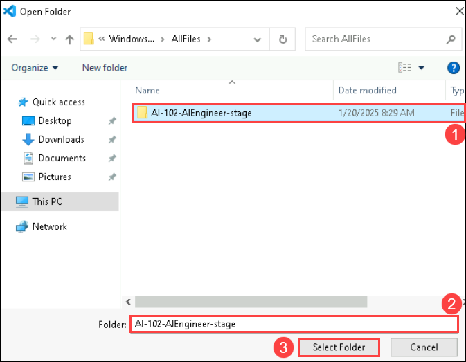
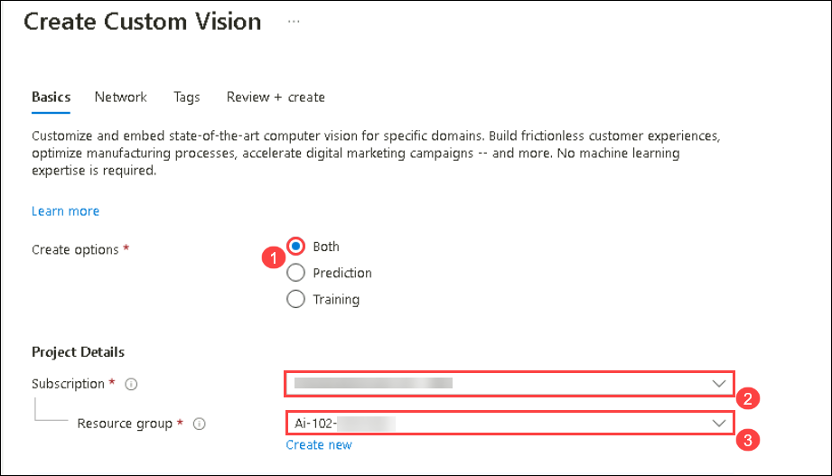
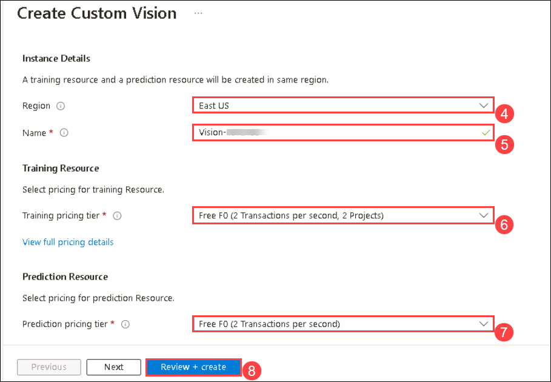
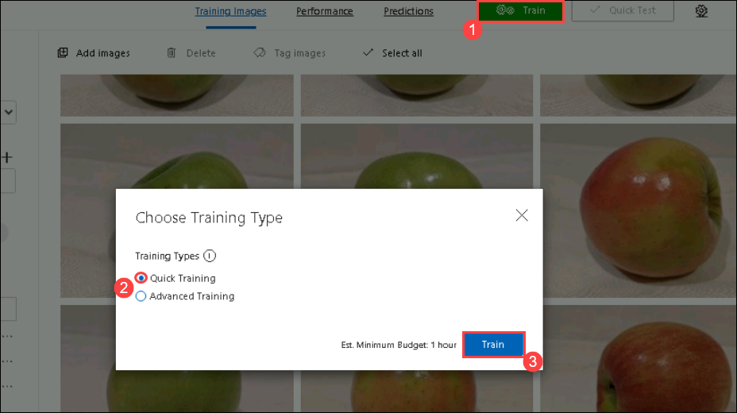
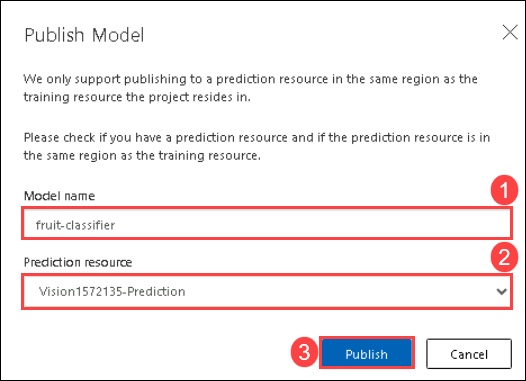
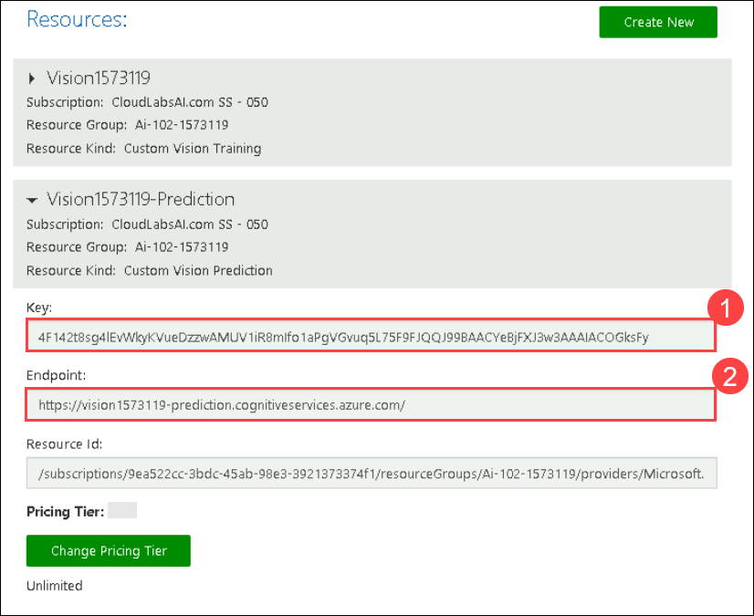

# Exercise 01: Classify Images with Custom Vision

## Lab scenario

The **Custom Vision** service enables you to create computer vision models that are trained on your own images. You can use it to train *image classification* and *object detection* models; which you can then publish and consume from applications.

In this exercise, you will use the Custom Vision service to train an image classification model that can identify three classes of fruit (apple, banana, and orange).

## Objectives

In this lab, you will complete the following tasks:

+ Task 1: Open the cloned folder in Visual Studio Code
+ Task 2: Create Custom Vision resources
+ Task 3: Create a Custom Vision project
+ Task 4: Test the model
+ Task 5: View the project settings
+ Task 6:  Use the *training* API
+ Task 7: Publish the image classification model
+ Task 8: Use the image classifier from a client application

## Estimated timing: 60 minutes

## Architecture diagram


## Task 1: Open the cloned folder in Visual Studio Code

1.  Start Visual Studio Code (the program icon is pinned to the bottom taskbar).

     

2.  Open a file, From the top-left options, Click on **file->Open Folder** and navigate to **C:\AllFiles\AI-102-AIEngineer-stage (1)** and select **(2)** then click on **select folder (3)**.

     

    **Note:** You may be prompted to complete a 2-minute survey. Go ahead and select **No, thanks**. You may need to do this more than once.
    **Note:** In the Do you trust the authors of the files in this folder? prompt, select **Yes, I trust the authors**

3.  Wait while additional files are installed to support the C# code projects in the repo.

## Task 2: Create Custom Vision resources

Before you can train a model, you will need Azure resources for *training* and *prediction*. You can create **Custom Vision** resources for each of these tasks, or you can create a single **Azure AI Services** resource and use it for either (or both).

In this exercise, you'll create **Custom Vision** resources for training and prediction so that you can manage access and costs for these workloads separately.


1. In the azure portal, Select the **&#65291;Create a resource** button.

   

1. Search for *custom vision* and select it, and create a **Custom Vision** resource with the following settings:

    - **Create options**: Both **(1)**
    - **Subscription**: *Your Azure subscription* **(2)**
    - **Resource group**: Choose a resource group (Ai-102-<inject key="DeploymentID" enableCopy="false"/>) **(3)**

       

    - **Region**: *Choose any available region* **(4)**
    - **Name**: Vision-<inject key="DeploymentID" enableCopy="false"/> **(5)**
    - **Training pricing tier**: F0 **(6)**
    - **Prediction pricing tier**: F0 **(7)**

        > **Note**: If you already have an F0 custom vision service in your subscription, select **S0** for this one.

3. Select **Review + create (8)** to navigate to the **Review + create** tab, and then select **Create**.

    

4. Wait for the resources to be created, and then view the deployment details and note that two Custom Vision resources are provisioned; one for training, and another for prediction. You can view these by navigating to the resource group where you created them.

    > **Important**: Each resource has its own *endpoint* and *keys*, which are used to manage access from your code. To train an image classification model, your code must use the *training* resource (with its endpoint and key); and to use the trained model to predict image classes, your code must use the *prediction* resource (with its endpoint and key).

## Task 3: Create a Custom Vision project

To train an image classification model, you need to create a Custom Vision project based on your training resource. To do this, you'll use the Custom Vision portal.

1. In Visual Studio Code, view the training images in the **17-image-classification/training-images**. This folder contains subfolders of apple, banana, and orange images.

1. In a new browser tab, open the Custom Vision portal at `https://customvision.ai`. If prompted, sign in using the Microsoft account associated with your Azure subscription and agree to the terms of service.

4. In the Custom Vision portal, select **NEW PROJECT** to create a new project with the following settings then click on **Create Project**:

    - **Name**: Classify Fruit **(1)**
    - **Description**: Image classification for fruit **(2)**
    - **Resource**: Select **Vision-<inject key="DeploymentID" enableCopy="false"/> (3)**
    - **Project Types**: Classification **(4)**
    - **Classification Types**: Multiclass (Single tag per image) **(5)**
    - **Domains**: Food **(6)**

      
      

5. In the new project, click **\[+\] Add images**, and select all of the files in the **C:\AllFiles\AI-102-AIEngineer-stage\17-image-classification\training-images\apple** folder you viewed previously. Then upload the image files, specifying the tag *apple*, like this:

   
   
6. Repeat the previous step to upload the images in the **banana** folder with the tag *banana*, and the images in the **orange** folder with the tag *orange*.

7. Explore the images you have uploaded in the Custom Vision project - there should be 15 images of each class, like this:

   
    
8. In the Custom Vision project, above the images, click **Train (1)** to train a classification model using the tagged images. Select the **Quick Training (2)** option then click on **Train (3)**, and then wait for the training iteration to complete (this may take a minute or so).

   

9. When the model iteration has been trained, review the **Precision**, **Recall**, and **AP** performance metrics - these measure the prediction accuracy of the classification model, and should all be high.

>**Note**: The performance metrics are based on a probability threshold of 50% for each prediction (in other words, if the model calculates a 50% or higher probability that an image is of a particular class, then that class is predicted). You can adjust this at the top-left of the page.

## Task 4: Test the model

Now that you've trained the model, you can test it.

1. Above the performance metrics, click **Quick Test**.

2. In the **Image URL** box, type `https://aka.ms/apple-image` and click &#10132;

3. View the predictions returned by your model - the probability score for *apple* should be the highest, like this:

     

4. Close the **Quick Test** window.

## Task 5: View the project settings

The project you have created has been assigned a unique identifier, which you will need to specify in any code that interacts with it.

1. Click the **settings (&#9881;)** icon at the top right of the **Performance** page to view the project settings.

2. Under **General** (on the left), note the **Project Id** that uniquely identifies this project.

3. On the right, under **Resources** note that the **key and endpoint** are shown. These are the details for the *training* resource (you can also obtain this information by viewing the resource in the Azure portal).

## Task 6: Use the *training* API

The Custom Vision portal provides a convenient user interface that you can use to upload and tag images, and train models. However, in some scenarios you may want to automate model training by using the Custom Vision training API.

1. In Visual Studio Code, in the **Explorer** pane, browse to the **17-image_classification** folder and expand the **C-Sharp**

2. Right-click the **train-classifier** folder and open an integrated terminal. Then install the Custom Vision Training package by running the appropriate command for your language preference:

    **C#**

    ```
    dotnet add package Microsoft.Azure.CognitiveServices.Vision.CustomVision.Training --version 2.0.0
    ```

3. View the contents of the **train-classifier** folder, and note that it contains a file for configuration settings:
    - **C#**: appsettings.json

    Open the configuration file and update the configuration values it contains to reflect the endpoint and key for your Custom Vision *training* resource, and the project ID for the classification project you created previously. Save your changes.

4. Note that the **train-classifier** folder contains a code file for the client application:

    - **C#**: Program.cs

    Open the code file and review the code it contains, noting the following details:
    - Namespaces from the package you installed are imported
    - The **Main** function retrieves the configuration settings, and uses the key and endpoint to create an authenticated **CustomVisionTrainingClient**, which is then used with the project ID to create a **Project** reference to your project.
    - The **Upload_Images** function retrieves the tags that are defined in the Custom Vision project and then uploads image files from correspondingly named folders to the project, assigning the appropriate tag ID.
    - The **Train_Model** function creates a new training iteration for the project and waits for training to complete.

5. Return the integrated terminal for the **train-classifier** folder, and enter the following command to run the program:

    **C#**

    ```
    dotnet run
    ```
    
6. Wait for the program to end. Then return to your browser and view the **Training Images** page for your project in the Custom Vision portal (refreshing the browser if necessary).

7. Verify that some new tagged images have been added to the project. Then view the **Performance** page and verify that a new iteration has been created.

## Task 7: Publish the image classification model

Now you're ready to publish your trained model so that it can be used from a client application.

1. In the Custom Vision portal, on the **Performance** page,  click **&#128504; Publish** to publish the trained model with the following settings:
    - **Model name**: fruit-classifier **(1)**
    - **Prediction Resource**: *The **prediction** resource you created previously which ends with "-Prediction" (<u>not</u> the training resource)*. **(2)**
     - Click **Publish (3)**

     

2. At the top left of the **Project Settings** page, click the *Projects Gallery* (&#128065;) icon to return to the Custom Vision portal home page, where your project is now listed.

3. On the Custom Vision portal home page, at the top right, click the *settings* (&#9881;) icon to view the settings for your Custom Vision service. Then, under **Resources**, find your *prediction* resource which ends with "-Prediction"  (<u>not</u> the training resource) to determine its **Key (1)** and **Endpoint (2)** values (you can also obtain this information by viewing the resource in the Azure portal).

   

## Task 8: Use the image classifier from a client application

Now that you've published the image classification model, you can use it from a client application. Once again, you can choose to use **C#**.

1. In Visual Studio Code, in the **17-image-classification** folder, in the subfolder for your preferred language (**C-Sharp**), right- the **test-classifier** folder and open an integrated terminal. Then enter the following SDK-specific command to install the Custom Vision Prediction package:

    **C#**

    ```
    dotnet add package Microsoft.Azure.CognitiveServices.Vision.CustomVision.Prediction --version 2.0.0
    ```

2. Expand the **test-classifier** folder to view the files it contains, which are used to implement a test client application for your image classification model.

3. Open the configuration file for your client application (*appsettings.json* for C#) and update the configuration values it contains to reflect the endpoint and key for your Custom Vision *prediction* resource, the project ID for the classification project, and the name of your published model (which should be *fruit-classifier*). Save your changes.

4. Open the code file for your client application (*Program.cs* for C#) and review the code it contains, noting the following details:

    - Namespaces from the package you installed are imported

    - The **Main** function retrieves the configuration settings, and uses the key and endpoint to create an authenticated **CustomVisionPredictionClient**.

    - The prediction client object is used to predict a class for each image in the **test-images** folder, specifying the project ID and model name for each request. Each prediction includes a probability for each possible class, and only predicted tags with a probability greater than 50% are displayed.

5. Return the integrated terminal for the **test-classifier** folder, and enter the following SDK-specific command to run the program:

    **C#**

    ```
    dotnet run
    ```
6. View the label (tag) and probability scores for each prediction. You can view the images in the **test-images** folder to verify that the model has classified them correctly.

   

### Review
In this lab, you have completed:

+ Opened the cloned folder in Visual Studio Code
+ Created Custom Vision resources
+ Created a Custom Vision project
+ Tested the model
+ Viewed the project settings
+ Used the *training* API
+ Published the image classification model
+ Used the image classifier from a client application
   
## You have successfully completed the lab, proceed with the next exercises.
