# Lab 01: Create an Azure AI Search solution

### Estimated Duration: 120 Minutes

## Overview
All organizations rely on information to make decisions, answer questions, and function efficiently. The problem for most organizations is not a lack of information, but the challenge of finding and  extracting the information from the massive set of documents, databases, and other sources in which the information is stored.

For example, suppose *Margie's Travel* is a travel agency that specializes in organizing trips to cities around the world. Over time, the company has amassed a huge amount of information in documents such as brochures, as well as reviews of hotels submitted by customers. This data is a valuable source of insights for travel agents and customers as they plan trips, but the sheer volume of data can make it difficult to find relevant information to answer a specific customer question.

To address this challenge, Margie's Travel can use Azure AI Search to implement a solution in which the documents are indexed and enriched by using AI skills to make them easier to search.

## Objectives

In this lab, you will complete the following tasks:

+ **Task 1:** Open the folder in Visual Studio Code.
+ **Task 2:** Create Azure resources
+ **Task 3:** Upload Documents to Azure Storage
+ **Task 4:** Index the documents
+ **Task 5:** Search the index
+ **Task 6:** Explore and modify definitions of search components
+ **Task 7:** Create a search client application

## Architecture diagram

   

## Task 1: Open the folder in Visual Studio Code.

In this task, you will open the folder in Visual Studio Code.

1. In the Lab-VM desktop, double-click on the **Visual Studio Code**.

    .png)

1. Open a file, from the top-left options, click on **Explorer (1)-> Open Folder (2)** and navigate to **C:\AllFiles (3)**, choose **AI-102-AIEngineer-stage (4)** folder and click **Select folder (5)**.

    .png)

    >**Note:** Do you trust the authors of the files in this folder? prompt, select **Yes, I trust the authors**.

## Task 2: Create Azure resources

In this task, you will learn how to create the necessary Azure resources, including an Azure AI Search resource, an Azure AI Services resource, and a Storage account with a blob container.

The solution you will create for Margie's Travel requires the following resources in your Azure subscription:

- An **Azure AI Search** resource, which will manage indexing and querying.
- An **Azure AI Services** resource, which provides AI services for skills that your search solution can use to enrich the data in the data source with AI-generated insights.
- A **Storage account** with a blob container in which the documents to be searched are stored.

    > **Important:** Your Azure AI Search and Azure AI Services resources must be in the same location!

### Task 2.1: Create an Azure AI Search resource

In this task, you will learn how to create an Azure AI Search resource to manage indexing and querying.

1. Open the Azure portal.

2. In the search bar, type **AI Search (1)** and select **AI Search (2)** from the results.

    .png)

1. In the **Microsoft Foundry | AI Search** blade, click on **+ Create** to create new resource.

    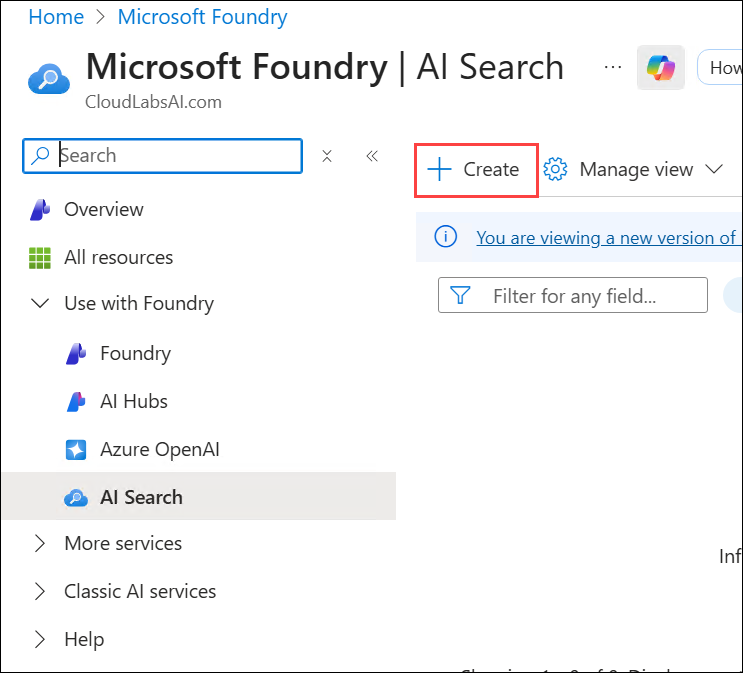

1. Create an **Azure AI Search** resource with the following settings and then click on **Review + Create (6)**.
    
    - **Subscription**: Leave default subscription **(1)**
    
    - **Resource group**: **Ai-102-<inject key="DeploymentID" enableCopy="false"/> (2)**
    
    - **Service name**: **aisearch<inject key="DeploymentID" enableCopy="false"/> (3)**
    
    - **Location**: **<inject key="Region" enableCopy="false" /></inject> (4)** - *note that your Azure AI Search and Azure AI Services resources must be in the same location*.
    
    - **Pricing tier**: **Basic (5)**

      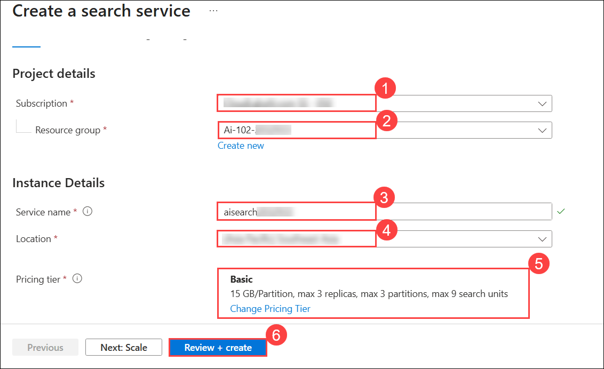    

1. On the **Review + create** tab, click **Create**.

    .png)

1. Wait for deployment to complete, and click on **Go to resources**.

    .png)

1. Review the **Overview** page on the blade for your Azure AI Search resource in the Azure portal. Here, you can use a visual interface to create, test, manage, and monitor the various components of a search solution, including data sources, indexes, indexers, and skillsets.

    .png)

>**Note:** Perform the Validation after completing, **Task 4**. Otherwise, you may get validation as failed.

### Task 2.2: Create an Azure AI Services resource

In this task, you will learn how to create an Azure AI Services resource to provide AI capabilities for enriching your data with AI-generated insights.

If you don't already have one in your subscription, you'll need to provision an **Azure AI Services** resource. Your search solution will use this to enrich the data in the datastore with AI-generated insights.

1. Click on **+ Create a resource** on the azure portal home page.

    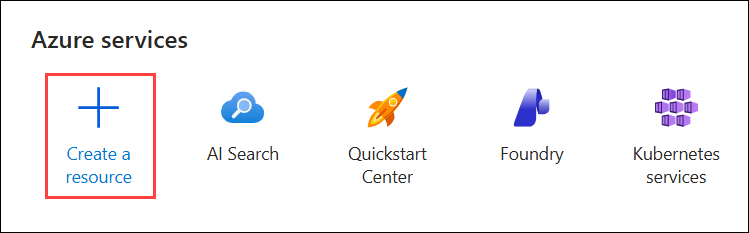

1. On the **Create a resource** page, search for **Azure ai services (1)** and press **Enter**. From the results, select **Azure AI services**, click the **Create (2)** dropdown, and then choose **Azure AI services (3)**.

    .png)
 
1. Create an **Azure AI Services** resource with the following settings and then click on **Review+ create (7)**.

    - **Subscription**: Leave default Azure subscription **(1)**

    - **Resource group**: **Ai-102-<inject key="DeploymentID" enableCopy="false"/> (2)**

    - **Region**: **<inject key="Region" enableCopy="false" /></inject> (3)** - **The same location as your Azure AI Search resource**

    - **Name**: **aiservices<inject key="DeploymentID" enableCopy="false"/> (4)**

    - **Pricing tier**: **Standard S0 (5)**

    - **Select the required checkboxes (6)**.

      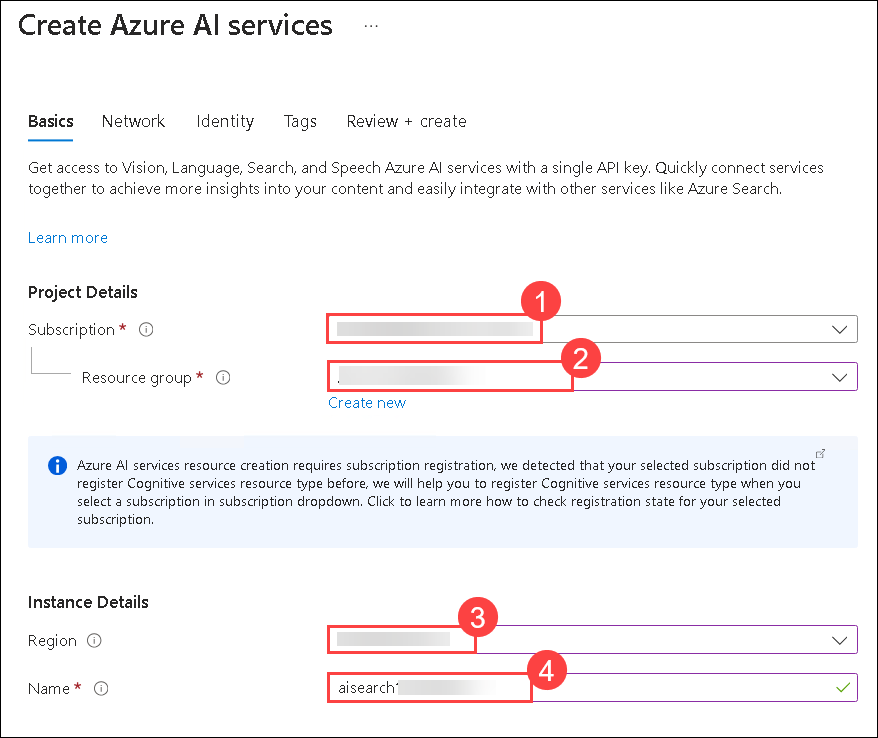    

      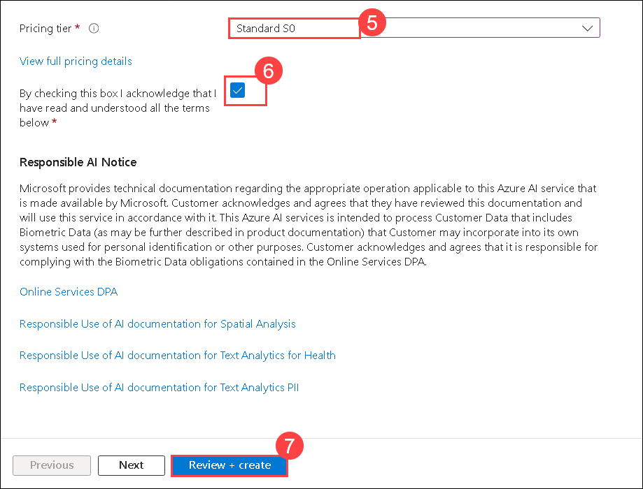    

1. On the **Review + create** tab, click **Create**.

    .png)

1. Wait for the deployment to complete, and click on **Go to resources**, then view the deployment details.

    .png)

### Task 2.3: Create a storage account

In this task, you will learn how to create a storage account in Azure to store your documents in a blob container.

1. Return to the home page of the Azure portal, and search for **Storage account (1)** and then select **Storage accounts (2)** from the services.

    (1).png)

1. In the **Storage center | Blob Storage** blade, click on **+ Create**.

    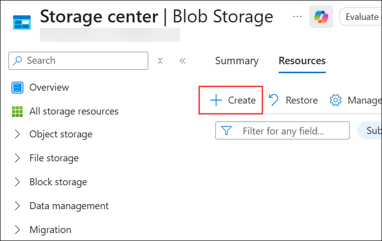
 
 1. Create a **Storage account** resource with the following settings and then click on the **Advanced** tab from the top.

    - **Subscription**: Leave default Azure subscription **(1)**

    - **Resource group**: **Ai-102-<inject key="DeploymentID" enableCopy="false"/> (2)**

    - **Storage account name**: **blob<inject key="DeploymentID" enableCopy="false"/> (3)**

    - **Region**: **<inject key="Region" enableCopy="false" /></inject> (4)**

    - **Performance**: **Standard (5)**

    - **Replication**: **Locally-redundant storage (LRS) (6)**

      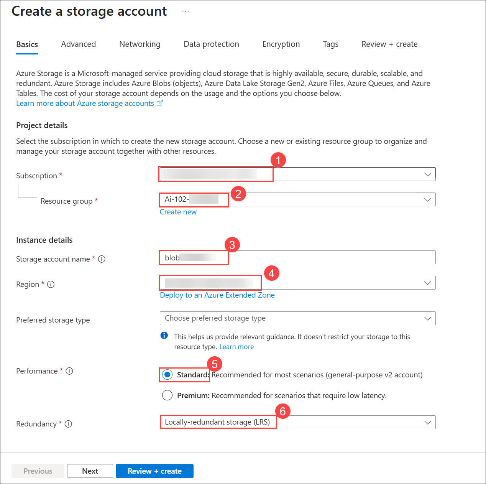 
     
    - On the **Advanced** tab, check the box next to **Allow enabling anonymous access on individual containers (1)** then select **Review + create (2)**.

      .png)
     
1. On the **Review + create** tab, click on **Create**.

    .png)

1. Wait for deployment to complete, and click on **Go to resource**.

    .png)

1. On the **Overview (1)** page, note the **Subscription ID (2)** -this identifies the subscription in which the storage account is provisioned.

    .png)
 
1. In the left navigation pane, under **Security + networking**, select **Access keys (1)**. Copy the two keys **(2)** and **(3)** generated for your storage account into a notepad, then click **Show keys** to view them.

    .png) 
 
    >**Note:** Keep the **Storage Account** blade open - you will need the subscription ID and one of the keys in the next procedure.

## Task 3: Upload Documents to Azure Storage

In this task, you will learn how to upload documents to your Azure Storage account, specifically into the blob container.

Now that you have the required resources, you can upload some documents to your Azure Storage account.

1. In Visual Studio Code, in the **Explorer** pane, expand the **22-create-a-search-solution** folder and select **UploadDocs.cmd**.

1. Edit the batch file to replace the **YOUR_SUBSCRIPTION_ID**, **YOUR_AZURE_STORAGE_ACCOUNT_NAME**, and **YOUR_AZURE_STORAGE_KEY** placeholders with the appropriate subscription ID, Azure storage account name, and Azure storage account key values for the storage account you created previously. Save your changes.

     .png)
 
1. Then right-click on the **22-Create-a-search-solution (1)** folder and select **Open in Integrated Terminal (2)**.

    .png)

1. Enter the following command to sign into your Azure subscription by using the Azure CLI.

    ```
    az login
    ```

    A web browser tab will open and prompt you to sign in to Azure. Do so, and then close the browser tab and return to Visual Studio Code.

    > **Note:** If the Sign-in window doesn’t appear, try minimizing VS Code.

    - If prompted, select **Work or school account (1)** then click on **Continue (2)**.

      .png)  

    - Enter the Email address and Password provided in the **Environment** tab.

    - In the **Sign in to all apps, websites, and services on this device?** prompt, select **No, this app only**. 

        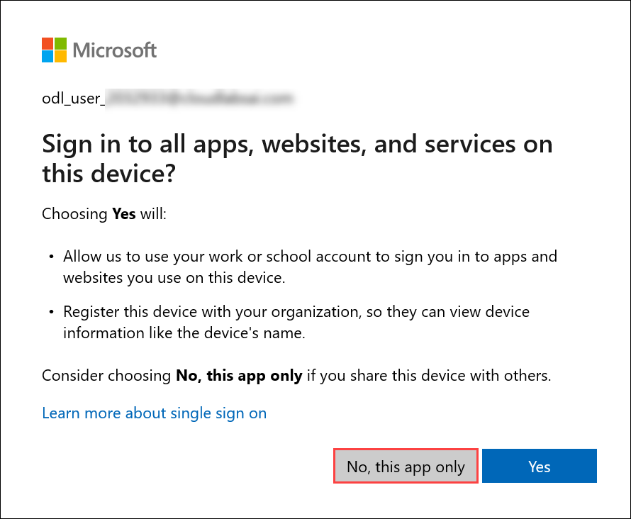

1. Navigate back to the VS Code. If prompted, **Select a subscription and tenant (Type a number or Enter for no changes):** press **Enter**.     

1. Enter the following command to run the batch file. This will create a blob container in your storage account and upload the documents in the **data** folder to it.

    ```
    .\UploadDocs.cmd
    ```

    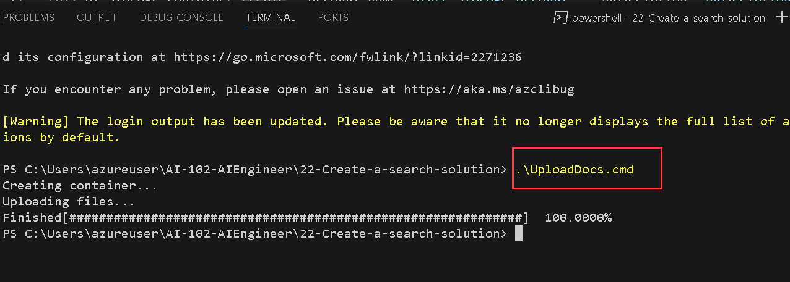 
     
> **Congratulations** on completing the task! Now, it's time to validate it. Here are the steps:
>
> - Hit the Validate button for the corresponding task. If you receive a success message, you can proceed to the next task.
> - If not, carefully read the error message and retry the step, following the instructions in the lab guide.
> - If you need any assistance, please contact us at cloudlabs-support@spektrasystems.com. We are available 24/7 to help.

<validation step="6cbaad12-ad3b-48d8-9a96-088e83af5b84" />

## Task 4: Index the documents

In this task, you will learn how to index the uploaded documents in Azure AI Search to enable efficient searching and querying.

Now that you have the documents in place, you can create a search solution by indexing them.

1. In the Azure portal, browse to your Azure AI Search resource. 

    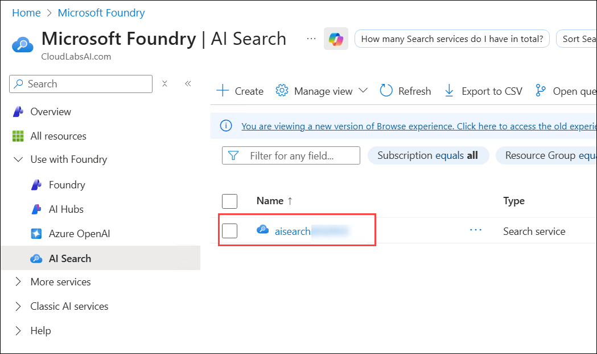
 
1. Then, on its **Overview** page, select **Import data**.

     .png)
 
1. In the **Choose a data source** section, select **Azure Blob Storage**.

    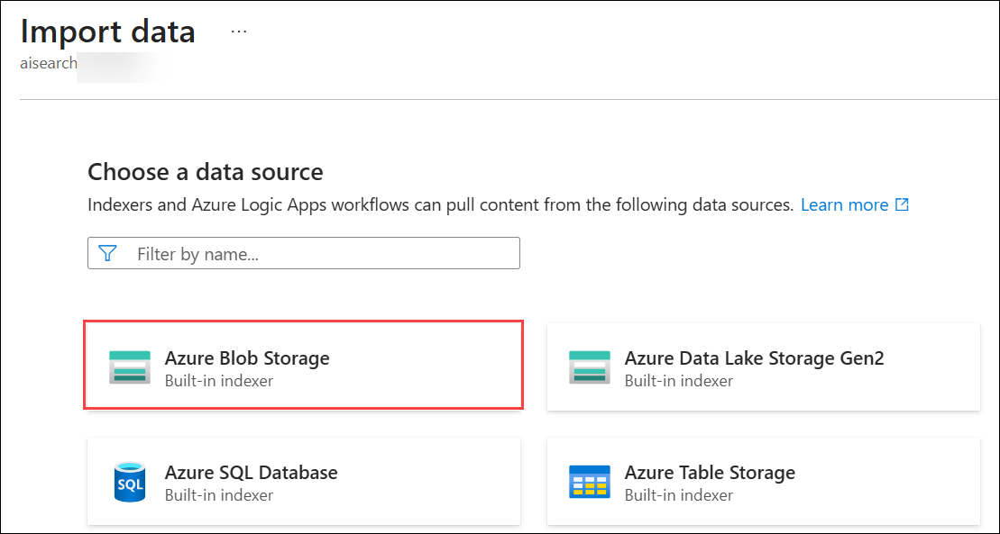  

1. In the **What scenario are you targeting?** section, select **Keyword search**.

    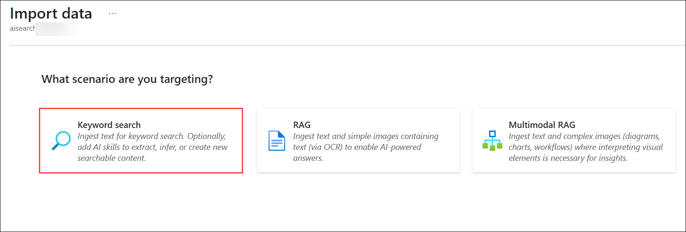 

1. On **Connect to your data** form set the following:

    - Subscription: *Your Azure subscription* **(1)**
    - Select your storage account **blob<inject key="DeploymentID" enableCopy="false"/> (2)**.
    - **Blob container**: Select the **margies (3)** container.
    - Leave the remaining options as their default values, and then select **Next (4)**.

       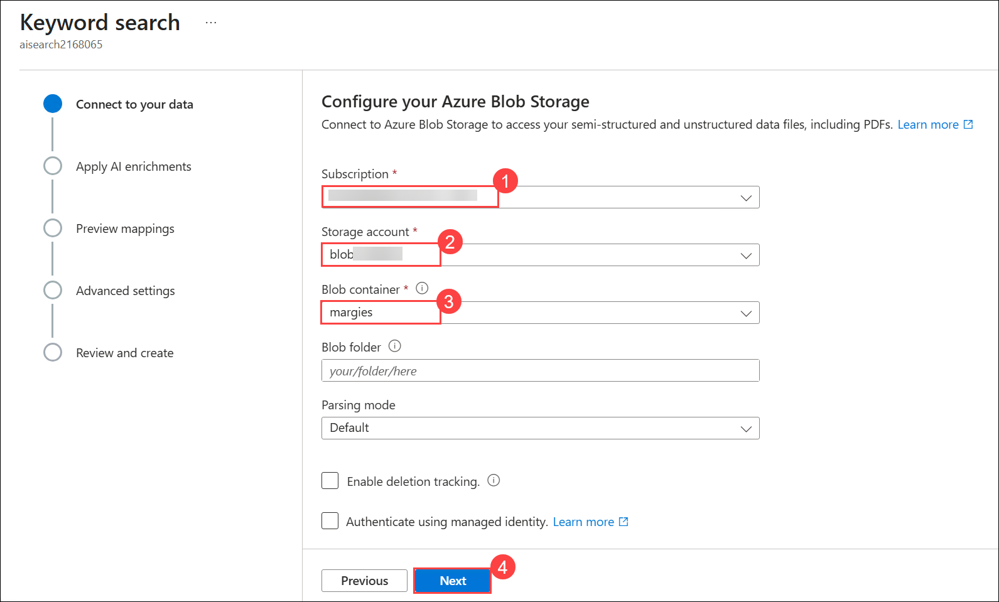 

1. On **Apply AI enrichments** set the following:
    - Select **Extract phrases (1)**.
    - Select **Extract entities**, select the settings icon **(2)**. 
    
      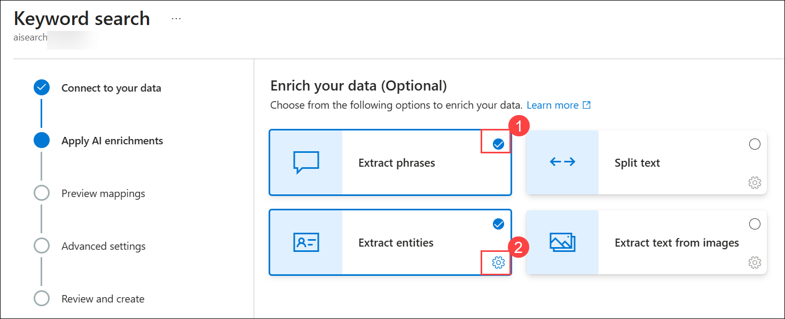 

1. In the **Extract text entities** pane, select **Persons (1)** and **Locations (1)**, and then click **Save (2)**.

    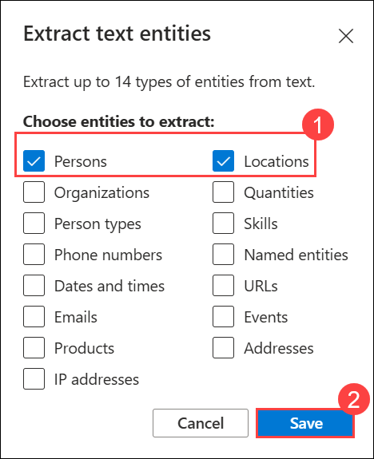 

1. Select **Extract text from images** and select the settings icon. 

    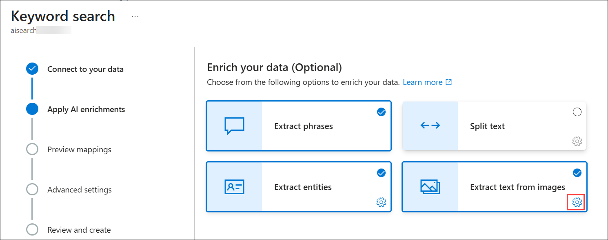 

1. In the **Extract text from images** pane, select **Generate tags (1)** and **Categorize content (1)**, and then click **Save (2)**.

    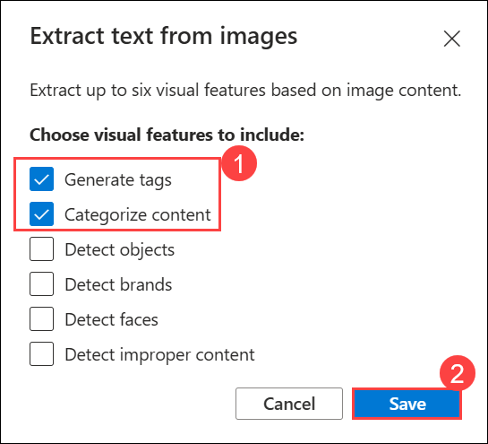 

1. In the **Attach a Foundry Tools multi-service account** section, select **Use a free Foundry Tools resource (1)**, choose your multi-service account **aiservices<inject key="DeploymentID" enableCopy="false"/> (2)**, select the acknowledgment option **(3)**, and then click **Next (4)**.

    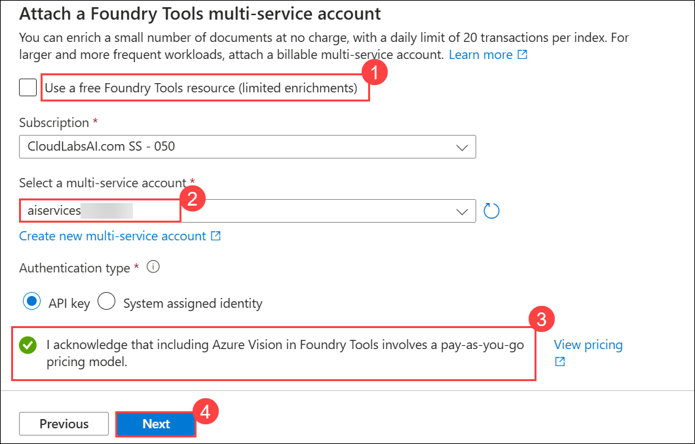 

1. In the **Preview mappings** step, scroll down and select **metadata_storage_size (1)**, click **Configure field (2)**, configure as shown in the following table repeat the same configuration for the remaining fields as required.

    - The fields are already mapped based on the options you selected in the previous step.

    | Target index field name | Retrievable | Filterable | Sortable | Facetable | Searchable |
    | ---------- | ----------- | ---------- | -------- | --------- | ---------- |
    | metadata_storage_size | &nbsp;&nbsp;&nbsp;&nbsp;&nbsp;&nbsp;&#10004; | &nbsp;&nbsp;&nbsp;&nbsp;&nbsp;&nbsp;&#10004; | &nbsp;&nbsp;&nbsp;&nbsp;&nbsp;&nbsp;&#10004; | | |

     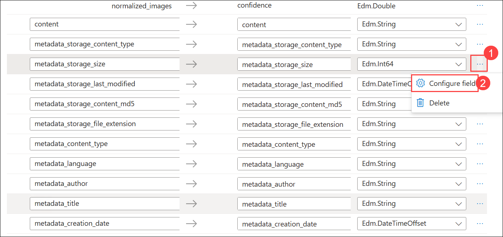 

     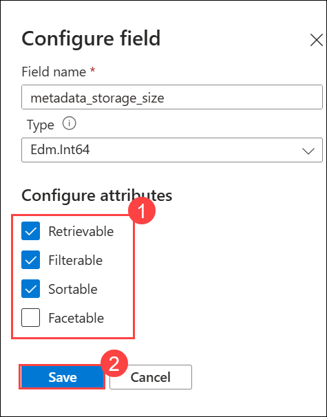 

1. On **Preview mappings** set the following configuration:

    | Target index field name | Retrievable | Filterable | Sortable | Facetable | Searchable |
    | ---------- | ----------- | ---------- | -------- | --------- | ---------- |
    | metadata_storage_last_modified | &nbsp;&nbsp;&nbsp;&nbsp;&nbsp;&nbsp;&#10004; | &nbsp;&nbsp;&nbsp;&nbsp;&nbsp;&nbsp;&#10004; | &nbsp;&nbsp;&nbsp;&nbsp;&nbsp;&nbsp;&#10004; | | |
    | title | &nbsp;&nbsp;&nbsp;&nbsp;&nbsp;&nbsp;&#10004; | | | | &nbsp;&nbsp;&nbsp;&nbsp;&nbsp;&nbsp;&#10004; |
    | locations | &nbsp;&nbsp;&nbsp;&nbsp;&nbsp;&nbsp;&#10004; | &nbsp;&nbsp;&nbsp;&nbsp;&nbsp;&nbsp;&#10004; | | | &nbsp;&nbsp;&nbsp;&nbsp;&nbsp;&nbsp;&#10004; |
    | persons | &nbsp;&nbsp;&nbsp;&nbsp;&nbsp;&nbsp;&#10004; | | | | &nbsp;&nbsp;&nbsp;&nbsp;&nbsp;&nbsp;&#10004; |
    | keyPhrases | &nbsp;&nbsp;&nbsp;&nbsp;&nbsp;&nbsp;&#10004; | | | | &nbsp;&nbsp;&nbsp;&nbsp;&nbsp;&nbsp;&#10004; |
    | metadata_author | &nbsp;&nbsp;&nbsp;&nbsp;&nbsp;&nbsp;&#10004; | &nbsp;&nbsp;&nbsp;&nbsp;&nbsp;&nbsp;&#10004; | &nbsp;&nbsp;&nbsp;&nbsp;&nbsp;&nbsp;&#10004; | &nbsp;&nbsp;&nbsp;&nbsp;&nbsp;&nbsp;&#10004; | &nbsp;&nbsp;&nbsp;&nbsp;&nbsp;&nbsp;&#10004; |

    - Double-check your selections carefully.
    - Select **Next**.

1. On **Advanced settings** set the following:
    - Ensure **Enable semantic ranker (1)** is selected.
    - If it isn't already selected, set **Schedule** to **Once (2)**.
    - Select **Next (3)**.

      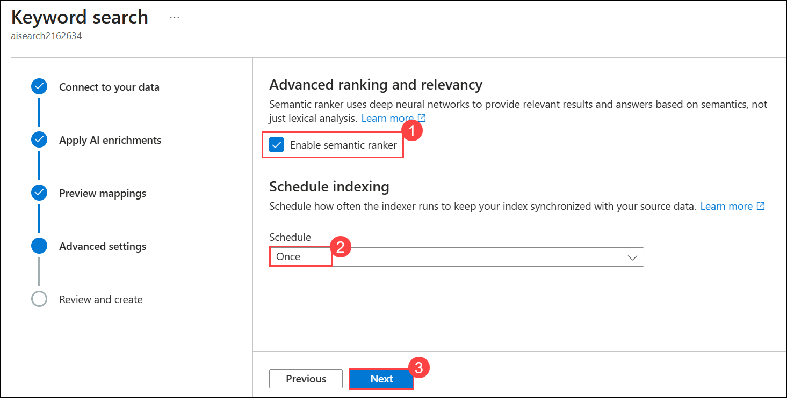 

1. On **Review and create** set **Objects name prefix** to `margies` **(1)** and then select **Create (2)**.

    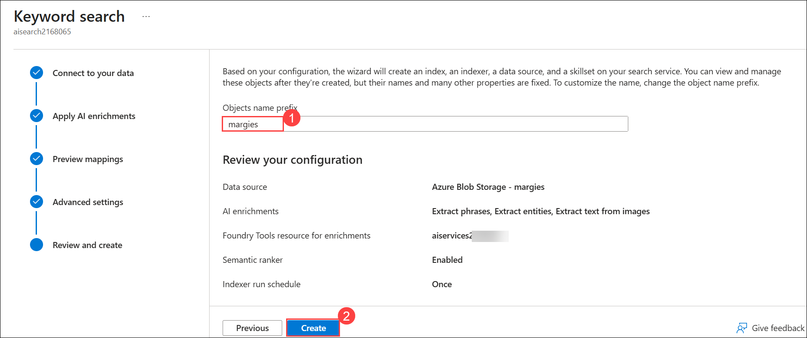

1. You may close the success notification.

> **Congratulations** on completing the task! Now, it's time to validate it. Here are the steps:
>
> - Hit the Validate button for the corresponding task. If you receive a success message, you can proceed to the next task.
> - If not, carefully read the error message and retry the step, following the instructions in the lab guide.
> - If you need any assistance, please contact us at cloudlabs-support@spektrasystems.com. We are available 24/7 to help.

<validation step="9a5c0568-3ad3-4983-9e42-c9baba1ebb22" />

## Task 5: Search the index

In this task, you will learn how to search the indexed documents in Azure AI Search to retrieve relevant results based on queries.

Now that you have an index, you can search it.

1. At the top of the **Overview** page for your Azure AI Search resource, select **Search explorer**.

    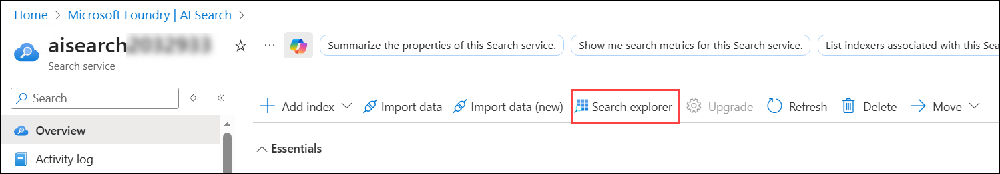 
 
1. In Search explorer, in the **Query string** box, enter `*` (a single asterisk) **(1)**, and then select **Search (2)**.

    .png) 
 
    This query retrieves all documents in the index in JSON format. Examine the results and note the fields for each document, which contain document content, metadata, and enriched data extracted by the cognitive skills you selected.

1. In the **View (1)** drop-down menu, select **JSON view (2)**.

    .png) 
 
1. Note that the JSON request for the search is shown, like this:

    ```json
    {
    "search": "*",
    "count": true,
    "queryType": "semantic",
    "semanticConfiguration": "margies-index-semantic-configuration",
    "captions": "extractive",
    "answers": "extractive|count-3",
    "queryLanguage": "en-us"
    }
    ```

1. Modify the JSON request to include the **count** parameter as shown here:

    ```json
    {
      "search": "*",
      "count": true
    }
    ```

1. Submit the modified search. This time, the results include a **@odata.count** field at the top of the results that indicates the number of documents returned by the search.

    .png)  
 
1. Modify the JSON request to include the **select** parameter as shown here:

    ```json
    {
        "search": "*",
        "count": true,
        "select": "title,locations"
    }
    ```

    

    This time the results include only the file name and any locations mentioned in the document content. The file name is in the **title** field. The **locations** field was generated by an AI skill.
    
1. Now try the following query string:

    ```json
    {
        "search": "New York",
        "count": true,
        "select": "title,keyPhrases"
    }
    ```

    This search finds documents that mention "New York" in any of the searchable fields, and returns the file name and key phrases in the document.
   
1. Let's try one more query:

    ```json
    {
        "search": "New York",
        "count": true,
        "select": "title,keyPhrases",
        "filter": "metadata_storage_size lt 380000"
    }
    ```

    This query returns the filename and key phrases for any documents mentioning "New York" that are smaller than 380,000 bytes in size.

## Task 6: Explore and modify definitions of search components

In this task, you will learn how to explore and modify the definitions of search components, such as indexes, fields, and data sources, in Azure AI Search to customize search functionality.

The components of the search solution are based on JSON definitions, which you can view and edit in the Azure portal.

While you can use the portal to create and modify search solutions, it's often desirable to define the search objects in JSON and use the Azure AI Service REST interface to create and modify them.

### Task 6.1: Get the endpoint and key for your Azure AI Search resource

In this task, you will learn how to get the endpoint and key for your Azure AI Search resource to authenticate and interact with the service.

1. In the Azure portal, return to the **Overview** page for your Azure AI Search resource, and in the top section of the page, find the **Url** for your resource (which looks like **https://resource_name.search.windows.net**) and copy it to the clipboard.

    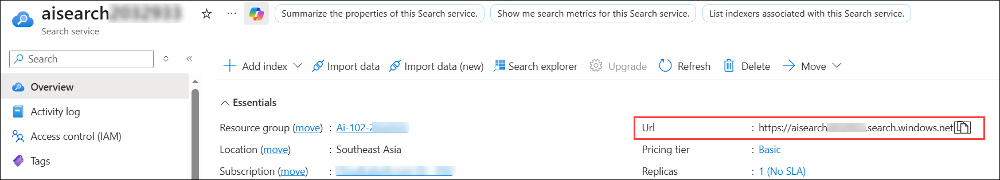 
 
1. In Visual Studio Code, in the Explorer pane, expand the **22-create-a-search-solution** folder and its **modify-search** subfolder, and select **modify-search.cmd** to open it. You will use this script file to run *CURL* commands that submit JSON to the Azure AI Service REST interface.

1. In **modify-search.cmd**, replace the **YOUR_SEARCH_URL** placeholder with the URL you copied to the clipboard. 

1. Navigate to the **Settings (1)** section from the left pane, open the **Keys (2)** page for your Azure AI Search resource, and copy the **Primary admin key (3)** to your clipboard.

    .png)

1. In Visual Studio Code, replace the **YOUR_ADMIN_KEY** placeholder with the key you copied to the clipboard.

    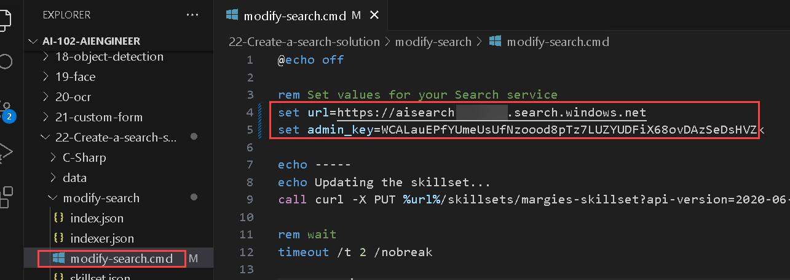 
 
1. Save the changes to **modify-search.cmd** (but don't run it yet!).

### Task 6.2: Review and modify the skillset

In this task, you will learn how to review and modify the skillset in Azure AI Search to enhance the data enrichment process using AI-generated insights.

1. In Visual studio Code, in the **modify-search** folder, open **skillset.json**. This shows a JSON definition for **margies-skillset**.

1. At the top of the skillset definition, note the **Azure AI Services** object, which is used to connect your Azure AI Services resource to the skillset.

1. In the Azure portal, open your Azure AI Services resource (<u>not</u> your Azure AI Search resource!) and from the left navigation pane, select **Resource Management (1)** and click **Keys and Endpoint (2)**. Then copy **Key 1 (3)** to the clipboard.

    .png) 

1. In Visual Studio Code, in **skillset.json**, replace the **YOUR_COGNITIVE_SERVICES_KEY** placeholder with the Azure AI Services key you copied to the clipboard.

    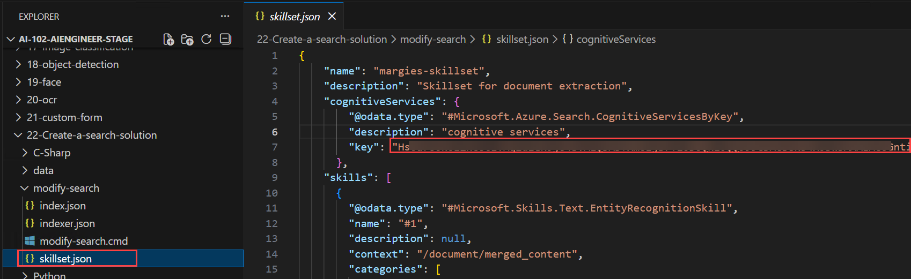 
 
1. Scroll through the JSON file, noting that it includes definitions for the skills you created using the Azure AI Search user interface in the Azure portal. At the bottom of the list of skills, an additional skill has been added with the following definition:

    ```
    {
        "@odata.type": "#Microsoft.Skills.Text.V3.SentimentSkill",
        "defaultLanguageCode": "en",
        "name": "get-sentiment",
        "description": "New skill to evaluate sentiment",
        "context": "/document",
        "inputs": [
            {
                "name": "text",
                "source": "/document/merged_content"
            },
            {
                "name": "languageCode",
                "source": "/document/language"
            }
        ],
        "outputs": [
            {
                "name": "sentiment",
                "targetName": "sentimentLabel"
            }
        ]
    }
    ```

    The new skill is named **get-sentiment**, and for each **document** level in a document, it, will evaluate the text found in the **merged_content** field of the document being indexed (which includes the source content as well as any text extracted from images in the content). It uses the extracted **language** of the document (with a default of English), and evaluates a label for the sentiment of the content. Values for the sentiment label can be "positive", "negative", "neutral", or "mixed". This label is then output as a new field named **sentimentLabel**.

1. Save the changes you've made to **skillset.json**.

### Task 6.3: Review and modify the index

In this task, you will learn how to review and modify the index in Azure AI Search to adjust the structure and fields for improved search performance and accuracy.

1. In Visual studio Code, in the **modify-search** folder, open **index.json**. This shows a JSON definition for **margies-index**.

1. Scroll through the index and view the field definitions. Some fields are based on metadata and content in the source document, and others are the results of skills in the skillset.

1. At the end of the list of fields that you defined in the Azure portal, note that two additional fields have been added:

    ```
    {
        "name": "sentiment",
        "type": "Edm.String",
        "facetable": false,
        "filterable": true,
        "retrievable": true,
        "sortable": true
    },
    {
        "name": "url",
        "type": "Edm.String",
        "facetable": false,
        "filterable": true,
        "retrievable": true,
        "searchable": false,
        "sortable": false
    }
    ```

    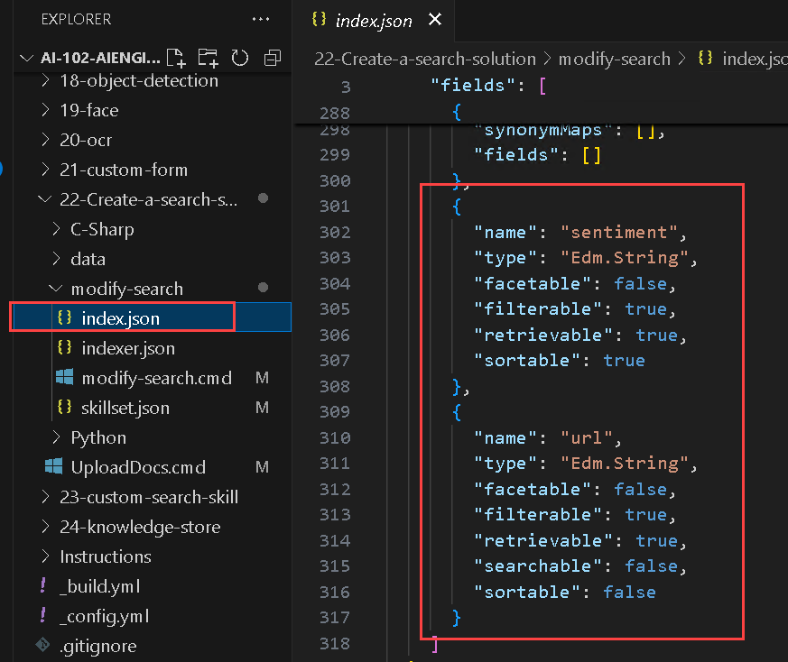 
     
1. The **sentiment** field will be used to add the output from the **get-sentiment** skill that was added to the skillset. The **url** field will be used to add the URL for each indexed document to the index, based on the **metadata_storage_path** value extracted from the data source. Note that the index already includes the **metadata_storage_path** field, but it's used as the index key and Base-64 encoded, making it efficient as a key but requiring client applications to decode it if they want to use the actual URL value as a field. Adding a second field for the unencoded value resolves this problem.

### Task 6.4: Review and modify the indexer

In this task, you will learn how to review and modify the indexer in Azure AI Search to control how data is crawled and indexed from your data source.

1. In Visual studio Code, in the **modify-search** folder, open **indexer.json**. This shows a JSON definition for **margies-indexer**, which maps fields extracted from document content and metadata (in the **fieldMappings** section), and values extracted by skills in the skillset (in the **outputFieldMappings** section), to fields in the index.

1. In the **indexer.json** file, update the **dataSourceName** value to **margies-datasource**.

    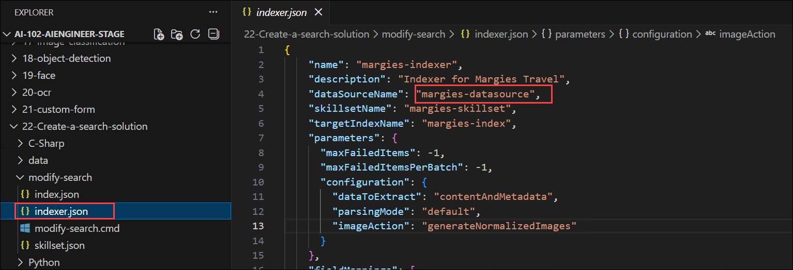 

1. In the **fieldMappings** list, note the mapping for the **metadata_storage_path** value to the base-64 encoded key field. This was created when you assigned the **metadata_storage_path** as the key and selected the option to encode the key in the Azure portal. Additionally, a new mapping explicitly maps the same value to the **url** field, but without the Base-64 encoding:

    ```
    {
        "sourceFieldName" : "metadata_storage_path",
        "targetFieldName": "metadata_storage_path",
        "mappingFunction": {
          "name": "base64Encode"
        }
    }
    
    ```

    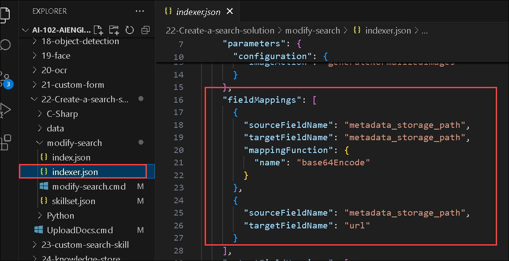 
     
    All of the other metadata and content fields in the source document are implicitly mapped to fields of the same name in the index.

1. Review the **ouputFieldMappings** section, which maps outputs from the skills in the skillset to index fields. Most of these reflect the choices you made in the user interface, but the following mapping has been added to map the **sentimentLabel** value extracted by your sentiment skill to the **sentiment** field you added to the index:

    ```
    {
        "sourceFieldName": "/document/sentimentLabel",
        "targetFieldName": "sentiment"
    }
    ```

### Task 6.5: Use the REST API to update the search solution

In this task, you will learn how to use the REST API to update your Azure AI Search solution, including modifying indexes, skillsets, and other components programmatically.

1. Right-click the **modify-search (1)** folder and select **Open in Integrated Terminal (2)**.

    .png)

1. In the terminal pane for the **modify-search** folder, enter the following command to run the **modify-search.cmd** script, which submits the JSON definitions to the REST interface and initiates the indexing.

    ```
    .\modify-search.cmd
    ```

1. When the script has finished, return to the **Overview** page for your Azure AI Search resource in the Azure portal and view the **Indexers** page. Periodically select **Refresh** to track the progress of the indexing operation. It may take a minute or so to complete.

    .png)

    *There may be some warnings for a few documents that are too large to evaluate sentiment. Often, sentiment analysis is performed at the page or sentence level rather than the full document, but in this case scenario, most of the documents, particularly the hotel reviews, are short enough for useful document-level sentiment scores to be evaluated.*

### Task 6.6: Query the modified index

In this task, you will learn how to query the modified index in Azure AI Search to retrieve updated results based on your changes to the index structure.

1. In the **Overview** tab of your Azure AI Search resource, click **Search explorer**.

    

1. In Search Explorer, in the **Query string** box, submit the following JSON query:

    ```json
    {
      "search": "London",
      "select": "url,sentiment,keyphrases",
      "filter": "metadata_author eq 'Reviewer' and sentiment eq 'positive'"
    }
    ```

    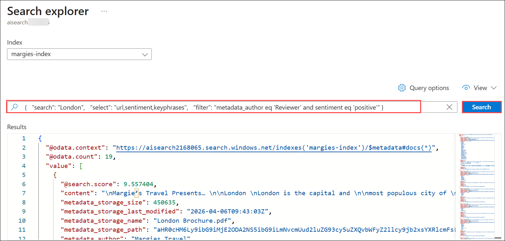 

    This query retrieves the **url**, **sentiment**, and **keyphrases** for all documents that mention *London* authored by *Reviewer* that have a positive **sentiment** label (in other words, positive reviews that mention London)

1. Close the **Search explorer** page to return to the **Overview** page.

## Task 7: Create a search client application

In this task, you will learn how to create a search client application that interacts with your Azure AI Search service to send queries and display results.

Now that you have a useful index, you can use it from a client application. You can do this by consuming the REST interface, submitting requests and receiving responses in JSON format over HTTP, or you can use the software development kit (SDK) for your preferred programming language. In this exercise, we'll use the SDK.

### Task 7.1: Get the endpoint and keys for your search resource

In this task, you will learn how to get the endpoint and keys for your Azure AI Search resource to authenticate and connect your application to the search service.

1. In the Azure portal, on the **Overview** page for your Azure AI Search resource, note the **Url** value, which should be similar to **https://*your_resource_name*.search.windows.net**. This is the endpoint for your search resource.

    

1. On the **Keys (1)** page under the Settings dropdown, you’ll see two admin keys and one **query (2)** key. Admin keys are used to create and manage search resources, while the query key is for client applications that only need to perform search queries.

    .png) 
 
    >**Note:** You will need the **endpoint and query key** for your client application.

### Task 7.2: Prepare to use the Azure AI Search SDK

1. In Visual Studio Code, in the **Explorer** pane, browse to the **22-create-a-search-solution (1)** folder and expand the **C-Sharp (2)** folder. Right-click the **margies-travel (3)** folder and select **Open in Integrated Terminal (4)**. 

    .png)

1. Then install the Azure AI Search SDK package by running the appropriate command for your language preference:

    **C#**
    
    ```
    dotnet add package Azure.Search.Documents --version 11.1.1
    ```
    
1. View the contents of the **margies-travel** folder, and note that it contains a file for configuration settings:

    - **C#**: appsettings.json

    Open the configuration file and update the configuration values it contains to reflect the **endpoint** and **query key** for your Azure AI Search resource. Save your changes.

    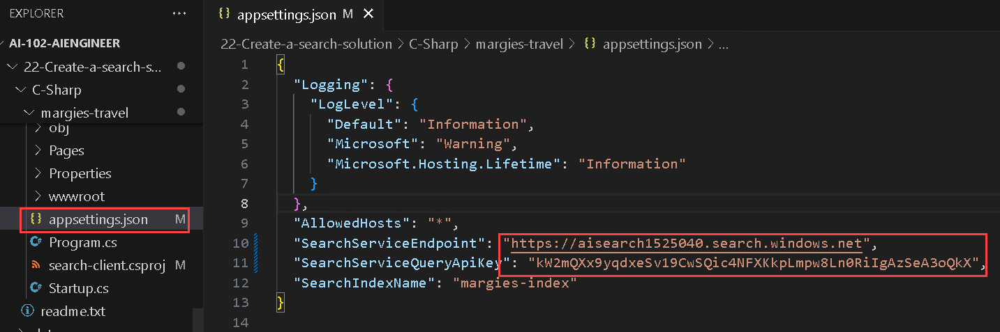 
     

### Task 7.3: Explore code to search an index

In this task, you will learn how to explore the code needed to search an index using the Azure AI Search SDK, including how to send queries and retrieve search results programmatically.

The **margies-travel** folder contains code files for a web application, a Microsoft C# *ASP.NET Razor* web application, which includes search functionality.

1. Open the following code file in the web application, depending on your choice of programming language:

    - **C#**: Pages/Index.cshtml.cs

1. Near the top of the code file, find the comment **Import search namespaces**, and note the namespaces that have been imported to work with the Azure AI Search SDK:

1. In the **search_query** function, find the comment **Create a search client**, and note that the code creates a **SearchClient** object using the endpoint and query key for your Azure AI Search resource:

1. In the **search_query** function, find the comment **Submit search query**, and review the code to submit a search for the specified text with the following options:

    - A *search mode* that requires **all** of the individual words in the search text to be found.
    - The total number of documents found by the search is included in the results.
    - The results are filtered to include only documents that match the provided filter expression.
    - The results are sorted into the specified sort order.
    - Each discrete value of the **metadata_author** field is returned as a *facet* that can be used to display pre-defined values for filtering.
    - Up to three extracts of the **merged_content** and **imageCaption** fields with the search terms highlighted are included in the results.
    - The results include only the fields specified.

### Task 7.4: Explore code to render search results

In this task, you will learn how to explore the code to render search results from Azure AI Search, including formatting and displaying the retrieved data in a user-friendly interface.

The web app already includes code to process and render the search results.

1. Open the following code file in the web application, depending on your choice of programming language:

    - **C#**:Pages/Index.cshtml

1. Examine the code, which renders the page on which the search results are displayed. Observe that:

    - The page begins with a search form that the user can use to submit a new search, which is referenced at the beginning of the page.
    - A second form is then rendered, enabling the user to refine the search results. The code for this form:
        - Retrieves and displays the count of documents from the search results.
        - Retrieves the facet values for the **metadata_author** field and displays them as an option list for filtering.
        - Creates a drop-down list of sort options for the results.
    - The code then iterates through the search results, rendering each result as follows:
        - Display the **metadata_storage_name** (file name) field as a link to the address in the **url** field.
        - Displaying *highlights* for search terms found in the **merged_content** and **imageCaption** fields to help show the search terms in context.
        - Display the **metadata_author**, **metadata_storage_size**, **metadata_storage_last_modified**, and **language** fields.
        - Display the **sentiment** label for the document. Can be positive, negative, neutral, or mixed.
        - Display the first five **keyphrases** (if any).
        - Display the first five **locations** (if any).
        - Display the first five **imageTags** (if any).

### Task 7.5: Run the web app

In this task, you will learn how to run the web app that interacts with your Azure AI Search service, allowing users to perform searches and view results in a web-based interface.

 1. Return to the integrated terminal for the **margies-travel** folder, and enter the following command to run the program:

    **C#**
    
    ```
    dotnet run
    ```

1. In the message that is displayed when the app starts successfully, follow the link to the running web application (*http://localhost:5000/* or *http://127.0.0.1:5000/*) to open the Margies Travel site in a web browser.

    .png)

1. In the Margie's Travel website, enter **London hotel (1)** into the search box and click **Search (2)**.

    .png)
 
1. Review the search results. They include the file name (with a hyperlink to the file URL), an extract of the file content with the search terms (*London* and *hotel*) emphasized, and other attributes of the file from the index fields.

1. Observe that the results page includes some user interface elements that enable you to refine the results. These include:

    - A *filter* based on a facet value for the **metadata_author** field. This demonstrates how you can use *facetable* fields to return a list of *facets* - fields with a small set of discrete values that can be displayed as potential filter values in the user interface.
    - The ability to *order* the results based on a specified field and sort direction (ascending or descending). The default order is based on *relevancy*, which is calculated as a **search.score()** value based on a *scoring profile* that evaluates the frequency and importance of search terms in the index fields.

1. Select the **Reviewer (1)** filter and the **Positive to negative (2)** sort option, and then select **Refine Results (3)**.

    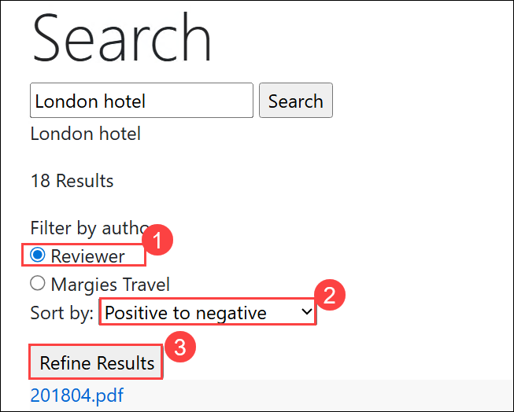 
 
1. Observe that the results are filtered to include only reviews and sorted based on the sentiment label.

1. In the **Search** box, enter a new search for **quiet hotel in New York** and review the results.

1. Try the following search terms:
    - **Tower of London** (observe that this term is identified as a *key phrase* in some documents).
    - **skyscraper** (observe that this word doesn't appear in the actual content of any documents, but is found in the *image captions* and *image tags* that were generated for images in some documents).
    - **Mojave desert** (observe that this term is identified as a *location* in some documents).

1. Close the browser tab containing the Margie's Travel website and return to Visual Studio Code. Then, in the terminal for the **margies-travel** folder where the dotnet  application is running, enter **Ctrl+C** to stop the app.

## Summary
In this lab, you have completed:

+ Opened the folder in Visual Studio Code.
+ Created Azure resources
+ Uploaded Documents to Azure Storage
+ Indexed the documents
+ Searched the index
+ Explored and modified definitions of search components
+ Created a search client application

### You have successfully completed the lab, click on Next >>.


