# Exercise 01: Create an Azure AI Search solution

## Lab scenario
All organizations rely on information to make decisions, answer questions, and function efficiently. The problem for most organizations is not a lack of information, but the challenge of finding and  extracting the information from the massive set of documents, databases, and other sources in which the information is stored.

For example, suppose *Margie's Travel* is a travel agency that specializes in organizing trips to cities around the world. Over time, the company has amassed a huge amount of information in documents such as brochures, as well as reviews of hotels submitted by customers. This data is a valuable source of insights for travel agents and customers as they plan trips, but the sheer volume of data can make it difficult to find relevant information to answer a specific customer question.

To address this challenge, Margie's Travel can use Azure AI Search to implement a solution in which the documents are indexed and enriched by using AI skills to make them easier to search.

## Objectives

In this lab, you will complete the following tasks:

+ Task 1: Clone the repository for this course
+ Task 2: Create Azure resources
+ Task 3: Upload Documents to Azure Storage
+ Task 4: Index the documents
+ Task 5: Search the index
+ Task 6: Explore and modify definitions of search components
+ Task 7: Create a search client application


## Estimated timing: 120 minutes

## Architecture diagram

   

## Task 1: Clone the repository for this course

If you have not already cloned **AI-102-AIEngineer** code repository to the environment where you're working on this lab, follow these steps to do so. Otherwise, open the cloned folder in Visual Studio Code.

1. Start Visual Studio Code.

    

1. Click on the elipses **(...) (1)**, select **Terminal (2)** and then **New Terminal (2)**.

    

1. Run the following command to clone the repository to a local folder.
   
    ```
    git clone https://github.com/CloudLabs-MOC/AI-102-AIEngineer
    ```

    

1. When the repository has been cloned, open the folder in Visual Studio Code. Wait while additional files are installed to support the C# code projects in the repo.

    > **Note**: If you are prompted to add required assets to build and debug, select **Not Now**.

1. Select **File (1)**, select **Open Folder (2)**.

    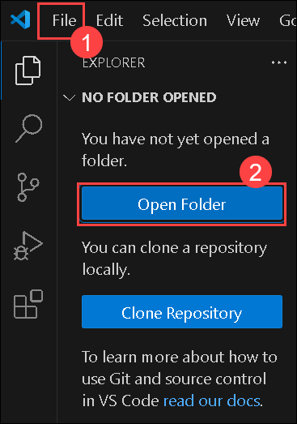

1. Open **C:\Users\azureuser\AI-102-AIEngineer (1)**, press enter and then click on **Select folder (2)**.

    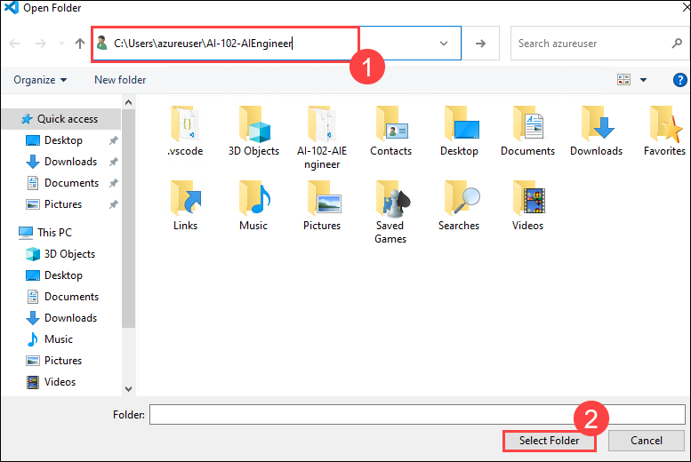

    >**Note:** On the **Do you trust the authors of the files in this folder?** pop-up, select **Yes, I trust the authors**.

    >**Note:** You may be prompted to complete a 2-minute survey. Go ahead and select **No, thanks**. You may need to do this more than once.

## Task 2: Create Azure resources

The solution you will create for Margie's Travel requires the following resources in your Azure subscription:

- An **Azure AI Search** resource, which will manage indexing and querying.
- An **Azure AI Services** resource, which provides AI services for skills that your search solution can use to enrich the data in the data source with AI-generated insights.
- A **Storage account** with a blob container in which the documents to be searched are stored.

    > **Important**: Your Azure AI Search and Azure AI Services resources must be in the same location!

### Task 2.1: Create an Azure AI Search resource

1. In the azure portal, select the **&#65291;Create a resource** button.

    

1. Search for **Azure AI Search (1)**, press enter and then select from the results **(2)**. 

    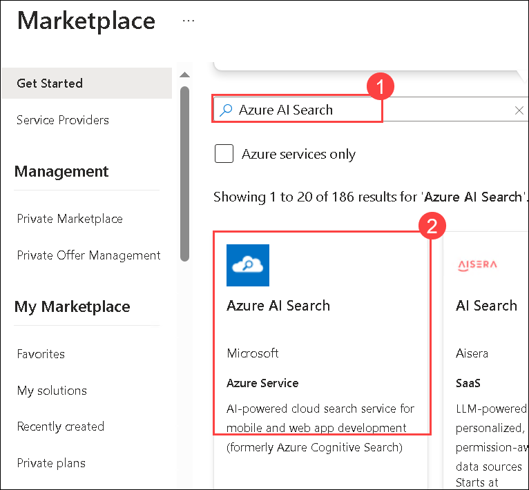

1. Create an **Azure AI Search** resource with the following settings and then click on **Review+Create (6)**.
    
    - **Subscription**: **Leave default subscription (1)**
    
    - **Resource group**: **Ai-102-<inject key="DeploymentID" enableCopy="false"/> (2)**
    
    - **Service name**: **aisearch<inject key="DeploymentID" enableCopy="false"/> (3)**
    
    - **Location**: **<inject key="Region" enableCopy="false" /></inject> (4)** - *note that your Azure AI Search and Azure AI Services resources must be in the same location*.
    
    - **Pricing tier**: **Basic (5)**

          

1. Click on **Create**.

1. Wait for deployment to complete, and click on **Go to resources**.

1. Review the **Overview** page on the blade for your Azure AI Search resource in the Azure portal. Here, you can use a visual interface to create, test, manage, and monitor the various components of a search solution; including data sources, indexes, indexers, and skillsets.

>**Important**: Perform the Validation after completing, **Task 4**. Otherwise you may get validation as failed.

### Task 2.2: Create an Azure AI Services resource

If you don't already have one in your subscription, you'll need to provision an **Azure AI Services** resource. Your search solution will use this to enrich the data in the datastore with AI-generated insights.

1.  Return to home page and select the **&#65291;Create a resource** button.

    

 1. Search for *Azure AI Services (1)* and then select **Azure AI Services (2)** from the services.
 
     
 
1. Create an **Azure AI Services** resource with the following settings and then click on **Review+Create (7)**.

    - **Subscription**: **Leave default Azure subscription (1)**

    - **Resource group**: **ai-102-<inject key="DeploymentID" enableCopy="false"/> (2)**

    - **Region**: **<inject key="Region" enableCopy="false" /></inject> (3)** - **The same location as your Azure AI Search resource**

    - **Name**: **aiservices<inject key="DeploymentID" enableCopy="false"/> (4)**

    - **Pricing tier**: **Standard S0 (5)**

    - **Select the required checkboxes (6)**.

      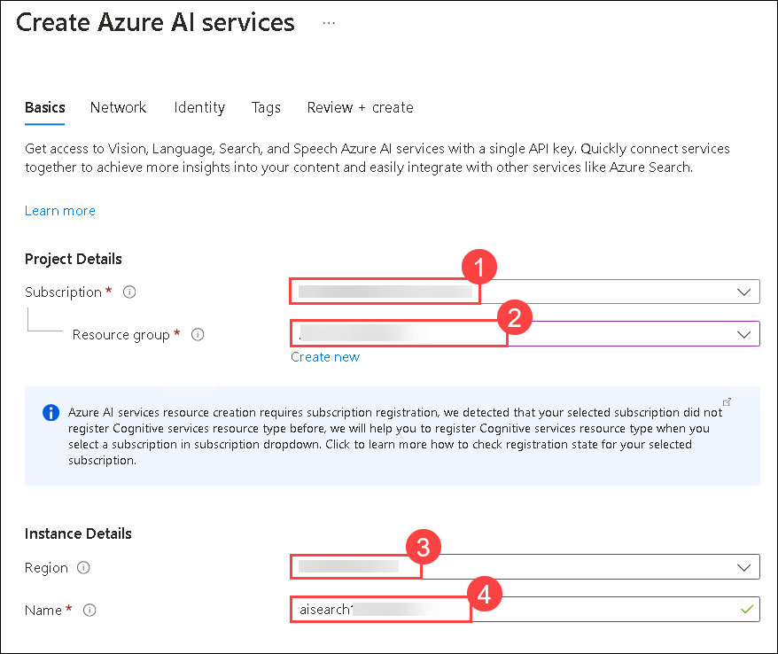    

      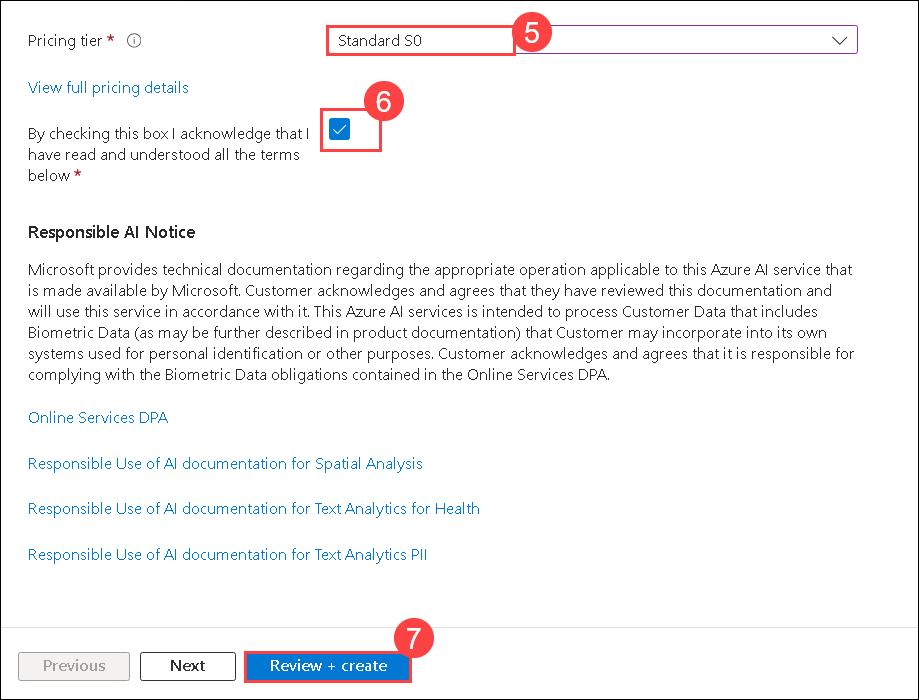    

1. Click on **Create**.

1. Wait for deployment to complete, and click on **Go to resources** then view the deployment details.

>**Important**: Perform the Validation after completing, **Task 4**. Otherwise you may get validation as failed.

### Task 2.3: Create a storage account

1. Return to the home page of the Azure portal, and then select the **&#65291;Create a resource** button.

1. Search for *storage account (1)* and then select **Storage account (2)** from the services.

     

1. Click on **+Create**.

    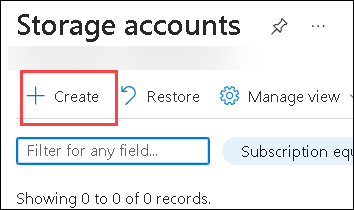 
 
 1. Create a **Storage account** resource with the following settings and then click on **Advanced** tab from the top.

    - **Subscription**: **Leave default Azure subscription (1)**

    - **Resource group**: **ai-102-<inject key="DeploymentID" enableCopy="false"/> (2)**

    - **Storage account name**: **blob<inject key="DeploymentID" enableCopy="false"/> (3)**

    - **Region**: **<inject key="Region" enableCopy="false" /></inject> (4)**

    - **Performance**: **Standard (5)**

    - **Replication**: **Locally-redundant storage (LRS) (6)**

       
     
    - On the **Advanced** tab, check the box next to **Allow enabling anonymous access on individual containers** then select **Review+create (2)**.

       
     
1. Click on **Create**

1. Wait for deployment to complete, and click on **Go yo resources** then go to the deployed resource.

1. On the **Overview (1)** page, note the **Subscription ID (2)** -this identifies the subscription in which the storage account is provisioned.

    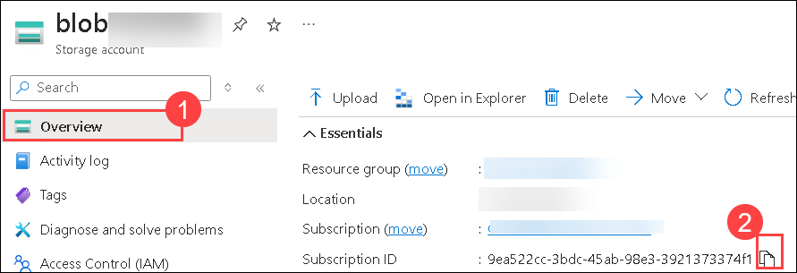 
 
1. On the **Access keys (1)** page, copy that **two keys (2) (3)** have been generated for your storage account in your notepad. Then select **Show keys** to view the keys.

     
 
    > **Tip**: Keep the **Storage Account** blade open - you will need the subscription ID and one of the keys in the next procedure.

## Task 3: Upload Documents to Azure Storage

Now that you have the required resources, you can upload some documents to your Azure Storage account.

1. In Visual Studio Code, in the **Explorer** pane, expand the **22-create-a-search-solution** folder and select **UploadDocs.cmd**.

1. Edit the batch file to replace the **YOUR_SUBSCRIPTION_ID**, **YOUR_AZURE_STORAGE_ACCOUNT_NAME**, and **YOUR_AZURE_STORAGE_KEY** placeholders with the appropriate subscription ID, Azure storage account name, and Azure storage account key values for the storage account you created previously.

     
 
1. Save your changes, and then right-click the **22-create-a-search-solution** folder and open an integrated terminal.
1. Enter the following command to sign into your Azure subscription by using the Azure CLI.

    ```
    az login
    ```

    A web browser tab will open and prompt you to sign into Azure. Do so, and then close the browser tab and return to Visual Studio Code.

    - If prompted select **Work or school account** then click on **Continue**.

      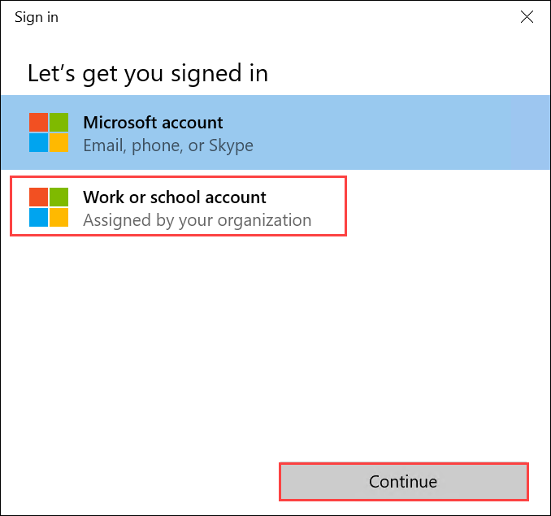  

    - Enter the Email address and Password provided in the **Environment** tab.

    - Click on **No, sign in to this app only** to **Stay signed in ti all your apps**.

1. Navigate back to the VS code, If prompted **Select a subscription and tenant (Type a number or Enter for no changes):** press **Enter**.     

1. Enter the following command to run the batch file. This will create a blob container in your storage account and upload the documents in the **data** folder to it.

    ```
    .\UploadDocs.cmd
    ```

    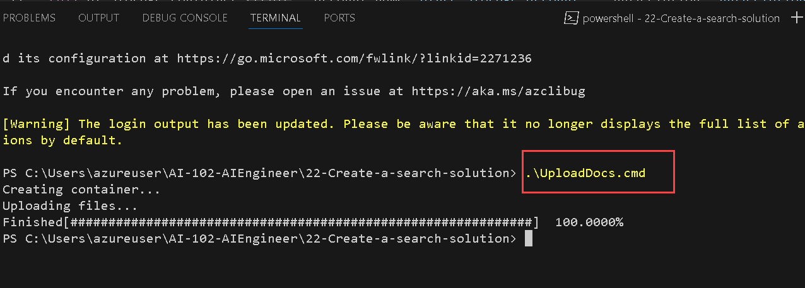 
     
> **Congratulations** on completing the task! Now, it's time to validate it. Here are the steps:
> - Hit the Validate button for the corresponding task. If you receive a success message, you can proceed to the next task. 
> - If not, carefully read the error message and retry the step, following the instructions in the lab guide.
> - If you need any assistance, please contact us at labs-support@spektrasystems.com. We are available 24/7 to help

<validation step="6cbaad12-ad3b-48d8-9a96-088e83af5b84" />

## Task 4: Index the documents

Now that you have the documents in place, you can create a search solution by indexing them.

1. In the Azure portal, browse to your Azure AI Search resource. 

    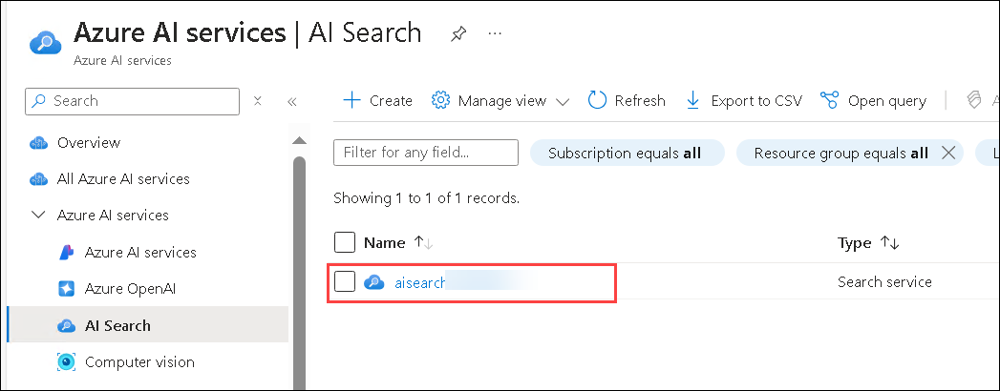 
 
1. Then, on its **Overview** page, select **Import data**.

     
 
1. On the **Connect to your data** page, in the **Data Source** list, select **Azure Blob Storage**. Then complete the data store details with the following values:

    - **Data Source**: **Azure Blob Storage (1)**

    - **Data source name**: **margies-data (2)**

    - **Data to extract**: **Content and metadata (3)**

    - **Parsing mode**: **Default (4)**

    - **Subscription:** **Leave default subscrption (5)**

    - **Connection string**: Select **Choose an existing connection (6)**. 

      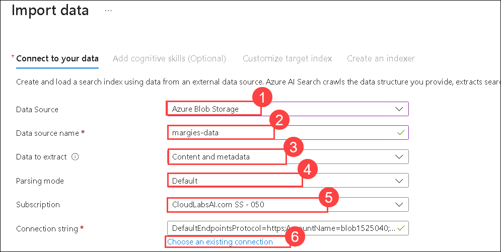 
         
    - Then select your storage account **(1)**, and finally select the **margies (2)** container that was created by the UploadDocs.cmd script and the click on **Select (3)**.

       
     
    - **Managed identity authentication**: **None (7)**

    - **Container name**: **margies (8)**

    - **Blob folder**: **Leave this blank (9)**

    - **Description**: **Brochures and reviews in Margie's Travel web site (10)**

    - Proceed to the next step **Add cognitive skills (11)**

      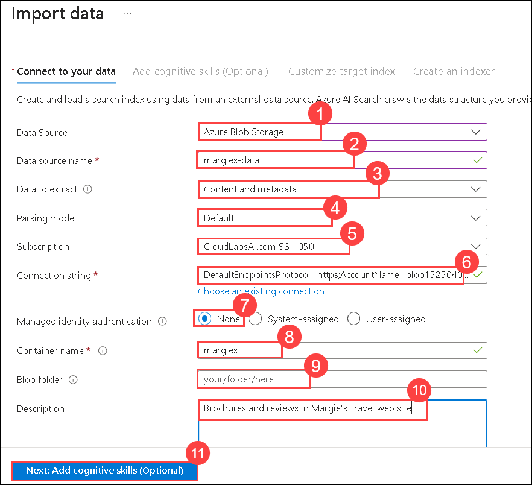 
     
1. In the **Attach Azure AI Services** section, select your Azure AI Services resource.

     
 

1. In the **Add enrichments** section:

    - Change the **Skillset name** to **margies-skillset (1)**.

    - Select the option **Enable OCR and merge all text into merged_content field (2)**.

    - Ensure that the **Source data field** is set to **merged_content**.

    - Leave the **Enrichment granularity level** as **Source field**, which is set the entire contents of the document being indexed; but note that you can change this to extract information at more granular levels, like pages or sentences.

    - Select the following enriched fields: **(3)**

        | Cognitive Skill | Parameter | Field name |
        | --------------- | ---------- | ---------- |
        | Extract location names | | locations |
        | Extract key phrases | | keyphrases |
        | Detect language | | language |
        | Generate tags from images | | imageTags |
        | Generate captions from images | | imageCaption |

    - Double-check your selections (it can be difficult to change them later). Then proceed to the next step **Customize target index (4)**.

      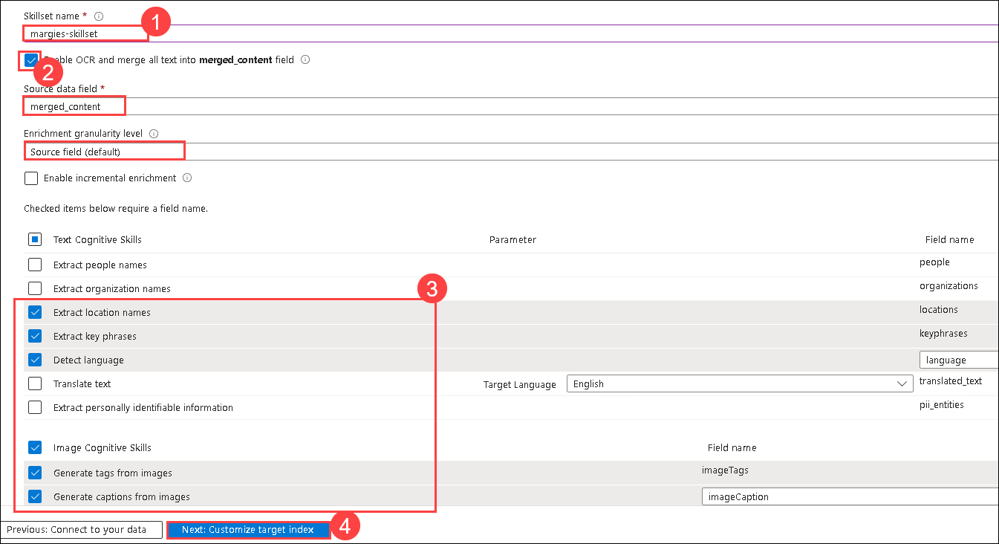 
     
1. On the **Customize target index** tab.

    - Change the **Index name** to **margies-index (1)**.

    - Ensure that the **Key** is set to **metadata_storage_path (2)** and leave the **Suggester name** blank and **Search mode** at its default.

    - Make the following changes to the index fields, leaving all other fields with their default settings. **(3)**

       
   
    - Double-check your selections, paying particular attention to ensure that the correct **Retrievable**, **Filterable**, **Sortable**, **Facetable**, and **Searchable** options are selected for each field  (it can be difficult to change them later). Then proceed to the next step **Create an indexer (4)**.

       
     
1. On the **Create an indexer** tab,

    - Change the **Indexer name** to **margies-indexer (1)**.

    - Leave the **Schedule** set to **Once (2)**.

    - Expand the **Advanced** options, and ensure that the **Base-64 encode keys (3)** option is selected (generally encoding keys make the index more efficient).

    - Select **Submit (4)** to create the data source, skillset, index, and indexer. 
    
      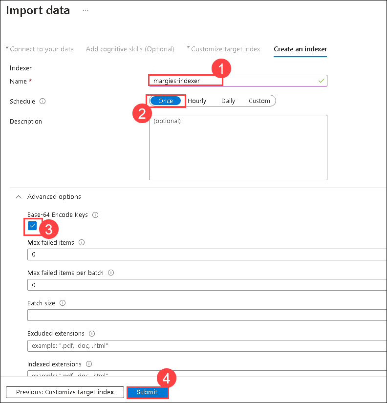 
     
    The indexer is run automatically and runs the indexing pipeline, which:
  
    - Extracts the document metadata fields and content from the data source
    - Runs the skillset of cognitive skills to generate additional enriched fields
    - Maps the extracted fields to the index.

1. In the bottom half of the **Overview** page for your Azure AI Search resource, view the **Indexers** tab, which should show the newly created **margies-indexer**. Wait a few minutes, and click **&orarr; Refresh** until the **Status** indicates success.

    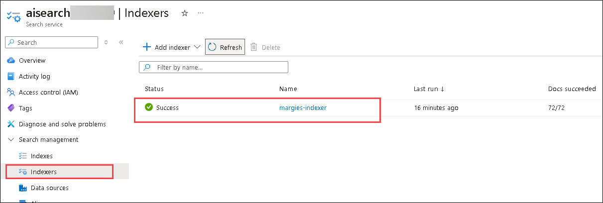 
 
> **Congratulations** on completing the task! Now, it's time to validate it. Here are the steps:
> - Hit the Validate button for the corresponding task. If you receive a success message, you can proceed to the next task. 
> - If not, carefully read the error message and retry the step, following the instructions in the lab guide.
> - If you need any assistance, please contact us at labs-support@spektrasystems.com. We are available 24/7 to help

<validation step="9a5c0568-3ad3-4983-9e42-c9baba1ebb22" />

## Task 5: Search the index

Now that you have an index, you can search it.

1. At the top of the **Overview** page for your Azure AI Search resource, select **Search explorer**.

     
 
1. In Search explorer, in the **Query string** box, enter `*` (a single asterisk) **(1)**, and then select **Search (2)**.

    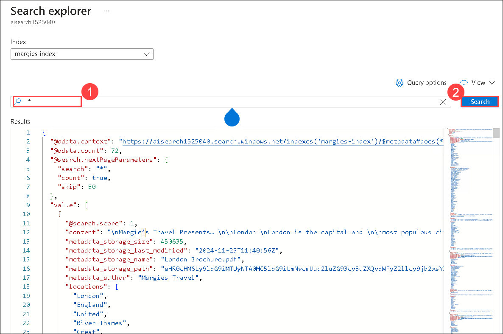 
 
    This query retrieves all documents in the index in JSON format. Examine the results and note the fields for each document, which contain document content, metadata, and enriched data extracted by the cognitive skills you selected.

1. In the **View** menu, select **JSON view**.

     
 
1. Note that the JSON request for the search is shown, like this:

    ```json
    {
      "search": "*"
    }
    ```

1. Modify the JSON request to include the **count** parameter as shown here:

    ```json
    {
      "search": "*",
      "count": true
    }
    ```

1. Submit the modified search. This time, the results include a **@odata.count** field at the top of the results that indicates the number of documents returned by the search.

    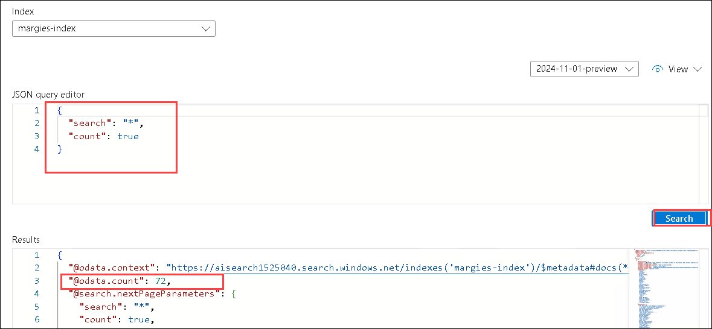 
 
1. Try the following query:

    ```json
    {
      "search": "*",
      "count": true,
      "select": "metadata_storage_name,metadata_author,locations"
    }
    ```

    This time the results include only the file name, author, and any locations mentioned in the document content. The file name and author are in the **metadata_storage_name** and **metadata_author** fields, which were extracted from the source document. The **locations** field was generated by a cognitive skill.

1. Now try the following query string:

    ```json
    {
      "search": "New York",
      "count": true,
      "select": "metadata_storage_name,keyphrases"
    }
    ```

    This search finds documents that mention "New York" in any of the searchable fields, and returns the file name and key phrases in the document.

1. Let's try one more query:

    ```json
    {
      "search": "New York",
      "count": true,
      "select": "metadata_storage_name",
      "filter": "metadata_author eq 'Reviewer'"
    }
    ```

    This query returns the filename of any documents authored by *Reviewer* that mention "New York".

## Task 6: Explore and modify definitions of search components

The components of the search solution are based on JSON definitions, which you can view and edit in the Azure portal.

While you can use the portal to create and modify search solutions, it's often desirable to define the search objects in JSON and use the Azure AI Service REST interface to create and modify them.

### Task 6.1: Get the endpoint and key for your Azure AI Search resource

1. In the Azure portal, return to the **Overview** page for your Azure AI Search resource; and in the top section of the page, find the **Url** for your resource (which looks like **https://resource_name.search.windows.net**) and copy it to the clipboard.

     
 

1. In Visual Studio Code, in the Explorer pane, expand the **22-create-a-search-solution** folder and its **modify-search** subfolder, and select **modify-search.cmd** to open it. You will use this script file to run *cURL* commands that submit JSON to the Azure AI Service REST interface.

1. In **modify-search.cmd**, replace the **YOUR_SEARCH_URL** placeholder with the URL you copied to the clipboard.

1. In the Azure portal, view the **Keys (1)** page for your Azure AI Search resource, and copy the **Primary admin key (2)** to the clipboard.

    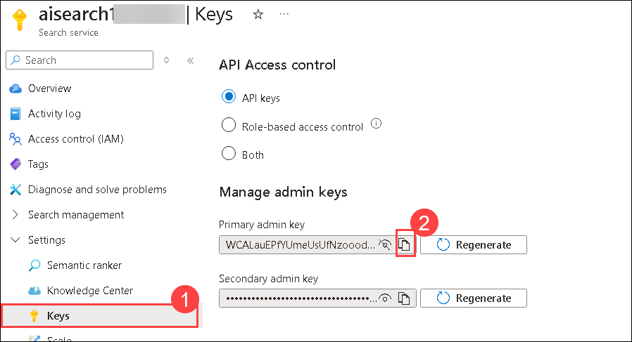 
 

1. In Visual Studio Code, replace the **YOUR_ADMIN_KEY** placeholder with the key you copied to the clipboard.

     
 
1. Save the changes to **modify-search.cmd** (but don't run it yet!)

### Task 6.2: Review and modify the skillset

1. In Visual studio Code, in the **modify-search** folder, open **skillset.json**. This shows a JSON definition for **margies-skillset**.

1. At the top of the skillset definition, note the **Azure AI Services** object, which is used to connect your Azure AI Services resource to the skillset.

1. In the Azure portal, open your Azure AI Services resource (<u>not</u> your Azure AI Search resource!) and view its **Keys** page. Then copy **Key 1** to the clipboard.

1. In Visual Studio Code, in **skillset.json**, replace the **YOUR_AZURE_AI_SERVICES_KEY** placeholder with the Azure AI Services key you copied to the clipboard.

     
 
1. Scroll through the JSON file, noting that it includes definitions for the skills you created using the Azure AI Search user interface in the Azure portal. At the bottom of the list of skills, an additional skill has been added with the following definition:

    ```
    {
        "@odata.type": "#Microsoft.Skills.Text.V3.SentimentSkill",
        "defaultLanguageCode": "en",
        "name": "get-sentiment",
        "description": "New skill to evaluate sentiment",
        "context": "/document",
        "inputs": [
            {
                "name": "text",
                "source": "/document/merged_content"
            },
            {
                "name": "languageCode",
                "source": "/document/language"
            }
        ],
        "outputs": [
            {
                "name": "sentiment",
                "targetName": "sentimentLabel"
            }
        ]
    }
    ```

    The new skill is named **get-sentiment**, and for each **document** level in a document, it, will evaluate the text found in the **merged_content** field of the document being indexed (which includes the source content as well as any text extracted from images in the content). It uses the extracted **language** of the document (with a default of English), and evaluates a label for the sentiment of the content. Values for the sentiment label can be "positive", "negative", "neutral", or "mixed". This label is then output as a new field named **sentimentLabel**.

1. Save the changes you've made to **skillset.json**.

### Task 6.3: Review and modify the index

1. In Visual studio Code, in the **modify-search** folder, open **index.json**. This shows a JSON definition for **margies-index**.

1. Scroll through the index and view the field definitions. Some fields are based on metadata and content in the source document, and others are the results of skills in the skillset.

1. At the end of the list of fields that you defined in the Azure portal, note that two additional fields have been added:

    ```
    {
        "name": "sentiment",
        "type": "Edm.String",
        "facetable": false,
        "filterable": true,
        "retrievable": true,
        "sortable": true
    },
    {
        "name": "url",
        "type": "Edm.String",
        "facetable": false,
        "filterable": true,
        "retrievable": true,
        "searchable": false,
        "sortable": false
    }
    ```

    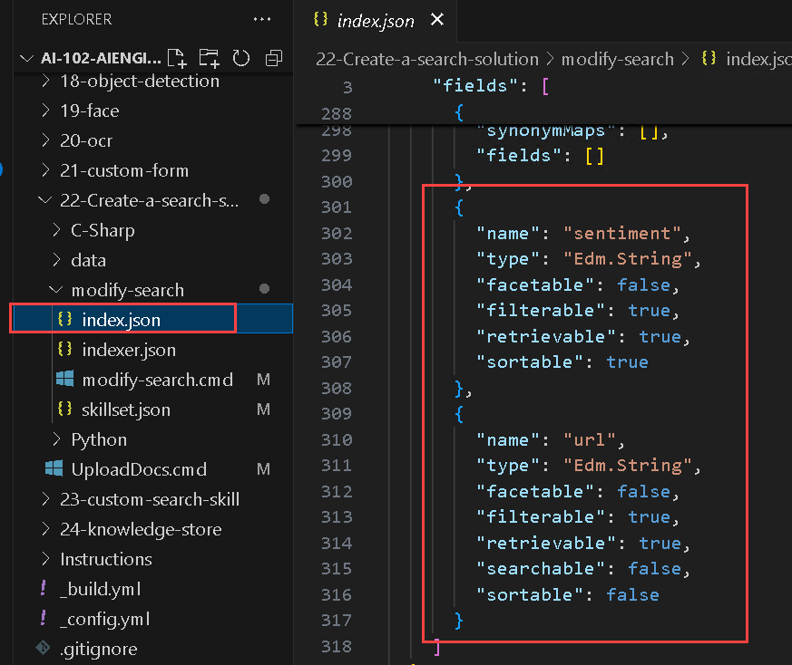 
     
1. The **sentiment** field will be used to add the output from the **get-sentiment** skill that was added the skillset. The **url** field will be used to add the URL for each indexed document to the index, based on the **metadata_storage_path** value extracted from the data source. Note that index already includes the **metadata_storage_path** field, but it's used as the index key and Base-64 encoded, making it efficient as a key but requiring client applications to decode it if they want to use the actual URL value as a field. Adding a second field for the unencoded value resolves this problem.

### Task 6.4: Review and modify the indexer

1. In Visual studio Code, in the **modify-search** folder, open **indexer.json**. This shows a JSON definition for **margies-indexer**, which maps fields extracted from document content and metadata (in the **fieldMappings** section), and values extracted by skills in the skillset (in the **outputFieldMappings** section), to fields in the index.

1. In the **fieldMappings** list, note the mapping for the **metadata_storage_path** value to the base-64 encoded key field. This was created when you assigned the **metadata_storage_path** as the key and selected the option to encode the key in the Azure portal. Additionally, a new mapping explicitly maps the same value to the **url** field, but without the Base-64 encoding:

    ```
    {
        "sourceFieldName" : "metadata_storage_path",
        "targetFieldName": "metadata_storage_path",
        "mappingFunction": {
          "name": "base64Encode"
        }
    }
    
    ```

    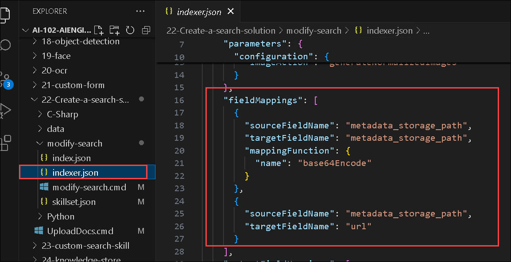 
     
    All of the other metadata and content fields in the source document are implicitly mapped to fields of the same name in the index.

1. Review the **ouputFieldMappings** section, which maps outputs from the skills in the skillset to index fields. Most of these reflect the choices you made in the user interface, but the following mapping has been added to map the **sentimentLabel** value extracted by your sentiment skill to the **sentiment** field you added to the index:

    ```
    {
        "sourceFieldName": "/document/sentimentLabel",
        "targetFieldName": "sentiment"
    }
    ```

### Task 6.5: Use the REST API to update the search solution

1. Right-click the **modify-search** folder and open an integrated terminal.

1. In the terminal pane for the **modify-search** folder, enter the following command to run the **modify-search.cmd** script, which submits the JSON definitions to the REST interface and initiates the indexing.

    ```
    .\modify-search.cmd
    ```

1. When the script has finished, return to the **Overview** page for your Azure AI Search resource in the Azure portal and view the **Indexers** page. The periodically select **Refresh** to track the progress of the indexing operation. It may take a minute or so to complete.

    *There may be some warnings for a few documents that are too large to evaluate sentiment. Often sentiment analysis is performed at the page or sentence level rather than the full document; but in this case scenario, most of the documents - particularly the hotel reviews, are short enough for useful document-level sentiment scores to be evaluated.*

### Task 6.6: Query the modified index

1. At the top of the blade for your Azure AI Search resource, select **Search explorer**.

1. In Search explorer, in the **Query string** box, submit the following JSON query:

    ```json
    {
      "search": "London",
      "select": "url,sentiment,keyphrases",
      "filter": "metadata_author eq 'Reviewer' and sentiment eq 'positive'"
    }
    ```

    This query retrieves the **url**, **sentiment**, and **keyphrases** for all documents that mention *London* authored by *Reviewer* that have a positive **sentiment** label (in other words, positive reviews that mention London)

1. Close the **Search explorer** page to return to the **Overview** page.

## Task 7: Create a search client application

Now that you have a useful index, you can use it from a client application. You can do this by consuming the REST interface, submitting requests and receiving responses in JSON format over HTTP; or you can use the software development kit (SDK) for your preferred programming language. In this exercise, we'll use the SDK.


### Task 7.1: Get the endpoint and keys for your search resource

1. In the Azure portal, on the **Overview** page for your Azure AI Search resource, note the **Url** value, which should be similar to **https://*your_resource_name*.search.windows.net**. This is the endpoint for your search resource.

1. On the **Keys (1)** page, note that there are two admin keys, and a single **query (2)** key. An *admin* key is used to create and manage search resources; a *query* key is used by client applications that only need to perform search queries.

    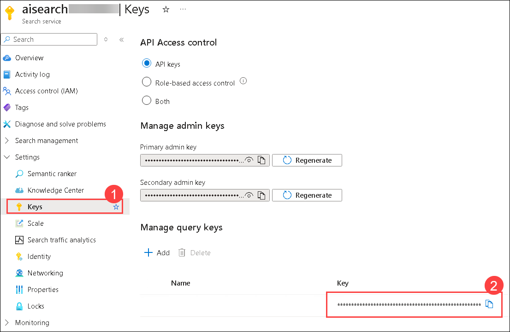 
 
    *You will need the **endpoint and query key** for your client application.*

### Task 7.2: Prepare to use the Azure AI Search SDK

1. In Visual Studio Code, in the **Explorer** pane, browse to the **22-create-a-search-solution** folder and expand the **C-Sharp** folder.

1. Right-click the **margies-travel** folder and open an integrated terminal. Then install the Azure AI Search SDK package by running the appropriate command for your language preference:

    **C#**
    
    ```
    dotnet add package Azure.Search.Documents --version 11.1.1
    ```
    
1. View the contents of the **margies-travel** folder, and note that it contains a file for configuration settings:

    - **C#**: appsettings.json

    Open the configuration file and update the configuration values it contains to reflect the **endpoint** and **query key** for your Azure AI Search resource. Save your changes.

     
     

### Task 7.3: Explore code to search an index

The **margies-travel** folder contains code files for a web application a Microsoft C# *ASP.NET Razor* web application, which includes search functionality.

1. Open the following code file in the web application, depending on your choice of programming language:

    - **C#**:Pages/Index.cshtml.cs

1. Near the top of the code file, find the comment **Import search namespaces**, and note the namespaces that have been imported to work with the Azure AI Search SDK:

1. In the **search_query** function, find the comment **Create a search client**, and note that the code creates a **SearchClient** object using the endpoint and query key for your Azure AI Search resource:

1. In the **search_query** function, find the comment **Submit search query**, and review the code to submit a search for the specified text with the following options:

    - A *search mode* that requires **all** of the individual words in the search text are found.
    - The total number of documents found by the search is included in the results.
    - The results are filtered to include only documents that match the provided filter expression.
    - The results are sorted into the specified sort order.
    - Each discrete value of the **metadata_author** field is returned as a *facet* that can be used to display pre-defined values for filtering.
    - Up to three extracts of the **merged_content** and **imageCaption** fields with the search terms highlighted are included in the results.
    - The results include only the fields specified.

### Task 7.4: Explore code to render search results

The web app already includes code to process and render the search results.

1. Open the following code file in the web application, depending on your choice of programming language:

    - **C#**:Pages/Index.cshtml

1. Examine the code, which renders the page on which the search results are displayed. Observe that:

    - The page begins with a search form that the user can use to submit a new search, which is referenced at the beginning of the page.
    - A second form is then rendered, enabling the user to refine the search results. The code for this form:
        - Retrieves and displays the count of documents from the search results.
        - Retrieves the facet values for the **metadata_author** field and displays them as an option list for filtering.
        - Creates a drop-down list of sort options for the results.
    - The code then iterates through the search results, rendering each result as follows:
        - Display the **metadata_storage_name** (file name) field as a link to the address in the **url** field.
        - Displaying *highlights* for search terms found in the **merged_content** and **imageCaption** fields to help show the search terms in context.
        - Display the **metadata_author**, **metadata_storage_size**, **metadata_storage_last_modified**, and **language** fields.
        - Display the **sentiment** label for the document. Can be positive, negative, neutral, or mixed.
        - Display the first five **keyphrases** (if any).
        - Display the first five **locations** (if any).
        - Display the first five **imageTags** (if any).

### Task 7.5: Run the web app

 1. Return to the integrated terminal for the **margies-travel** folder, and enter the following command to run the program:

    **C#**
    
    ```
    dotnet run
    ```

1. In the message that is displayed when the app starts successfully, follow the link to the running web application (*http://localhost:5000/* or *http://127.0.0.1:5000/*) to open the Margies Travel site in a web browser.

1. In the Margie's Travel website, enter **London hotel (1)** into the search box and click **Search (2)**.

    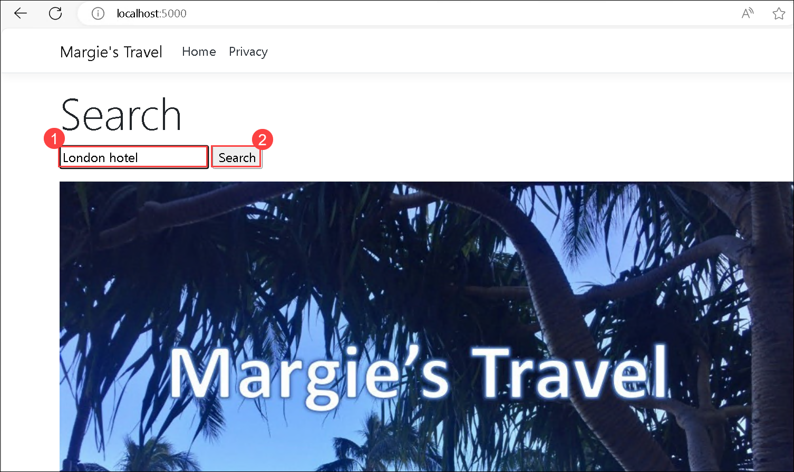 
 
1. Review the search results. They include the file name (with a hyperlink to the file URL), an extract of the file content with the search terms (*London* and *hotel*) emphasized, and other attributes of the file from the index fields.

1. Observe that the results page includes some user interface elements that enable you to refine the results. These include:

    - A *filter* based on a facet value for the **metadata_author** field. This demonstrates how you can use *facetable* fields to return a list of *facets* - fields with a small set of discrete values that can displayed as potential filter values in the user interface.
    - The ability to *order* the results based on a specified field and sort direction (ascending or descending). The default order is based on *relevancy*, which is calculated as a **search.score()** value based on a *scoring profile* that evaluates the frequency and importance of search terms in the index fields.

1. Select the **Reviewer (1)** filter and the **Positive to negative (2)** sort option, and then select **Refine Results (3)**.

    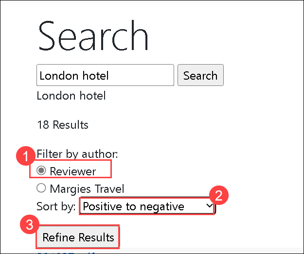 
 
1. Observe that the results are filtered to include only reviews, and sorted based on the sentiment label.

1. In the **Search** box, enter a new search for **quiet hotel in New York** and review the results.

1. Try the following search terms:
    - **Tower of London** (observe that this term is identified as a *key phrase* in some documents).
    - **skyscraper** (observe that this word doesn't appear in the actual content of any documents, but is found in the *image captions* and *image tags* that were generated for images in some documents).
    - **Mojave desert** (observe that this term is identified as a *location* in some documents).

1. Close the browser tab containing the Margie's Travel web site and return to Visual Studio Code. Then in the terminal for the **margies-travel** folder where the dotnet  application is running, enter **Ctrl+C** to stop the app.

### Review
In this lab, you have completed:

+ Cloned the repository for this course
+ Created Azure resources
+ Uploaded Documents to Azure Storage
+ Indexed the documents
+ Searched the index
+ Explored and modify definitions of search components
+ Created a search client application

## You have successfully completed the lab, proceed with the next exercises.
