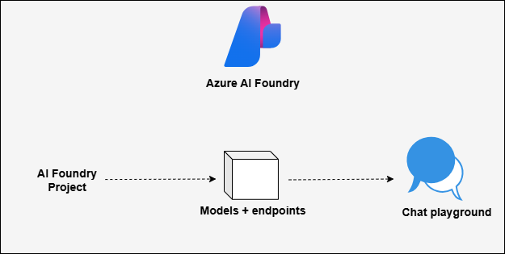
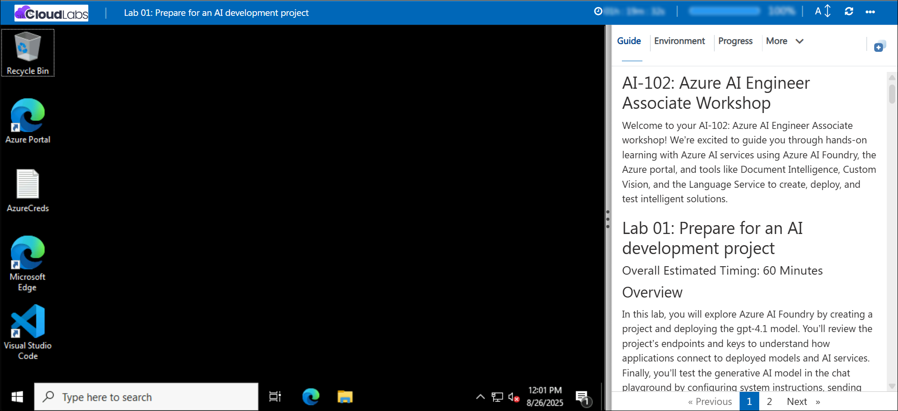

# AI-102: Azure AI Engineer Associate Workshop

Welcome to your AI-102: Azure AI Engineer Associate workshop! We’re excited to guide you through hands-on learning with Azure AI services using Azure AI Foundry, the Azure portal, and tools like Document Intelligence, Custom Vision, the Language Service, etc., to create, deploy, and test intelligent solutions.

# Lab 01: Prepare for an AI development project

### Overall Estimated Timing: 60 Minutes

## Overview

In this lab, you will explore Azure AI Foundry by creating a project and deploying the gpt-4.1 model. You’ll review the project’s endpoints and keys to understand how applications connect to deployed models and AI services. Finally, you’ll test the generative AI model in the chat playground by configuring system instructions, sending queries, and reviewing responses to see how the model can be applied in real scenarios.

## Objectives

By the end of this lab, you will be able to:

1. **Create and deploy a project in Azure AI Foundry**: Set up a new project, deploy the gpt-4.1 model, and explore resource and project-level settings.

2. **Review project endpoints and keys**: Understand how applications connect to your Azure AI Foundry project, deployed models, and integrated AI services.

3. **Test a generative AI model in the chat playground**: Configure system instructions, send queries, and analyze responses from the deployed model.

## Pre-requisites

* Basic knowledge of the Azure portal.
* Familiarity with core AI concepts such as generative AI and language models.
* An active Azure subscription with access to Azure AI Foundry.

## Architecture

The lab architecture demonstrates how an Azure AI Foundry project supports generative AI development and integration:

1. **Azure AI Foundry Resource**: Created in the Azure portal, this resource connects to Azure AI services and hosts deployed models such as gpt-4.1.

2. **Azure AI Foundry Project**: A workspace where you deploy and manage the gpt-4.1 model, configure project settings, and access endpoints and keys for application integration.

3. **Chat Playground Interface**: A built-in tool within Azure AI Foundry that allows you to test your deployed model, provide custom instructions, send queries, and analyze responses before integrating the model into applications.

## Architecture Diagram

## Explanation of Components

1. **Azure AI Foundry Project**: The main workspace where you organize your AI solutions. It acts as a hub for managing deployed models, configuring project settings, and controlling access to resources.

2. **Models and Endpoints**: Deployed AI models, like gpt-4.1, are accessible via endpoints and secured with authorization keys. These endpoints allow client applications to interact with the models programmatically.

3. **Chat Playground**: An interactive interface within the Foundry project that lets you experiment with your models. You can provide instructions, run queries, and observe model responses, which helps in testing and refining AI behavior before integration.

# Getting Started with lab

Welcome to your AI-102: Azure AI Engineer Associate workshop! We’ve prepared an interactive environment for you to explore generative AI concepts and work with Microsoft Azure services like Azure AI Foundry, Document Intelligence, Custom Vision, Language Service etc. Let’s get started and make the most of this hands-on experience.

## Accessing Your Lab Environment
 
Once you're ready to dive in, your virtual machine and **lab guide** will be right at your fingertips within your web browser.
 

### Virtual Machine & Lab Guide
 
Your virtual machine is your workhorse throughout the workshop. The lab guide is your roadmap to success.

## Exploring Your Lab Resources
 
To get a better understanding of your lab resources and credentials, navigate to the **Environment** tab.
 

## Lab Guide Zoom In/Zoom Out
 
To adjust the zoom level for the environment page, click the **A↕: 100%** icon located next to the timer in the lab environment.

## Utilizing the Split Window Feature
 
For convenience, you can open the lab guide in a separate window by selecting the **Split Window** button from the Top right corner.
 

## Managing Your Virtual Machine
 
Feel free to **Start, Restart, or Stop (2)** your virtual machine as needed from the **Resources (1)** tab. Your experience is in your hands!
 

## Lab Progress

You can use the **Progress** tab to track your progress while working on the lab. A score will be provided after successful validation.

## Let's Get Started with Azure Portal
 
1. On your virtual machine, click on the Azure Portal icon as shown below:
 
   

1. In sign-in window, kindly sign in using the provided Azure credentials

    - **Email/Username:** <inject key="AzureAdUserEmail"></inject>

        

    - **Password:** <inject key="AzureAdUserPassword"></inject>

        

1. If prompted to **Stay signed in?**, you can click **No**.

    

1. If a **Welcome to Microsoft Azure** pop-up window appears, simply click **Cancel** to skip the tour.

    

## Support Contact
 
The CloudLabs support team is available 24/7, 365 days a year, via email and live chat to ensure seamless assistance at any time. We offer dedicated support channels explicitly tailored for both learners and instructors, ensuring that all your needs are promptly and efficiently addressed.
 
Learner Support Contacts:
 
- Email Support: cloudlabs-support@spektrasystems.com
- Live Chat Support: https://cloudlabs.ai/labs-support

Click on **Next** from the lower right corner to move on to the next page.

   

## Happy Learning !!

