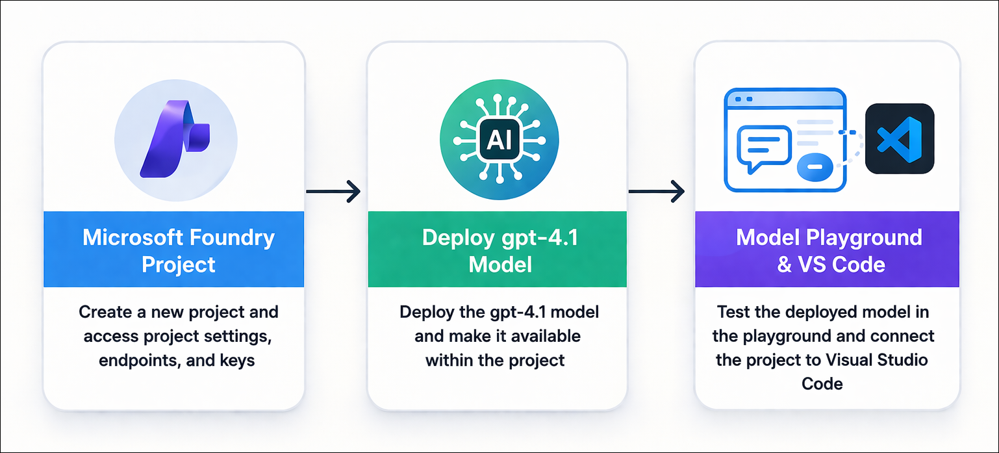

# AI-102: Azure AI Engineer Associate Workshop

Welcome to your AI-102: Azure AI Engineer Associate workshop! We’re excited to guide you through hands-on learning with Azure AI services using Microsoft Foundry, the Azure portal, and tools like Document Intelligence, Custom Vision, the Language Service, etc., to create, deploy, and test intelligent solutions.

# Lab 01: Prepare for an AI development project

### Overall Estimated Timing: 45 Minutes

## Overview

In this hands-on lab, you will set up an AI development environment using Microsoft Foundry by creating a project and deploying a gpt-4.1 model. You will test the model in the playground by providing instructions, sending prompts, and reviewing responses. By the end of the lab, you will understand how to manage project resources and integrate your environment with development tools like Visual Studio Code.

## Objectives

By the end of this lab, you will be able to:

1. **Create a Microsoft Foundry project:** Set up a new project with the required Azure resources and configure the development environment.

2. **Deploy and test a generative AI model:** Deploy the **gpt-4.1** model and validate its responses using the model playground.

3. **Explore endpoints and integrate with development tools:** Review project and resource endpoints, and connect the project to Visual Studio Code for further development.

## Pre-requisites

* Basic knowledge of the Azure portal.
* Familiarity with core AI concepts such as generative AI and language models.
* An active Azure subscription with access to Microsoft Foundry.

## Architecture

The lab architecture demonstrates how an Foundry project supports generative AI development and integration:

1. **Microsoft Foundry Resource:** Created in the Azure portal, this resource connects to Azure AI services and hosts deployed models such as gpt-4.1.

2. **Microsoft Foundry Project:** A workspace where you deploy and manage the gpt-4.1 model, configure project settings, and access endpoints and keys for application integration.

3. **Model Playground and VS Code Integration:** Interactive environments used to test deployed models, provide instructions, send prompts, analyze responses, and connect the project to Visual Studio Code for development workflows.

## Architecture Diagram

## Explanation of Components

1. **Microsoft Foundry Project:** The central workspace created in the Microsoft Foundry portal where you deploy and manage the **gpt-4.1** model and access project-level settings, endpoints, and keys.

2. **Deployed Model (gpt-4.1):** The foundation model deployed within the project that processes prompts and generates responses for AI-driven interactions.

3. **Model Playground:** An interactive interface used to test the deployed model by providing system instructions, submitting prompts, and analyzing responses.

4. **Visual Studio Code Integration:** The Microsoft Foundry extension in Visual Studio Code that connects to your project, enabling you to access the deployed model and work within a development environment.

# Getting Started with lab

Welcome to your AI-102: Azure AI Engineer Associate workshop! We’ve prepared an interactive environment for you to explore generative AI concepts and work with Microsoft Azure services like Microsoft Foundry, Document Intelligence, Custom Vision, Language Service, etc. Let’s get started and make the most of this hands-on experience.

## Accessing Your Lab Environment
 
Once you're ready to dive in, your virtual machine and **Guide** will be right at your fingertips within your web browser.
 

### Virtual Machine & Lab Guide
 
Your virtual machine is your workhorse throughout the workshop. The lab guide is your roadmap to success.

## Exploring Your Lab Resources
 
To get a better understanding of your lab resources and credentials, navigate to the **Environment** tab.
 

## Managing Your Virtual Machine
 
Feel free to **Start, Restart, or Stop (2)** your virtual machine as needed from the **Resources (1)** tab. Your experience is in your hands!
 

## Lab Progress

You can use the **Progress** tab to track your progress while working on the lab. A score will be provided after successful validation.

## Utilizing the Split Window Feature
 
For convenience, you can open the lab guide in a separate window by selecting the **Split Window** button from the top right corner.
 

## Lab Guide Zoom In/Zoom Out
 
To adjust the zoom level for the environment page, click the **A↕: 100%** icon located next to the timer in the lab environment.

## Let's Get Started with Azure Portal
 
1. On your virtual machine, click on the Azure Portal icon as shown below:
 
   

1. In the sign-in window, kindly sign in using the provided Azure credentials

    - **Email/Username:** <inject key="AzureAdUserEmail"></inject>

        

    - **Password:** <inject key="AzureAdUserPassword"></inject>

        

1. If prompted to **Stay signed in?**, you can click **No**.

    

1. If a **Welcome to Microsoft Azure** pop-up window appears, simply click **Maybe later** to skip the tour.

    

## Support Contact
 
The CloudLabs support team is available 24/7, 365 days a year, via email and live chat to ensure seamless assistance at any time. We offer dedicated support channels explicitly tailored for both learners and instructors, ensuring that all your needs are promptly and efficiently addressed.
 
Learner Support Contacts:
 
- Email Support: cloudlabs-support@spektrasystems.com
- Live Chat Support: https://cloudlabs.ai/labs-support

Click on **Next** from the lower right corner to move on to the next page.

   

## Happy Learning !!

