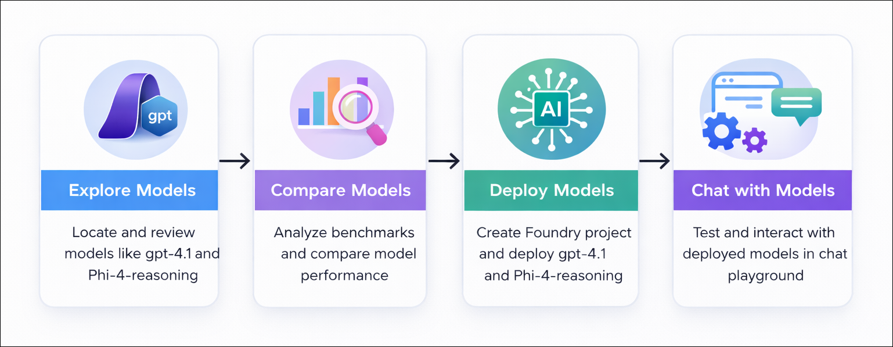
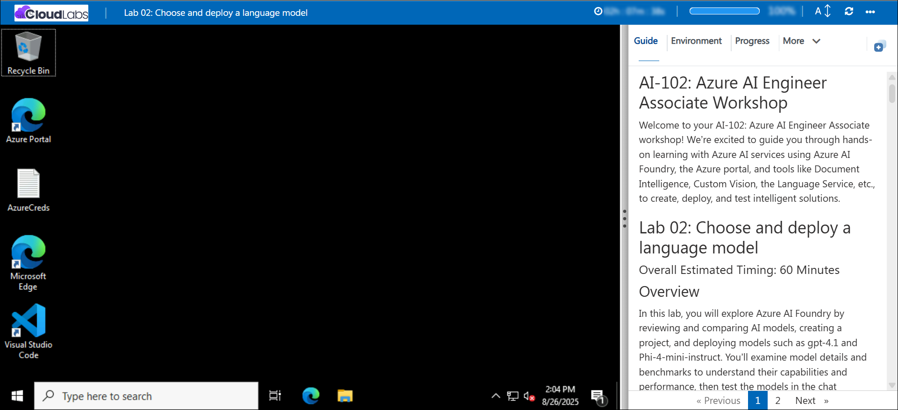

# AI-102: Azure AI Engineer Associate Workshop

Welcome to your AI-102: Azure AI Engineer Associate workshop! We’re excited to guide you through hands-on learning with Azure AI services using Microsoft Foundry, the Azure portal, and tools like Document Intelligence, Custom Vision, the Language Service, etc., to create, deploy, and test intelligent solutions.

# Lab 02: Choose and deploy a language model

### Overall Estimated Timing: 45 Minutes

## Overview

In this hands-on lab, you’ll gain practical experience with **Microsoft Foundry** by reviewing and comparing AI models. You’ll create a project and deploy models such as **gpt-4.1** and **Phi-4-reasoning**, examining their details and benchmarks to understand capabilities and performance. Next, you’ll test the models in the chat playground by configuring system instructions, sending queries, and analyzing responses. By the end of the lab, you’ll have compared the models to evaluate their suitability for different tasks and real-world scenarios.

## Objectives

By the end of this lab, you will be able to:

1. **Explore and compare AI models:** Review model details, benchmarks, and performance metrics to understand their capabilities and select appropriate models for specific tasks.

2. **Create and deploy a project in Microsoft Foundry:** Set up a new project, deploy models such as gpt-4.1 and Phi-4-reasoning, and configure project-level settings.

3. **Test and interact with deployed models:** Use the chat playground to provide system instructions, submit queries, review responses, and compare model performance to determine suitability for various scenarios.

## Pre-requisites

* Basic knowledge of the Azure portal.
* Familiarity with core AI concepts such as generative AI and language models.
* An active Azure subscription with access to Microsoft Foundry.

## Architecture

The lab architecture demonstrates how Microsoft Foundry supports generative AI model exploration, deployment, and testing:

1. **Microsoft Foundry Resource:** Provisioned through the Azure portal, this resource connects to Azure AI services and hosts deployed models such as gpt-4.1 and Phi-4-reasoning.

2. **Microsoft Foundry Project:** A workspace where models are deployed and managed, project settings are configured, and endpoints and authorization keys are accessed for application integration.

3. **Chat Playground Interface:** An interactive environment within the project that allows you to test deployed models, provide system instructions, submit queries, analyze responses, and compare model performance.

## Architecture Diagram

## Explanation of Components

1. **Microsoft Foundry Project:** The main workspace where you organize your AI solutions. It acts as a hub for managing deployed models, configuring project settings, and controlling access to resources.

2. **Models and Endpoints:** Deployed AI models, like gpt-4.1, are accessible via endpoints and secured with authorization keys. These endpoints allow client applications to interact with the models programmatically.

3. **Chat Playground:** An interactive interface within the Foundry project that lets you experiment with your models. You can provide instructions, run queries, and observe model responses, which helps in testing and refining AI behavior before integration.

# Getting Started with lab

Welcome to your AI-102: Azure AI Engineer Associate workshop! We’ve prepared an interactive environment for you to explore generative AI concepts and work with Microsoft Azure services like Microsoft Foundry, Document Intelligence, Custom Vision, Language Service, etc. Let’s get started and make the most of this hands-on experience.

## Accessing Your Lab Environment
 
Once you're ready to dive in, your virtual machine and **Guide** will be right at your fingertips within your web browser.
 

### Virtual Machine & Lab Guide
 
Your virtual machine is your workhorse throughout the workshop. The lab guide is your roadmap to success.

## Exploring Your Lab Resources
 
To get a better understanding of your lab resources and credentials, navigate to the **Environment** tab.
 

## Managing Your Virtual Machine
 
Feel free to **Start, Restart, or Stop (2)** your virtual machine as needed from the **Resources (1)** tab. Your experience is in your hands!
 

## Lab Progress

You can use the **Progress** tab to track your progress while working on the lab. A score will be provided after successful validation.

## Utilizing the Split Window Feature
 
For convenience, you can open the lab guide in a separate window by selecting the **Split Window** button from the top right corner.
 

## Lab Guide Zoom In/Zoom Out
 
To adjust the zoom level for the environment page, click the **A↕: 100%** icon located next to the timer in the lab environment.

## Let's Get Started with Azure Portal
 
1. On your virtual machine, click on the Azure Portal icon as shown below:
 
   

1. In the sign-in window, kindly sign in using the provided Azure credentials

    - **Email/Username:** <inject key="AzureAdUserEmail"></inject>

        

    - **Password:** <inject key="AzureAdUserPassword"></inject>

        

1. If prompted to **Stay signed in?**, you can click **No**.

    

1. If a **Welcome to Microsoft Azure** pop-up window appears, simply click **Maybe later** to skip the tour.

    

## Support Contact
 
The CloudLabs support team is available 24/7, 365 days a year, via email and live chat to ensure seamless assistance at any time. We offer dedicated support channels explicitly tailored for both learners and instructors, ensuring that all your needs are promptly and efficiently addressed.
 
Learner Support Contacts:
 
- Email Support: cloudlabs-support@spektrasystems.com
- Live Chat Support: https://cloudlabs.ai/labs-support

Click on **Next** from the lower right corner to move on to the next page.

   

## Happy Learning !!

