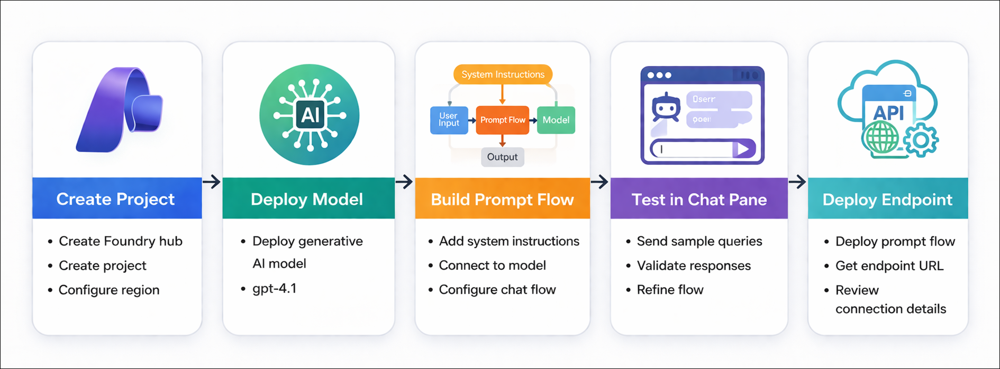
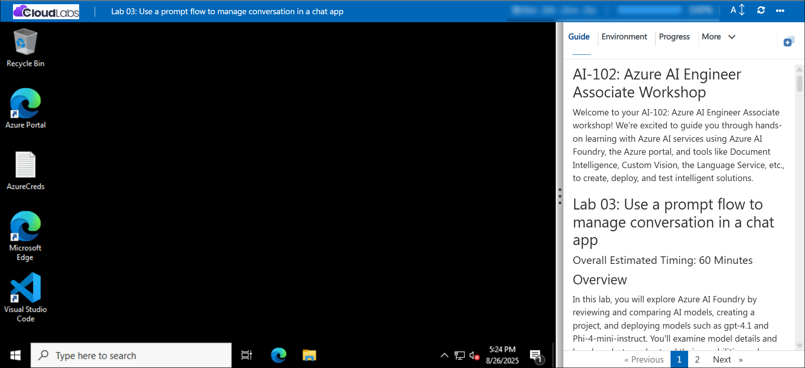

# Getting Started with your AI-102: Azure AI Engineer Associate Workshop

Welcome to your AI-102: Azure AI Engineer Associate workshop! We’re excited to guide you through hands-on learning with Azure AI services using Microsoft Foundry, the Azure portal, and tools like Document Intelligence, Custom Vision, the Language Service, etc., to create, deploy, and test intelligent solutions.

# Lab 03: Use a prompt flow to manage conversation in a chat app

### Overall Estimated Timing: 60 Minutes

## Overview

In this hands-on lab, you’ll gain practical experience with **Microsoft Foundry** by designing, building, and deploying a prompt flow solution. You’ll start by creating a project, then construct and configure a flow with system instructions and connect it to a model. Next, you’ll test the flow in the chat pane using sample prompts, refine responses as needed, and validate its behavior. Finally, you’ll deploy the flow as an endpoint, test it directly in the Microsoft Foundry portal, and review connection details for integrating it into client applications. By the end of the lab, you’ll be proficient in creating, testing, and deploying prompt flows to deliver interactive generative AI capabilities.

## Objectives

By the end of this lab, you will be able to:

1. **Create a Foundry project:** Set up a new project environment to build and manage prompt flows.

2. **Design and configure a prompt flow:** Add system instructions, connect to a model, and adjust flow components.

3. **Test flows in the chat pane:** Run sample queries, review outputs, and refine prompts to improve responses.

4. **Deploy a prompt flow as an endpoint:** Publish your flow, enabling it to be accessed outside the design environment.

5. **Validate the deployed endpoint:** Interact with the deployed flow directly in Microsoft Foundry to confirm functionality.

6. **Retrieve endpoint connection details:** Access deployment information required to integrate the flow into client applications.

## Pre-requisites

- Basic knowledge of navigating the Azure portal.

- Familiarity with AI concepts such as generative AI, language models, and benchmarks.

- An active Azure subscription with access to Microsoft Foundry.

- Permission to create and manage resources (including enabling managed identities).

## Architecture

1. **Microsoft Foundry Resource:** The central workspace that hosts the prompt flow, connected resources, and the deployed gpt-4.1 model. It provides the environment to build, manage, and deploy the conversational AI solution.

2. **Microsoft Foundry Project:** A generative AI model that processes structured prompts from the flow and generates intelligent, context-aware responses for travel-related queries.

3. **Prompt Flow and Chat Playground:** Orchestrates the conversation by combining system instructions, user input, and chat history. It ensures the assistant behaves like a travel agent and produces consistent, context-aware outputs.

4. **Storage and Authorization:** Blob storage integrated with managed identities ensures the project and prompt flows have secure access to necessary data and assets.

5. **Deployment and Integration:** The prompt flow is deployed as an endpoint, enabling external applications to interact with it using APIs, making it ready for real-world chat application integration.

## Architecture Diagram

## Explanation of Components

1. **Microsoft Foundry Resource**: The core service provisioned in the Azure portal that connects to Azure AI services, hosts deployed models, and manages secure access via system-assigned identities. It serves as the foundation for creating projects, deploying models, and integrating AI capabilities.

2. **Microsoft Foundry Project:** The workspace where you deploy and manage models, configure project-level settings, create prompt flows, and access endpoints and authorization keys. This is where all model-related operations, including deployment, testing, and orchestration, occur.

3. **Models and Endpoints:** AI models such as **gpt-4.1**, are deployed within the project and exposed through endpoints. Endpoints enable applications or prompt flows to interact with the models programmatically while ensuring secure access via keys.

4. **Prompt Flow:** A configurable workflow that orchestrates prompts, inputs, and outputs for a generative AI model. It allows you to define interactions, integrate system instructions, and process user queries to automate AI-assisted tasks.

5. **Chat Playground:** An interactive interface for testing deployed models and prompt flows. Users can input queries, provide system instructions, observe responses, and iteratively refine model behavior before integrating it into applications.

6. **Storage Integration and Authorization:** Blob storage connected via managed identities ensures that prompt flows and projects can securely read and store assets required for AI operations, maintaining controlled access to sensitive data.

## Accessing Your Lab Environment
 
Once you're ready to dive in, your virtual machine and **Guide** will be right at your fingertips within your web browser.
 

## Virtual Machine & Lab Guide
 
Your virtual machine is your workhorse throughout the workshop. The lab guide is your roadmap to success.

## Exploring Your Lab Resources
 
To get a better understanding of your lab resources and credentials, navigate to the **Environment** tab.
 

## Managing Your Virtual Machine
 
Feel free to **Start, Restart, or Stop (2)** your virtual machine as needed from the **Resources (1)** tab. Your experience is in your hands!
 

## Lab Progress

You can use the **Progress** tab to track your progress while working on the lab. A score will be provided after successful validation.

## Utilizing the Split Window Feature
 
For convenience, you can open the lab guide in a separate window by selecting the **Split Window** button from the top right corner.
 

## Lab Guide Zoom In/Zoom Out
 
To adjust the zoom level for the environment page, click the **A↕: 100%** icon located next to the timer in the lab environment.

## Let's Get Started with Azure Portal
 
1. On your virtual machine, click on the Azure Portal icon as shown below:
 
    

1. In sign-in window, kindly sign in using the provided Azure credentials

    - **Email/Username:** <inject key="AzureAdUserEmail"></inject>

        

    - **Password:** <inject key="AzureAdUserPassword"></inject>

        

1. If prompted to **Stay signed in?**, you can click **No**.

    

1. If a **Welcome to Microsoft Azure** pop-up window appears, simply click **Maybe later** to skip the tour.

    

## Support Contact
 
The CloudLabs support team is available 24/7, 365 days a year, via email and live chat to ensure seamless assistance at any time. We offer dedicated support channels explicitly tailored for both learners and instructors, ensuring that all your needs are promptly and efficiently addressed.
 
Learner Support Contacts:
 
- Email Support: cloudlabs-support@spektrasystems.com
- Live Chat Support: https://cloudlabs.ai/labs-support

Click on **Next** from the lower right corner to move on to the next page.

   

## Happy Learning !!
