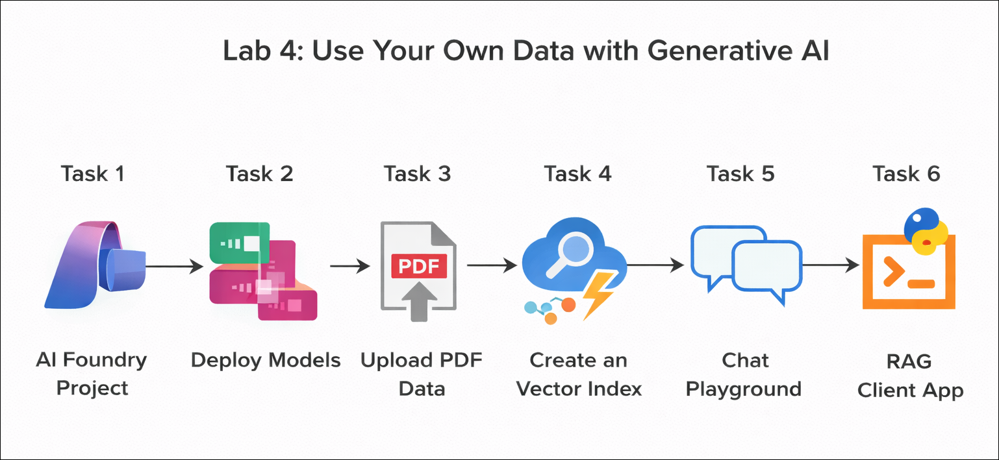
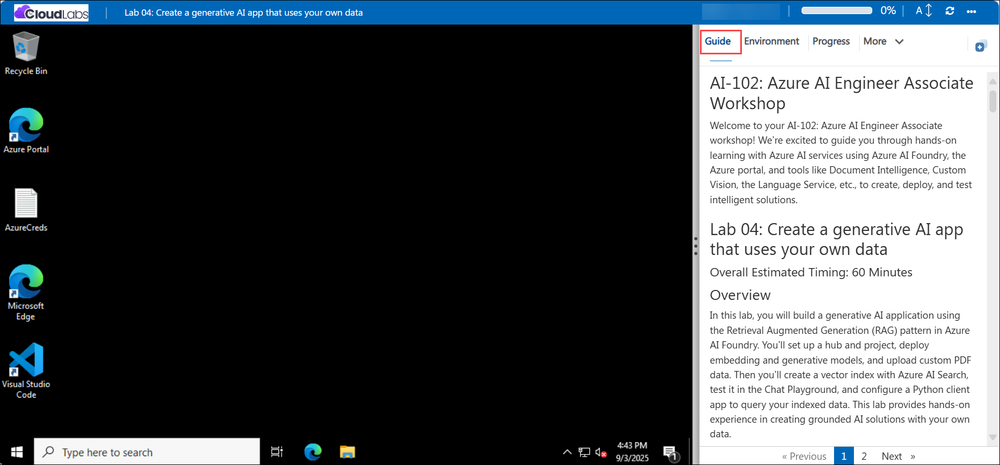

# Getting Started with your AI-102: Azure AI Engineer Associate Workshop

Welcome to your AI-102: Azure AI Engineer Associate workshop! We’re excited to guide you through hands-on learning with Azure AI services using Microsoft Foundry, the Azure portal, and tools like Document Intelligence, Custom Vision, the Language Service, etc., to create, deploy, and test intelligent solutions.

# Lab 04: Create a generative AI app that uses your own data

### Overall Estimated Timing: 60 Minutes

## Overview

In this hands-on lab, you will build a generative AI application using the Retrieval Augmented Generation (RAG) pattern in Microsoft Foundry. You’ll set up a hub and project, deploy embedding and generative models, and upload custom PDF data. Then you’ll create a vector index with Azure AI Search, test it in the Chat Playground, and configure a Python client app to query your indexed data. This lab provides hands-on experience in creating grounded AI solutions with your own data.

## Objectives

By the end of this lab, you will be able to:

1. **Create and organize resources in Microsoft Foundry:** Set up a hub and project to manage models, data, and indexes.

2. **Deploy models for RAG:** Deploy an embedding model for vectorization and a generative model for grounded responses.

3. **Add and index custom data:** Upload PDF files, create a vector index in Azure AI Search, and connect it to your project.

4. **Test responses with data grounding:** Use the Chat Playground to compare outputs with and without the index.

5. **Build and run a client application:** Configure a Python-based RAG app that integrates the Azure OpenAI SDK and Azure AI Search.

## Pre-requisites

- Basic knowledge of navigating the Azure portal.

- Familiarity with concepts of generative AI and vector search.

- An active Azure subscription with access to Microsoft Foundry.

- Basic knowledge of Python programming.

## Architecture

1. **Microsoft Foundry Resource:** The core service in Azure that provides access to model catalog, deployment capabilities, and integration with Azure AI Search.

2. **Microsoft Foundry Project:** A workspace within the resource where you deploy models, upload custom data, and manage indexes.

3. **Azure AI Search:** A service that hosts the vector index created from your custom data, enabling semantic and keyword-based retrieval.

4. **Chat Playground and RAG Client App:** Interactive environments for testing model responses. The Playground allows quick validation with and without data grounding, while the Python client app demonstrates how to integrate RAG into real applications.

## Architecture Diagram

## Explanation of Components

1. **Microsoft Foundry Resource:** The core Azure service that provides access to model deployment, data integration, and connections with Azure AI Search. It serves as the foundation for building and managing your RAG solution.

2. **Microsoft Foundry Project:** A workspace where you deploy the gpt-4.1 generative model and the text-embedding-ada-002 embedding model, upload PDF brochures, and manage indexes. The project acts as the central hub for all assets.

3. **Azure AI Search (Vector Index):** A connected resource that hosts the brochures-index, enabling both vector and keyword search. It retrieves the most relevant passages from the uploaded PDFs to ground responses.

4. **Chat Playground and Python Client App:** Tools for testing and validation. The Chat Playground provides a no-code environment to compare outputs with and without grounding, while the Python client app demonstrates programmatic integration of Azure OpenAI and Azure AI Search to deliver a full RAG application.

5. **Azure Cloud Shell:** A browser-based command-line environment in the Azure portal that comes preconfigured with developer tools. In this lab, you will use it to run the Python client app.

## Accessing Your Lab Environment
 
Once you're ready to dive in, your virtual machine and **Guide** will be right at your fingertips within your web browser.
 

## Virtual Machine & Lab Guide
 
Your virtual machine is your workhorse throughout the workshop. The lab guide is your roadmap to success.

## Exploring Your Lab Resources
 
To get a better understanding of your lab resources and credentials, navigate to the **Environment** tab.
 

## Managing Your Virtual Machine
 
Feel free to **Start, Restart, or Stop (2)** your virtual machine as needed from the **Resources (1)** tab. Your experience is in your hands!
 

## Lab Progress

You can use the **Progress** tab to track your progress while working on the lab. A score will be provided after successful validation.

## Utilizing the Split Window Feature
 
For convenience, you can open the lab guide in a separate window by selecting the **Split Window** button from the top right corner.
 

## Lab Guide Zoom In/Zoom Out
 
To adjust the zoom level for the environment page, click the **A↕: 100%** icon located next to the timer in the lab environment.

## Let's Get Started with Azure Portal
 
1. On your virtual machine, click on the Azure Portal icon as shown below:
 
   

1. In sign-in window, kindly sign in using the provided Azure credentials

    - **Email/Username:** <inject key="AzureAdUserEmail"></inject>

        

    - **Password:** <inject key="AzureAdUserPassword"></inject>

        

1. If prompted to **Stay signed in?**, you can click **No**.

    

1. If a **Welcome to Microsoft Azure** pop-up window appears, simply click **Maybe later** to skip the tour.

    

## Support Contact
 
The CloudLabs support team is available 24/7, 365 days a year, via email and live chat to ensure seamless assistance at any time. We offer dedicated support channels explicitly tailored for both learners and instructors, ensuring that all your needs are promptly and efficiently addressed.
 
Learner Support Contacts:
 
- Email Support: cloudlabs-support@spektrasystems.com
- Live Chat Support: https://cloudlabs.ai/labs-support

Click on **Next** from the lower right corner to move on to the next page.

   

## Happy Learning !!