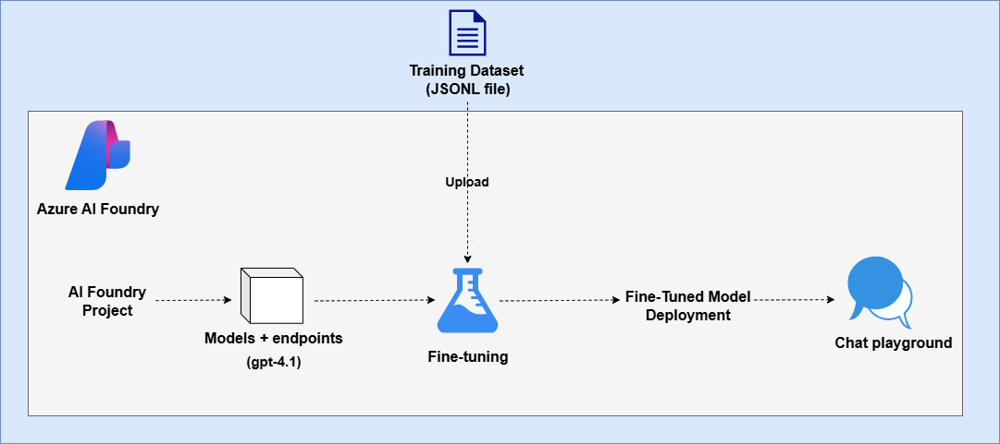

# AI-102: Azure AI Engineer Associate Workshop

Welcome to your AI-102: Azure AI Engineer Associate workshop! We’re excited to guide you through hands-on learning with Azure AI services using Azure AI Foundry, the Azure portal, and tools like Document Intelligence, Custom Vision, the Language Service, etc., to create, deploy, and test intelligent solutions.

# Lab 05: Fine-tune a language model

### Overall Estimated Duration: 60 Minutes

## Overview

In this lab, you fine-tuned a **GPT-4.1 model** in Azure AI Foundry to customize its conversational style for a travel chat application. You started by deploying a base model, interacting with it in the playground, and refining its behavior using system messages. You then prepared and uploaded a training dataset, initiated a fine-tuning job, and deployed the fine-tuned model. Finally, you tested the model against the base version to compare response style, tone, and consistency, ensuring it aligned with the desired role of a friendly and inspiring travel assistant.

## Objectives

By the end of this lab, you will be able to:

1. **Deploy a base model in Azure AI Foundry**: Set up a project and deploy the GPT-4.1 model for use in a custom chat application.
2. **Fine-tune the model with training data**: Upload a JSONL dataset, configure fine-tuning parameters, and initiate the fine-tuning process.
3. **Compare base and fine-tuned models**: Interact with both models in the playground, adjust system messages, and evaluate their responses.
4. **Deploy and test the fine-tuned model**: Verify the deployment, interact with the model, and assess its consistency, tone, and alignment with the travel assistant use case.

## Pre-requisites

* Basic understanding of **language models** and how fine-tuning differs from prompt engineering.
* Familiarity with **JSONL file format** for training data preparation.
* Experience using the **Azure portal** and navigating within **Azure AI Foundry**.
* An active **Azure subscription** with access to **Azure AI Foundry** services.
* Permissions to create and manage projects, deploy models, and run fine-tuning jobs (for example, **Cognitive Services OpenAI Contributor** or equivalent role).

## Architecture

The lab architecture demonstrates how a base model is fine-tuned and deployed in **Azure AI Foundry** to act as a customized travel assistant:

1. **Azure AI Foundry Project**: The workspace where the GPT-4.1 model is deployed, fine-tuned, and managed.
2. **Base Model (GPT-4.1)**: The starting point for experimentation, tested in the chat playground with system messages and prompts.
3. **Training Dataset (JSONL file)**: A collection of curated travel-related conversations uploaded to guide the model’s desired behavior.
4. **Fine-Tuning Job**: A process that applies supervised learning on the base model using the training dataset to adapt its conversational style.
5. **Fine-Tuned Model Deployment**: The customized GPT-4.1 variant deployed as an endpoint for testing and integration.
6. **Chat Playground**: An interactive environment used to compare the base and fine-tuned models and validate improvements in tone, style, and consistency.

## Architecture Diagram

## Explanation of Components

1. **Azure AI Foundry Project**: Acts as the central workspace to deploy the GPT-4.1 model, manage fine-tuning jobs, and organize related resources.
2. **Base Model (GPT-4.1)**: The original, unmodified model used as a benchmark for comparison before fine-tuning.
3. **Training Dataset (JSONL file)**: A structured set of example travel-related conversations that guide the fine-tuned model toward the desired tone and behavior.
4. **Fine-Tuning Job**: The supervised learning process that adapts the base GPT-4.1 model using the uploaded dataset, creating a specialized version of the model.
5. **Fine-Tuned Model Deployment**: The customized GPT-4.1 endpoint, deployed in Azure AI Foundry for testing and integration into applications.
6. **Chat Playground**: An interactive tool within Azure AI Foundry where both the base and fine-tuned models can be tested and evaluated for response style, consistency, and accuracy.

# Getting Started with lab

Welcome to your AI-102: Azure AI Engineer Associate workshop! We’ve prepared an interactive environment for you to explore generative AI concepts and work with Microsoft Azure services like Azure AI Foundry, Document Intelligence, Custom Vision, Language Service, etc. Let’s get started and make the most of this hands-on experience.

## Accessing Your Lab Environment
 
Once you're ready to dive in, your virtual machine and **lab guide** will be right at your fingertips within your web browser.
 

### Virtual Machine & Lab Guide
 
Your virtual machine is your workhorse throughout the workshop. The lab guide is your roadmap to success.

## Exploring Your Lab Resources
 
To get a better understanding of your lab resources and credentials, navigate to the **Environment** tab.
 

## Managing Your Virtual Machine
 
Feel free to **Start, Restart, or Stop (2)** your virtual machine as needed from the **Resources (1)** tab. Your experience is in your hands!
 

## Lab Progress

You can use the **Progress** tab to track your progress while working on the lab. A score will be provided after successful validation.

## Utilizing the Split Window Feature
 
For convenience, you can open the lab guide in a separate window by selecting the **Split Window** button from the top right corner.
 

## Lab Guide Zoom In/Zoom Out
 
To adjust the zoom level for the environment page, click the **A↕: 100%** icon located next to the timer in the lab environment.

## Let's Get Started with Azure Portal
 
1. On your virtual machine, click on the Azure Portal icon as shown below:
 
   

1. In the sign-in window, kindly sign in using the provided Azure credentials

    - **Email/Username:** <inject key="AzureAdUserEmail"></inject>

        

    - **Password:** <inject key="AzureAdUserPassword"></inject>

        

1. If prompted to **Stay signed in?**, you can click **No**.

    

1. If a **Welcome to Microsoft Azure** pop-up window appears, simply click **Cancel** to skip the tour.

    

## Support Contact
 
The CloudLabs support team is available 24/7, 365 days a year, via email and live chat to ensure seamless assistance at any time. We offer dedicated support channels explicitly tailored for both learners and instructors, ensuring that all your needs are promptly and efficiently addressed.
 
Learner Support Contacts:
 
- Email Support: cloudlabs-support@spektrasystems.com
- Live Chat Support: https://cloudlabs.ai/labs-support

Click on **Next** from the lower right corner to move on to the next page.

   

## Happy Learning !!

