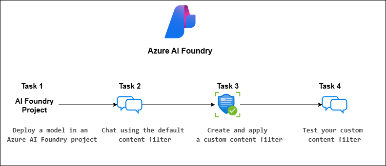

# AI-102: Azure AI Engineer Associate Workshop

Welcome to your AI-102: Azure AI Engineer Associate workshop! We’re excited to guide you through hands-on learning with Azure AI services using Azure AI Foundry, the Azure portal, and tools like Document Intelligence, Custom Vision, the Language Service, etc., to create, deploy, and test intelligent solutions.

# Lab 06: Apply content filters to prevent the output of harmful content

### Overall Estimated Timing: 60 Minutes

## Overview

In this lab, you will explore how Azure AI Foundry uses content filters to detect and block potentially harmful prompts and responses. You’ll deploy a model, test the effect of default filters, and then create and apply a custom content filter tailored to stricter requirements. Finally, you’ll validate how these filters influence model outputs in the Chat Playground. This lab provides practical experience in applying responsible AI principles to generative AI solutions.

## Objectives

By the end of this lab, you will be able to:

1. **Create and deploy a project in Azure AI Foundry:** Create a new project, deploy the Phi-4 model, and prepare it for testing in the Chat Playground.
2. **Test the default content filters:** Interact with your deployed model to see how harmful inputs and outputs are identified and blocked.
3. **Create and apply a custom content filter:** Define stricter thresholds for categories such as violence, hate, sexual, and self-harm, and apply them to your deployment.
4. **Validate the custom filter in the Chat Playground:** Submit prompts to compare model behavior before and after applying the custom content filter.

## Pre-requisites

- Basic knowledge of navigating the Azure portal.

- Familiarity with responsible AI concepts such as harmful content filtering.

- An active Azure subscription with access to Azure AI Foundry.

## Architecture

1. **Azure AI Foundry Resource**: The core service in Azure that provides access to model catalog, deployment capabilities, and responsible AI tools such as content filters.

2. **Azure AI Foundry Project**: A workspace where you manage the Phi-4 model deployment, configure settings, and apply content filters.

3. **Content Filters:** Default or custom filters that analyze both input prompts and output completions to block harmful content categories such as violence, hate, sexual, and self-harm.

4. **Chat Playground Interface:** An interactive environment for testing the model with different prompts to validate the effect of default and custom content filters.

## Architecture Diagram

## Explanation of Components

1. **Azure AI Foundry Resource**: The core service in Azure that provides access to generative AI models, deployment options, and responsible AI features such as content filters. It is the foundation for creating projects and managing model deployments.

2. **Azure AI Foundry Project**: The workspace you create within the resource to organize and manage assets. In this lab, the project hosts the Phi-4 model deployment and is the location where you configure and apply content filters.

3. **Model Deployment (Phi-4)**: The generative AI model deployed in the project. It is accessed through a secure endpoint and used in the Chat Playground to demonstrate how harmful prompts and completions are handled by filters.

4. **Content Filters:** Default or custom filters applied to model deployments. They evaluate both input prompts and output responses across categories such as violence, hate, sexual, and self-harm to block unsafe content.

5. **Chat Playground**: An interactive interface for testing deployed models. It allows users to input queries, review responses, and validate how both default and custom filters affect the model’s output.

# Getting Started with lab

Welcome to your AI-102: Azure AI Engineer Associate workshop! We’ve prepared an interactive environment for you to explore generative AI concepts and work with Microsoft Azure services like Azure AI Foundry, Document Intelligence, Custom Vision, Language Service etc. Let’s get started and make the most of this hands-on experience.

## Accessing Your Lab Environment
 
Once you're ready to dive in, your virtual machine and **Guide** will be right at your fingertips within your web browser.
 

### Virtual Machine & Lab Guide
 
Your virtual machine is your workhorse throughout the workshop. The lab guide is your roadmap to success.

## Exploring Your Lab Resources
 
To get a better understanding of your lab resources and credentials, navigate to the **Environment** tab.
 

## Managing Your Virtual Machine
 
Feel free to **Start, Restart, or Stop (2)** your virtual machine as needed from the **Resources (1)** tab. Your experience is in your hands!
 

## Lab Progress

You can use the **Progress** tab to track your progress while working on the lab. A score will be provided after successful validation.

## Utilizing the Split Window Feature
 
For convenience, you can open the lab guide in a separate window by selecting the **Split Window** button from the top right corner.
 

## Lab Guide Zoom In/Zoom Out
 
To adjust the zoom level for the environment page, click the **A↕: 100%** icon located next to the timer in the lab environment.

## Let's Get Started with Azure Portal
 
1. On your virtual machine, click on the Azure Portal icon as shown below:
 
   

1. In sign-in window, kindly sign in using the provided Azure credentials

    - **Email/Username:** <inject key="AzureAdUserEmail"></inject>

        

    - **Password:** <inject key="AzureAdUserPassword"></inject>

        

1. If prompted to **Stay signed in?**, you can click **No**.

    

1. If a **Welcome to Microsoft Azure** pop-up window appears, simply click **Cancel** to skip the tour.

    

## Support Contact
 
The CloudLabs support team is available 24/7, 365 days a year, via email and live chat to ensure seamless assistance at any time. We offer dedicated support channels explicitly tailored for both learners and instructors, ensuring that all your needs are promptly and efficiently addressed.
 
Learner Support Contacts:
 
- Email Support: cloudlabs-support@spektrasystems.com
- Live Chat Support: https://cloudlabs.ai/labs-support

Click on **Next** from the lower right corner to move on to the next page.

   

## Happy Learning !!