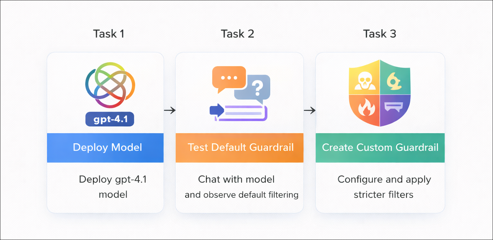
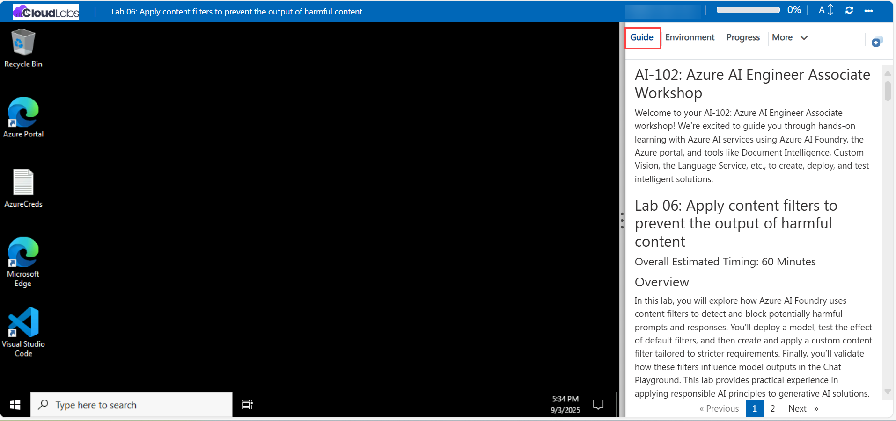

# AI-102: Azure AI Engineer Associate Workshop

Welcome to your AI-102: Azure AI Engineer Associate workshop! We’re excited to guide you through hands-on learning with Azure AI services using Azure AI Foundry, the Azure portal, and tools like Document Intelligence, Custom Vision, the Language Service, etc., to create, deploy, and test intelligent solutions.

# Lab 05: Apply content filters to prevent the output of harmful content

### Overall Estimated Timing: 60 Minutes

## Overview

In this lab, you will learn how to apply guardrails (content filters) to control and prevent harmful outputs in generative AI applications using Microsoft Foundry. You will begin by creating a project and deploying the gpt-4.1 model, then test the default guardrails in the Chat Playground using various prompts. Next, you will create and apply custom guardrails with stricter filtering thresholds for categories such as hate, violence, sexual content, and self-harm, and validate how these safeguards manage unsafe content.

## Objectives

By the end of this lab, you will be able to:

1. **Create a Microsoft Foundry project and deploy a model:** Create a new project, deploy the gpt-4.1 model, and prepare it for testing in the Chat Playground.
2. **Test default guardrails:** Interact with your deployed model to see how harmful inputs and outputs are identified and blocked.
3. **Create and apply custom guardrails:** Configure stricter filtering thresholds for categories like hate, violence, sexual content, and self-harm, and apply them to the model.

## Pre-requisites

- Basic knowledge of navigating the Azure portal.

- Familiarity with responsible AI concepts such as harmful content filtering.

- An active Azure subscription with access to Azure AI Foundry.

## Architecture

The lab architecture demonstrates how Microsoft Foundry enables safe and responsible generative AI usage through guardrails:

1. **Microsoft Foundry Project:** A workspace where you create and manage your project, deploy the **gpt-4.1** model, and configure guardrails for content filtering.

2. **Model Deployment (gpt-4.1):** The deployed model used to generate responses in the Chat Playground, with default and custom guardrails applied to control outputs.

3. **Guardrails (Content Filters):** Configurable safety controls that filter harmful content across categories like hate, violence, sexual content, and self-harm, ensuring responsible AI behavior.

4. **Chat Playground:** An interactive environment to test prompts, observe how guardrails affect responses, and validate the effectiveness of default and custom filters.

## Architecture Diagram

## Explanation of Components

1. **Microsoft Foundry Project:** The central workspace where you create and manage your project, deploy the **gpt-4.1** model, and configure guardrails for content filtering.

2. **Deployed Model (gpt-4.1):** The generative AI model that processes user prompts and generates responses, which are then evaluated against applied guardrails.

3. **Guardrails (Content Filters):** Safety mechanisms that detect and restrict harmful content across categories such as hate, violence, sexual content, and self-harm based on defined thresholds.

4. **Chat Playground:** An interactive environment used to test prompts, observe model behavior, and validate how default and custom guardrails handle safe and unsafe inputs.

# Getting Started with lab

Welcome to your AI-102: Azure AI Engineer Associate workshop! We’ve prepared an interactive environment for you to explore generative AI concepts and work with Microsoft Azure services like Microsoft Foundry, Document Intelligence, Custom Vision, Language Service, etc. Let’s get started and make the most of this hands-on experience.

## Accessing Your Lab Environment
 
Once you're ready to dive in, your virtual machine and **Guide** will be right at your fingertips within your web browser.
 

### Virtual Machine & Lab Guide
 
Your virtual machine is your workhorse throughout the workshop. The lab guide is your roadmap to success.

## Exploring Your Lab Resources
 
To get a better understanding of your lab resources and credentials, navigate to the **Environment** tab.
 

## Managing Your Virtual Machine
 
Feel free to **Start, Restart, or Stop (2)** your virtual machine as needed from the **Resources (1)** tab. Your experience is in your hands!
 

## Lab Progress

You can use the **Progress** tab to track your progress while working on the lab. A score will be provided after successful validation.

## Utilizing the Split Window Feature
 
For convenience, you can open the lab guide in a separate window by selecting the **Split Window** button from the top right corner.
 

## Lab Guide Zoom In/Zoom Out
 
To adjust the zoom level for the environment page, click the **A↕: 100%** icon located next to the timer in the lab environment.

## Let's Get Started with Azure Portal
 
1. On your virtual machine, click on the Azure Portal icon as shown below:
 
   

1. In sign-in window, kindly sign in using the provided Azure credentials

    - **Email/Username:** <inject key="AzureAdUserEmail"></inject>

        

    - **Password:** <inject key="AzureAdUserPassword"></inject>

        

1. If prompted to **Stay signed in?**, you can click **No**.

    

1. If a **Welcome to Microsoft Azure** pop-up window appears, simply click **Maybe later** to skip the tour.

    

## Support Contact
 
The CloudLabs support team is available 24/7, 365 days a year, via email and live chat to ensure seamless assistance at any time. We offer dedicated support channels explicitly tailored for both learners and instructors, ensuring that all your needs are promptly and efficiently addressed.
 
Learner Support Contacts:
 
- Email Support: cloudlabs-support@spektrasystems.com
- Live Chat Support: https://cloudlabs.ai/labs-support

Click on **Next** from the lower right corner to move on to the next page.

   

## Happy Learning !!