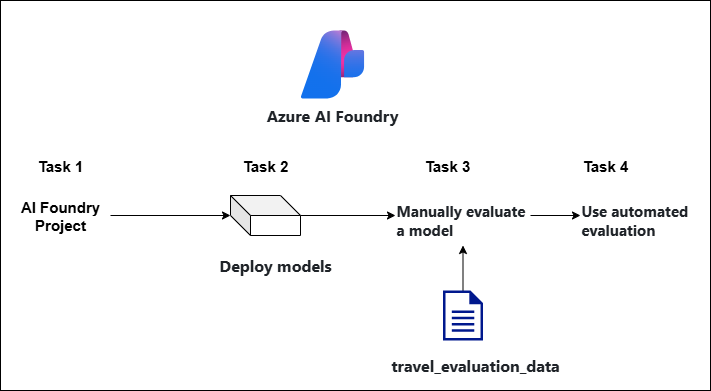
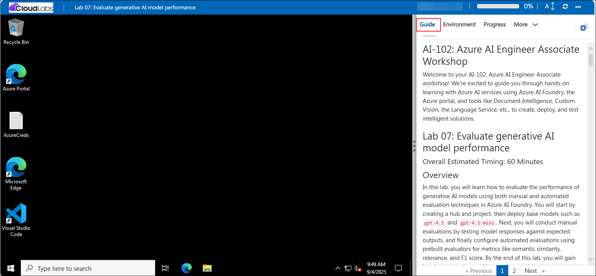

# AI-102: Azure AI Engineer Associate Workshop

Welcome to your AI-102: Azure AI Engineer Associate workshop! We’re excited to guide you through hands-on learning with Azure AI services using Azure AI Foundry, the Azure portal, and tools like Document Intelligence, Custom Vision, the Language Service, etc., to create, deploy, and test intelligent solutions.

# Lab 07: Evaluate generative AI model performance

### Overall Estimated Timing: 60 Minutes

## Overview

In this lab, you will learn how to evaluate the performance of generative AI models using both manual and automated evaluation techniques in Azure AI Foundry. You will start by creating a hub and project, then deploy base models such as `gpt-4.1` and `gpt-4.1-mini`. Next, you will conduct manual evaluations by testing model responses against expected outputs, and finally configure automated evaluations using prebuilt evaluators for metrics like semantic similarity, relevance, and F1 score. By the end of this lab, you will gain hands-on experience with assessing model accuracy, reliability, and fairness using standardized evaluation workflows in Azure AI Foundry.

## Objectives

By the end of this lab, you will be able to:

1. **Create an Azure AI Foundry project**: Set up a new project environment to build and manage prompt flows.
2. **Deploy models:** Deploy the gpt-4.1 and gpt-4.1-mini models within the project for evaluation.
3. **Perform manual evaluation:** Use a dataset of travel-related queries to test model accuracy and score outputs against expected responses.
4. **Run automated evaluations:** Apply evaluators to measure semantic similarity, relevance, F1 score, and fairness for standardized model assessment.

## Pre-requisites

- Familiarity with AI concepts such as model evaluation and performance metrics.

- An active Azure subscription with access to Azure AI Foundry.

## Architecture

1. **Azure AI Foundry Resource**: Provisioned via the Azure portal, this resource connects to Azure AI services, manages access via system-assigned identities, and hosts deployed models such as **gpt-4.1** and **gpt-4.1-mini**.

2. **Azure AI Foundry Project**: A workspace for deploying and managing models, configuring project settings, creating prompt flows, and accessing endpoints and authorization keys for applications.

3. **Evaluation Dataset:** A JSONL file with travel-related questions and expected answers, used to validate model outputs.

4. **Evaluation Workflows:** Manual evaluations capture human scoring, while automated evaluations apply semantic similarity, relevance, F1 score, and fairness checks.

## Architecture Diagram

## Explanation of Components

1. **Azure AI Foundry Project:** You create a hub and project that act as the workspace to deploy models, upload datasets, and run evaluations.

2. **Deployed Models (gpt-4.1 and gpt-4.1-mini):** You deploy the gpt-4.1 model to generate AI-assisted evaluation metrics, and the gpt-4.1-mini model to test performance against sample queries.

3. **Manual Evaluation Module:** You run test queries against the gpt-4.1-mini model, compare its responses with the expected answers, and score results manually using thumbs up/down.

4. **Automated Evaluation:** Built-in evaluators (semantic similarity, relevance, F1 score, fairness) automatically score the model outputs, enabling scalable and standardized assessment.

# Getting Started with lab

Welcome to your AI-102: Azure AI Engineer Associate workshop! We’ve prepared an interactive environment for you to explore generative AI concepts and work with Microsoft Azure services like Azure AI Foundry, Document Intelligence, Custom Vision, Language Service etc. Let’s get started and make the most of this hands-on experience.

## Accessing Your Lab Environment
 
Once you're ready to dive in, your virtual machine and **Guide** will be right at your fingertips within your web browser.
 

### Virtual Machine & Lab Guide
 
Your virtual machine is your workhorse throughout the workshop. The lab guide is your roadmap to success.

## Exploring Your Lab Resources
 
To get a better understanding of your lab resources and credentials, navigate to the **Environment** tab.
 

## Managing Your Virtual Machine
 
Feel free to **Start, Restart, or Stop (2)** your virtual machine as needed from the **Resources (1)** tab. Your experience is in your hands!
 

## Lab Progress

You can use the **Progress** tab to track your progress while working on the lab. A score will be provided after successful validation.

## Utilizing the Split Window Feature
 
For convenience, you can open the lab guide in a separate window by selecting the **Split Window** button from the top right corner.
 

## Lab Guide Zoom In/Zoom Out
 
To adjust the zoom level for the environment page, click the **A↕: 100%** icon located next to the timer in the lab environment.

## Let's Get Started with Azure Portal
 
1. On your virtual machine, click on the Azure Portal icon as shown below:
 
   

1. In sign-in window, kindly sign in using the provided Azure credentials

    - **Email/Username:** <inject key="AzureAdUserEmail"></inject>

        

    - **Password:** <inject key="AzureAdUserPassword"></inject>

        

1. If prompted to **Stay signed in?**, you can click **No**.

    

1. If a **Welcome to Microsoft Azure** pop-up window appears, simply click **Cancel** to skip the tour.

    

## Support Contact
 
The CloudLabs support team is available 24/7, 365 days a year, via email and live chat to ensure seamless assistance at any time. We offer dedicated support channels explicitly tailored for both learners and instructors, ensuring that all your needs are promptly and efficiently addressed.
 
Learner Support Contacts:
 
- Email Support: cloudlabs-support@spektrasystems.com
- Live Chat Support: https://cloudlabs.ai/labs-support

Click on **Next** from the lower right corner to move on to the next page.

   

## Happy Learning !!