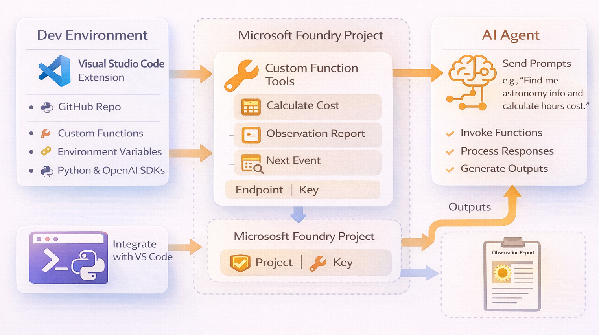
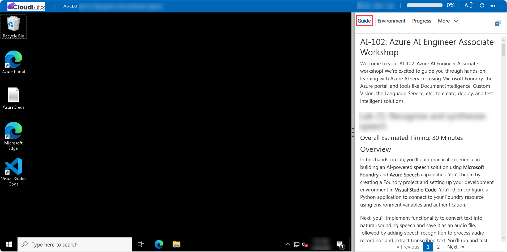

# AI-102: Azure AI Engineer Associate Workshop

Welcome to your AI-102: Azure AI Engineer Associate workshop! We’re excited to guide you through hands-on learning with Azure AI services using Microsoft Foundry, the Azure portal, and tools like Document Intelligence, Custom Vision, the Language Service, etc., to create, deploy, and test intelligent solutions.

# Lab 10: Use a custom function in an AI agent

### Overall Estimated Duration: 1 Hour

## Overview

In this lab, you will use Microsoft Foundry to create a project, deploy the GPT-4.1 model, and extend it with custom Python-based function tools. You’ll set up your development environment in Visual Studio Code, implement functions for retrieving event data, calculating costs, and generating reports, and integrate them into an AI agent. Finally, you’ll build and run the agent application to see how it intelligently invokes these functions during conversations, enabling dynamic, real-world task automation.

## Objectives

By the end of this lab, you will be able to:

1. **Set up and configure a Microsoft Foundry project:** Sign in to Azure, create a project, and deploy the gpt-4.1 model for use within an AI agent solution.

2. **Develop and register custom function tools:** Implement Python-based functions (such as retrieving event data, calculating costs, and generating reports) and define them as tools the agent can invoke.

3. **Build and run an AI agent with function integration:** Connect your application to the Foundry project, integrate function tools into an agent, and execute it to handle user prompts with dynamic function calls.

## Pre-requisites

* Basic familiarity with Visual Studio Code and installing extensions.
* Understanding of Azure fundamentals, including signing in and working with resource groups.
* Familiarity with Azure AI Foundry concepts such as projects, model deployments, and agents.
* An active Azure subscription with access to **Microsoft Foundry**.
* Basic knowledge of Python programming, including virtual environments and running scripts.
* Basic understanding of JSON and how functions can be defined and invoked within applications.

## Architecture

1. **Microsoft Foundry Resource**: The core service that provides access to model deployments, agent capabilities, and integration with custom function tools used by the AI agent.

2. **Microsoft Foundry Project**: A workspace where the gpt-4.1 model is deployed and managed, serving as the central environment for building and running the agent solution.

3. **Agent + Python Client**: An AI agent configured with gpt-4.1 and registered function tools (event lookup, cost calculation, report generation). A Python application connects to the project endpoint, manages the conversation flow, executes function calls, and processes responses dynamically.

## Architecture Diagram

## Explanation of Components

1. **Microsoft Foundry Project**: The workspace that hosts your gpt-4.1 model deployment and agent configuration; it provides the project endpoint that your Python application uses to connect and interact with the agent.

2. **Model Deployment (gpt-4.1)**: The deployed large language model within the Foundry project that processes user prompts, enables reasoning, and supports function calling through the agent.

3. **AI Agent**: A configured agent with instructions and registered function tools; it manages the conversation, determines when to invoke functions, and combines tool outputs with model responses.

4. **Custom Function Tools (Python)**: User-defined Python functions (such as retrieving astronomical events, calculating observation costs, and generating reports) that are exposed to the agent via JSON schemas and invoked dynamically during conversations.

5. **Python Client Application**: The local script that connects to the Foundry project endpoint, sends user prompts, handles agent responses and function calls, maintains conversation flow, outputs results, and performs cleanup (like deleting the agent after execution).

# Getting Started with lab

Welcome to your AI-102: Azure AI Engineer Associate workshop! We’ve prepared an interactive environment for you to explore generative AI concepts and work with Microsoft Azure services like Microsoft Foundry, Document Intelligence, Custom Vision, Language Service etc. Let’s get started and make the most of this hands-on experience.

## Accessing Your Lab Environment
 
Once you're ready to dive in, your virtual machine and **Guide** will be right at your fingertips within your web browser.
 

### Virtual Machine & Lab Guide
 
Your virtual machine is your workhorse throughout the workshop. The lab guide is your roadmap to success.

## Exploring Your Lab Resources
 
To get a better understanding of your lab resources and credentials, navigate to the **Environment** tab.
 

## Managing Your Virtual Machine
 
Feel free to **Start, Restart, or Stop (2)** your virtual machine as needed from the **Resources (1)** tab. Your experience is in your hands!
 

## Lab Progress

You can use the **Progress** tab to track your progress while working on the lab. A score will be provided after successful validation.

## Utilizing the Split Window Feature
 
For convenience, you can open the lab guide in a separate window by selecting the **Split Window** button from the top right corner.
 

## Lab Guide Zoom In/Zoom Out
 
To adjust the zoom level for the environment page, click the **A↕: 100%** icon located next to the timer in the lab environment.

## Let's Get Started with Azure Portal
 
1. On your virtual machine, click on the Azure Portal icon as shown below:
 
   

1. In sign-in window, kindly sign in using the provided Azure credentials

    - **Email/Username:** <inject key="AzureAdUserEmail"></inject>

        

    - **Password:** <inject key="AzureAdUserPassword"></inject>

        

1. If prompted to **Stay signed in?**, you can click **No**.

    

1. If a **Welcome to Microsoft Azure** pop-up window appears, simply click **Maybe later** to skip the tour.

    

## Support Contact
 
The CloudLabs support team is available 24/7, 365 days a year, via email and live chat to ensure seamless assistance at any time. We offer dedicated support channels explicitly tailored for both learners and instructors, ensuring that all your needs are promptly and efficiently addressed.
 
Learner Support Contacts:
 
- Email Support: cloudlabs-support@spektrasystems.com
- Live Chat Support: https://cloudlabs.ai/labs-support

Click on **Next** from the lower right corner to move on to the next page.

   

## Happy Learning !!

