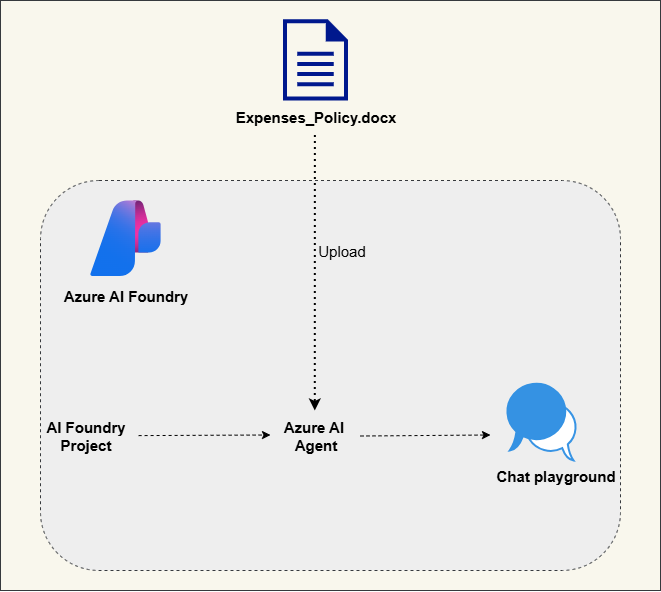
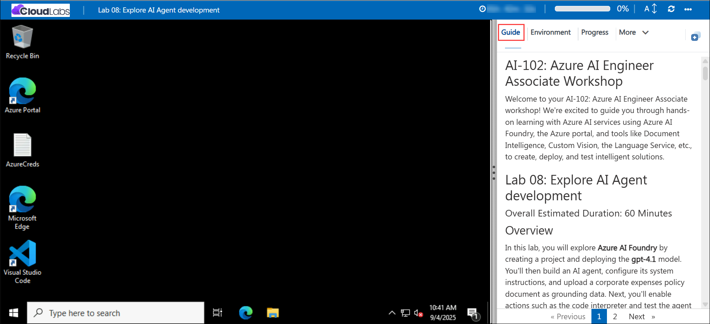

# AI-102: Azure AI Engineer Associate Workshop

Welcome to your AI-102: Azure AI Engineer Associate workshop! We’re excited to guide you through hands-on learning with Azure AI services using Azure AI Foundry, the Azure portal, and tools like Document Intelligence, Custom Vision, the Language Service, etc., to create, deploy, and test intelligent solutions.

# Lab 09: Develop an AI agent

### Overall Estimated Duration: 60 Minutes

## Overview

In this lab, you will use Azure AI Foundry to create a project, deploy the gpt-4.1 model, and extend it with custom function tools. You’ll develop functions in Azure Cloud Shell (like generating and saving support tickets) and make them available to your agent. Finally, you’ll build and run an AI agent that can call these functions during a live chat, manage conversation history, and clean up resources. This lab shows how to move beyond simple chat into real-world automation with intelligent agents.

## Objectives

By the end of this lab, you will be able to:

1. **Create and deploy an Azure AI Foundry project:** Set up a workspace, deploy the gpt-4.1 model, and prepare it for integration with an agent.

2. **Develop and configure custom function tools:** Build functions such as generating support tickets and register them for agent use.

3. **Build and run an AI agent with custom functions:** Integrate the tools into an agent, interact with it in a live chat, and validate function calls with conversation history.

## Pre-requisites

* Basic knowledge of the Azure portal.
* Familiarity with AI concepts such as creating projects, deploying models, building agents, and managing them in Azure AI Foundry.
* An active Azure subscription with access to **Azure AI Foundry**.
* Basic knowledge of Python programming.

## Architecture

1. **Azure AI Foundry Resource**: The core Azure service that provides access to model deployments, agent capabilities, and extensions such as function tools.

2. **Azure AI Foundry Project**: A workspace where the gpt-4.1 model is deployed and managed, serving as the base for your agent solution.

3. **Agent + Client:** Configure an AI agent to use gpt-4.1 and auto-invoke your registered functions during chat; a Python script connects to the project endpoint, runs the conversation, logs history, and saves ticket files.

## Architecture Diagram

## Explanation of Components

1. **Azure AI Foundry Project**: The main workspace where you create and manage AI agents. It serves as the hub for deploying models, configuring agent instructions, uploading grounding data, and controlling access to resources.

2. **Deployed Model (gpt-4.1)**: The AI model used by your agent to generate responses. It is hosted within the Foundry project and accessed via endpoints to process queries and perform tasks.

3. **AI Agent**: A configurable assistant that leverages the deployed model and grounding data to answer questions, perform actions (like generating expense claim files or analyzing data), and interact with users based on system instructions.

4. **Grounding Data / Knowledge Base**: Documents or files uploaded to the agent (e.g., the corporate expenses policy or data.txt) that provide factual context for the agent’s responses and actions.

5. **Code Interpreter / Actions**: Tools enabled for the agent to perform programmatic tasks, such as uploading data, generating outputs, performing calculations, or creating visualizations.

6. **Client Application**: A Python-based application that connects to the Azure AI Foundry project endpoint, sends prompts to the agent, receives responses, and handles interactive conversations programmatically.

7. **Agents Playground**: An interactive interface within the Foundry project where you can test the agent, run queries, validate behavior, and review outputs before integrating it into real-world workflows.

# Getting Started with lab

Welcome to your AI-102: Azure AI Engineer Associate workshop! We’ve prepared an interactive environment for you to explore generative AI concepts and work with Microsoft Azure services like Azure AI Foundry, Document Intelligence, Custom Vision, Language Service etc. Let’s get started and make the most of this hands-on experience.

## Accessing Your Lab Environment
 
Once you're ready to dive in, your virtual machine and **lab guide** will be right at your fingertips within your web browser.
 

### Virtual Machine & Lab Guide
 
Your virtual machine is your workhorse throughout the workshop. The lab guide is your roadmap to success.

## Exploring Your Lab Resources
 
To get a better understanding of your lab resources and credentials, navigate to the **Environment** tab.
 

## Managing Your Virtual Machine
 
Feel free to **Start, Restart, or Stop (2)** your virtual machine as needed from the **Resources (1)** tab. Your experience is in your hands!
 

## Lab Progress

You can use the **Progress** tab to track your progress while working on the lab. A score will be provided after successful validation.

## Utilizing the Split Window Feature
 
For convenience, you can open the lab guide in a separate window by selecting the **Split Window** button from the top right corner.
 

## Lab Guide Zoom In/Zoom Out
 
To adjust the zoom level for the environment page, click the **A↕: 100%** icon located next to the timer in the lab environment.

## Let's Get Started with Azure Portal
 
1. On your virtual machine, click on the Azure Portal icon as shown below:
 
   

1. In sign-in window, kindly sign in using the provided Azure credentials

    - **Email/Username:** <inject key="AzureAdUserEmail"></inject>

        

    - **Password:** <inject key="AzureAdUserPassword"></inject>

        

1. If prompted to **Stay signed in?**, you can click **No**.

    

1. If a **Welcome to Microsoft Azure** pop-up window appears, simply click **Cancel** to skip the tour.

    

## Support Contact
 
The CloudLabs support team is available 24/7, 365 days a year, via email and live chat to ensure seamless assistance at any time. We offer dedicated support channels explicitly tailored for both learners and instructors, ensuring that all your needs are promptly and efficiently addressed.
 
Learner Support Contacts:
 
- Email Support: cloudlabs-support@spektrasystems.com
- Live Chat Support: https://cloudlabs.ai/labs-support

Click on **Next** from the lower right corner to move on to the next page.

   

## Happy Learning !!

