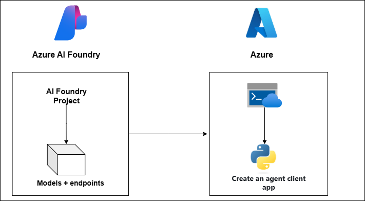
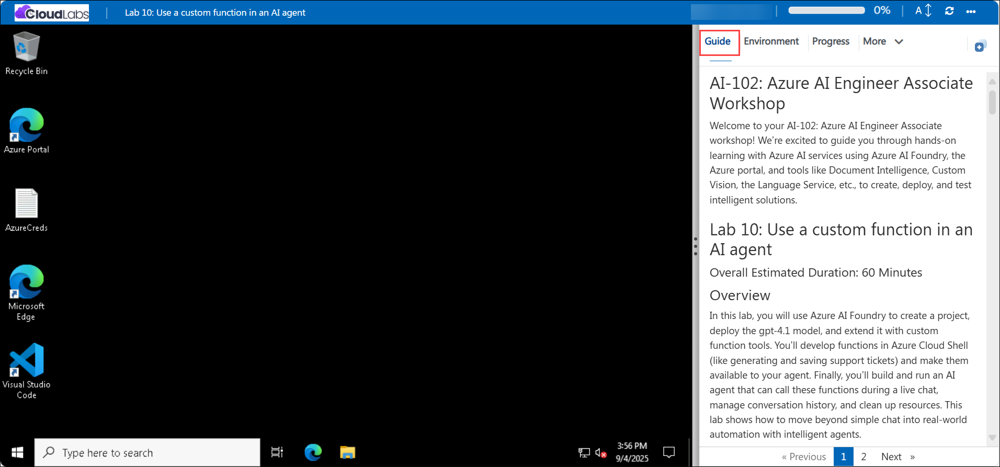

# AI-102: Azure AI Engineer Associate Workshop

Welcome to your AI-102: Azure AI Engineer Associate workshop! We’re excited to guide you through hands-on learning with Azure AI services using Azure AI Foundry, the Azure portal, and tools like Document Intelligence, Custom Vision, the Language Service, etc., to create, deploy, and test intelligent solutions.

# Lab 11: Develop an Azure AI agent with the Semantic Kernel SDK

### Overall Estimated Duration: 60 Minutes

## Overview

In this lab, you will prepare your environment to build and run an Azure AI agent with the Semantic Kernel SDK. You will create an Azure AI Foundry project, deploy the gpt-4.1 model, and record the project endpoint and deployment name for use in code. You will then set up Azure Cloud Shell, clone the sample repository, and configure application settings. By the end, your workspace, model deployment, and tools will be ready so you can implement and test the agent.

## Objectives

By the end of this lab, you will be able to:

1. **Deploy an Azure AI model:** Create a project in Azure AI Foundry and deploy the gpt-4.1 model with customized settings.

2. **Build an agent application:** Set up a Python client app using the Semantic Kernel SDK to process expense claims.

3. **Configure and extend the app:** Connect the application to your project endpoint and model deployment using environment variables, and implement a Semantic Kernel plugin to simulate sending expense-claim emails.

4. **Run and validate the agent:** Authenticate with Azure, execute the agent against expense data, and confirm the structured response and simulated email output.

## Pre-requisites

* Basic knowledge of the Azure portal.
* Familiarity with the Semantic Kernel SDK concepts such as plugins and orchestration.
* An active Azure subscription with access to **Azure AI Foundry**.
* Basic knowledge of Python programming.

## Architecture

The lab architecture demonstrates how a Semantic Kernel based agent is deployed and executed inside an Azure AI Foundry project:

1. **Azure AI Foundry Project**: Provides the environment to deploy the gpt-4.1 model, host the project endpoint, and manage agent experiments.

2. **Model Deployment (gpt-4.1):** The large language model endpoint used by the agent to interpret expense data, generate structured claims, and provide responses.

3. **Semantic Kernel Agent with Plugin:** An agent created in Python using the Semantic Kernel SDK, extended with a custom EmailPlugin that simulates sending expense-claim emails.

4. **Client Application (Python in Cloud Shell):** A script that connects to the Foundry project, loads expense data, and runs the agent, producing structured output and simulated email results.

## Architecture Diagram

## Explanation of Components

1. **Azure AI Foundry Project**: Central workspace that hosts the gpt-4.1 deployment, exposes the Project Endpoint, and tracks deployments and experiments your client app connects.

2. **Model Deployment (gpt-4.1)**:The language model endpoint used by the agent to analyze expense data and generate structured claims.

3. **Semantic Kernel Agent with Plugin:** The Python agent defined with Semantic Kernel SDK, extended with a custom EmailPlugin to simulate sending expense-claim emails.

4. **Azure Identity & Client App:** A Python script running in Cloud Shell, authenticated with DefaultAzureCredential, that loads expense data, calls the agent, and displays results.

5. **Expense Data Input:** Sample file containing expenses, used by the agent to build and output the structured claim for validation.

# Getting Started with lab

Welcome to your AI-102: Azure AI Engineer Associate workshop! We’ve prepared an interactive environment for you to explore generative AI concepts and work with Microsoft Azure services like Azure AI Foundry, Document Intelligence, Custom Vision, Language Service etc. Let’s get started and make the most of this hands-on experience.

## Accessing Your Lab Environment
 
Once you're ready to dive in, your virtual machine and **Guide** will be right at your fingertips within your web browser.
 

### Virtual Machine & Lab Guide
 
Your virtual machine is your workhorse throughout the workshop. The lab guide is your roadmap to success.

## Exploring Your Lab Resources
 
To get a better understanding of your lab resources and credentials, navigate to the **Environment** tab.
 

## Managing Your Virtual Machine
 
Feel free to **Start, Restart, or Stop (2)** your virtual machine as needed from the **Resources (1)** tab. Your experience is in your hands!
 

## Lab Progress

You can use the **Progress** tab to track your progress while working on the lab. A score will be provided after successful validation.

## Utilizing the Split Window Feature
 
For convenience, you can open the lab guide in a separate window by selecting the **Split Window** button from the top right corner.
 

## Lab Guide Zoom In/Zoom Out
 
To adjust the zoom level for the environment page, click the **A↕: 100%** icon located next to the timer in the lab environment.

## Let's Get Started with Azure Portal
 
1. On your virtual machine, click on the Azure Portal icon as shown below:
 
   

1. In sign-in window, kindly sign in using the provided Azure credentials

    - **Email/Username:** <inject key="AzureAdUserEmail"></inject>

        

    - **Password:** <inject key="AzureAdUserPassword"></inject>

        

1. If prompted to **Stay signed in?**, you can click **No**.

    

1. If a **Welcome to Microsoft Azure** pop-up window appears, simply click **Cancel** to skip the tour.

    

## Support Contact
 
The CloudLabs support team is available 24/7, 365 days a year, via email and live chat to ensure seamless assistance at any time. We offer dedicated support channels explicitly tailored for both learners and instructors, ensuring that all your needs are promptly and efficiently addressed.
 
Learner Support Contacts:
 
- Email Support: cloudlabs-support@spektrasystems.com
- Live Chat Support: https://cloudlabs.ai/labs-support

Click on **Next** from the lower right corner to move on to the next page.

   

## Happy Learning !!