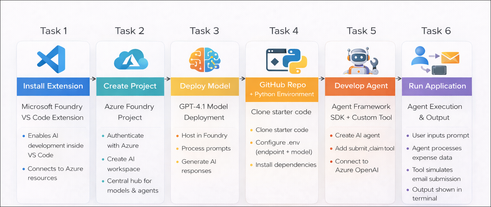
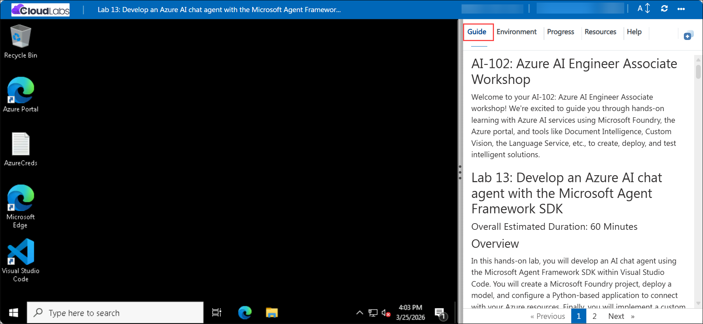

# AI-102: Azure AI Engineer Associate Workshop

Welcome to your AI-102: Azure AI Engineer Associate workshop! We’re excited to guide you through hands-on learning with Azure AI services using Microsoft Foundry, the Azure portal, and tools like Document Intelligence, Custom Vision, the Language Service, etc., to create, deploy, and test intelligent solutions.

# Lab 13: Develop an Azure AI chat agent with the Microsoft Agent Framework SDK

### Overall Estimated Duration: 60 Minutes

## Overview

In this hands-on lab, you will develop an AI chat agent using the Microsoft Agent Framework SDK within Visual Studio Code. You will create a Microsoft Foundry project, deploy a model, and configure a Python-based application to connect with your Azure resources. Finally, you will implement a custom tool to process expense data, run the agent, and validate its ability to generate and simulate expense claim submissions.

## Objectives

By the end of this lab, you will be able to:

1. **Set up the Microsoft Foundry development environment:** Install and configure the Microsoft Foundry extension in Visual Studio Code and sign in to Azure.

2. **Deploy a foundation model:** Deploy the *gpt-4.1* model in your Foundry project and configure it for use with an AI agent.

3. **Build an AI agent using the Microsoft Agent Framework SDK:** Create and configure an AI chat agent with custom instructions to process expense data.

4. **Implement and integrate a custom tool:** Develop a tool function to simulate expense claim submission and connect it to the agent for task execution.

5. **Run and validate the agent application:** Execute the Python application, interact with the agent, and verify its ability to generate responses and process expense claims.

## Pre-requisites

* Basic knowledge of the Azure portal.
* Understanding of AI agent concepts such as prompts, models, and tool-based interactions.
* Basic knowledge of Python programming.

## Architecture

The lab architecture demonstrates how a Semantic Kernel based agent is deployed and executed inside an Azure AI Foundry project:

1. **Microsoft Foundry Project and Model Deployment:** A project is created using Microsoft Foundry in Visual Studio Code, where the *gpt-4.1* model is deployed to power the AI agent’s responses.

2. **AI Agent Configuration using Agent Framework SDK:** An AI chat agent is configured in code using the Microsoft Agent Framework SDK, where system instructions define how the agent processes expense data and interacts with users.

3. **Custom Tool Integration:** A custom tool function is implemented and attached to the agent, enabling it to simulate expense claim submission by processing input data and performing actions.

4. **Agent Execution and Interaction Flow:** A Python application runs the agent, accepts user prompts, invokes the custom tool when required, and displays the generated responses in the terminal.

## Architecture Diagram

## Explanation of Components

1. **Microsoft Foundry Project:** The workspace created in Microsoft Foundry where you manage your AI resources, deploy the *gpt-4.1* model, and obtain the project endpoint used by the agent application.

2. **Model Deployment (gpt-4.1):** The language model deployed within the project that processes prompts, understands expense data, and generates intelligent responses for the agent.

3. **AI Agent with Custom Tool:** An AI chat agent built using the Microsoft Agent Framework SDK, configured with instructions and integrated with a custom tool to process expense claims and simulate email submission.

4. **Client Application (`agent-framework.py`):** A Python-based application that runs the agent, sends user prompts along with expense data, invokes the custom tool when required, and displays the generated responses.

# Getting Started with lab

Welcome to your AI-102: Azure AI Engineer Associate workshop! We’ve prepared an interactive environment for you to explore generative AI concepts and work with Microsoft Azure services like Microsoft Foundry, Document Intelligence, Custom Vision, Language Service, etc. Let’s get started and make the most of this hands-on experience.

## Accessing Your Lab Environment
 
Once you're ready to dive in, your virtual machine and **Guide** will be right at your fingertips within your web browser.
 

### Virtual Machine & Lab Guide
 
Your virtual machine is your workhorse throughout the workshop. The lab guide is your roadmap to success.

## Exploring Your Lab Resources
 
To get a better understanding of your lab resources and credentials, navigate to the **Environment** tab.
 

## Managing Your Virtual Machine
 
Feel free to **Start, Restart, or Stop (2)** your virtual machine as needed from the **Resources (1)** tab. Your experience is in your hands!
 

## Lab Progress

You can use the **Progress** tab to track your progress while working on the lab. A score will be provided after successful validation.

## Utilizing the Split Window Feature
 
For convenience, you can open the lab guide in a separate window by selecting the **Split Window** button from the top right corner.
 

## Lab Guide Zoom In/Zoom Out
 
To adjust the zoom level for the environment page, click the **A↕: 100%** icon located next to the timer in the lab environment.

## Let's Get Started with Azure Portal
 
1. On your virtual machine, click on the Azure Portal icon as shown below:
 
   

1. In sign-in window, kindly sign in using the provided Azure credentials

    - **Email/Username:** <inject key="AzureAdUserEmail"></inject>

        

    - **Password:** <inject key="AzureAdUserPassword"></inject>

        

1. If prompted to **Stay signed in?**, you can click **No**.

    

1. If a **Welcome to Microsoft Azure** pop-up window appears, simply click **Maybe later** to skip the tour.

    

## Support Contact
 
The CloudLabs support team is available 24/7, 365 days a year, via email and live chat to ensure seamless assistance at any time. We offer dedicated support channels explicitly tailored for both learners and instructors, ensuring that all your needs are promptly and efficiently addressed.
 
Learner Support Contacts:
 
- Email Support: cloudlabs-support@spektrasystems.com
- Live Chat Support: https://cloudlabs.ai/labs-support

Click on **Next** from the lower right corner to move on to the next page.

   

## Happy Learning !!