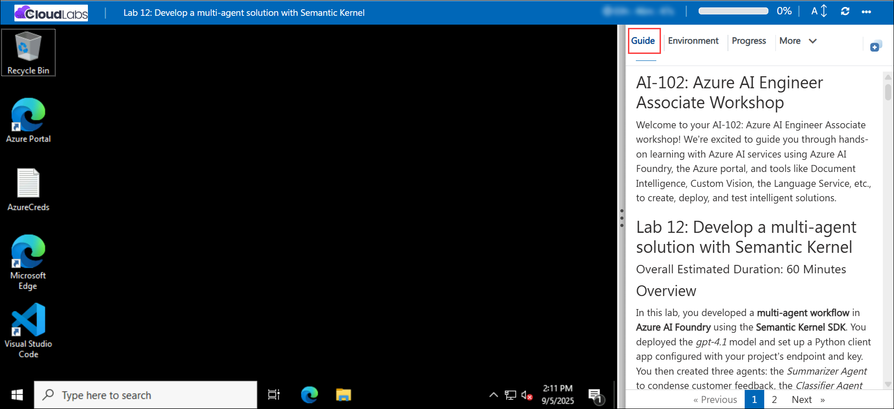

# AI-102: Azure AI Engineer Associate Workshop

Welcome to your AI-102: Azure AI Engineer Associate workshop! We’re excited to guide you through hands-on learning with Azure AI services using Azure AI Foundry, the Azure portal, and tools like Document Intelligence, Custom Vision, the Language Service, etc., to create, deploy, and test intelligent solutions.

# Lab 12: Develop a multi-agent solution with Semantic Kernel

### Overall Estimated Duration: 60 Minutes

## Overview

In this hands-on lab, you’ll gain practical experience in building a multi-agent workflow using **Azure AI Foundry** and the **Semantic Kernel SDK**. You’ll start by deploying the **gpt-4.1** model and configuring a Python client application with your project’s endpoint and key. Next, you’ll create three agents: a **Summarizer Agent** to condense customer feedback, a **Classifier Agent** to evaluate sentiment, and an **Action Agent** to recommend next steps. You’ll then define a sequential orchestration so each agent’s output flows into the next, and run the workflow in **Azure Cloud Shell**. By the end of this lab, you’ll be confident in designing and testing a multi-agent system where specialized agents collaborate to analyze, classify, and generate actionable insights from customer feedback.

## Objectives

1. **Deploy and configure a model in Azure AI Foundry**: Set up a project using the *gpt-4.1* model and capture its endpoint and key for client integration.
2. **Create AI agents with the Semantic Kernel SDK**: Implement a *Summarizer Agent*, *Classifier Agent*, and *Action Agent* to process customer feedback.
3. **Build a sequential orchestration**: Configure the agents to work in order so that summaries, classifications, and actions flow together logically.
4. **Run and test the multi-agent workflow**: Execute the solution in Cloud Shell with different feedback inputs and observe how the agents collaborate.
5. **Validate outputs**: Confirm that the agents accurately summarize, classify, and recommend actions based on customer feedback.

## Pre-requisites

* Basic understanding of AI agents and their roles in collaborative problem-solving.
* Familiarity with the **Semantic Kernel SDK** concepts, including agents, orchestrations, and connectors.
* Experience with the **Azure portal** and navigating **Azure AI Foundry**.
* An active Azure subscription with access to **Azure AI Foundry**.
* Permissions to create and manage resources within the assigned resource group (for example, Azure AI User role).
* Basic knowledge of Python and working in **Cloud Shell** or similar terminal environments.

## Architecture

The lab architecture demonstrates how three AI agents collaborate using the **Semantic Kernel SDK** inside an Azure AI Foundry project:

1. **Azure AI Foundry Project**: The central workspace that hosts the deployed *gpt-4.1* model and provides endpoints and API keys for the Semantic Kernel–based agents.
2. **Summarizer Agent**: Condenses customer feedback into a concise summary, extracting the key points while keeping the tone neutral.
3. **Classifier Agent**: Categorizes the summarized feedback as **Positive**, **Negative**, or **Feature Request**, providing context for decision-making.
4. **Action Agent**: Suggests the next step or recommended action based on the summary and classification, such as logging feedback or escalating an issue.
5. **Sequential Orchestration**: Coordinates the workflow, ensuring that each agent runs in order and passes its output to the next agent.
6. **Final Output**: Displays the summarized feedback, classification, and recommended action, showing how the agents collaboratively analyze and act on customer input.

## Architecture Diagram

## Explanation of Components

1. **Azure AI Foundry Project**: Provides the environment to deploy the *gpt-4.1* model, configure Semantic Kernel agents, and manage API endpoints for the multi-agent workflow.

2. **Semantic Kernel SDK**: A framework used to build, orchestrate, and manage AI agents. It provides APIs for creating agents, defining sequential orchestrations, handling agent outputs, and connecting to Azure OpenAI services.

3. **Summarizer Agent**: Processes raw customer feedback and condenses it into a short, clear summary that captures the key points without bias.

4. **Classifier Agent**: Categorizes the summarized feedback into one of three classes — **Positive**, **Negative**, or **Feature Request** — to provide context for actionable decisions.

5. **Action Agent**: Suggests the next step based on the summary and classification, such as escalating an issue, logging positive feedback, or adding a feature request to the backlog.

6. **Sequential Orchestration**: Manages the execution order of agents, ensuring that each agent runs in sequence and passes its output to the next agent for processing.

7. **Task Input and Final Output**: The input is customer feedback text, and the output shows the summarized feedback, classification, and recommended action, demonstrating the collaboration and workflow of the multi-agent system.

# Getting Started with lab

Welcome to your AI-102: Azure AI Engineer Associate workshop! We’ve prepared an interactive environment for you to explore generative AI concepts and work with Microsoft Azure services like Azure AI Foundry, Document Intelligence, Custom Vision, Language Service, etc. Let’s get started and make the most of this hands-on experience.

## Accessing Your Lab Environment
 
Once you're ready to dive in, your virtual machine and **lab guide** will be right at your fingertips within your web browser.
 

### Virtual Machine & Lab Guide
 
Your virtual machine is your workhorse throughout the workshop. The lab guide is your roadmap to success.

## Exploring Your Lab Resources
 
To get a better understanding of your lab resources and credentials, navigate to the **Environment** tab.
 

## Managing Your Virtual Machine
 
Feel free to **Start, Restart, or Stop (2)** your virtual machine as needed from the **Resources (1)** tab. Your experience is in your hands!
 

## Lab Progress

You can use the **Progress** tab to track your progress while working on the lab. A score will be provided after successful validation.

## Utilizing the Split Window Feature
 
For convenience, you can open the lab guide in a separate window by selecting the **Split Window** button from the top right corner.
 

## Lab Guide Zoom In/Zoom Out
 
To adjust the zoom level for the environment page, click the **A↕: 100%** icon located next to the timer in the lab environment.

## Let's Get Started with Azure Portal
 
1. On your virtual machine, click on the Azure Portal icon as shown below:
 
   

1. In the sign-in window, kindly sign in using the provided Azure credentials

    - **Email/Username:** <inject key="AzureAdUserEmail"></inject>

        

    - **Password:** <inject key="AzureAdUserPassword"></inject>

        

1. If prompted to **Stay signed in?**, you can click **No**.

    

1. If a **Welcome to Microsoft Azure** pop-up window appears, simply click **Cancel** to skip the tour.

    

## Support Contact
 
The CloudLabs support team is available 24/7, 365 days a year, via email and live chat to ensure seamless assistance at any time. We offer dedicated support channels explicitly tailored for both learners and instructors, ensuring that all your needs are promptly and efficiently addressed.
 
Learner Support Contacts:
 
- Email Support: cloudlabs-support@spektrasystems.com
- Live Chat Support: https://cloudlabs.ai/labs-support

Click on **Next** from the lower right corner to move on to the next page.

   

## Happy Learning !!

