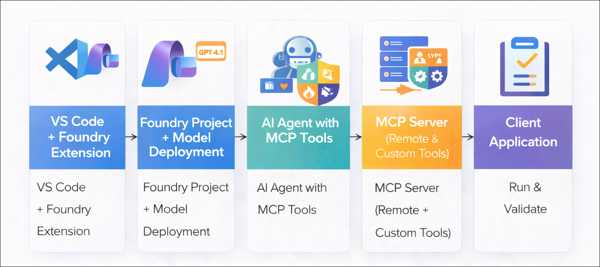
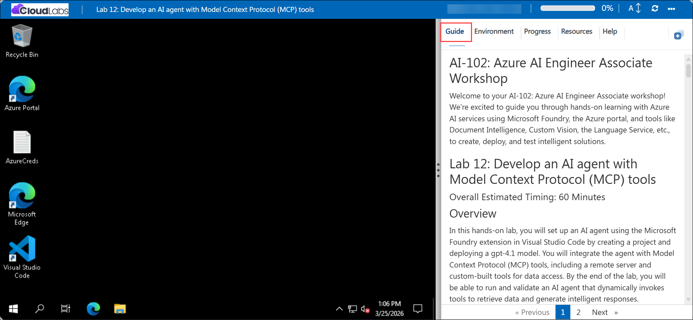

# Getting Started with your AI-102: Azure AI Engineer Associate Workshop

Welcome to your AI-102: Azure AI Engineer Associate workshop! We’re excited to guide you through hands-on learning with Azure AI services using Microsoft Foundry, the Azure portal, and tools like Document Intelligence, Custom Vision, the Language Service, etc., to create, deploy, and test intelligent solutions.

# Lab 12: Develop an AI agent with Model Context Protocol (MCP) tools

### Overall Estimated Timing: 60 Minutes

## Overview

In this hands-on lab, you will set up an AI agent using the Microsoft Foundry extension in Visual Studio Code by creating a project and deploying a gpt-4.1 model. You will integrate the agent with Model Context Protocol (MCP) tools, including a remote server and custom-built tools for data access. By the end of the lab, you will be able to run and validate an AI agent that dynamically invokes tools to retrieve data and generate intelligent responses.

## Objectives

By the end of this lab, you will be able to:

1. **Install and configure the Microsoft Foundry environment:** Set up the Microsoft Foundry extension in Visual Studio Code, sign in to Azure, and create a project for building AI agents.

2. **Deploy a foundation model:** Deploy the *gpt-4.1* model (or equivalent) in your Foundry project and configure it for agent-based interactions.

3. **Create and configure an AI agent with MCP tools:** Build an AI agent using the Foundry SDK, define instructions, and integrate it with Model Context Protocol (MCP) tools.

4. **Connect to a remote MCP server:** Enable the agent to retrieve real-time information by integrating with a remote MCP server hosted on Microsoft Learn.

5. **Develop and integrate custom MCP server tools:** Create a local MCP server with custom tools for inventory and sales operations, and connect it to the agent.

6. **Run and validate the AI agent application:** Execute the client application, test agent interactions, and verify dynamic tool invocation and context-aware responses.

## Pre-requisites

* Basic knowledge of the Azure portal.
* Understanding of AI agent concepts such as prompts, models, and agent workflows.
* Basic knowledge of Python programming.

## Architecture

The lab architecture demonstrates how an AI agent built using Microsoft Foundry integrates with Model Context Protocol (MCP) servers to access external data sources and custom tools:

1. **Microsoft Foundry Project and Deployed Model:** A project created using the Microsoft Foundry extension in Visual Studio Code, where the *gpt-4.1* model is deployed to process prompts and generate intelligent responses.

2. **AI Agent with MCP Integration:** An AI agent is configured with instructions and connected to MCP tools, enabling it to retrieve external information and perform tasks dynamically.

3. **Remote and Custom MCP Servers** The agent interacts with both a remote MCP server (for documentation access) and a custom MCP server (for inventory and sales tools).

4. **Client Application and Execution Flow:** A Python-based client manages communication between the agent and MCP servers, processes tool calls, and generates context-aware responses during execution.

## Architecture Diagram

## Explanation of Components

1. **Microsoft Foundry Project:** The workspace created in Microsoft Foundry where you manage resources, deploy models, and obtain the project endpoint used by agents and client applications.

2. **Model Deployment (gpt-4.1):** The language model deployed within the project that processes prompts, generates responses, and enables intelligent agent interactions.

3. **AI Agent with MCP Tools:** An AI agent configured with instructions and connected to MCP tools, allowing it to process prompts and dynamically interact with external data sources.

4. **Remote and Custom MCP Servers:** MCP servers that provide capabilities to the agent—remote servers for accessing real-time documentation and custom servers for executing domain-specific tools like inventory and sales operations.

5. **Client Application (agent.py / client.py):** A Python-based application that connects the agent with MCP servers, handles tool invocation, and manages the end-to-end interaction flow to generate context-aware responses.

## Accessing Your Lab Environment
 
Once you're ready to dive in, your virtual machine and **Guide** will be right at your fingertips within your web browser.
 

## Virtual Machine & Lab Guide
 
Your virtual machine is your workhorse throughout the workshop. The lab guide is your roadmap to success.

## Exploring Your Lab Resources
 
To get a better understanding of your lab resources and credentials, navigate to the **Environment** tab.
 

## Managing Your Virtual Machine
 
Feel free to **Start, Restart, or Stop (2)** your virtual machine as needed from the **Resources (1)** tab. Your experience is in your hands!
 

## Lab Progress

You can use the **Progress** tab to track your progress while working on the lab. A score will be provided after successful validation.

## Utilizing the Split Window Feature
 
For convenience, you can open the lab guide in a separate window by selecting the **Split Window** button from the top right corner.
 

## Lab Guide Zoom In/Zoom Out
 
To adjust the zoom level for the environment page, click the **A↕: 100%** icon located next to the timer in the lab environment.

## Let's Get Started with Azure Portal
 
1. On your virtual machine, click on the Azure Portal icon as shown below:
 
   

1. In the sign-in window, kindly sign in using the provided Azure credentials

    - **Email/Username:** <inject key="AzureAdUserEmail"></inject>

        

    - **Password:** <inject key="AzureAdUserPassword"></inject>

        

1. If prompted to **Stay signed in?**, you can click **No**.

    

1. If a **Welcome to Microsoft Azure** pop-up window appears, simply click **Maybe later** to skip the tour.

    

## Support Contact
 
The CloudLabs support team is available 24/7, 365 days a year, via email and live chat to ensure seamless assistance at any time. We offer dedicated support channels explicitly tailored for both learners and instructors, ensuring that all your needs are promptly and efficiently addressed.
 
Learner Support Contacts:
 
- Email Support: cloudlabs-support@spektrasystems.com
- Live Chat Support: https://cloudlabs.ai/labs-support

Click on **Next** from the lower right corner to move on to the next page.

   

## Happy Learning !!