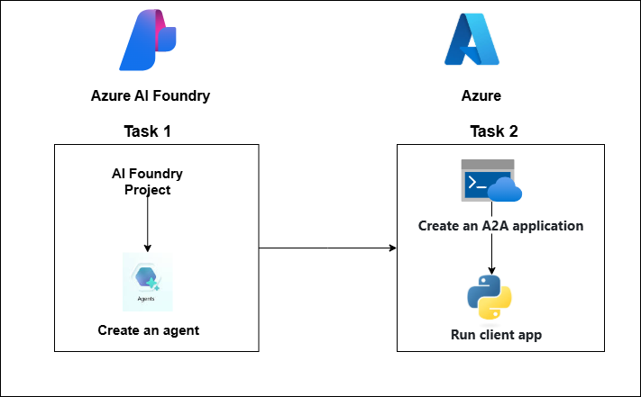
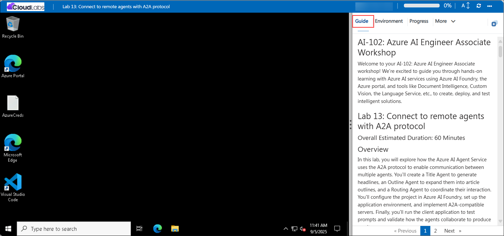

# AI-102: Azure AI Engineer Associate Workshop

Welcome to your AI-102: Azure AI Engineer Associate workshop! We’re excited to guide you through hands-on learning with Azure AI services using Azure AI Foundry, the Azure portal, and tools like Document Intelligence, Custom Vision, the Language Service, etc., to create, deploy, and test intelligent solutions.

# Lab 12: Connect to remote agents with A2A protocol

### Overall Estimated Duration: 60 Minutes

## Overview

In this lab, you will explore how the Azure AI Agent Service uses the A2A protocol to enable communication between multiple agents. You’ll create a Title Agent to generate headlines, an Outline Agent to expand them into article outlines, and a Routing Agent to coordinate their interaction. You’ll configure the project in Azure AI Foundry, set up the application environment, and implement A2A-compatible servers. Finally, you’ll run the client application to test prompts and validate how the agents collaborate to produce results.

## Objectives

By the end of this lab, you will be able to:

1. **Create AI agents using the Azure AI Agent Service:** Build and configure three agents a Title Agent, an Outline Agent, and a Routing Agent within an Azure AI Foundry project.
2. **Configure the application environment:** Set up project resources, connect the client app, and update configuration files with your project endpoint and model deployment.
3. **Implement discoverable A2A agents:** Define skills, agent cards, and executors to enable message handling and make agents interoperable through the A2A protocol.
4. **Validate multi-agent collaboration:** Run the client application, send prompts, and confirm that agents interact and respond collaboratively.

## Pre-requisites

* Basic understanding of AI agents.
* Familiarity with the **Semantic Kernel SDK** concepts like planners, skills, and connectors.
* Experience with the **Azure portal** and navigating **Azure AI Foundry**.
* Basic knowledge of **Python** programming.
* Permissions to create and manage resources within the assigned resource group (for example, Azure AI User role).

## Architecture

The lab architecture demonstrates how multiple AI agents communicate using the **A2A protocol** inside an Azure AI Foundry project:

1. **Azure AI Foundry Project:** Provides the workspace to host the model deployment and manage endpoints for the agents.
2. **Title Agent:** Generates blog post titles based on user prompts.
3. **Outline Agent:** Expands the generated title into a structured article outline. 
4. **Routing Agent:** Orchestrates the workflow by routing user prompts to the appropriate agent and returning the final combined output.
5. **Client Application:** Connects to the routing agent, sends prompts, and displays the coordinated response from the agents.

## Architecture Diagram

## Explanation of Components

1. **Azure AI Foundry Project** The workspace where you create and manage your AI project. It hosts the deployed gpt-4.1 model and provides the project endpoint that agents and client apps use for communication.
2. **Model Deployment (gpt-4.1):** The language model deployed in Azure AI Foundry with sufficient quota. It powers the Title and Outline Agents, enabling them to generate content when prompted.
3. **Title and Outline Agents (A2A):** Two agents that collaborate through the A2A protocol. The Title Agent generates catchy blog post titles, while the Outline Agent expands them into structured outlines. Both register their skills and are discoverable via agent cards, allowing the Routing Agent to invoke them.
4. **Routing Agent (A2A server):** The orchestrator that receives prompts from the client app, discovers the Title and Outline Agents using A2A, routes messages between them, and aggregates the responses into a final result.
5. **Client Application (run_all.py):** A Python app that launches all agents, manages A2A-based communication, and handles end-to-end interaction. It sends prompts to the Routing Agent, enables agent-to-agent message exchange, and displays the combined output (a generated title and matching outline) to the user.

# Getting Started with lab

Welcome to your AI-102: Azure AI Engineer Associate workshop! We’ve prepared an interactive environment for you to explore generative AI concepts and work with Microsoft Azure services like Azure AI Foundry, Document Intelligence, Custom Vision, Language Service, etc. Let’s get started and make the most of this hands-on experience.

## Accessing Your Lab Environment
 
Once you're ready to dive in, your virtual machine and **Guide** will be right at your fingertips within your web browser.
 

### Virtual Machine & Lab Guide
 
Your virtual machine is your workhorse throughout the workshop. The lab guide is your roadmap to success.

## Exploring Your Lab Resources
 
To get a better understanding of your lab resources and credentials, navigate to the **Environment** tab.
 

## Managing Your Virtual Machine
 
Feel free to **Start, Restart, or Stop (2)** your virtual machine as needed from the **Resources (1)** tab. Your experience is in your hands!
 

## Lab Progress

You can use the **Progress** tab to track your progress while working on the lab. A score will be provided after successful validation.

## Utilizing the Split Window Feature
 
For convenience, you can open the lab guide in a separate window by selecting the **Split Window** button from the top right corner.
 

## Lab Guide Zoom In/Zoom Out
 
To adjust the zoom level for the environment page, click the **A↕: 100%** icon located next to the timer in the lab environment.

## Let's Get Started with Azure Portal
 
1. On your virtual machine, click on the Azure Portal icon as shown below:
 
   

1. In the sign-in window, kindly sign in using the provided Azure credentials

    - **Email/Username:** <inject key="AzureAdUserEmail"></inject>

        

    - **Password:** <inject key="AzureAdUserPassword"></inject>

        

1. If prompted to **Stay signed in?**, you can click **No**.

    

1. If a **Welcome to Microsoft Azure** pop-up window appears, simply click **Cancel** to skip the tour.

    

## Support Contact
 
The CloudLabs support team is available 24/7, 365 days a year, via email and live chat to ensure seamless assistance at any time. We offer dedicated support channels explicitly tailored for both learners and instructors, ensuring that all your needs are promptly and efficiently addressed.
 
Learner Support Contacts:
 
- Email Support: cloudlabs-support@spektrasystems.com
- Live Chat Support: https://cloudlabs.ai/labs-support

Click on **Next** from the lower right corner to move on to the next page.

   

## Happy Learning !!

