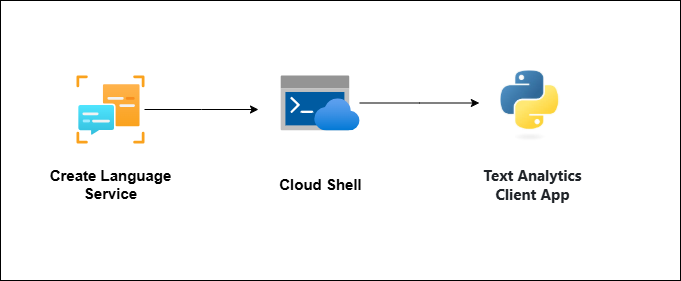
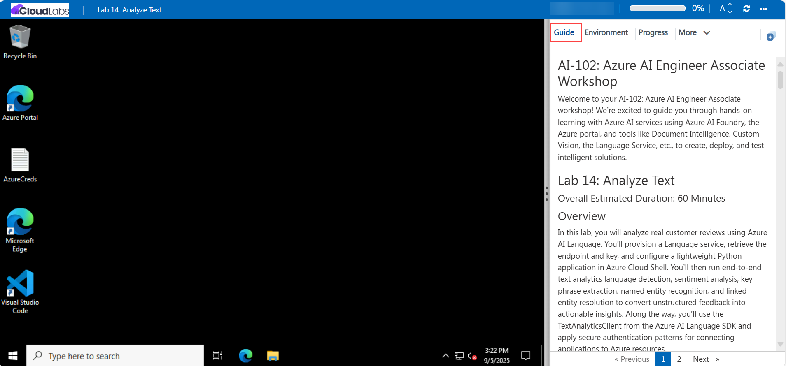

# AI-102: Azure AI Engineer Associate Workshop

Welcome to your AI-102: Azure AI Engineer Associate workshop! We’re excited to guide you through hands-on learning with Azure AI services using Azure AI Foundry, the Azure portal, and tools like Document Intelligence, Custom Vision, the Language Service, etc., to create, deploy, and test intelligent solutions.

# Lab 13: Analyze Text

### Overall Estimated Duration: 60 Minutes

## Overview

In this lab, you will analyze real customer reviews using Azure AI Language. You’ll provision a Language service, retrieve the endpoint and key, and configure a lightweight Python application in Azure Cloud Shell. You’ll then run end-to-end text analytics language detection, sentiment analysis, key phrase extraction, named entity recognition, and linked entity resolution to convert unstructured feedback into actionable insights. Along the way, you’ll use the TextAnalyticsClient from the Azure AI Language SDK and apply secure authentication patterns for connecting applications to Azure resources.

## Objectives

By the end of this lab, you will be able to:

1. **Provision and configure Azure AI Language:** Create a Language service, capture the endpoint and key.
2. **Set up the Python SDK workflow in Azure Cloud Shell:** Create a lightweight Python environment, install the Azure AI Language SDK, initialize TextAnalyticsClient, and execute end-to-end text analytics (language detection, sentiment, key phrases, named entities, and linked entities) on sample reviews.
3. **Run and test the workflow end to end:** Execute the solution in Cloud Shell with multiple review inputs and observe results for each capability.
4. **Validate outputs:** Verify that the outputs correctly identify language, sentiment, key topics, entities, and linked references, and prepare results for downstream reporting.

## Pre-requisites

* **Azure portal**
* Basic knowledge of **Python** programming.

## Architecture

he lab architecture demonstrates how a Python-based text analytics application uses **Azure AI Language** to transform unstructured hotel reviews into structured insights:

1. **Azure AI Language Resource:** Managed service that exposes text analytics capabilities via secure endpoints and keys.
2. **Runtime & App (Azure Cloud Shell + Python Console App):** Browser-based, managed shell in the Azure portal where you run a Python console application that loads review documents, invokes the Azure AI Language SDK, and prints structured results.
3. **Azure AI Language SDK (TextAnalyticsClient):** Client library that authenticates with the Language service using the endpoint/key and invokes text analytics APIs. 
4. **Data Flow (Reviews → Insights):** Inputs: sample hotel review text files. Outputs: detected language, sentiment labels/scores, key phrases, named entities, and linked entities.

## Architecture Diagram

## Explanation of Components

1. **Azure AI Language Resource:** The core Azure service that powers text analysis. It provides endpoints and keys to authenticate requests, enabling features like language detection, sentiment analysis, and entity recognition.
2. **Python Client App (text-analysis.py):** The executable script that loads review files, initializes the Text Analytics client with the endpoint and key, and sequentially invokes the features (language, sentiment, key phrases, entities, linked entities), writing results to the console.
3. **Language Detection:** A Text Analytics feature that identifies the primary language of each review and returns the language name and confidence scores.
4. **Sentiment Analysis:** A Text Analytics feature that classifies each review as positive, neutral, negative, or mixed, with per-document and per-sentence sentiment scores.
5. **Key Phrase Extraction:** A Text Analytics feature that surfaces the main topics and themes in each review as key phrases to quickly summarize what the customer is talking about.
6. **Entity Recognition:** A Text Analytics feature that detects and labels entities (for example, people, locations, organizations, amenities) mentioned in the reviews, returning the text span and category.
7. **Linked Entity Recognition:** A Text Analytics feature that resolves detected entities to authoritative sources (such as Wikipedia), returning a canonical name and a reference URL to provide context.

# Getting Started with lab

Welcome to your AI-102: Azure AI Engineer Associate workshop! We’ve prepared an interactive environment for you to explore generative AI concepts and work with Microsoft Azure services like Azure AI Foundry, Document Intelligence, Custom Vision, Language Service, etc. Let’s get started and make the most of this hands-on experience.

## Accessing Your Lab Environment
 
Once you're ready to dive in, your virtual machine and **Guide** will be right at your fingertips within your web browser.
 

### Virtual Machine & Lab Guide
 
Your virtual machine is your workhorse throughout the workshop. The lab guide is your roadmap to success.

## Exploring Your Lab Resources
 
To get a better understanding of your lab resources and credentials, navigate to the **Environment** tab.
 

## Managing Your Virtual Machine
 
Feel free to **Start, Restart, or Stop (2)** your virtual machine as needed from the **Resources (1)** tab. Your experience is in your hands!
 

## Lab Progress

You can use the **Progress** tab to track your progress while working on the lab. A score will be provided after successful validation.

## Utilizing the Split Window Feature
 
For convenience, you can open the lab guide in a separate window by selecting the **Split Window** button from the top right corner.
 

## Lab Guide Zoom In/Zoom Out
 
To adjust the zoom level for the environment page, click the **A↕: 100%** icon located next to the timer in the lab environment.

## Let's Get Started with Azure Portal
 
1. On your virtual machine, click on the Azure Portal icon as shown below:
 
   

1. In the sign-in window, kindly sign in using the provided Azure credentials

    - **Email/Username:** <inject key="AzureAdUserEmail"></inject>

        

    - **Password:** <inject key="AzureAdUserPassword"></inject>

        

1. If prompted to **Stay signed in?**, you can click **No**.

    

1. If a **Welcome to Microsoft Azure** pop-up window appears, simply click **Cancel** to skip the tour.

    

## Support Contact
 
The CloudLabs support team is available 24/7, 365 days a year, via email and live chat to ensure seamless assistance at any time. We offer dedicated support channels explicitly tailored for both learners and instructors, ensuring that all your needs are promptly and efficiently addressed.
 
Learner Support Contacts:
 
- Email Support: cloudlabs-support@spektrasystems.com
- Live Chat Support: https://cloudlabs.ai/labs-support

Click on **Next** from the lower right corner to move on to the next page.

   

## Happy Learning !!

