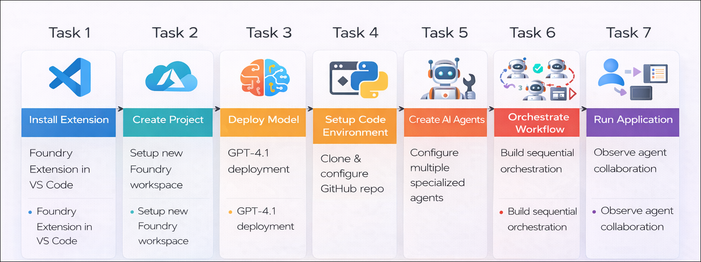
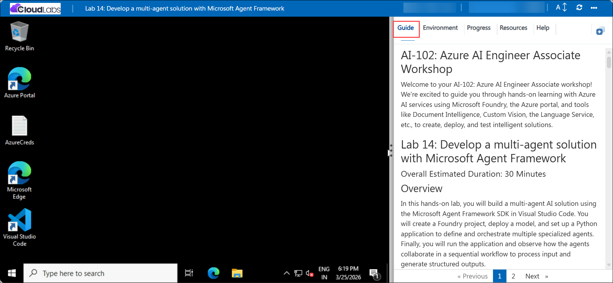

# Getting Started with your AI-102: Azure AI Engineer Associate Workshop

Welcome to your AI-102: Azure AI Engineer Associate workshop! We’re excited to guide you through hands-on learning with Azure AI services using Microsoft Foundry, the Azure portal, and tools like Document Intelligence, Custom Vision, the Language Service, etc., to create, deploy, and test intelligent solutions.

# Lab 14: Develop a multi-agent solution with Microsoft Agent Framework

### Overall Estimated Duration: 30 Minutes

## Overview

In this hands-on lab, you will build a multi-agent AI solution using the Microsoft Agent Framework SDK in Visual Studio Code. You will create a Foundry project, deploy a model, and set up a Python application to define and orchestrate multiple specialized agents. Finally, you will run the application and observe how the agents collaborate in a sequential workflow to process input and generate structured outputs.

## Objectives

1. **Set up the Microsoft Foundry development environment:** Install the Microsoft Foundry extension in Visual Studio Code and connect to Azure resources.

2. **Deploy and configure a model:** Create a project and deploy the *gpt-4.1* model to enable AI-powered agent interactions.

3. **Create multiple specialized AI agents:** Build agents with distinct roles such as summarization, classification, and action handling using the Microsoft Agent Framework SDK.

4. **Implement sequential agent orchestration:** Design a workflow where multiple agents process input in sequence and collaborate to generate structured outputs.

5. **Run and validate the multi-agent solution:** Execute the Python application, test the orchestration workflow, and analyze how agents collaborate to process user input.

## Pre-requisites

* Basic understanding of AI agents and their roles in collaborative problem-solving.
* Familiarity with AI agent concepts such as prompts, roles, and multi-agent workflows.
* Understanding of Python programming.

## Architecture

The lab architecture demonstrates how the Microsoft Agent Framework SDK enables multi-agent collaboration through sequential orchestration:

1. **Microsoft Foundry Resource:** The central workspace in Microsoft Foundry that hosts the project, deployed model, and agent configurations required for building the multi-agent solution.

2. **Model Deployment (gpt-4.1):** A generative AI model deployed within the project that processes input prompts and enables all agents to generate intelligent and context-aware responses.

3. **Multi-Agent Configuration:** Multiple specialized AI agents are created using the Microsoft Agent Framework SDK, where each agent is assigned a specific role such as summarization, classification, or action handling.

4. **Sequential Orchestration Workflow:** The orchestration layer that connects all agents in a defined sequence, ensuring inputs are processed step-by-step and results are passed between agents to produce a final structured output.

5. **Application Execution and Interaction:** A Python-based client application runs the workflow, sends user input to the agents, and displays the combined output generated through agent collaboration.
## Architecture Diagram

## Explanation of Components

1. **Microsoft Foundry Project:** The workspace created in Microsoft Foundry where you manage resources, configure agents, and connect to the deployed model for processing requests.

2. **Model Deployment (gpt-4.1):** The AI model that processes input prompts and generates responses used by all agents in the multi-agent workflow.

3. **Specialized AI Agents:** Multiple agents created using the Microsoft Agent Framework SDK, where each agent performs a specific task such as summarizing input, classifying feedback, or determining an action.

4. **Sequential Orchestration and Client Application:** A workflow that connects agents in sequence and a Python application (`agents.py`) that runs the orchestration, sends input, and displays the final structured output.

## Accessing Your Lab Environment
 
Once you're ready to dive in, your virtual machine and **Guide** will be right at your fingertips within your web browser.
 

## Virtual Machine & Lab Guide
 
Your virtual machine is your workhorse throughout the workshop. The lab guide is your roadmap to success.

## Exploring Your Lab Resources
 
To get a better understanding of your lab resources and credentials, navigate to the **Environment** tab.
 

## Managing Your Virtual Machine
 
Feel free to **Start, Restart, or Stop (2)** your virtual machine as needed from the **Resources (1)** tab. Your experience is in your hands!
 

## Lab Progress

You can use the **Progress** tab to track your progress while working on the lab. A score will be provided after successful validation.

## Utilizing the Split Window Feature
 
For convenience, you can open the lab guide in a separate window by selecting the **Split Window** button from the top right corner.
 

## Lab Guide Zoom In/Zoom Out
 
To adjust the zoom level for the environment page, click the **A↕: 100%** icon located next to the timer in the lab environment.

## Let's Get Started with Azure Portal
 
1. On your virtual machine, click on the Azure Portal icon as shown below:
 
   

1. In the sign-in window, kindly sign in using the provided Azure credentials

    - **Email/Username:** <inject key="AzureAdUserEmail"></inject>

        

    - **Password:** <inject key="AzureAdUserPassword"></inject>

        

1. If prompted to **Stay signed in?**, you can click **No**.

    

1. If a **Welcome to Microsoft Azure** pop-up window appears, simply click **Maybe later** to skip the tour.

    

## Support Contact
 
The CloudLabs support team is available 24/7, 365 days a year, via email and live chat to ensure seamless assistance at any time. We offer dedicated support channels explicitly tailored for both learners and instructors, ensuring that all your needs are promptly and efficiently addressed.
 
Learner Support Contacts:
 
- Email Support: cloudlabs-support@spektrasystems.com
- Live Chat Support: https://cloudlabs.ai/labs-support

Click on **Next** from the lower right corner to move on to the next page.

   

## Happy Learning !!

