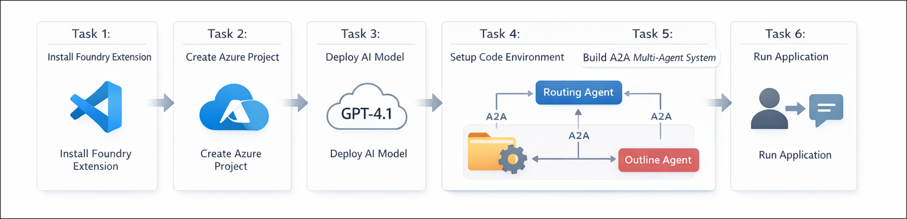
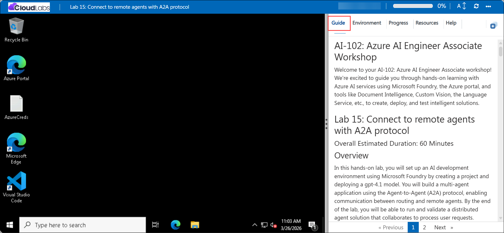

# AI-102: Azure AI Engineer Associate Workshop

Welcome to your AI-102: Azure AI Engineer Associate workshop! We’re excited to guide you through hands-on learning with Azure AI services using Microsoft Foundry, the Azure portal, and tools like Document Intelligence, Custom Vision, the Language Service, etc., to create, deploy, and test intelligent solutions.

# Lab 15: Connect to remote agents with A2A protocol

### Overall Estimated Duration: 60 Minutes

## Overview

In this hands-on lab, you will set up an AI development environment using Microsoft Foundry by creating a project and deploying a gpt-4.1 model. You will build a multi-agent application using the Agent-to-Agent (A2A) protocol, enabling communication between routing and remote agents. By the end of the lab, you will be able to run and validate a distributed agent solution that collaborates to process user requests.

## Objectives

By the end of this lab, you will be able to:

1. **Set up the Microsoft Foundry development environment:** Install and configure the Microsoft Foundry extension in Visual Studio Code and sign in to Azure.

2. **Deploy a foundation model:** Deploy the *gpt-4.1* model in your Foundry project and configure it for use with AI agents.

3. **Build a multi-agent application using A2A protocol:** Create routing and remote agents and enable communication between them using the Agent-to-Agent (A2A) protocol.

4. **Implement discoverable agents with skills and agent cards:** Define agent capabilities, skills, and metadata to make agents accessible and interoperable.

5. **Run and validate the multi-agent solution:** Execute the application, send user prompts, and verify collaboration between agents to generate responses.

## Pre-requisites

* Basic understanding of AI agents.
* Basic knowledge of **Python** programming.

## Architecture

The lab architecture demonstrates how multiple AI agents built using Microsoft Foundry communicate using the Agent-to-Agent (A2A) protocol to process user requests collaboratively:

1. **Microsoft Foundry Project and Deployed Model:** A project created using the Microsoft Foundry extension in Visual Studio Code, where the *gpt-4.1* model is deployed to power agent interactions and generate responses.

2. **Routing Agent (Orchestrator):** The central agent that receives user input, analyzes the request, and determines which remote agent should handle the task.

3. **Remote Agents (Title and Outline Agents):** Specialized agents exposed via A2A servers with defined skills and agent cards, enabling them to process specific tasks like generating titles or outlines.

4. **A2A Communication and Client Application:** A Python-based client and A2A protocol enable message exchange between agents, manage task execution, and return consolidated responses to the user.

## Architecture Diagram

## Explanation of Components

1. **Microsoft Foundry Project:** The workspace created in Microsoft Foundry where you manage resources, deploy models, and obtain the project endpoint used by agents and client applications.

2. **Model Deployment (gpt-4.1):** The language model deployed within the project that processes prompts, generates responses, and powers intelligent interactions across multiple agents.

3. **Title and Outline Agents (A2A):** Two agents that collaborate through the A2A protocol. The Title Agent generates catchy blog post titles, while the Outline Agent expands them into structured outlines. Both register their skills and are discoverable via agent cards, allowing the Routing Agent to invoke them.

4. **Routing Agent (A2A server):** The orchestrator that receives prompts from the client app, discovers the Title and Outline Agents using A2A, routes messages between them, and aggregates the responses into a final result.

5. **Client Application (run_all.py):** A Python app that launches all agents, manages A2A-based communication, and handles end-to-end interaction. It sends prompts to the Routing Agent, enables agent-to-agent message exchange, and displays the combined output (a generated title and matching outline) to the user.

# Getting Started with lab

Welcome to your AI-102: Azure AI Engineer Associate workshop! We’ve prepared an interactive environment for you to explore generative AI concepts and work with Microsoft Azure services like Azure AI Foundry, Document Intelligence, Custom Vision, Language Service, etc. Let’s get started and make the most of this hands-on experience.

## Accessing Your Lab Environment
 
Once you're ready to dive in, your virtual machine and **Guide** will be right at your fingertips within your web browser.
 

### Virtual Machine & Lab Guide
 
Your virtual machine is your workhorse throughout the workshop. The lab guide is your roadmap to success.

## Exploring Your Lab Resources
 
To get a better understanding of your lab resources and credentials, navigate to the **Environment** tab.
 

## Managing Your Virtual Machine
 
Feel free to **Start, Restart, or Stop (2)** your virtual machine as needed from the **Resources (1)** tab. Your experience is in your hands!
 

## Lab Progress

You can use the **Progress** tab to track your progress while working on the lab. A score will be provided after successful validation.

## Utilizing the Split Window Feature
 
For convenience, you can open the lab guide in a separate window by selecting the **Split Window** button from the top right corner.
 

## Lab Guide Zoom In/Zoom Out
 
To adjust the zoom level for the environment page, click the **A↕: 100%** icon located next to the timer in the lab environment.

## Let's Get Started with Azure Portal
 
1. On your virtual machine, click on the Azure Portal icon as shown below:
 
   

1. In the sign-in window, kindly sign in using the provided Azure credentials

    - **Email/Username:** <inject key="AzureAdUserEmail"></inject>

        

    - **Password:** <inject key="AzureAdUserPassword"></inject>

        

1. If prompted to **Stay signed in?**, you can click **No**.

    

1. If a **Welcome to Microsoft Azure** pop-up window appears, simply click **Cancel** to skip the tour.

    

## Support Contact
 
The CloudLabs support team is available 24/7, 365 days a year, via email and live chat to ensure seamless assistance at any time. We offer dedicated support channels explicitly tailored for both learners and instructors, ensuring that all your needs are promptly and efficiently addressed.
 
Learner Support Contacts:
 
- Email Support: cloudlabs-support@spektrasystems.com
- Live Chat Support: https://cloudlabs.ai/labs-support

Click on **Next** from the lower right corner to move on to the next page.

   

## Happy Learning !!

