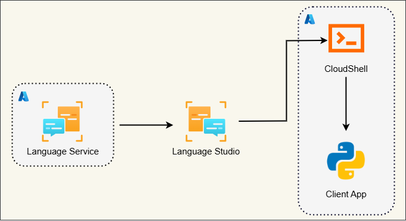
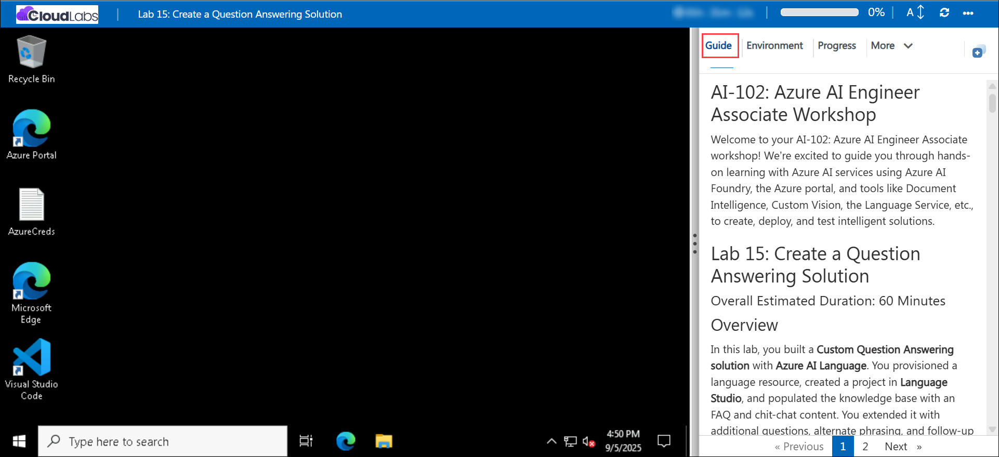

# AI-102: Azure AI Engineer Associate Workshop

Welcome to your AI-102: Azure AI Engineer Associate workshop! We’re excited to guide you through hands-on learning with Azure AI services using Azure AI Foundry, the Azure portal, and tools like Document Intelligence, Custom Vision, the Language Service, etc., to create, deploy, and test intelligent solutions.

# Lab 15: Create a Question Answering Solution

### Overall Estimated Duration: 60 Minutes

## Overview

In this lab, you built a **Custom Question Answering solution** with **Azure AI Language**. You provisioned a language resource, created a project in **Language Studio**, and populated the knowledge base with an FAQ and chit-chat content. You extended it with additional questions, alternate phrasing, and follow-up prompts for multi-turn conversations. After training, testing, and deploying the knowledge base, you set up a Python client app in **Azure Cloud Shell**, configured it with your resource’s endpoint and key, and ran the app to interactively query the knowledge base and receive accurate, context-aware answers.

## Objectives

1. **Provision and configure an Azure AI Language resource**: Create a language resource in Azure and capture its endpoint and key for client integration.
2. **Create a question answering project in Language Studio**: Set up a project, define the language, and configure basic settings for your knowledge base.
3. **Populate and extend the knowledge base**: Import FAQ and chit-chat content, add new question-answer pairs, alternate questions, and follow-up prompts to support multi-turn conversations.
4. **Train, test, and deploy the knowledge base**: Verify responses in Language Studio and deploy the knowledge base to make it accessible via a REST endpoint.
5. **Develop and configure a Python client app**: Set up the app in Azure Cloud Shell, configure it with the resource endpoint and key, and run it to interactively submit questions and receive answers.

## Pre-requisites

* Basic understanding of question answering systems and knowledge bases.
* Familiarity with **Azure AI Language** concepts, including projects, knowledge bases, and REST endpoints.
* Experience with the **Azure portal** and navigating **Language Studio**.
* An active Azure subscription with permissions to create and manage resources in the assigned resource group.
* Basic knowledge of Python and experience working in **Cloud Shell** or similar terminal environments.

## Architecture

The lab architecture demonstrates how a **Custom Question Answering solution** is built and accessed using **Azure AI Language**:

1. **Azure AI Language Resource**: The central service that hosts the question answering capabilities, providing endpoints and API keys for client applications.
2. **Question Answering Project (Language Studio)**: Defines the knowledge base, including imported FAQ and chit-chat content, and manages question-answer pairs, alternate questions, and follow-up prompts.
3. **Knowledge Base**: Stores questions and answers, including multi-turn conversational flows, enabling context-aware responses.
4. **REST Endpoint**: Exposes the deployed knowledge base to external applications for interactive querying.
5. **Python Client App (Cloud Shell)**: Connects to the deployed knowledge base using the endpoint and key, allowing users to submit questions and receive answers interactively.
6. **User Interaction**: Users ask questions through the app, and the system returns answers with confidence scores, sources, and follow-up prompts, demonstrating how the knowledge base provides accurate and context-aware responses.

## Architecture Diagram

## Explanation of Components

1. **Azure AI Language Resource**: Provides the service environment to host the question answering capabilities, manage API keys, and expose endpoints for client applications.

2. **Language Studio Project**: Enables creation and management of the knowledge base, including importing FAQs, adding chit-chat content, and organizing question-answer pairs, alternate questions, and follow-up prompts.

3. **Knowledge Base**: Stores all questions, answers, and conversational flows, supporting context-aware responses and multi-turn interactions.

4. **REST Endpoint**: Exposes the deployed knowledge base to external applications, allowing programmatic access to submit questions and retrieve answers.

5. **Python Client App (Cloud Shell)**: Connects to the deployed knowledge base using the endpoint and key, providing an interactive interface to submit questions and display answers along with confidence scores and sources.

6. **User Interaction**: Users enter questions through the app, and the system returns responses from the knowledge base, including follow-up prompts for multi-turn conversations, demonstrating the knowledge base’s ability to provide accurate and context-sensitive answers.

# Getting Started with lab

Welcome to your AI-102: Azure AI Engineer Associate workshop! We’ve prepared an interactive environment for you to explore generative AI concepts and work with Microsoft Azure services like Azure AI Foundry, Document Intelligence, Custom Vision, Language Service, etc. Let’s get started and make the most of this hands-on experience.

## Accessing Your Lab Environment
 
Once you're ready to dive in, your virtual machine and **lab guide** will be right at your fingertips within your web browser.
 

### Virtual Machine & Lab Guide
 
Your virtual machine is your workhorse throughout the workshop. The lab guide is your roadmap to success.

## Exploring Your Lab Resources
 
To get a better understanding of your lab resources and credentials, navigate to the **Environment** tab.
 

## Managing Your Virtual Machine
 
Feel free to **Start, Restart, or Stop (2)** your virtual machine as needed from the **Resources (1)** tab. Your experience is in your hands!
 

## Lab Progress

You can use the **Progress** tab to track your progress while working on the lab. A score will be provided after successful validation.

## Utilizing the Split Window Feature
 
For convenience, you can open the lab guide in a separate window by selecting the **Split Window** button from the top right corner.
 

## Lab Guide Zoom In/Zoom Out
 
To adjust the zoom level for the environment page, click the **A↕: 100%** icon located next to the timer in the lab environment.

## Let's Get Started with Azure Portal
 
1. On your virtual machine, click on the Azure Portal icon as shown below:
 
   

1. In the sign-in window, kindly sign in using the provided Azure credentials

    - **Email/Username:** <inject key="AzureAdUserEmail"></inject>

        

    - **Password:** <inject key="AzureAdUserPassword"></inject>

        

1. If prompted to **Stay signed in?**, you can click **No**.

    

1. If a **Welcome to Microsoft Azure** pop-up window appears, simply click **Cancel** to skip the tour.

    

## Support Contact
 
The CloudLabs support team is available 24/7, 365 days a year, via email and live chat to ensure seamless assistance at any time. We offer dedicated support channels explicitly tailored for both learners and instructors, ensuring that all your needs are promptly and efficiently addressed.
 
Learner Support Contacts:
 
- Email Support: cloudlabs-support@spektrasystems.com
- Live Chat Support: https://cloudlabs.ai/labs-support

Click on **Next** from the lower right corner to move on to the next page.

   

## Happy Learning !!

