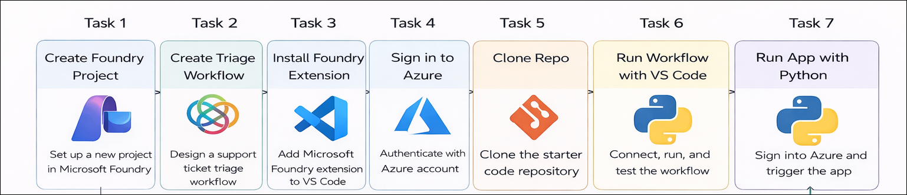
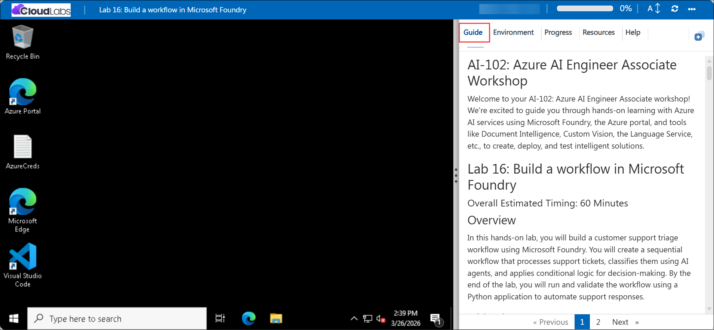

# AI-102: Azure AI Engineer Associate Workshop

Welcome to your AI-102: Azure AI Engineer Associate workshop! We’re excited to guide you through hands-on learning with Azure AI services using Microsoft Foundry, the Azure portal, and tools like Document Intelligence, Custom Vision, the Language Service, etc., to create, deploy, and test intelligent solutions.

# Lab 16: Build a workflow in Microsoft Foundry

### Overall Estimated Timing: 90 Minutes

## Overview

In this hands-on lab, you will build a customer support triage workflow using Microsoft Foundry. You will create a sequential workflow that processes support tickets, classifies them using AI agents, and applies conditional logic for decision-making. By the end of the lab, you will run and validate the workflow using a Python application to automate support responses.

## Objectives

By the end of this lab, you will be able to:

1. **Create and configure a workflow in Microsoft Foundry:** Set up a project and design a workflow to process customer support tickets.

2. **Integrate AI-based classification:** Use an AI model to classify tickets and generate responses.

3. **Implement conditional logic:** Apply decision-making based on confidence scores and ticket categories.

4. **Automate ticket handling:** Route billing issues for escalation and generate responses for other cases.

5. **Execute and validate the workflow:** Connect to the workflow using a Python application and verify end-to-end processing.

## Pre-requisites
  
* Familiarity with Microsoft Foundry concepts such as projects, agents, and workflows.  
* Basic understanding of AI agent workflows and conditional logic.  
* Basic knowledge of Python and running scripts from a command-line environment. 

## Architecture

The lab architecture demonstrateshow a Microsoft Foundry project enables AI-powered customer support automation through SDK-based agent orchestration, intelligent ticket classification, confidence-based routing, and automated response generation:

1. **Microsoft Foundry Project:** A workspace created in the Microsoft Foundry portal where you deploy foundation models and manage AI agent configurations for customer support automation.

2. **Deployment Model (gpt- 4.1):** A model deployed within the project that processes support ticket prompts, performs classification, evaluates confidence levels, and generates conversational responses.

3. **Triage Agent (SDK-Defined):** An agent defined programmatically using the Azure AI SDK, configured with instructions to analyze incoming tickets, classify issues, and determine routing decisions.

4. **Resolution Agent:** An AI agent responsible for generating automated responses for high-confidence tickets using the deployed GPT-4.1 model.

5. **Confidence-Based Decision Logic:** A routing mechanism that evaluates the model’s confidence score and determines whether to automate the response or escalate the ticket.

6. **Human Support Escalation:** A fallback process that routes low-confidence tickets to human agents to ensure accuracy and quality control.

## Architecture Diagram

## Explanation of Components

1. **Microsoft Foundry Project:** The central cloud workspace where foundation models are deployed, AI agents are configured, and workflows for customer support automation are managed.

2. **Visual Studio Code Integration:** The IDE used to connect to the Foundry project, create and deploy agents, and configure workflows using the Microsoft Foundry SDK.

3. **Deployment Model (gpt-4.1):** The core language model that interprets ticket content, performs reasoning, assigns classifications, and generates contextual responses.

4. **Triage Agent (SDK-Defined):** A programmatically created agent that reviews each incoming ticket, categorizes the issue type, and evaluates confidence scores to determine routing.

5. **Resolution Agent:** An AI agent that generates automated responses for tickets meeting the confidence threshold.

6. **Confidence-Based Decision Logic:** A control mechanism that determines whether a ticket should be automatically resolved or escalated for human review.

7. **Human Support Escalation:** A safeguard process that routes uncertain or complex tickets to human representatives for manual handling.

# Getting Started with lab

Welcome to your AI-102: Azure AI Engineer Associate workshop! We’ve prepared an interactive environment for you to explore generative AI concepts and work with Microsoft Azure services like Microsoft Foundry, Document Intelligence, Custom Vision, Language Service, etc. Let’s get started and make the most of this hands-on experience.

## Accessing Your Lab Environment
 
Once you're ready to dive in, your virtual machine and **Guide** will be right at your fingertips within your web browser.
 

### Virtual Machine & Lab Guide
 
Your virtual machine is your workhorse throughout the workshop. The lab guide is your roadmap to success.

## Exploring Your Lab Resources
 
To get a better understanding of your lab resources and credentials, navigate to the **Environment** tab.
 

## Managing Your Virtual Machine
 
Feel free to **Start, Restart, or Stop (2)** your virtual machine as needed from the **Resources (1)** tab. Your experience is in your hands!
 

## Lab Progress

You can use the **Progress** tab to track your progress while working on the lab. A score will be provided after successful validation.

## Utilizing the Split Window Feature
 
For convenience, you can open the lab guide in a separate window by selecting the **Split Window** button from the top right corner.
 

## Lab Guide Zoom In/Zoom Out
 
To adjust the zoom level for the environment page, click the **A↕: 100%** icon located next to the timer in the lab environment.

## Let's Get Started with Azure Portal
 
1. On your virtual machine, click on the Azure Portal icon as shown below:
 
   

1. In the sign-in window, kindly sign in using the provided Azure credentials

    - **Email/Username:** <inject key="AzureAdUserEmail"></inject>

        

    - **Password:** <inject key="AzureAdUserPassword"></inject>

        

1. If prompted to **Stay signed in?**, you can click **No**.

    

1. If a **Welcome to Microsoft Azure** pop-up window appears, simply click **Maybe later** to skip the tour.

    

## Support Contact
 
The CloudLabs support team is available 24/7, 365 days a year, via email and live chat to ensure seamless assistance at any time. We offer dedicated support channels explicitly tailored for both learners and instructors, ensuring that all your needs are promptly and efficiently addressed.
 
Learner Support Contacts:
 
- Email Support: cloudlabs-support@spektrasystems.com
- Live Chat Support: https://cloudlabs.ai/labs-support

Click on **Next** from the lower right corner to move on to the next page.

   

## Happy Learning !!