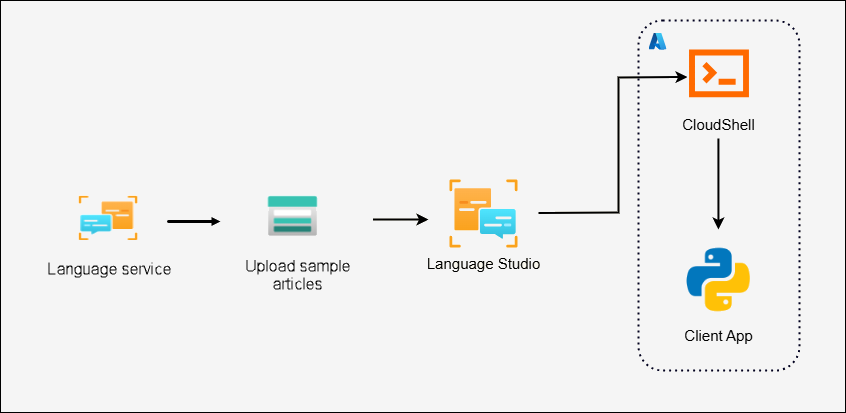
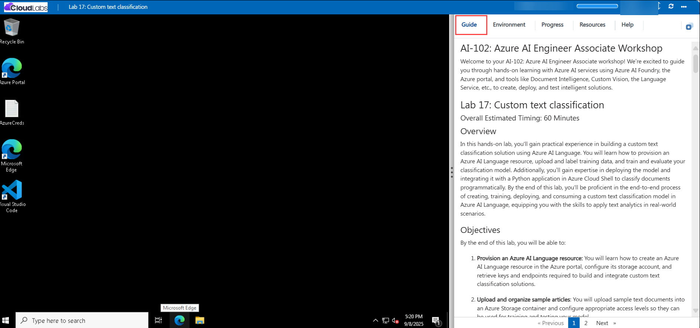

# AI-102: Azure AI Engineer Associate Workshop

Welcome to your AI-102: Azure AI Engineer Associate workshop! We’re excited to guide you through hands-on learning with Azure AI services using Azure AI Foundry, the Azure portal, and tools like Document Intelligence, Custom Vision, the Language Service, etc., to create, deploy, and test intelligent solutions.

# Lab 17: Custom text classification

### Overall Estimated Timing: 60 Minutes

## Overview

In this hands-on lab, you'll gain practical experience in building a custom text classification solution using Azure AI Language. You will learn how to provision an Azure AI Language resource, upload and label training data, and train and evaluate your classification model. Additionally, you’ll gain expertise in deploying the model and integrating it with a Python application in Azure Cloud Shell to classify documents programmatically. By the end of this lab, you'll be proficient in the end-to-end process of creating, training, deploying, and consuming a custom text classification model in Azure AI Language, equipping you with the skills to apply text analytics in real-world scenarios.

## Objectives

By the end of this lab, you will be able to:

1. **Provision an Azure AI Language resource:** You will learn how to create an Azure AI Language resource in the Azure portal, configure its storage account, and retrieve keys and endpoints required to build and integrate custom text classification solutions.

1. **Upload and organize sample articles**: You will upload sample text documents into an Azure Storage container and configure appropriate access levels so they can be used for training and testing your model.

1. **Create and label a custom text classification project:** You will create a project in Language Studio, define classification categories, and label sample articles with the correct class and dataset (training or testing) to prepare your data for model training.

1. **Train and evaluate your model:** You will train a custom classification model using the labeled data and evaluate its performance using built-in metrics and test set details to identify misclassifications and potential areas for improvement.

1. **Deploy your classification model:** You will deploy your trained model in Language Studio, making it accessible via an API endpoint for real-time text classification.

1. **Configure and run a Python application in Cloud Shell:** You will set up a Python environment in Azure Cloud Shell, configure application settings with your resource details, add SDK code for classification, and run the app to classify documents and view confidence scores.

## Pre-requisites

- Familiarity with text analytics concepts such as labeling, training, and testing models.
- Basic experience with Python and working in Azure Cloud Shell.

## Architecture

The lab architecture demonstrates how Azure AI Language enables custom text classification using uploaded documents and application integration:

1. **Azure AI Language Resource:** Learning how to provision an AI Language service in the Azure portal that provides the core NLP capabilities, including training, deploying, and hosting custom classification models.

1. **Azure Storage Account:** Understanding how to create and configure a storage account to store and manage sample articles. These articles are uploaded into a container and linked to the classification project for labeling and training.

1. **Language Studio:** Gaining experience using the browser-based interface to create a classification project, label data, train, evaluate, and deploy the model.

1. **Cloud Shell & Python App:** Learning how to configure a development environment in Azure Cloud Shell, connect to the deployed model using endpoints and keys, and classify text files programmatically through the Azure AI Language SDK.

## Architecture Diagram

## Explanation of Components

1. **Azure AI Language Resource:** Provides NLP capabilities to build, train, deploy, and host custom text classification models.

1. **Azure Storage Account:** Stores and organizes sample articles in containers for labeling and model training.

1. **Language Studio:** A web-based interface to create projects, label data, train, evaluate, and deploy classification models.

1. **Cloud Shell & Python App:** A development setup to configure and run a Python app that connects to the deployed model for text classification.

# Getting Started with lab

Welcome to your AI-102: Azure AI Engineer Associate workshop! We’ve prepared an interactive environment for you to explore generative AI concepts and work with Microsoft Azure services like Azure AI Foundry, Document Intelligence, Custom Vision, Language Service, etc. Let’s get started and make the most of this hands-on experience.

## Accessing Your Lab Environment
 
Once you're ready to dive in, your virtual machine and **Guide** will be right at your fingertips within your web browser.
 

## Lab Guide Zoom In/Zoom Out
 
To adjust the zoom level for the environment page, click the **A↕: 100%** icon located next to the timer in the lab environment.

### Virtual Machine & Lab Guide
 
Your virtual machine is your workhorse throughout the workshop. The lab guide is your roadmap to success.

## Exploring Your Lab Resources
 
To get a better understanding of your lab resources and credentials, navigate to the **Environment** tab.
 

## Utilizing the Split Window Feature
 
For convenience, you can open the lab guide in a separate window by selecting the **Split Window** button from the top right corner.
 

## Lab Progress

You can use the **Progress** tab to track your progress while working on the lab. A score will be provided after successful validation.

## Managing Your Virtual Machine
 
Feel free to **Start, Restart, or Stop (2)** your virtual machine as needed from the **Resources (1)** tab. Your experience is in your hands!
 

## Let's Get Started with Azure Portal
 
1. On your virtual machine, click on the Azure Portal icon as shown below:
 
   

1. In the sign-in window, kindly sign in using the provided Azure credentials

    - **Email/Username:** <inject key="AzureAdUserEmail"></inject>

        

    - **Password:** <inject key="AzureAdUserPassword"></inject>

        

1. If prompted to **Stay signed in?**, you can click **No**.

    

1. If a **Welcome to Microsoft Azure** pop-up window appears, simply click **Cancel** to skip the tour.

    

## Support Contact
 
The CloudLabs support team is available 24/7, 365 days a year, via email and live chat to ensure seamless assistance at any time. We offer dedicated support channels explicitly tailored for both learners and instructors, ensuring that all your needs are promptly and efficiently addressed.
 
Learner Support Contacts:
 
- Email Support: cloudlabs-support@spektrasystems.com
- Live Chat Support: https://cloudlabs.ai/labs-support

Click on **Next** from the lower right corner to move on to the next page.

   

## Happy Learning !!

