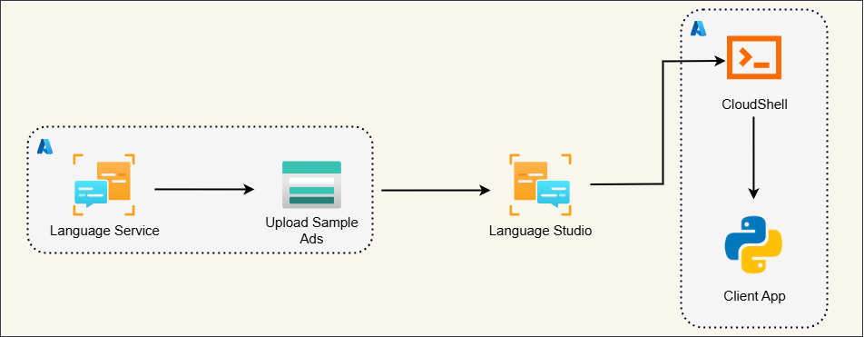
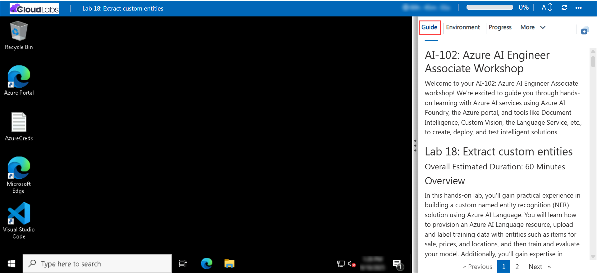

# AI-102: Azure AI Engineer Associate Workshop

Welcome to your AI-102: Azure AI Engineer Associate workshop! We’re excited to guide you through hands-on learning with Azure AI services using Azure AI Foundry, the Azure portal, and tools like Document Intelligence, Custom Vision, the Language Service, etc., to create, deploy, and test intelligent solutions.

# Lab 17: Extract custom entities

### Overall Estimated Duration: 60 Minutes

## Overview

In this hands-on lab, you’ll gain practical experience in building a custom named entity recognition (NER) solution using Azure AI Language. You will learn how to provision an Azure AI Language resource, upload and label training data with entities such as items for sale, prices, and locations, and then train and evaluate your model. Additionally, you’ll gain expertise in deploying the model and integrating it with a Python application in Azure Cloud Shell to extract entities programmatically from new text. By the end of this lab, you’ll be proficient in the end-to-end process of creating, training, deploying, and consuming a custom NER model in Azure AI Language, equipping you with the skills to apply entity extraction in real-world scenarios.

## Objectives

By the end of this lab, you will be able to:

1. **Provision an Azure AI Language resource:** Create an Azure AI Language resource in the Azure portal and retrieve the keys and endpoint required to build and integrate a custom named entity recognition (NER) solution.

2. **Upload and prepare training data:** Upload text documents to an Azure Storage container and ensure appropriate access so they can be used for labeling and model training.

3. **Create and label a custom NER project:** Use Language Studio to create a project, define entity categories (such as items, prices, and locations), and label text samples to prepare data for training.

4. **Train and evaluate your model:** Train a custom NER model with the labeled data and evaluate its accuracy using built-in metrics and test sets to identify strengths and areas for improvement.

5. **Deploy your entity extraction model:** Deploy the trained NER model in Language Studio, making it available through an API endpoint for real-time entity extraction.

6. **Configure and run a Python application in Cloud Shell:** Set up a Python environment in Azure Cloud Shell, configure application settings with your resource details, add SDK code for entity extraction, and run the app to extract entities from new text inputs.

## Pre-requisites

* Basic understanding of **natural language processing (NLP)** concepts, especially named entity recognition (NER).
* Familiarity with **Azure AI Language** concepts, including projects, datasets, and endpoints.
* Experience using the **Azure portal** and working in **Language Studio**.
* An active Azure subscription with permissions to create and manage resources in the assigned resource group.
* Basic knowledge of Python and experience working in **Cloud Shell** or similar terminal environments.

## Architecture

The lab architecture demonstrates how Azure AI Language enables custom entity extraction using labeled documents and application integration:

1. **Azure AI Language Resource:** Provision an AI Language service in the Azure portal that provides the core NLP capabilities, including training, deploying, and hosting custom entity recognition models.

2. **Azure Storage Account:** Create and configure a storage account to store and manage sample text documents. These documents are uploaded into a container and linked to the NER project for labeling and training.

3. **Language Studio:** Use the browser-based interface to create a custom NER project, define entity categories, label data, train, evaluate, and deploy the model.

4. **Cloud Shell & Python App:** Configure a development environment in Azure Cloud Shell, connect to the deployed model using endpoints and keys, and extract entities programmatically through the Azure AI Language SDK.

## Architecture Diagram

## Explanation of Components

1. **Azure AI Language Resource:** Provides NLP capabilities to build, train, deploy, and host custom named entity recognition (NER) models.

2. **Azure Storage Account:** Stores sample text documents in containers for labeling and model training.

3. **Language Studio:** A web-based interface to create NER projects, define entity categories, label data, train, evaluate, and deploy models.

4. **Cloud Shell & Python App:** A development setup to configure and run a Python app that connects to the deployed model for extracting entities from new text inputs.

# Getting Started with lab

Welcome to your AI-102: Azure AI Engineer Associate workshop! We’ve prepared an interactive environment for you to explore generative AI concepts and work with Microsoft Azure services like Azure AI Foundry, Document Intelligence, Custom Vision, Language Service, etc. Let’s get started and make the most of this hands-on experience.

## Accessing Your Lab Environment
 
Once you're ready to dive in, your virtual machine and **lab guide** will be right at your fingertips within your web browser.
 

### Virtual Machine & Lab Guide
 
Your virtual machine is your workhorse throughout the workshop. The lab guide is your roadmap to success.

## Exploring Your Lab Resources
 
To get a better understanding of your lab resources and credentials, navigate to the **Environment** tab.
 

## Managing Your Virtual Machine
 
Feel free to **Start, Restart, or Stop (2)** your virtual machine as needed from the **Resources (1)** tab. Your experience is in your hands!
 

## Lab Progress

You can use the **Progress** tab to track your progress while working on the lab. A score will be provided after successful validation.

## Utilizing the Split Window Feature
 
For convenience, you can open the lab guide in a separate window by selecting the **Split Window** button from the top right corner.
 

## Lab Guide Zoom In/Zoom Out
 
To adjust the zoom level for the environment page, click the **A↕: 100%** icon located next to the timer in the lab environment.

## Let's Get Started with Azure Portal
 
1. On your virtual machine, click on the Azure Portal icon as shown below:
 
   

1. In the sign-in window, kindly sign in using the provided Azure credentials

    - **Email/Username:** <inject key="AzureAdUserEmail"></inject>

        

    - **Password:** <inject key="AzureAdUserPassword"></inject>

        

1. If prompted to **Stay signed in?**, you can click **No**.

    

1. If a **Welcome to Microsoft Azure** pop-up window appears, simply click **Cancel** to skip the tour.

    

## Support Contact
 
The CloudLabs support team is available 24/7, 365 days a year, via email and live chat to ensure seamless assistance at any time. We offer dedicated support channels explicitly tailored for both learners and instructors, ensuring that all your needs are promptly and efficiently addressed.
 
Learner Support Contacts:
 
- Email Support: cloudlabs-support@spektrasystems.com
- Live Chat Support: https://cloudlabs.ai/labs-support

Click on **Next** from the lower right corner to move on to the next page.

   

## Happy Learning !!