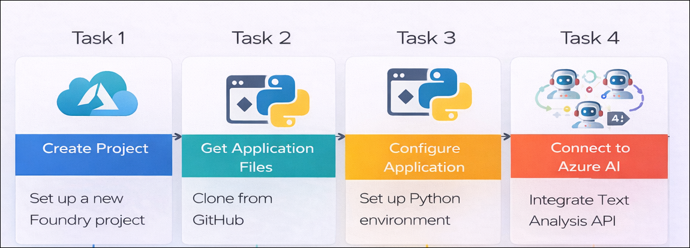
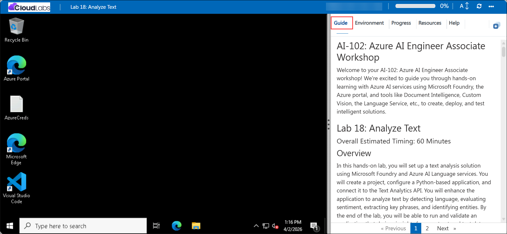

# AI-102: Azure AI Engineer Associate Workshop

Welcome to your AI-102: Azure AI Engineer Associate workshop! We’re excited to guide you through hands-on learning with Azure AI services using Microsoft Foundry, the Azure portal, and tools like Document Intelligence, Custom Vision, the Language Service, etc., to create, deploy, and test intelligent solutions.

# Lab 18: Analyze Text

### Overall Estimated Timing: 60 Minutes

## Overview

In this hands-on lab, you will set up a text analysis solution using Microsoft Foundry and Azure AI Language services. You will create a project, configure a Python-based application, and connect it to the Text Analytics API. You will enhance the application to analyze text by detecting language, evaluating sentiment, extracting key phrases, and identifying entities. By the end of the lab, you will be able to run and validate an application that derives insights from unstructured text data.

## Objectives

By the end of this lab, you will be able to:

1. **Set up the Microsoft Foundry project:** Create and configure a project in the Microsoft Foundry portal for text analysis.

2. **Configure a Python application environment:** Clone the repository, install dependencies, and set up the application configuration.

3. **Connect to Azure AI Language services:** Authenticate and integrate the Text Analytics client using the Azure SDK.

4. **Analyze text using AI capabilities:** Implement language detection, sentiment analysis, and key phrase extraction.

5. **Extract entities and insights from text:** Identify named entities and linked entities to gain deeper understanding of unstructured data.

6. **Run and validate the application:** Execute the solution and verify the analysis results from review text files.

## Pre-requisites
  
* Familiarity with Microsoft Foundry concepts such as projects, agents, and model deployments.  
* Basic understanding of Azure AI Language (Text Analytics) capabilities.
* Basic knowledge of Python and running scripts from a command-line environment.   

## Architecture

The lab architecture demonstrates how a Microsoft Foundry project integrates with Azure AI Language services to analyze and extract insights from text using a Python-based application:

1. **Microsoft Foundry Project:** A workspace created in the Microsoft Foundry portal where AI resources and configurations are managed.

2. **Azure AI Language Service:** A cloud-based service that provides natural language processing capabilities such as language detection, sentiment analysis, and entity recognition.

3. **Text Analytics Client (SDK):** A Python SDK component used to connect to the Azure AI Language service and perform text analysis operations.

4. **Python Application:** A client application that reads text data, sends it to the AI service for analysis, and processes the returned insights.

5. **Review Data (Input Files):** A collection of text files containing sample reviews that are analyzed to extract meaningful information.

## Architecture Diagram

## Explanation of Components

1. **Microsoft Foundry Project:** The central workspace where the AI solution is created and configured, including access to Azure AI services.

2. **Azure AI Language Service:** The core service that processes text and provides capabilities like language detection, sentiment analysis, and entity recognition.

3. **Text Analytics Client (SDK):** The Python SDK component used to interact with the Azure AI Language service and send text for analysis.

4. **Python Client Application:** A local application that reads review text files, sends them to the AI service, and displays the analysis results.

5. **Review Data (Input Files):** A set of sample text documents used as input for performing text analysis and extracting insights.

# Getting Started with lab

Welcome to your AI-102: Azure AI Engineer Associate workshop! We’ve prepared an interactive environment for you to explore generative AI concepts and work with Microsoft Azure services like Microsoft Foundry, Document Intelligence, Custom Vision, Language Service, etc. Let’s get started and make the most of this hands-on experience.

## Accessing Your Lab Environment
 
Once you're ready to dive in, your virtual machine and **Guide** will be right at your fingertips within your web browser.
 

### Virtual Machine & Lab Guide
 
Your virtual machine is your workhorse throughout the workshop. The lab guide is your roadmap to success.

## Exploring Your Lab Resources
 
To get a better understanding of your lab resources and credentials, navigate to the **Environment** tab.
 

## Managing Your Virtual Machine
 
Feel free to **Start, Restart, or Stop (2)** your virtual machine as needed from the **Resources (1)** tab. Your experience is in your hands!
 

## Lab Progress

You can use the **Progress** tab to track your progress while working on the lab. A score will be provided after successful validation.

## Utilizing the Split Window Feature
 
For convenience, you can open the lab guide in a separate window by selecting the **Split Window** button from the top right corner.
 

## Lab Guide Zoom In/Zoom Out
 
To adjust the zoom level for the environment page, click the **A↕: 100%** icon located next to the timer in the lab environment.

## Let's Get Started with Azure Portal
 
1. On your virtual machine, click on the Azure Portal icon as shown below:
 
    

1. In the sign-in window, kindly sign in using the provided Azure credentials

    - **Email/Username:** <inject key="AzureAdUserEmail"></inject>

        

    - **Password:** <inject key="AzureAdUserPassword"></inject>

        

1. If prompted to **Stay signed in?**, you can click **No**.

    

1. If a **Welcome to Microsoft Azure** pop-up window appears, simply click **Maybe later** to skip the tour.

    

## Support Contact
 
The CloudLabs support team is available 24/7, 365 days a year, via email and live chat to ensure seamless assistance at any time. We offer dedicated support channels explicitly tailored for both learners and instructors, ensuring that all your needs are promptly and efficiently addressed.
 
Learner Support Contacts:
 
- Email Support: cloudlabs-support@spektrasystems.com
- Live Chat Support: https://cloudlabs.ai/labs-support

Click on **Next** from the lower right corner to move on to the next page.

   

## Happy Learning !!