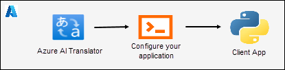
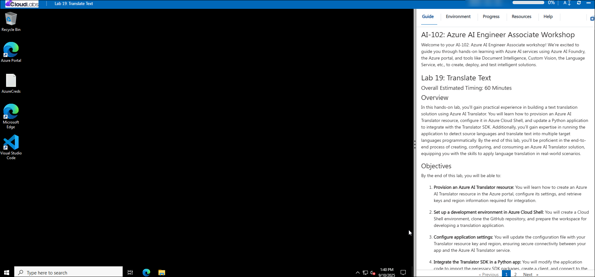
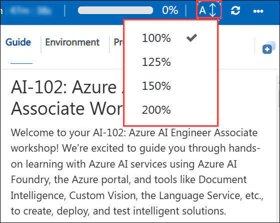
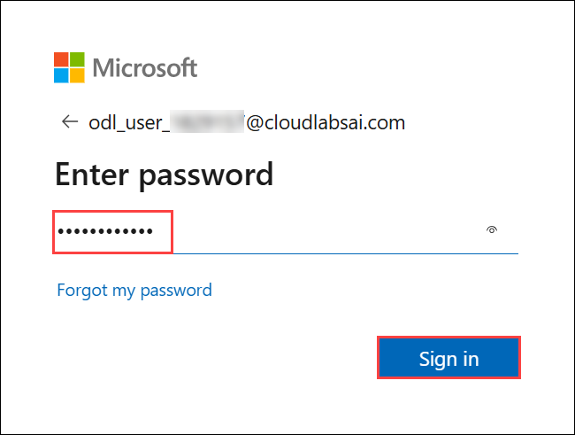
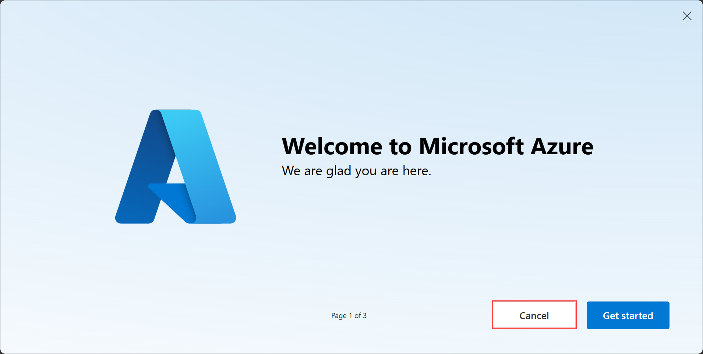

# AI-102: Azure AI Engineer Associate Workshop

Welcome to your AI-102: Azure AI Engineer Associate workshop! We’re excited to guide you through hands-on learning with Azure AI services using Azure AI Foundry, the Azure portal, and tools like Document Intelligence, Custom Vision, the Language Service, etc., to create, deploy, and test intelligent solutions.

# Lab 19: Translate Text

### Overall Estimated Timing: 30 Minutes

## Overview

In this hands-on lab, you'll gain practical experience in building a text translation solution using Azure AI Translator. You will learn how to provision an Azure AI Translator resource, configure it in Azure Cloud Shell, and update a Python application to integrate with the Translator SDK. Additionally, you’ll gain expertise in running the application to detect source languages and translate text into multiple target languages programmatically. By the end of this lab, you'll be proficient in the end-to-end process of creating, configuring, and consuming an Azure AI Translator solution, equipping you with the skills to apply language translation in real-world scenarios.

## Objectives

By the end of this lab, you will be able to:

1. **Provision an Azure AI Translator resource:** You will learn how to create an Azure AI Translator resource in the Azure portal, configure its settings, and retrieve keys and region information required for integration.

1. **Set up a development environment in Azure Cloud Shell:** You will create a Cloud Shell environment, clone the GitHub repository, and prepare the workspace for developing a translation application.

1. **Configure application settings:** You will update the configuration file with your Translator resource key and region, ensuring secure connectivity between your app and the Azure AI Translator service.

1. **Integrate the Translator SDK in a Python app:** You will modify the application code to import the necessary SDK packages, create a client, and connect to the Translator service.

1. **Translate text interactively:** You will run the Python app in Cloud Shell, select a target language, and test translation by providing text inputs, observing how the app automatically detects the source language and returns accurate translations.

## Pre-requisites

- Familiarity with Python programming and package management.

- Experience working in Azure Cloud Shell and using command-line tools.

## Architecture

The lab architecture demonstrates how Azure AI Language enables custom text classification using uploaded documents and application integration:

1. **Azure AI Language Resource:** Learning how to provision an AI Language service in the Azure portal that provides the core NLP capabilities, including training, deploying, and hosting custom classification models.

1. **Azure Storage Account:** Understanding how to create and configure a storage account to store and manage sample articles. These articles are uploaded into a container and linked to the classification project for labeling and training.

1. **Language Studio:** Gaining experience using the browser-based interface to create a classification project, label data, train, evaluate, and deploy the model.

1. **Cloud Shell & Python App:** Learning how to configure a development environment in Azure Cloud Shell, connect to the deployed model using endpoints and keys, and classify text files programmatically through the Azure AI Language SDK.

## Architecture Diagram

## Explanation of Components

1. **Azure AI Translator Resource:** Provides translation services that enable multilingual text processing, including detecting source languages and translating into target languages.

1. **Cloud Shell:** A browser-based development environment in the Azure portal used to set up, configure, and run the translation application without requiring local tools.

1. **Python Application:** A console app developed in Cloud Shell that integrates with the Translator resource using keys and endpoints to perform text translation programmatically.

# Getting Started with lab

Welcome to your AI-102: Azure AI Engineer Associate workshop! We’ve prepared an interactive environment for you to explore generative AI concepts and work with Microsoft Azure services like Azure AI Foundry, Document Intelligence, Custom Vision, Language Service, etc. Let’s get started and make the most of this hands-on experience.

## Accessing Your Lab Environment
 
Once you're ready to dive in, your virtual machine and **Guide** will be right at your fingertips within your web browser.
 

## Lab Guide Zoom In/Zoom Out
 
To adjust the zoom level for the environment page, click the **A↕: 100%** icon located next to the timer in the lab environment.

### Virtual Machine & Lab Guide
 
Your virtual machine is your workhorse throughout the workshop. The lab guide is your roadmap to success.

## Exploring Your Lab Resources
 
To get a better understanding of your lab resources and credentials, navigate to the **Environment** tab.
 

## Utilizing the Split Window Feature
 
For convenience, you can open the lab guide in a separate window by selecting the **Split Window** button from the top right corner.
 

## Managing Your Virtual Machine
 
Feel free to **Start, Restart, or Stop (2)** your virtual machine as needed from the **Resources (1)** tab. Your experience is in your hands!
 

## Lab Progress

You can use the **Progress** tab to track your progress while working on the lab. A score will be provided after successful validation.

## Let's Get Started with Azure Portal
 
1. On your virtual machine, click on the Azure Portal icon as shown below:
 
   

1. In the sign-in window, kindly sign in using the provided Azure credentials

    - **Email/Username:** <inject key="AzureAdUserEmail"></inject>

        

    - **Password:** <inject key="AzureAdUserPassword"></inject>

        

1. If prompted to **Stay signed in?**, you can click **No**.

    

1. If a **Welcome to Microsoft Azure** pop-up window appears, simply click **Cancel** to skip the tour.

    

## Support Contact
 
The CloudLabs support team is available 24/7, 365 days a year, via email and live chat to ensure seamless assistance at any time. We offer dedicated support channels explicitly tailored for both learners and instructors, ensuring that all your needs are promptly and efficiently addressed.
 
Learner Support Contacts:
 
- Email Support: cloudlabs-support@spektrasystems.com
- Live Chat Support: https://cloudlabs.ai/labs-support

Click on **Next** from the lower right corner to move on to the next page.

   

## Happy Learning !!
