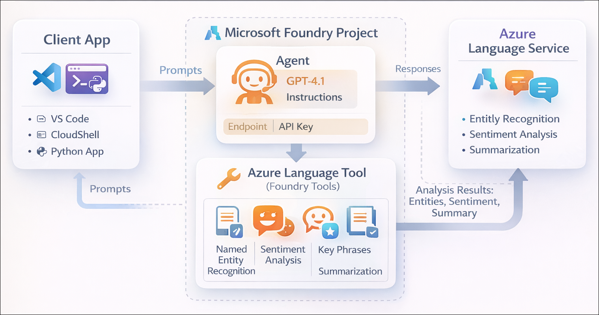

# Getting Started with your AI-102: Azure AI Engineer Associate Workshop

Welcome to your AI-102: Azure AI Engineer Associate workshop! We’re excited to guide you through hands-on learning with Azure AI services using Microsoft Foundry, the Azure portal, and tools like Document Intelligence, Custom Vision, the Language Service, etc., to create, deploy, and test intelligent solutions.

# Lab 19: Develop a text analysis agent

### Overall Estimated Duration: 60 Minutes

## Overview

In this hands-on lab, you’ll gain practical experience in building an AI-powered text analysis solution using **Microsoft Foundry**. You’ll begin by creating a Foundry project and configuring an intelligent agent capable of analyzing and summarizing text. You’ll then integrate **Azure Language** tools to enable capabilities such as named entity recognition, key phrase extraction, and sentiment analysis.

Next, you’ll work in **Visual Studio Code** to set up a Python-based client application, configure environment variables, and use the Foundry SDK to interact with your agent programmatically. You’ll authenticate with Azure, run the application, and test it with real-world text inputs to extract insights. By the end of this lab, you’ll be confident in building, extending, and integrating a text analysis agent into a client application for practical scenarios.

## Objectives

By the end of this lab, you will be able to:

1. **Create and configure a Microsoft Foundry project**: Set up a new project with the required Azure resources and capture the endpoint and key for later use.
2. **Build and configure a text analysis agent**: Create an agent, select an appropriate model, and define instructions to analyze and summarize text.
3. **Integrate Azure Language tools with the agent**: Connect the Azure Language tool and enable capabilities such as entity recognition, summarization, and sentiment analysis.
4. **Test and configure tool usage in the playground**: Validate the agent’s functionality, review outputs, and configure automatic tool approval settings.
5. **Set up and configure a Python client application**: Clone the sample repository, install dependencies, and configure environment variables in Visual Studio Code.
6. **Implement agent interaction using the Foundry SDK**: Write Python code to connect to the agent, send prompts, and process responses programmatically.
7. **Authenticate and test the application**: Sign in to Azure, run the application, and validate text analysis outputs such as entities, dates, and sentiment.
8. **Analyze response details and tool usage**: Inspect detailed responses to understand how the agent uses Azure Language tools to generate insights.

## Pre-requisites

* Basic understanding of AI agents and text analysis concepts such as summarization, entity recognition, and sentiment analysis.
* Familiarity with **Microsoft Foundry** and **Azure AI Language** services.
* Experience navigating the **Azure portal** and working with **Visual Studio Code**.
* An active Azure subscription with permissions to create and manage resources in the assigned resource group.
* Basic knowledge of Python and experience working with virtual environments and terminal commands.
* Understanding of environment variables and how they are used to configure applications.

## Architecture

The lab architecture demonstrates how an **AI-powered text analysis solution** is built and accessed using **Microsoft Foundry** and **Azure AI Language**:

1. **Microsoft Foundry Project**: Acts as the central workspace that manages resources, agents, connections, and endpoints required for building and deploying AI solutions.

2. **Text Analysis Agent**: A custom AI agent configured with a foundation model (such as GPT-4.1) and instructions to analyze, summarize, and extract insights from text.

3. **Azure Language Tool (MCP Tool Connection)**: Provides advanced text analysis capabilities such as named entity recognition, summarization, and sentiment analysis, which the agent can invoke when processing requests.

4. **Agent Playground (Foundry Portal)**: Enables interactive testing of the agent, allowing users to submit prompts, approve tool usage, and review responses and execution logs.

5. **Foundry Endpoint and API Access**: Exposes the agent through a secure endpoint that client applications can use to send prompts and receive responses programmatically.

6. **Python Client Application (Visual Studio Code)**: Connects to the Foundry endpoint using the SDK and Azure authentication, allowing users to interact with the agent from a local environment.

7. **User Interaction**: Users provide input text through the playground or client application, and the agent processes it using Azure Language tools to return structured insights such as summaries, entities, dates, and sentiment.

## Architecture Diagram

## Explanation of Components

1. **Microsoft Foundry Project**: Serves as the central environment for building and managing AI solutions, including agents, tool connections, and access credentials such as endpoints and API keys.

2. **Text Analysis Agent**: A custom-configured AI agent that uses a foundation model to process user input and perform tasks such as summarization, entity extraction, and sentiment analysis based on defined instructions.

3. **Azure Language Tool (MCP Tool Connection)**: Extends the agent’s capabilities by providing prebuilt text analysis features like named entity recognition, key phrase extraction, and sentiment detection, which the agent can invoke dynamically.

4. **Agent Playground (Foundry Portal)**: Offers an interactive interface to test and validate the agent’s behavior, review responses, approve tool usage, and analyze execution logs.

5. **Foundry Endpoint and API Access**: Provides a secure interface for external applications to communicate with the agent, enabling programmatic interaction through SDKs or REST APIs.

6. **Python Client Application (Visual Studio Code)**: Acts as the user-facing application that connects to the Foundry project using authentication, sends prompts to the agent, and displays processed results.

7. **User Interaction**: Users submit text inputs through the playground or client application, and the agent processes them using Azure Language tools to return meaningful insights such as summaries, entities, dates, and sentiment.

## Accessing Your Lab Environment
 
Once you're ready to dive in, your virtual machine and **Guide** will be right at your fingertips within your web browser.
 

## Virtual Machine & Lab Guide
 
Your virtual machine is your workhorse throughout the workshop. The lab guide is your roadmap to success.

## Exploring Your Lab Resources
 
To get a better understanding of your lab resources and credentials, navigate to the **Environment** tab.
 

## Managing Your Virtual Machine
 
Feel free to **Start, Restart, or Stop (2)** your virtual machine as needed from the **Resources (1)** tab. Your experience is in your hands!
 

## Lab Progress

You can use the **Progress** tab to track your progress while working on the lab. A score will be provided after successful validation.

## Utilizing the Split Window Feature
 
For convenience, you can open the lab guide in a separate window by selecting the **Split Window** button from the top right corner.
 

## Lab Guide Zoom In/Zoom Out
 
To adjust the zoom level for the environment page, click the **A↕: 100%** icon located next to the timer in the lab environment.

## Let's Get Started with Azure Portal
 
1. On your virtual machine, click on the Azure Portal icon as shown below:
 
    

1. In the sign-in window, kindly sign in using the provided Azure credentials

    - **Email/Username:** <inject key="AzureAdUserEmail"></inject>

        

    - **Password:** <inject key="AzureAdUserPassword"></inject>

        

1. If prompted to **Stay signed in?**, you can click **No**.

    

1. If a **Welcome to Microsoft Azure** pop-up window appears, simply click **Maybe later** to skip the tour.

    

## Support Contact
 
The CloudLabs support team is available 24/7, 365 days a year, via email and live chat to ensure seamless assistance at any time. We offer dedicated support channels explicitly tailored for both learners and instructors, ensuring that all your needs are promptly and efficiently addressed.
 
Learner Support Contacts:
 
- Email Support: cloudlabs-support@spektrasystems.com
- Live Chat Support: https://cloudlabs.ai/labs-support

Click on **Next** from the lower right corner to move on to the next page.

   

## Happy Learning !!

