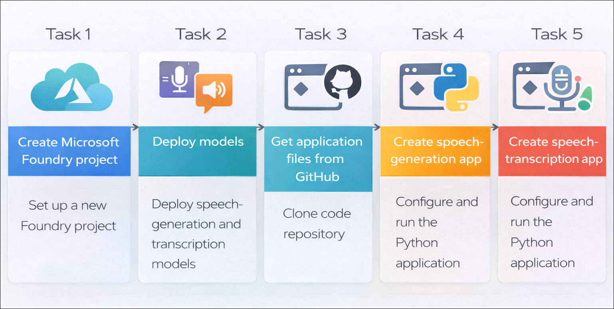
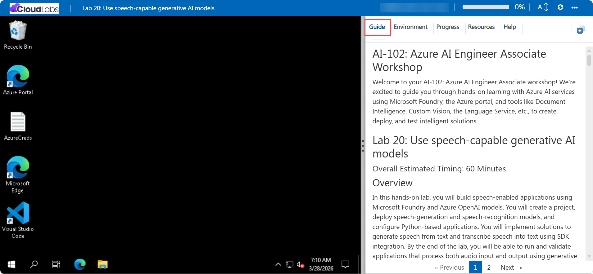

# Getting Started with your AI-102: Azure AI Engineer Associate Workshop

Welcome to your AI-102: Azure AI Engineer Associate workshop! We’re excited to guide you through hands-on learning with Azure AI services using Microsoft Foundry, the Azure portal, and tools like Document Intelligence, Custom Vision, the Language Service, etc., to create, deploy, and test intelligent solutions.

# Lab 20: Use speech-capable generative AI models

### Overall Estimated Timing: 60 Minutes

## Overview

In this hands-on lab, you will build speech-enabled applications using Microsoft Foundry and Azure OpenAI models. You will create a project, deploy speech-generation and speech-recognition models, and configure Python-based applications. You will implement solutions to generate speech from text and transcribe speech into text using SDK integration. By the end of the lab, you will be able to run and validate applications that process both audio input and output using generative AI models.

## Objectives

By the end of this lab, you will be able to:

1. **Create and configure a Foundry project:** Set up a new project in Microsoft Foundry and prepare the environment for building speech-enabled applications.

2. **Deploy speech-capable generative AI models:** Deploy text-to-speech and speech-to-text models to enable audio generation and transcription capabilities.

3. **Set up a Python development environment:** Clone the required GitHub repository, install dependencies, and configure application settings.

4. **Develop a speech-generation application:** Build and run a Python application that converts text into speech using a deployed model.

5. **Develop a speech-transcription application:** Build and run a Python application that converts audio into text using a deployed model.

6. **Test and validate speech applications:** Execute both applications to verify speech generation and transcription outputs.

## Pre-requisites
    
* Familiarity with Microsoft Foundry concepts such as projects, agents, and model deployments.  
* Basic knowledge of Python and running scripts from a command-line environment.   

## Architecture

The lab architecture demonstrates how a Microsoft Foundry project integrates speech-capable generative AI models with Python applications to enable speech generation and transcription:

1. **Microsoft Foundry Project:** A workspace created in the Microsoft Foundry portal where AI models are deployed and managed for building applications.

2. **Speech Generation Model (gpt-4o-mini-tts):** A deployed model that converts text input into natural-sounding speech output.

3. **Speech Transcription Model (gpt-4o-mini-transcribe):** A deployed model that processes audio input and converts it into text.

4. **Python Applications:** Client applications that connect to the Foundry project endpoint, authenticate using Azure credentials, and interact with the deployed models for speech generation and transcription.

5. **Audio Input/Output:** The system handles text input to generate audio files and processes audio files to produce text output.

## Architecture Diagram

## Explanation of Components

1. **Microsoft Foundry Project:** The central workspace where speech-capable AI models are deployed and managed for building and testing applications.

2. **Speech Generation Model (gpt-4o-mini-tts):** The model responsible for converting text input into natural-sounding speech output.

3. **Speech Transcription Model (gpt-4o-mini-transcribe):** The model that processes audio input and converts spoken content into text.

4. **Python Applications:** The client applications that connect to the Foundry endpoint, authenticate using Azure credentials, and interact with the deployed models.

5. **Audio Files:** Input and output files used by the applications, where text is converted into audio and audio is transcribed back into text.

## Accessing Your Lab Environment
 
Once you're ready to dive in, your virtual machine and **Guide** will be right at your fingertips within your web browser.
 

## Virtual Machine & Lab Guide
 
Your virtual machine is your workhorse throughout the workshop. The lab guide is your roadmap to success.

## Exploring Your Lab Resources
 
To get a better understanding of your lab resources and credentials, navigate to the **Environment** tab.
 

## Managing Your Virtual Machine
 
Feel free to **Start, Restart, or Stop (2)** your virtual machine as needed from the **Resources (1)** tab. Your experience is in your hands!
 

## Lab Progress

You can use the **Progress** tab to track your progress while working on the lab. A score will be provided after successful validation.

## Utilizing the Split Window Feature
 
For convenience, you can open the lab guide in a separate window by selecting the **Split Window** button from the top right corner.
 

## Lab Guide Zoom In/Zoom Out
 
To adjust the zoom level for the environment page, click the **A↕: 100%** icon located next to the timer in the lab environment.

## Let's Get Started with Azure Portal
 
1. On your virtual machine, click on the Azure Portal icon as shown below:
 
    

1. In the sign-in window, kindly sign in using the provided Azure credentials

    - **Email/Username:** <inject key="AzureAdUserEmail"></inject>

        

    - **Password:** <inject key="AzureAdUserPassword"></inject>

        

1. If prompted to **Stay signed in?**, you can click **No**.

    

1. If a **Welcome to Microsoft Azure** pop-up window appears, simply click **Maybe later** to skip the tour.

    

## Support Contact
 
The CloudLabs support team is available 24/7, 365 days a year, via email and live chat to ensure seamless assistance at any time. We offer dedicated support channels explicitly tailored for both learners and instructors, ensuring that all your needs are promptly and efficiently addressed.
 
Learner Support Contacts:
 
- Email Support: cloudlabs-support@spektrasystems.com
- Live Chat Support: https://cloudlabs.ai/labs-support

Click on **Next** from the lower right corner to move on to the next page.

   

## Happy Learning !!
