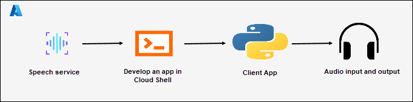

# AI-102: Azure AI Engineer Associate Workshop

Welcome to your AI-102: Azure AI Engineer Associate workshop! We’re excited to guide you through hands-on learning with Azure AI services using Azure AI Foundry, the Azure portal, and tools like Document Intelligence, Custom Vision, the Language Service, etc., to create, deploy, and test intelligent solutions.

# Lab 21: Translate Speech

### Overall Estimated Timing: 30 Minutes

## Overview

In this hands-on lab, you'll gain practical experience in building a speech translation solution using Azure AI Speech. You will learn how to provision an Azure AI Speech resource, configure it in Azure Cloud Shell, and update a Python application to integrate with the Speech SDK. Additionally, you’ll gain expertise in recognizing spoken input, translating it into multiple target languages, and synthesizing the translations into speech. By the end of this lab, you'll be proficient in the end-to-end process of creating, configuring, and consuming an Azure AI Speech solution, equipping you with the skills to apply multilingual speech translation in real-world scenarios.

## Objectives

By the end of this lab, you will be able to:

1. **Provision an Azure AI Speech resource:** You will learn how to create an Azure AI Speech resource in the Azure portal, configure its settings, and retrieve keys and region information required for integration.

1. **Set up a development environment in Azure Cloud Shell:** You will create a Cloud Shell environment, clone the GitHub repository, and prepare the workspace for developing a speech translation application.

1. **Configure application settings:** You will update the configuration file with your Speech resource key and region, ensuring secure connectivity between your app and the Azure AI Speech service.

1. **Integrate the Speech SDK in a Python app:** You will modify the application code to import the necessary SDK packages, configure speech recognition, translation, and synthesis, and connect to the Speech service.

1. **Translate and synthesize speech:** You will run the Python app in Cloud Shell, provide audio input, translate it into multiple target languages, and generate synthesized speech output to test end-to-end speech translation functionality.

## Pre-requisites

- Familiarity with Python programming and package management.

- Experience working in Azure Cloud Shell and using command-line tools.

## Architecture

The lab architecture demonstrates how Azure AI Speech enables real-time speech translation and synthesis:

1. **Azure AI Speech Resource:** Learning how to provision a Speech service in the Azure portal that provides speech-to-text, translation, and text-to-speech capabilities.

1. **Azure Cloud Shell:** Gaining experience in setting up a Cloud Shell environment to develop, run, and test the Python application.

1. **Python Application:** Understanding how to integrate the Azure AI Speech SDK in a Python app to recognize spoken input, translate it into multiple languages, and synthesize the translations into speech.

1. **Audio Input & Output:** Using a sample .wav audio file as input for translation and generating output .wav files to hear the translated speech.

## Architecture Diagram

## Explanation of Components

1. **Azure AI Speech Resource:** Provides speech services including speech-to-text, real-time translation, and text-to-speech synthesis, enabling multilingual speech processing.

1. **Cloud Shell:** A browser-based development environment in the Azure portal used to set up, configure, and run the speech translation application without requiring local tools.

1. **Python Application:** A console app developed in Cloud Shell that integrates with the Speech resource using keys and endpoints to perform speech recognition, translation, and synthesis programmatically.

1. **Audio Files:** Sample .wav files used as input for speech translation and output for synthesized speech, allowing users to test end-to-end functionality.

# Getting Started with lab

Welcome to your AI-102: Azure AI Engineer Associate workshop! We’ve prepared an interactive environment for you to explore generative AI concepts and work with Microsoft Azure services like Azure AI Foundry, Document Intelligence, Custom Vision, Language Service, etc. Let’s get started and make the most of this hands-on experience.

## Accessing Your Lab Environment
 
Once you're ready to dive in, your virtual machine and **Guide** will be right at your fingertips within your web browser.
 

## Lab Guide Zoom In/Zoom Out
 
To adjust the zoom level for the environment page, click the **A↕: 100%** icon located next to the timer in the lab environment.

### Virtual Machine & Lab Guide
 
Your virtual machine is your workhorse throughout the workshop. The lab guide is your roadmap to success.

## Exploring Your Lab Resources
 
To get a better understanding of your lab resources and credentials, navigate to the **Environment** tab.
 

## Utilizing the Split Window Feature
 
For convenience, you can open the lab guide in a separate window by selecting the **Split Window** button from the top right corner.
 

## Managing Your Virtual Machine
 
Feel free to **Start, Restart, or Stop (2)** your virtual machine as needed from the **Resources (1)** tab. Your experience is in your hands!
 

## Lab Progress

You can use the **Progress** tab to track your progress while working on the lab. A score will be provided after successful validation.

## Let's Get Started with Azure Portal
 
1. On your virtual machine, click on the Azure Portal icon as shown below:
 
   

1. In the sign-in window, kindly sign in using the provided Azure credentials

    - **Email/Username:** <inject key="AzureAdUserEmail"></inject>

        

    - **Password:** <inject key="AzureAdUserPassword"></inject>

        

1. If prompted to **Stay signed in?**, you can click **No**.

    

1. If a **Welcome to Microsoft Azure** pop-up window appears, simply click **Cancel** to skip the tour.

    

## Support Contact
 
The CloudLabs support team is available 24/7, 365 days a year, via email and live chat to ensure seamless assistance at any time. We offer dedicated support channels explicitly tailored for both learners and instructors, ensuring that all your needs are promptly and efficiently addressed.
 
Learner Support Contacts:
 
- Email Support: cloudlabs-support@spektrasystems.com
- Live Chat Support: https://cloudlabs.ai/labs-support

Click on **Next** from the lower right corner to move on to the next page.

   

## Happy Learning !!
