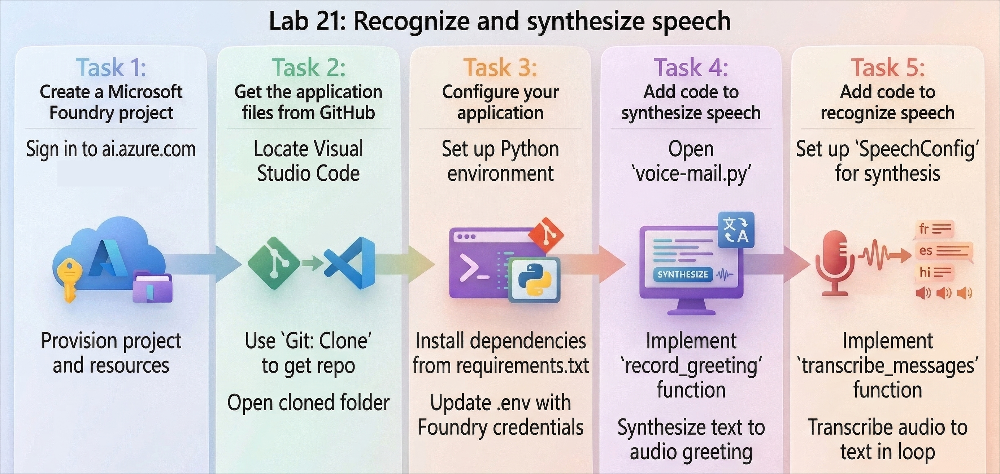
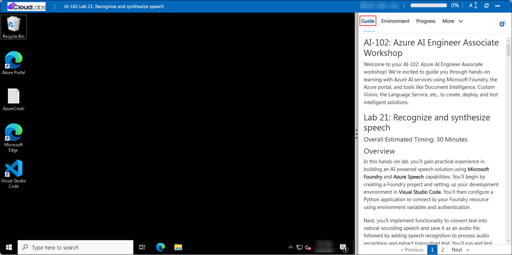

# AI-102: Azure AI Engineer Associate Workshop

Welcome to your AI-102: Azure AI Engineer Associate workshop! We’re excited to guide you through hands-on learning with Azure AI services using Microsoft Foundry, the Azure portal, and tools like Document Intelligence, Custom Vision, the Language Service, etc., to create, deploy, and test intelligent solutions.

# Lab 21: Recognize and synthesize speech

### Overall Estimated Timing: 45 Minutes

## Overview

In this hands-on lab, you’ll gain practical experience in building an AI-powered speech solution using **Microsoft Foundry** and **Azure Speech** capabilities. You’ll begin by creating a Foundry project and setting up your development environment in **Visual Studio Code**. You’ll then configure a Python application to connect to your Foundry resource using environment variables and authentication.

Next, you’ll implement functionality to convert text into natural-sounding speech and save it as an audio file, followed by adding speech recognition to process audio recordings and extract transcribed text. You’ll run and test the application to see how text-to-speech and speech-to-text work together in a real-world workflow. By the end of this lab, you’ll be confident in integrating speech capabilities into applications and building voice-enabled solutions using Azure AI services.

## Objectives

By the end of this lab, you will be able to:

1. **Provision and configure a Microsoft Foundry project:** You will learn how to create a Foundry project, configure required resources, and retrieve the endpoint and API key for application integration.

2. **Set up a development environment in Visual Studio Code:** You will clone a GitHub repository, create a Python virtual environment, and prepare your workspace for building a speech-enabled application.

3. **Configure application settings using environment variables:** You will update the configuration file with the Foundry endpoint and API key to enable secure communication with Azure AI services.

4. **Integrate the Azure Speech SDK in a Python application:** You will modify the application code to import required libraries, configure speech settings, and establish a connection to the Speech service.

5. **Implement text-to-speech functionality:** You will add code to synthesize text into speech and save it as an audio file for playback.

6. **Implement speech-to-text functionality:** You will enhance the application to process audio files and transcribe spoken content into text.

7. **Run and test the speech-enabled application:** You will execute the Python application, interact with its features, and validate how speech synthesis and recognition work together in a real-world scenario.

## Pre-requisites

* Basic understanding of speech processing concepts such as speech-to-text and text-to-speech.
* Familiarity with **Microsoft Foundry** and **Azure AI Speech** services.
* Experience using the **Azure portal** and navigating cloud resources.
* An active Azure subscription with permissions to create and manage resources in the assigned resource group.
* Basic knowledge of Python and experience working with **Visual Studio Code**.
* Understanding of virtual environments, package installation, and running Python scripts from a terminal.
* Basic knowledge of environment variables and how they are used to configure applications.

## Architecture

The lab architecture demonstrates how a **speech-enabled application** is built and accessed using **Microsoft Foundry** and **Azure AI Speech**:

1. **Microsoft Foundry Project**: Acts as the central workspace that manages resources, authentication details, and endpoints required to access Azure AI Speech services.

2. **Azure AI Speech Service**: Provides core capabilities for speech processing, including text-to-speech (speech synthesis) and speech-to-text (speech recognition).

3. **Application Configuration (.env file)**: Stores essential connection details such as the Foundry endpoint and API key, enabling secure communication between the application and the Speech service.

4. **Python Application (Visual Studio Code)**: Implements the business logic using the Azure Speech SDK to handle speech synthesis and recognition tasks.

5. **Speech SDK Integration**: Enables the application to interact with the Speech service by configuring audio input/output, voice settings, and recognition parameters.

6. **Audio Input and Output**: The system processes user-provided text to generate audio files (speech synthesis) and consumes audio recordings to produce transcribed text (speech recognition).

7. **User Interaction**: Users interact with the application via the terminal, providing text or audio input, and receive outputs in the form of synthesized speech or transcribed text, demonstrating an end-to-end speech processing workflow.

## Architecture Diagram

## Explanation of Components

1. **Microsoft Foundry Project**: Serves as the central environment for managing Azure resources, endpoints, and authentication details required to access speech capabilities within the application.

2. **Azure AI Speech Service**: Provides the core functionality for processing audio, including converting text into natural-sounding speech (text-to-speech) and converting spoken audio into text (speech-to-text).

3. **Application Configuration (.env file)**: Stores sensitive connection details such as the Foundry endpoint and API key, allowing the application to securely connect to Azure services without hardcoding credentials.

4. **Python Application (Visual Studio Code)**: Acts as the main interface where the application logic is implemented, enabling interaction with the Speech service through code execution.

5. **Speech SDK Integration**: Provides the libraries and APIs required to configure speech settings, handle audio input/output, and interact with the Azure AI Speech service programmatically.

6. **Audio Input and Output**: Handles user-provided text and audio files—converting text into speech audio files and processing audio recordings to extract transcribed text.

7. **User Interaction**: Users interact with the application through the terminal by entering text or selecting options, and receive outputs such as generated audio files or transcribed text, demonstrating real-world speech processing scenarios.

# Getting Started with lab

Welcome to your AI-102: Azure AI Engineer Associate workshop! We’ve prepared an interactive environment for you to explore generative AI concepts and work with Microsoft Azure services like Microsoft Foundry, Document Intelligence, Custom Vision, Language Service, etc. Let’s get started and make the most of this hands-on experience.

## Accessing Your Lab Environment
 
Once you're ready to dive in, your virtual machine and **Guide** will be right at your fingertips within your web browser.
 

## Lab Guide Zoom In/Zoom Out
 
To adjust the zoom level for the environment page, click the **A↕: 100%** icon located next to the timer in the lab environment.

### Virtual Machine & Lab Guide
 
Your virtual machine is your workhorse throughout the workshop. The lab guide is your roadmap to success.

## Exploring Your Lab Resources
 
To get a better understanding of your lab resources and credentials, navigate to the **Environment** tab.
 

## Utilizing the Split Window Feature
 
For convenience, you can open the lab guide in a separate window by selecting the **Split Window** button from the top right corner.
 

## Lab Progress

You can use the **Progress** tab to track your progress while working on the lab. A score will be provided after successful validation.

## Managing Your Virtual Machine
 
Feel free to **Start, Restart, or Stop (2)** your virtual machine as needed from the **Resources (1)** tab. Your experience is in your hands!
 

## Let's Get Started with Azure Portal
 
1. On your virtual machine, click on the Azure Portal icon as shown below:
 
   

1. In the sign-in window, kindly sign in using the provided Azure credentials

    - **Email/Username:** <inject key="AzureAdUserEmail"></inject>

        

    - **Password:** <inject key="AzureAdUserPassword"></inject>

        

1. If prompted to **Stay signed in?**, you can click **No**.

    

1. If a **Welcome to Microsoft Azure** pop-up window appears, simply click **Cancel** to skip the tour.

    

## Support Contact
 
The CloudLabs support team is available 24/7, 365 days a year, via email and live chat to ensure seamless assistance at any time. We offer dedicated support channels explicitly tailored for both learners and instructors, ensuring that all your needs are promptly and efficiently addressed.
 
Learner Support Contacts:
 
- Email Support: cloudlabs-support@spektrasystems.com
- Live Chat Support: https://cloudlabs.ai/labs-support

Click on **Next** from the lower right corner to move on to the next page.

   

## Happy Learning !!
