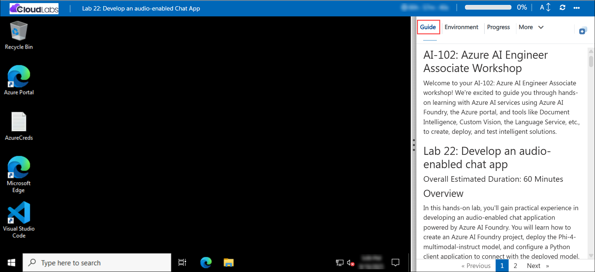

# AI-102: Azure AI Engineer Associate Workshop

Welcome to your AI-102: Azure AI Engineer Associate workshop! We’re excited to guide you through hands-on learning with Azure AI services using Azure AI Foundry, the Azure portal, and tools like Document Intelligence, Custom Vision, the Language Service, etc., to create, deploy, and test intelligent solutions.

# Lab 22: Develop an audio-enabled chat app

### Overall Estimated Duration: 60 Minutes

## Overview

In this hands-on lab, you’ll gain practical experience in developing an audio-enabled chat application powered by Azure AI Foundry. You will learn how to create an Azure AI Foundry project, deploy the Phi-4-multimodal-instruct model, and configure a Python client application to connect with the deployed model. You’ll then enhance the application to handle multimodal inputs by encoding audio files, combining them with text prompts, and submitting them to the model. By testing the app with different audio samples, you’ll observe the model’s ability to transcribe, summarize, and respond to audio-based inputs in real time. By the end of this lab, you’ll be proficient in deploying a multimodal AI model, building and running a client application, and leveraging Azure AI Foundry for interactive audio-to-text experiences.

## Objectives

By the end of this lab, you will be able to:

1. **Create an Azure AI Foundry project:** Set up a project in Azure AI Foundry and deploy the Phi-4-multimodal-instruct model to enable multimodal interactions.

2. **Configure a client application in Azure Cloud Shell:** Clone the required repository, install dependencies, and prepare a Python app to connect to the deployed model.

3. **Connect your application to the deployed model:** Write code to initialize the Foundry project client, obtain a chat client, and securely connect to the model.

4. **Submit audio-based prompts:** Enhance your app to encode audio files, attach them to user messages, and send both audio and text inputs to the model.

5. **Run and test the application:** Sign in to Azure, execute the Python app in Cloud Shell, and observe how the model responds to audio and text inputs in real time.

6. **Experiment with different audio inputs:** Modify your application to process alternate audio files and explore how the model generates summaries and insights from varied audio prompts.

## Pre-requisites

* Basic understanding of **multimodal AI concepts**, including how models process both text and audio inputs.
* Familiarity with **Azure AI Foundry**, including projects, deployments, and endpoints.
* Experience using the **Azure portal** and navigating **Cloud Shell**.
* An active Azure subscription with permissions to create and manage resources in the assigned resource group.
* Basic knowledge of Python and experience working in **Cloud Shell** or similar terminal environments.

## Architecture

The lab architecture demonstrates how Azure AI Foundry enables multimodal interactions by combining audio and text processing with application integration:

1. **Azure AI Foundry Project and Model Deployment:** Provision an Azure AI Foundry project and deploy the **Phi-4-multimodal-instruct** model, which provides the core multimodal capabilities for processing both text and audio inputs.

2. **Azure AI Foundry Endpoint:** Use the project endpoint generated during deployment to connect client applications securely to the multimodal model.

3. **Azure Cloud Shell:** Set up a development environment in Cloud Shell to configure dependencies, clone code repositories, and run the Python client application.

4. **Python Client Application:** Build and configure a Python app that connects to the deployed model, encodes audio files, submits audio and text prompts, and retrieves real-time responses using the Azure AI Model Inference SDK.

## Architecture Diagram

## Explanation of Components

1. **Azure AI Foundry Project and Model Deployment:** Provides the environment to deploy and manage the **Phi-4-multimodal-instruct** model, enabling multimodal AI capabilities for both text and audio inputs.

2. **Azure AI Foundry Endpoint:** Acts as the connection point that allows client applications to securely interact with the deployed model for real-time processing.

3. **Azure Cloud Shell:** A browser-based terminal environment used to configure dependencies, clone the lab repository, and run the Python client app.

4. **Python Client Application:** A sample application that connects to the deployed model, encodes and submits audio files along with text prompts, and retrieves responses using the Azure AI Model Inference SDK.

# Getting Started with lab

Welcome to your AI-102: Azure AI Engineer Associate workshop! We’ve prepared an interactive environment for you to explore generative AI concepts and work with Microsoft Azure services like Azure AI Foundry, Document Intelligence, Custom Vision, Language Service, etc. Let’s get started and make the most of this hands-on experience.

## Accessing Your Lab Environment
 
Once you're ready to dive in, your virtual machine and **lab guide** will be right at your fingertips within your web browser.
 

### Virtual Machine & Lab Guide
 
Your virtual machine is your workhorse throughout the workshop. The lab guide is your roadmap to success.

## Exploring Your Lab Resources
 
To get a better understanding of your lab resources and credentials, navigate to the **Environment** tab.
 

## Managing Your Virtual Machine
 
Feel free to **Start, Restart, or Stop (2)** your virtual machine as needed from the **Resources (1)** tab. Your experience is in your hands!
 

## Lab Progress

You can use the **Progress** tab to track your progress while working on the lab. A score will be provided after successful validation.

## Utilizing the Split Window Feature
 
For convenience, you can open the lab guide in a separate window by selecting the **Split Window** button from the top right corner.
 

## Lab Guide Zoom In/Zoom Out
 
To adjust the zoom level for the environment page, click the **A↕: 100%** icon located next to the timer in the lab environment.

## Let's Get Started with Azure Portal
 
1. On your virtual machine, click on the Azure Portal icon as shown below:
 
   

1. In the sign-in window, kindly sign in using the provided Azure credentials

    - **Email/Username:** <inject key="AzureAdUserEmail"></inject>

        

    - **Password:** <inject key="AzureAdUserPassword"></inject>

        

1. If prompted to **Stay signed in?**, you can click **No**.

    

1. If a **Welcome to Microsoft Azure** pop-up window appears, simply click **Cancel** to skip the tour.

    

## Support Contact
 
The CloudLabs support team is available 24/7, 365 days a year, via email and live chat to ensure seamless assistance at any time. We offer dedicated support channels explicitly tailored for both learners and instructors, ensuring that all your needs are promptly and efficiently addressed.
 
Learner Support Contacts:
 
- Email Support: cloudlabs-support@spektrasystems.com
- Live Chat Support: https://cloudlabs.ai/labs-support

Click on **Next** from the lower right corner to move on to the next page.

   

## Happy Learning !!