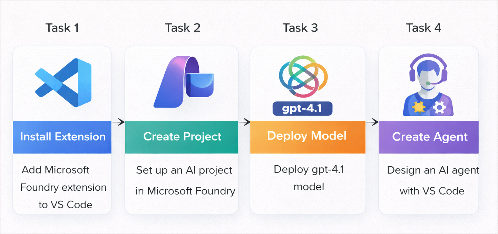
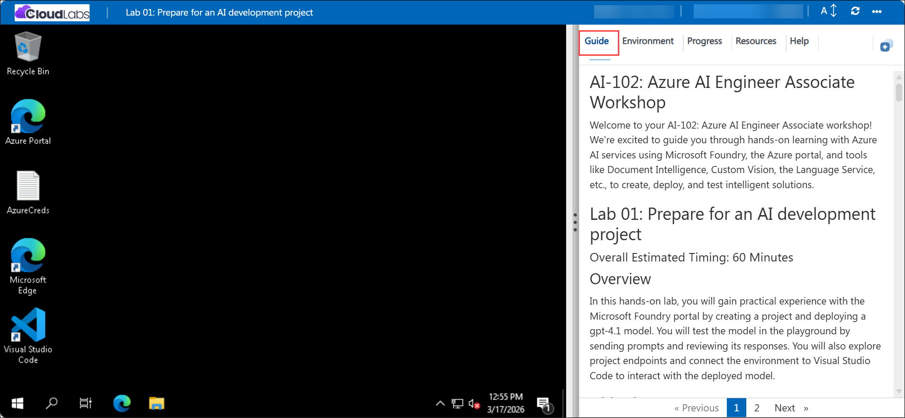

# AI-102: Azure AI Engineer Associate Workshop

Welcome to your AI-102: Azure AI Engineer Associate workshop! We’re excited to guide you through hands-on learning with Azure AI services using Microsoft Foundry, the Azure portal, and tools like Document Intelligence, Custom Vision, the Language Service, etc., to create, deploy, and test intelligent solutions.

# Lab 22: Use Azure Speech in an agent

### Overall Estimated Timing: 45 Minutes

## Overview

In this hands-on lab, you will create an AI agent in Microsoft Foundry and integrate it with Azure Speech capabilities using the MCP tool. You will configure Azure resources, enable speech synthesis and transcription, and test the agent in the Foundry playground. Finally, you will build and run a Python client application to interact with the agent and perform speech-based tasks.

## Objectives

By the end of this lab, you will be able to:

1. **Create and configure Azure resources:** Set up an Azure Storage account and create a Microsoft Foundry project to support speech-enabled scenarios.

2. **Build and configure an AI agent:** Create an agent in Microsoft Foundry, define its instructions, and prepare it for speech-based interactions.

3. **Integrate Azure Speech MCP tool:** Connect the Azure Speech MCP server to your project and enable the agent to perform speech synthesis and transcription.

4. **Test speech capabilities in the playground:** Use the Foundry playground to generate speech from text and transcribe audio using the connected tool.

5. **Develop and run a client application:** Configure and execute a Python application to interact with the agent and validate end-to-end speech functionality.

## Pre-requisites

* Basic knowledge of the Azure portal.
* Familiarity with the Azure AI Agent Service concepts, including agents, agent cards, and executors.
* Basic knowledge of Visual Studio Code.

## Architecture

The lab architecture demonstrates how an AI agent in Microsoft Foundry integrates with Azure Speech services to enable speech-based interactions:

1. **Microsoft Foundry Project and Agent:** A project created in Microsoft Foundry where an AI agent is configured using a *gpt-4.1* model to handle user prompts and coordinate speech-related tasks.

2. **Azure Storage Account:** A storage account with a blob container is used to store generated audio files and provide secure access through SAS tokens.

3. **Azure Speech MCP Server Integration:** The Azure Speech MCP tool is connected to the Foundry project, enabling the agent to perform speech synthesis (text-to-speech) and transcription (speech-to-text).

4. **Agent Playground in Foundry:** An interactive environment where users test the agent, approve tool usage, and validate speech generation and transcription outputs.

5. **Python Client Application:** A client application built using the Azure AI Projects SDK that connects to the agent, sends prompts, and processes speech-based responses programmatically.

## Architecture Diagram

## Explanation of Components

1. **Microsoft Foundry Project and Agent:** The project serves as the central workspace where the AI agent is created and managed. The *gpt-4.1* model powers the agent, enabling it to process user prompts and coordinate speech-related tasks.

2. **Azure Storage Account:** The storage account provides a blob container to store generated audio files. It uses SAS tokens to securely allow the Azure Speech tool to read and write audio data.

3. **Azure Speech MCP Server Tool:** This tool enables the agent to perform speech synthesis (text-to-speech) and transcription (speech-to-text). It connects the agent to Azure Speech services and uses the storage container for handling audio files.

4. **Agent Playground in Foundry:** The Playground allows you to interactively test the agent by submitting prompts, approving tool usage, and reviewing generated speech links or transcription outputs.

5. **Python Client Application:** The client application connects to the Foundry agent using the Azure AI Projects SDK. It allows you to send prompts programmatically and receive speech-based responses, enabling end-to-end testing outside the portal.

# Getting Started with lab

Welcome to your AI-102: Azure AI Engineer Associate workshop! We’ve prepared an interactive environment for you to explore generative AI concepts and work with Microsoft Azure services like Microsoft Foundry, Document Intelligence, Custom Vision, Language Service, etc. Let’s get started and make the most of this hands-on experience.

## Accessing Your Lab Environment
 
Once you're ready to dive in, your virtual machine and **Guide** will be right at your fingertips within your web browser.
 

### Virtual Machine & Lab Guide
 
Your virtual machine is your workhorse throughout the workshop. The lab guide is your roadmap to success.

## Exploring Your Lab Resources
 
To get a better understanding of your lab resources and credentials, navigate to the **Environment** tab.
 

## Managing Your Virtual Machine
 
Feel free to **Start, Restart, or Stop (2)** your virtual machine as needed from the **Resources (1)** tab. Your experience is in your hands!
 

## Lab Progress

You can use the **Progress** tab to track your progress while working on the lab. A score will be provided after successful validation.

## Utilizing the Split Window Feature
 
For convenience, you can open the lab guide in a separate window by selecting the **Split Window** button from the top right corner.
 

## Lab Guide Zoom In/Zoom Out
 
To adjust the zoom level for the environment page, click the **A↕: 100%** icon located next to the timer in the lab environment.

## Let's Get Started with Azure Portal
 
1. On your virtual machine, click on the Azure Portal icon as shown below:
 
   

1. In the sign-in window, kindly sign in using the provided Azure credentials

    - **Email/Username:** <inject key="AzureAdUserEmail"></inject>

        

    - **Password:** <inject key="AzureAdUserPassword"></inject>

        

1. If prompted to **Stay signed in?**, you can click **No**.

    

1. If a **Welcome to Microsoft Azure** pop-up window appears, simply click **Maybe later** to skip the tour.

    

## Support Contact
 
The CloudLabs support team is available 24/7, 365 days a year, via email and live chat to ensure seamless assistance at any time. We offer dedicated support channels explicitly tailored for both learners and instructors, ensuring that all your needs are promptly and efficiently addressed.
 
Learner Support Contacts:
 
- Email Support: cloudlabs-support@spektrasystems.com
- Live Chat Support: https://cloudlabs.ai/labs-support

Click on **Next** from the lower right corner to move on to the next page.

   

## Happy Learning !!

