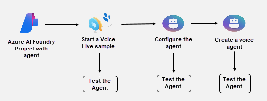
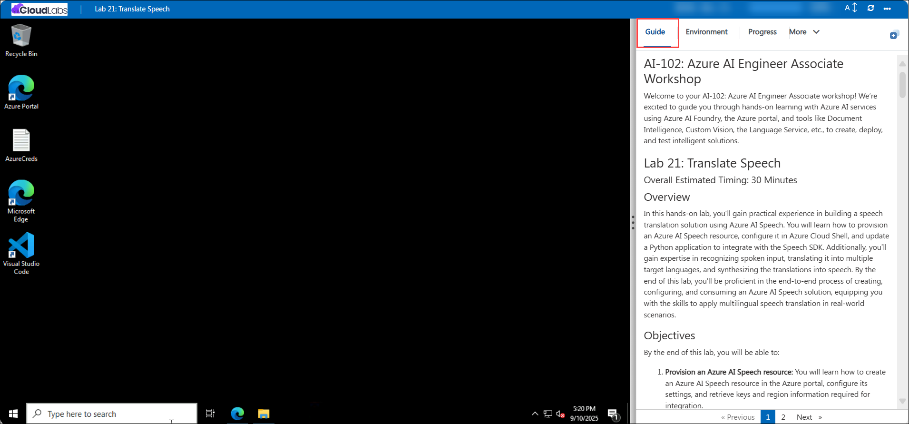

# AI-102: Azure AI Engineer Associate Workshop

Welcome to your AI-102: Azure AI Engineer Associate workshop! We’re excited to guide you through hands-on learning with Azure AI services using Azure AI Foundry, the Azure portal, and tools like Document Intelligence, Custom Vision, the Language Service, etc., to create, deploy, and test intelligent solutions.

# Lab 23: Explore the Voice Live API

### Overall Estimated Timing: 30 Minutes

## Overview

In this hands-on lab, you'll gain practical experience in building and customizing conversational AI agents using Azure AI Foundry. You will learn how to create a project, deploy a GPT-4.1 model, and explore the Speech Playground with the Voice Live API. Additionally, you’ll configure agent settings such as voice, avatars, and proactive engagement, and create a custom voice agent from scratch. By the end of this lab, you'll be proficient in designing, configuring, and testing real-time voice-enabled agents, equipping you with the skills to apply conversational AI in real-world scenarios.

## Objectives

By the end of this lab, you will be able to:

1. **Create an Azure AI Foundry project:** You will learn how to provision a new project in Azure AI Foundry, configure resource group and region settings, and deploy the GPT-4.1 model for use in agents.

1. **Explore the Speech Playground with Voice Live API:** You will interact with pre-built sample agents in the Speech Playground, use live voice interactions, and observe how the agent handles real-time conversations.

1. **Configure agent settings:** You will modify the agent’s voice, enable avatars, and adjust proactive engagement settings to customize conversational behavior.

1. **Build a custom voice agent:** You will create a new agent from scratch, configure its generative AI model, voice input/output, and response instructions, and test it in live interactions.

1. **Test and validate conversational AI:** You will run different agents, apply configuration changes, and evaluate how settings like speech detection and avatars impact the agent’s real-time responses.

## Pre-requisites

- Basic familiarity with conversational AI concepts and speech recognition.
- A working microphone and speakers (or headset) for testing voice interactions.

## Architecture

The lab architecture demonstrates how Azure AI Foundry enables the creation and customization of real-time voice-enabled agents using the Voice Live API:

1. **Azure AI Foundry Project:** Learning how to create a project, provision resources, and deploy the GPT-4.1 model to power conversational AI capabilities.

1. **Voice Live API in Speech Playground:** Exploring pre-built voice-enabled agents to test real-time conversation, speech recognition, and natural voice responses.

1. **Configuration Panel:** Gaining experience customizing agent settings such as speech output, avatars, and engagement modes to modify interaction behavior.

1. **Custom Voice Agent:** Building a voice agent from scratch, configuring it with a generative AI model, voice options, and conversation flow to simulate real-world use cases.

## Architecture Diagram

## Explanation of Components

1. **Azure AI Foundry Project:** Provides the workspace for creating, managing, and deploying AI-powered agents, including access to models and integration with voice features.

1. **Voice Live API (Speech Playground):** A service within Azure AI Foundry that enables real-time speech interaction with agents, supporting natural conversation through speech recognition and voice synthesis.

1. **Configure the agent:** Divided into GenAI, Speech, and Avatar sections, it allows customization of the agent’s behavior, voice output, and visual representation.

1. **Create Voice Agent:** A generative AI-powered agent that can be configured with different voices, avatars, and response styles to simulate real-world conversational scenarios.

# Getting Started with lab

Welcome to your AI-102: Azure AI Engineer Associate workshop! We’ve prepared an interactive environment for you to explore generative AI concepts and work with Microsoft Azure services like Azure AI Foundry, Document Intelligence, Custom Vision, Language Service, etc. Let’s get started and make the most of this hands-on experience.

## Accessing Your Lab Environment
 
Once you're ready to dive in, your virtual machine and **Guide** will be right at your fingertips within your web browser.
 

## Lab Guide Zoom In/Zoom Out
 
To adjust the zoom level for the environment page, click the **A↕: 100%** icon located next to the timer in the lab environment.

### Virtual Machine & Lab Guide
 
Your virtual machine is your workhorse throughout the workshop. The lab guide is your roadmap to success.

## Exploring Your Lab Resources
 
To get a better understanding of your lab resources and credentials, navigate to the **Environment** tab.
 

## Utilizing the Split Window Feature
 
For convenience, you can open the lab guide in a separate window by selecting the **Split Window** button from the top right corner.
 

## Lab Progress

You can use the **Progress** tab to track your progress while working on the lab. A score will be provided after successful validation.

## Managing Your Virtual Machine
 
Feel free to **Start, Restart, or Stop (2)** your virtual machine as needed from the **Resources (1)** tab. Your experience is in your hands!
 

## Let's Get Started with Azure Portal
 
1. On your virtual machine, click on the Azure Portal icon as shown below:
 
   

1. In the sign-in window, kindly sign in using the provided Azure credentials

    - **Email/Username:** <inject key="AzureAdUserEmail"></inject>

        

    - **Password:** <inject key="AzureAdUserPassword"></inject>

        

1. If prompted to **Stay signed in?**, you can click **No**.

    

1. If a **Welcome to Microsoft Azure** pop-up window appears, simply click **Cancel** to skip the tour.

    

## Support Contact
 
The CloudLabs support team is available 24/7, 365 days a year, via email and live chat to ensure seamless assistance at any time. We offer dedicated support channels explicitly tailored for both learners and instructors, ensuring that all your needs are promptly and efficiently addressed.
 
Learner Support Contacts:
 
- Email Support: cloudlabs-support@spektrasystems.com
- Live Chat Support: https://cloudlabs.ai/labs-support

Click on **Next** from the lower right corner to move on to the next page.

   

## Happy Learning !!
