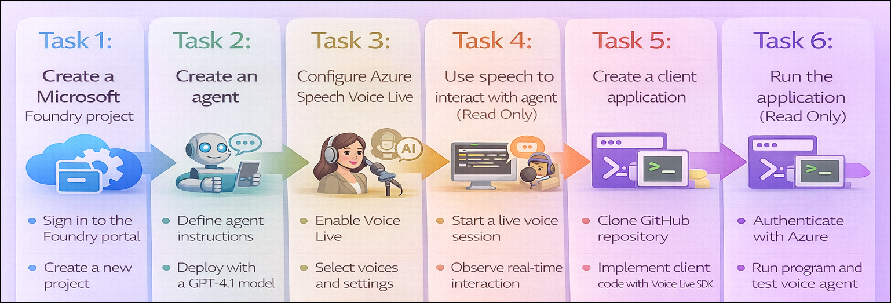

# Getting Started with your AI-102: Azure AI Engineer Associate Workshop

Welcome to your AI-102: Azure AI Engineer Associate workshop! We’re excited to guide you through hands-on learning with Azure AI services using Microsoft Foundry, the Azure portal, and tools like Document Intelligence, Custom Vision, the Language Service, etc., to create, deploy, and test intelligent solutions.

# Lab 23: Develop a Voice Live agent

### Overall Estimated Duration: 30 Minutes

## Overview

In this hands-on lab, you’ll gain practical experience in building a voice-enabled AI solution using **Microsoft Foundry**. You’ll begin by creating a Foundry project and configuring an intelligent agent capable of responding to user queries. You’ll then enable **Azure Speech Voice Live** to add real-time speech capabilities, allowing the agent to process spoken input and generate audio responses.

Next, you’ll work in **Visual Studio Code** to set up a Python-based client application, configure environment variables, and use the Voice Live SDK to establish and manage a live conversation session with your agent. You’ll authenticate with Azure, run the application, and interact with the agent through real-time audio input and output. By the end of this lab, you’ll be confident in building and integrating a voice-enabled agent into a client application for conversational AI scenarios.

## Objectives

By the end of this lab, you will be able to:

1. **Create and configure a Microsoft Foundry project**: Set up a new project with the required Azure resources and capture the endpoint for later use.
2. **Build and configure a voice-enabled AI agent**: Create an agent, select an appropriate model, and define instructions for conversational interactions.
3. **Enable Azure Speech Voice Live capabilities**: Configure voice mode to allow the agent to process spoken input and generate audio responses.
4. **Interact with the agent using speech**: Explore real-time voice-based interactions and understand how the agent processes and responds to spoken prompts.
5. **Set up and configure a Python client application**: Clone the sample repository, install dependencies, and configure environment variables in Visual Studio Code.
6. **Implement voice interaction using the Voice Live SDK**: Write Python code to connect to the agent and manage a real-time voice conversation session.
7. **Authenticate and run the application**: Sign in to Azure, execute the application, and interact with the agent through live audio input and output.

## Pre-requisites

* Basic understanding of AI agents and conversational AI concepts, including speech recognition and speech synthesis.
* Familiarity with **Microsoft Foundry** and **Azure Speech** services.
* Experience navigating the **Azure portal** and working with **Visual Studio Code**.
* An active Azure subscription with permissions to create and manage resources in the assigned resource group.
* Basic knowledge of Python and experience working with virtual environments and terminal commands.
* Understanding of environment variables and how they are used to configure applications.

## Architecture

The lab architecture demonstrates how a **voice-enabled AI solution** is built and accessed using **Microsoft Foundry** and **Azure Speech Voice Live**:

1. **Microsoft Foundry Project**: Acts as the central workspace that manages resources, agents, and endpoints required for building and deploying AI solutions.

2. **Voice-Enabled Agent**: A custom AI agent configured with a foundation model (such as GPT-4.1) and instructions to handle conversational queries and generate responses.

3. **Azure Speech Voice Live Integration**: Provides real-time speech capabilities, enabling the agent to convert spoken input into text (speech-to-text) and generate audio responses (text-to-speech).

4. **Agent Playground (Foundry Portal)**: Enables interactive testing of the agent, allowing users to communicate using voice or text and observe real-time responses.

5. **Foundry Endpoint and API Access**: Exposes the agent through a secure endpoint that client applications can use to initiate and manage voice-based interactions programmatically.

6. **Python Client Application (Visual Studio Code)**: Connects to the Foundry endpoint using the Voice Live SDK and Azure authentication to establish and manage real-time voice sessions.

7. **User Interaction**: Users interact with the agent through speech or text, and the system processes the input using Azure Speech services to deliver intelligent, conversational responses in real time.

## Architecture Diagram

## Explanation of Components

1. **Microsoft Foundry Project**: Serves as the central environment for building and managing AI solutions, including agents, configurations, and access details such as endpoints and credentials.

2. **Voice-Enabled Agent**: A custom-configured AI agent that uses a foundation model to process user queries and generate conversational responses based on defined instructions.

3. **Azure Speech Voice Live**: Extends the agent’s capabilities by enabling real-time speech processing, converting spoken input into text (speech-to-text) and generating audio responses (text-to-speech).

4. **Agent Playground (Foundry Portal)**: Provides an interactive interface to test and validate the agent’s behavior using voice or text, and observe real-time conversational responses.

5. **Foundry Endpoint and API Access**: Offers a secure interface for external applications to communicate with the agent, enabling programmatic voice interactions through SDKs or APIs.

6. **Python Client Application (Visual Studio Code)**: Acts as the user-facing application that connects to the Foundry project using authentication, manages voice sessions, and handles audio input and output.

7. **User Interaction**: Users interact with the agent through speech or text, and the system processes the input using Azure Speech services to deliver real-time, conversational responses.

## Accessing Your Lab Environment
 
Once you're ready to dive in, your virtual machine and **Guide** will be right at your fingertips within your web browser.
 

## Virtual Machine & Lab Guide
 
Your virtual machine is your workhorse throughout the workshop. The lab guide is your roadmap to success.

## Exploring Your Lab Resources
 
To get a better understanding of your lab resources and credentials, navigate to the **Environment** tab.
 

## Managing Your Virtual Machine
 
Feel free to **Start, Restart, or Stop (2)** your virtual machine as needed from the **Resources (1)** tab. Your experience is in your hands!
 

## Lab Progress

You can use the **Progress** tab to track your progress while working on the lab. A score will be provided after successful validation.

## Utilizing the Split Window Feature
 
For convenience, you can open the lab guide in a separate window by selecting the **Split Window** button from the top right corner.
 

## Lab Guide Zoom In/Zoom Out
 
To adjust the zoom level for the environment page, click the **A↕: 100%** icon located next to the timer in the lab environment.

## Let's Get Started with Azure Portal
 
1. On your virtual machine, click on the Azure Portal icon as shown below:
 
    

1. In the sign-in window, kindly sign in using the provided Azure credentials

    - **Email/Username:** <inject key="AzureAdUserEmail"></inject>

        

    - **Password:** <inject key="AzureAdUserPassword"></inject>

        

1. If prompted to **Stay signed in?**, you can click **No**.

    

1. If a **Welcome to Microsoft Azure** pop-up window appears, simply click **Cancel** to skip the tour.

    

## Support Contact
 
The CloudLabs support team is available 24/7, 365 days a year, via email and live chat to ensure seamless assistance at any time. We offer dedicated support channels explicitly tailored for both learners and instructors, ensuring that all your needs are promptly and efficiently addressed.
 
Learner Support Contacts:
 
- Email Support: cloudlabs-support@spektrasystems.com
- Live Chat Support: https://cloudlabs.ai/labs-support

Click on **Next** from the lower right corner to move on to the next page.

   

## Happy Learning !!

