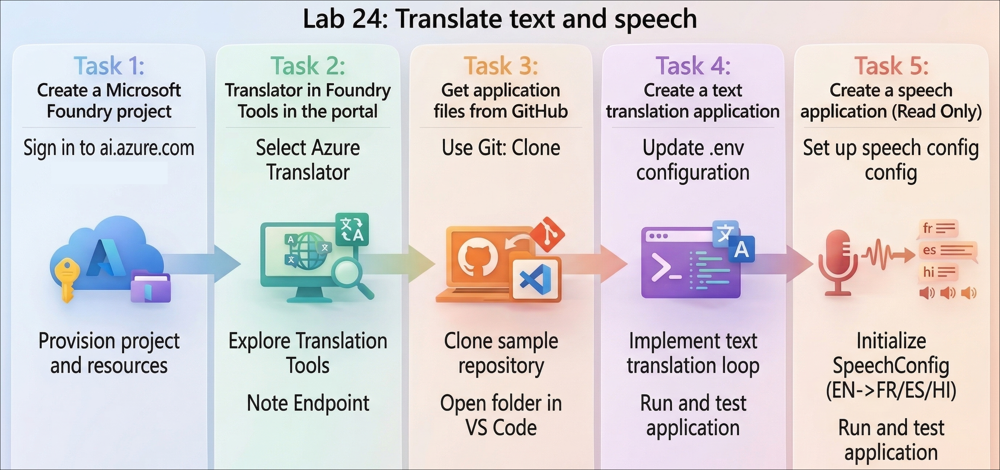
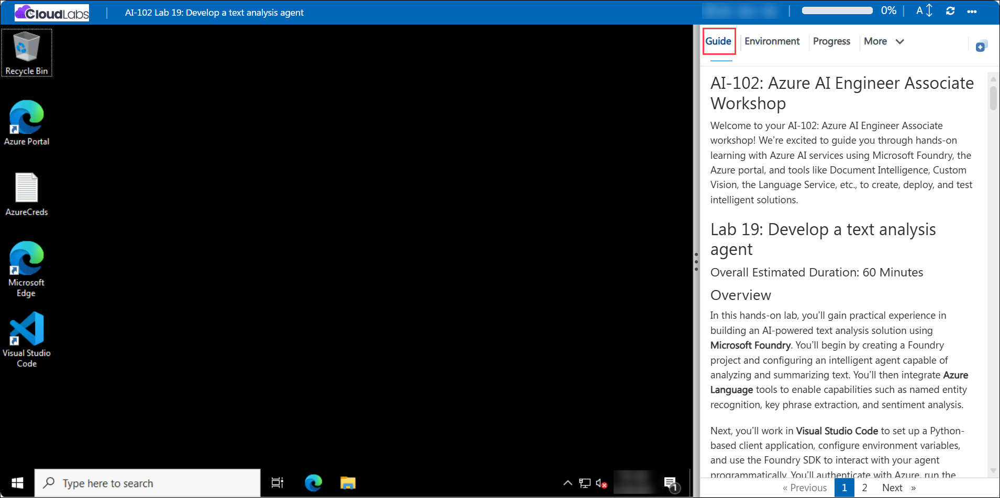

# Getting Started with your AI-102: Azure AI Engineer Associate Workshop

Welcome to your AI-102: Azure AI Engineer Associate workshop! We’re excited to guide you through hands-on learning with Azure AI services using Microsoft Foundry, the Azure portal, and tools like Document Intelligence, Custom Vision, the Language Service, etc., to create, deploy, and test intelligent solutions.

# Lab 24: Translate text and speech

### Overall Estimated Duration: 30 Minutes

## Overview

In this hands-on lab, you’ll gain practical experience in building multilingual translation applications using **Microsoft Foundry**. You’ll begin by creating a Foundry project and exploring **Azure Translator** to perform text translation across multiple languages. You’ll then use **Azure Speech** to enable speech-based translation capabilities.

Next, you’ll work in **Visual Studio Code** to set up a Python-based application, configure environment variables, and use Azure SDKs to implement both text and speech translation. You’ll authenticate with Azure, run the applications, and test translations using different languages. By the end of this lab, you’ll be confident in building and integrating text and speech translation capabilities into real-world applications.

## Objectives

By the end of this lab, you will be able to:

1. **Create and configure a Microsoft Foundry project**: Set up a new project with the required Azure resources and capture the endpoint for later use.
2. **Explore Azure Translator capabilities in the Foundry portal**: Use the Translator playground to perform and understand text translation across multiple languages.
3. **Set up the development environment**: Clone the sample repository, install dependencies, and prepare the project in Visual Studio Code.
4. **Build and configure a text translation application**: Implement a Python application that translates text using Azure Translator services.
5. **Implement speech translation using Azure Speech**: Configure and develop a Python application to translate spoken input into multiple languages.
6. **Authenticate and run the applications**: Sign in to Azure, execute the applications, and validate translation outputs for both text and speech scenarios.

## Pre-requisites

* Basic understanding of AI concepts such as text translation and speech translation.
* Familiarity with **Microsoft Foundry**, **Azure Translator**, and **Azure Speech** services.
* Experience navigating the **Azure portal** and working with **Visual Studio Code**.
* An active Azure subscription with permissions to create and manage resources in the assigned resource group.
* Basic knowledge of Python and experience working with virtual environments and terminal commands.
* Understanding of environment variables and how they are used to configure applications.

## Architecture

The lab architecture demonstrates how a **multilingual translation solution** is built and accessed using **Microsoft Foundry**, **Azure Translator**, and **Azure Speech**:

1. **Microsoft Foundry Project**: Acts as the central workspace that manages resources, configurations, and endpoints required for building and running translation applications.

2. **Azure Translator Service**: Provides text translation capabilities, enabling conversion of text from one language to another across multiple supported languages.

3. **Azure Speech Service**: Enables speech-based translation by converting spoken input into text (speech-to-text) and translating it into the desired language, optionally generating audio output.

4. **Foundry Portal (Playground)**: Allows users to explore and test translation capabilities interactively within the browser before implementing them in code.

5. **Foundry Endpoint and API Access**: Exposes the translation services through secure endpoints that client applications can use to send text or audio input and receive translated output.

6. **Python Client Application (Visual Studio Code)**: Connects to the Azure services using SDKs and authentication, enabling implementation of both text and speech translation workflows.

7. **User Interaction**: Users provide input as text or speech, and the system processes it using Azure Translator and Speech services to return translated text or audio in the target language.

## Architecture Diagram

## Explanation of Components

1. **Microsoft Foundry Project**: Serves as the central environment for building and managing the solution, including configurations, resources, and access details such as endpoints and credentials.

2. **Azure Translator Service**: Provides text translation capabilities, enabling conversion of text between multiple languages with high accuracy.

3. **Azure Speech Service**: Extends the solution by enabling speech translation, converting spoken input into text (speech-to-text) and translating it into the desired language, with optional audio output.

4. **Foundry Portal (Playground)**: Provides an interactive interface to test and validate translation capabilities directly in the browser before implementing them in code.

5. **Foundry Endpoint and API Access**: Offers secure endpoints that client applications can use to send text or audio input and receive translated output programmatically.

6. **Python Client Application (Visual Studio Code)**: Acts as the user-facing application that connects to Azure services using SDKs, handles input (text or speech), and processes translation results.

7. **User Interaction**: Users provide input as text or speech, and the system processes it using Azure Translator and Speech services to return translated text or audio in the target language.

## Accessing Your Lab Environment
 
Once you're ready to dive in, your virtual machine and **Guide** will be right at your fingertips within your web browser.
 

## Virtual Machine & Lab Guide
 
Your virtual machine is your workhorse throughout the workshop. The lab guide is your roadmap to success.

## Exploring Your Lab Resources
 
To get a better understanding of your lab resources and credentials, navigate to the **Environment** tab.
 

## Managing Your Virtual Machine
 
Feel free to **Start, Restart, or Stop (2)** your virtual machine as needed from the **Resources (1)** tab. Your experience is in your hands!
 

## Lab Progress

You can use the **Progress** tab to track your progress while working on the lab. A score will be provided after successful validation.

## Utilizing the Split Window Feature
 
For convenience, you can open the lab guide in a separate window by selecting the **Split Window** button from the top right corner.
 

## Lab Guide Zoom In/Zoom Out
 
To adjust the zoom level for the environment page, click the **A↕: 100%** icon located next to the timer in the lab environment.

## Let's Get Started with Azure Portal
 
1. On your virtual machine, click on the Azure Portal icon as shown below:
 
   

1. In the sign-in window, kindly sign in using the provided Azure credentials

    - **Email/Username:** <inject key="AzureAdUserEmail"></inject>

        

    - **Password:** <inject key="AzureAdUserPassword"></inject>

        

1. If prompted to **Stay signed in?**, you can click **No**.

    

1. If a **Welcome to Microsoft Azure** pop-up window appears, simply click **Cancel** to skip the tour.

    

## Support Contact
 
The CloudLabs support team is available 24/7, 365 days a year, via email and live chat to ensure seamless assistance at any time. We offer dedicated support channels explicitly tailored for both learners and instructors, ensuring that all your needs are promptly and efficiently addressed.
 
Learner Support Contacts:
 
- Email Support: cloudlabs-support@spektrasystems.com
- Live Chat Support: https://cloudlabs.ai/labs-support

Click on **Next** from the lower right corner to move on to the next page.

   

## Happy Learning !!

