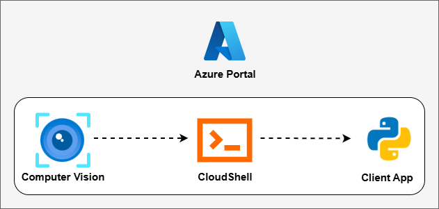
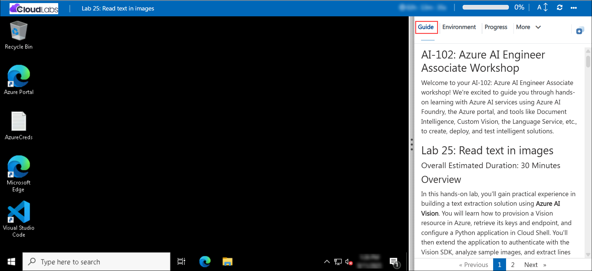

# AI-102: Azure AI Engineer Associate Workshop

Welcome to your AI-102: Azure AI Engineer Associate workshop! We’re excited to guide you through hands-on learning with Azure AI services using Azure AI Foundry, the Azure portal, and tools like Document Intelligence, Custom Vision, the Language Service, etc., to create, deploy, and test intelligent solutions.

# Lab 24: Read text in images

### Overall Estimated Duration: 30 Minutes

## Overview

In this hands-on lab, you’ll gain practical experience in building a text extraction solution using **Azure AI Vision**. You will learn how to provision a Vision resource in Azure, retrieve its keys and endpoint, and configure a Python application in Cloud Shell. You’ll then extend the application to authenticate with the Vision SDK, analyze sample images, and extract lines of text. Next, you’ll enhance the solution to detect individual words, display their confidence scores, and generate annotated images highlighting the recognized text. By the end of this lab, you’ll be proficient in provisioning a Vision resource, integrating the Azure AI Vision SDK, and developing an OCR-enabled application that can read and interpret text from images.

## Objectives

By the end of this lab, you will be able to:

1. **Provision an Azure AI Vision resource:** Create a Computer Vision resource in the Azure portal and obtain its keys and endpoint.

2. **Set up a Python application in Cloud Shell:** Configure the environment, install the Azure AI Vision SDK, and prepare the app for development.

3. **Authenticate and connect to the Vision service:** Use the SDK to securely connect your application to the provisioned Vision resource.

4. **Read text from images:** Extend the client app to analyze sample images and extract lines of printed or handwritten text.

5. **Extract individual words with confidence scores:** Enhance the application to detect words, output confidence values, and annotate images with bounding boxes.

6. **Generate annotated images:** Produce visual outputs that highlight detected lines and words, enabling easy validation of OCR results.

## Pre-requisites

* Basic understanding of **OCR (Optical Character Recognition)** concepts, including how text can be extracted from images.
* Familiarity with the **Azure portal**, including creating and managing resources.
* Experience using **Azure Cloud Shell** for running Python scripts and managing environments.
* An active Azure subscription with permissions to create **Azure AI Vision** resources in the assigned resource group.
* Basic knowledge of **Python programming** and working in a terminal or shell environment.

## Architecture

The lab architecture demonstrates how Azure AI Vision enables OCR by combining resource provisioning, SDK integration, and client application development:

1. **Azure AI Vision Resource:** Provision a Computer Vision resource in Azure that provides OCR capabilities through secure keys and an endpoint.

2. **Azure Cloud Shell:** Configure a development environment in Cloud Shell to install dependencies, clone the lab repository, and run Python scripts for text extraction.

3. **Azure AI Vision SDK:** Use the Python SDK to authenticate with the Vision resource, analyze images, and extract printed or handwritten text.

4. **Python Client Application:** Extend a Python app that connects to the Vision service, reads lines and words from images, displays confidence scores, and generates annotated outputs.

## Architecture Diagram

## Explanation of Components

1. **Azure AI Vision Resource:** Provides the environment to perform OCR by analyzing images and extracting printed or handwritten text through a secure endpoint and key.

2. **Azure Cloud Shell:** A browser-based terminal environment used to configure dependencies, clone the lab repository, and run Python scripts to interact with the Vision resource.

3. **Azure AI Vision SDK:** A Python SDK that enables applications to connect to the Vision resource, analyze images, and extract text and bounding box data.

4. **Python Client Application:** A sample app that authenticates with the Vision resource, submits images for OCR, retrieves text with confidence scores, and generates annotated outputs highlighting detected lines and words.

# Getting Started with lab

Welcome to your AI-102: Azure AI Engineer Associate workshop! We’ve prepared an interactive environment for you to explore generative AI concepts and work with Microsoft Azure services like Azure AI Foundry, Document Intelligence, Custom Vision, Language Service, etc. Let’s get started and make the most of this hands-on experience.

## Accessing Your Lab Environment
 
Once you're ready to dive in, your virtual machine and **lab guide** will be right at your fingertips within your web browser.
 

### Virtual Machine & Lab Guide
 
Your virtual machine is your workhorse throughout the workshop. The lab guide is your roadmap to success.

## Lab Guide Zoom In/Zoom Out
 
To adjust the zoom level for the environment page, click the **A↕: 100%** icon located next to the timer in the lab environment.

## Exploring Your Lab Resources
 
To get a better understanding of your lab resources and credentials, navigate to the **Environment** tab.
 

## Utilizing the Split Window Feature
 
For convenience, you can open the lab guide in a separate window by selecting the **Split Window** button from the top right corner.
 

## Lab Progress

You can use the **Progress** tab to track your progress while working on the lab. A score will be provided after successful validation.

## Managing Your Virtual Machine
 
Feel free to **Start, Restart, or Stop (2)** your virtual machine as needed from the **Resources (1)** tab. Your experience is in your hands!
 

## Let's Get Started with Azure Portal
 
1. On your virtual machine, click on the Azure Portal icon as shown below:
 
   

1. In the sign-in window, kindly sign in using the provided Azure credentials

    - **Email/Username:** <inject key="AzureAdUserEmail"></inject>

        

    - **Password:** <inject key="AzureAdUserPassword"></inject>

        

1. If prompted to **Stay signed in?**, you can click **No**.

    

1. If a **Welcome to Microsoft Azure** pop-up window appears, simply click **Cancel** to skip the tour.

    

## Support Contact
 
The CloudLabs support team is available 24/7, 365 days a year, via email and live chat to ensure seamless assistance at any time. We offer dedicated support channels explicitly tailored for both learners and instructors, ensuring that all your needs are promptly and efficiently addressed.
 
Learner Support Contacts:
 
- Email Support: cloudlabs-support@spektrasystems.com
- Live Chat Support: https://cloudlabs.ai/labs-support

Click on **Next** from the lower right corner to move on to the next page.

   

## Happy Learning !!