# Getting Started with your AI-102: Azure AI Engineer Associate Workshop

Welcome to your AI-102: Azure AI Engineer Associate workshop! We’re excited to guide you through hands-on learning with Azure AI services using Microsoft Foundry, the Azure portal, and tools like Document Intelligence, Custom Vision, the Language Service, etc., to create, deploy, and test intelligent solutions.

# Lab 25: Analyze images

### Overall Estimated Timing: 30 Minutes

## Overview

In this hands-on lab, you'll gain practical experience in building an image analysis solution using Azure AI Vision. You will learn how to provision and configure a Vision resource, set up a development environment in Azure Cloud Shell, and integrate the Vision SDK into a Python application. Additionally, you’ll implement features to generate captions, extract tags, detect and locate objects, and identify people in images. By the end of this lab, you’ll be proficient in designing, configuring, and testing computer vision applications, equipping you with the skills to apply image analysis in real-world scenarios.

## Objectives

By the end of this lab, you will be able to:

1. **Provision an Azure AI Vision resource:** You will create and configure an Azure AI Vision resource, set up authentication keys, and prepare it for integration with applications.

1. **Develop an image analysis app with the Azure AI Vision SDK:** You will build a Python application using the SDK, implement image analysis features such as object detection and description generation, run the app with sample images, validate the analysis output, and apply best practices for integrating AI Vision capabilities into real-world scenarios.

## Pre-requisites

- Basic familiarity with Python programming.

- Understanding of REST APIs and SDK usage.

## Architecture

The lab architecture demonstrates how Azure AI Vision enables building and testing image analysis applications using the Azure AI Vision SDK:

1. **Provision an Azure AI Vision resource:** You will create and configure an Azure AI Vision resource, set up authentication keys, and prepare it for integration with applications.

1. **Develop an image analysis app with the Azure AI Vision SDK:** You will build a Python application using the SDK, implement image analysis features, run the app with sample images, validate the analysis output, and apply AI Vision capabilities to real-world scenarios.

## Architecture Diagram

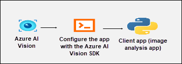

## Explanation of Components

1. **Azure AI Vision Resource:** Provides the core service for image analysis, enabling features such as object detection, image tagging, and description generation.

1. **Azure AI Vision SDK:** A development toolkit that allows integration of Azure AI Vision capabilities into applications, providing APIs to send images for analysis and receive structured outputs.

1. **Image Analysis Application (Client App):** A Python-based application that leverages the SDK to process images, analyze visual content, and present results in a usable format.

## Accessing Your Lab Environment
 
Once you're ready to dive in, your virtual machine and **Guide** will be right at your fingertips within your web browser.
 
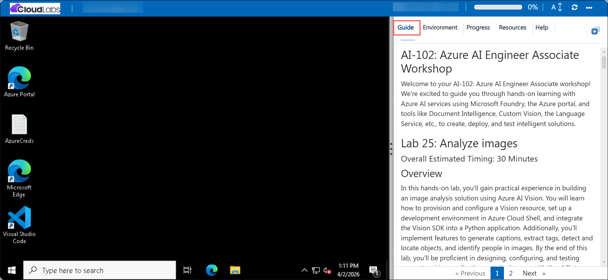

## Lab Guide Zoom In/Zoom Out
 
To adjust the zoom level for the environment page, click the **A↕: 100%** icon located next to the timer in the lab environment.

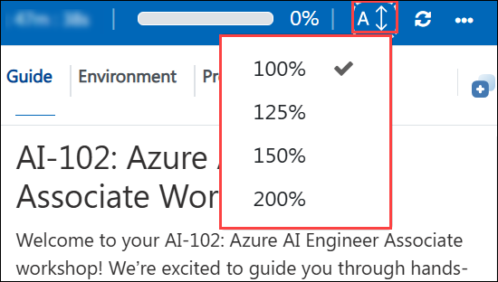

## Virtual Machine & Lab Guide
 
Your virtual machine is your workhorse throughout the workshop. The lab guide is your roadmap to success.

## Exploring Your Lab Resources
 
To get a better understanding of your lab resources and credentials, navigate to the **Environment** tab.
 
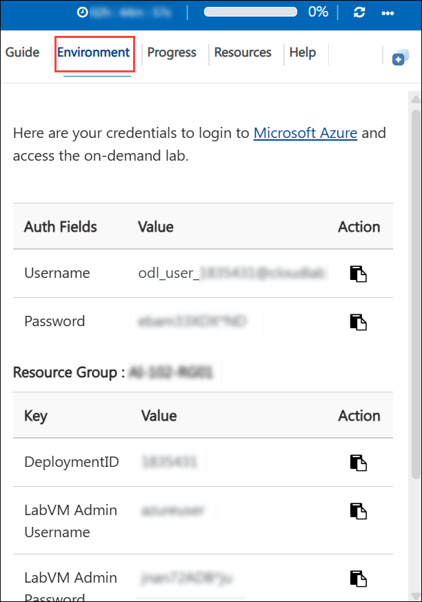

## Utilizing the Split Window Feature
 
For convenience, you can open the lab guide in a separate window by selecting the **Split Window** button from the top right corner.
 
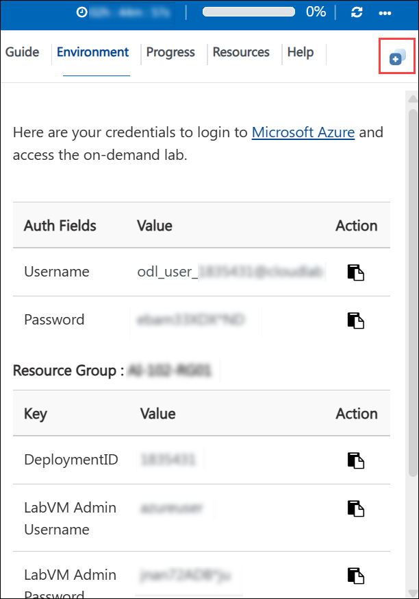

## Lab Progress

You can use the **Progress** tab to track your progress while working on the lab. A score will be provided after successful validation.

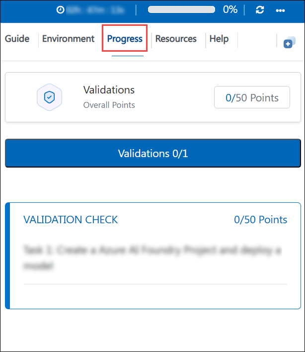

## Managing Your Virtual Machine
 
Feel free to **Start, Restart, or Stop (2)** your virtual machine as needed from the **Resources (1)** tab. Your experience is in your hands!
 
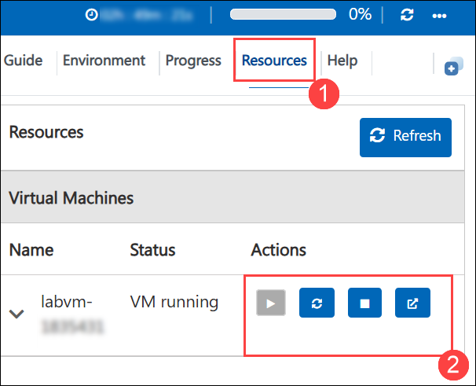

## Let's Get Started with Azure Portal
 
1. On your virtual machine, click on the Azure Portal icon as shown below:
 
    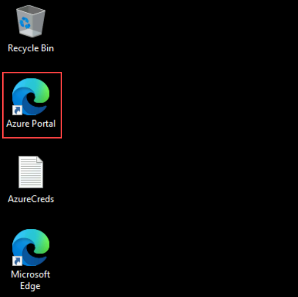

1. In the sign-in window, kindly sign in using the provided Azure credentials

    - **Email/Username:** <inject key="AzureAdUserEmail"></inject>

        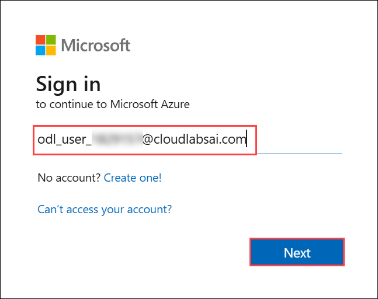

    - **Password:** <inject key="AzureAdUserPassword"></inject>

        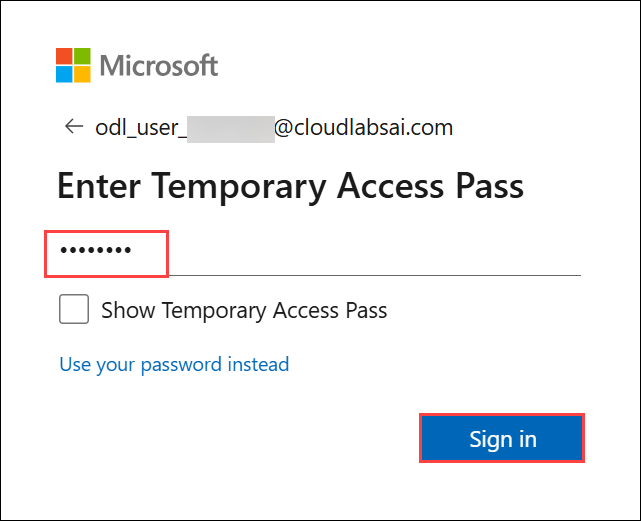

1. If prompted to **Stay signed in?**, you can click **No**.

    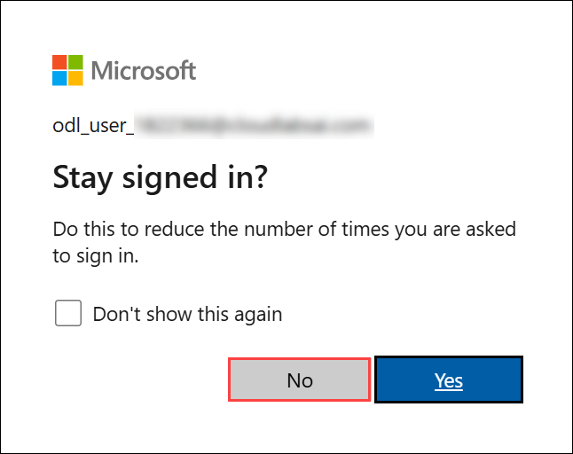

1. If a **Welcome to Microsoft Azure** pop-up window appears, simply click **Maybe later** to skip the tour.

    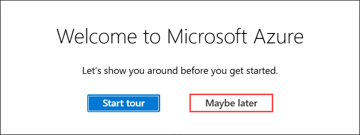

## Support Contact
 
The CloudLabs support team is available 24/7, 365 days a year, via email and live chat to ensure seamless assistance at any time. We offer dedicated support channels explicitly tailored for both learners and instructors, ensuring that all your needs are promptly and efficiently addressed.
 
Learner Support Contacts:
 
- Email Support: cloudlabs-support@spektrasystems.com
- Live Chat Support: https://cloudlabs.ai/labs-support

Click on **Next** from the lower right corner to move on to the next page.

   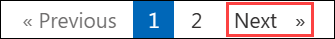

## Happy Learning !!
