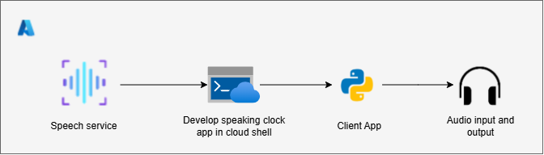

# AI-102: Azure AI Engineer Associate Workshop

Welcome to your AI-102: Azure AI Engineer Associate workshop! We’re excited to guide you through hands-on learning with Azure AI services using Azure AI Foundry, the Azure portal, and tools like Document Intelligence, Custom Vision, the Language Service, etc., to create, deploy, and test intelligent solutions.

# Lab 26: Detect and analyze faces

### Overall Estimated Timing: 30 Minutes

## Overview

In this hands-on lab, you’ll build an end-to-end face detection and analysis solution with Azure AI Face by provisioning the service, capturing its endpoint and key, and—using Azure Cloud Shell cloning a prebuilt Python project configured with the Face SDK to detect faces and extract attributes such as head pose, occlusions (eyes, mouth, forehead), and accessories (e.g., glasses); you’ll then generate annotated images with bounding boxes and download them for verification, leaving you confident in provisioning, authenticating from code, analyzing images programmatically, and validating outputs for responsible, privacy-aware scenarios.

## Objectives

By the end of this lab, you will be able to:

1. **Provision an Azure AI Speech resource:** You will create the Speech resource in the Azure portal, configure basic settings, and retrieve the key and region required for integration.

1. **Set up a development environment in Azure Cloud Shell:** Open Cloud Shell (PowerShell), clone the GitHub repository, create a Python virtual environment, and install dependencies.

1. **Configure application settings:** You will update the configuration file with your Azure AI Speech resource key and region, ensuring secure connectivity between your app and the Azure AI Speech service.

1. **Integrate and verify the Speech SDK in a Python app:** You will import SDK packages, initialize SpeechConfig, and run the app once to confirm successful connection to the Speech endpoint.

1. **Recognize speech (speech-to-text):** You will create a SpeechRecognizer to transcribe spoken input from an audio file and handle recognition results.

1. **Synthesize speech (text-to-speech) with SSML:** You will create a SpeechSynthesizer to generate a .wav file and apply SSML to control voice selection, pacing, and pauses.

## Pre-requisites

- Familiarity with Python programming and package management.

- Experience working in Azure Cloud Shell and using command-line tools.

## Architecture

The lab architecture demonstrates how Azure AI Speech enables real-time speech recognition and synthesis for application integration:

1. **Azure AI Speech Resource:** A managed Cognitive Service that exposes speech-to-text and text-to-speech endpoints (with SSML support). The app authenticates using the resource key and region.

1. **Azure Cloud Shell (PowerShell):** A browser-based environment used to clone the lab repository, manage the Python virtual environment, run the app, and download the generated audio files.

1. **Python Application (speaking-clock):** A console app that uses the Azure AI Speech SDK to initialize SpeechConfig, recognize speech from an input file via SpeechRecognizer, and synthesize audio via SpeechSynthesizer. Configuration is read from a .env file.

1. **Audio Input & Output:** A sample .wav input file (for recognition) and a generated output.wav file (for synthesis). Because Cloud Shell lacks audio hardware, all speech I/O is file-based.

## Architecture Diagram

## Explanation of Components

1. **Azure AI Speech Resource:** Provides speech-to-text and text-to-speech services (with SSML support) via region-specific endpoints. The application authenticates using the resource key and region to perform recognition and synthesis.

1. **Cloud Shell:** A browser-based development environment in the Azure portal used to set up the Python workspace, install dependencies, edit the .env file, run the speaking-clock app, and download the generated audio.

1. **Python Application:** A console app that integrates the Azure AI Speech SDK using keys and endpoints to programmatically recognize speech from an input .wav and synthesize natural-sounding output, with SSML to control voice and prosody.

1. **Audio Files:** Sample .wav files used as input for recognition (e.g., time.wav) and as output for synthesized speech (e.g., output.wav), enabling end-to-end testing in Cloud Shell.

# Getting Started with lab

Welcome to your AI-102: Azure AI Engineer Associate workshop! We’ve prepared an interactive environment for you to explore generative AI concepts and work with Microsoft Azure services like Azure AI Foundry, Document Intelligence, Custom Vision, Language Service, etc. Let’s get started and make the most of this hands-on experience.

## Accessing Your Lab Environment
 
Once you're ready to dive in, your virtual machine and **Guide** will be right at your fingertips within your web browser.
 

## Lab Guide Zoom In/Zoom Out
 
To adjust the zoom level for the environment page, click the **A↕: 100%** icon located next to the timer in the lab environment.

### Virtual Machine & Lab Guide
 
Your virtual machine is your workhorse throughout the workshop. The lab guide is your roadmap to success.

## Exploring Your Lab Resources
 
To get a better understanding of your lab resources and credentials, navigate to the **Environment** tab.
 

## Utilizing the Split Window Feature
 
For convenience, you can open the lab guide in a separate window by selecting the **Split Window** button from the top right corner.
 

## Lab Progress

You can use the **Progress** tab to track your progress while working on the lab. A score will be provided after successful validation.

## Managing Your Virtual Machine
 
Feel free to **Start, Restart, or Stop (2)** your virtual machine as needed from the **Resources (1)** tab. Your experience is in your hands!
 

## Let's Get Started with Azure Portal
 
1. On your virtual machine, click on the Azure Portal icon as shown below:
 
   

1. In the sign-in window, kindly sign in using the provided Azure credentials

    - **Email/Username:** <inject key="AzureAdUserEmail"></inject>

        

    - **Password:** <inject key="AzureAdUserPassword"></inject>

        

1. If prompted to **Stay signed in?**, you can click **No**.

    

1. If a **Welcome to Microsoft Azure** pop-up window appears, simply click **Cancel** to skip the tour.

    

## Support Contact
 
The CloudLabs support team is available 24/7, 365 days a year, via email and live chat to ensure seamless assistance at any time. We offer dedicated support channels explicitly tailored for both learners and instructors, ensuring that all your needs are promptly and efficiently addressed.
 
Learner Support Contacts:
 
- Email Support: cloudlabs-support@spektrasystems.com
- Live Chat Support: https://cloudlabs.ai/labs-support

Click on **Next** from the lower right corner to move on to the next page.

   

## Happy Learning !!
