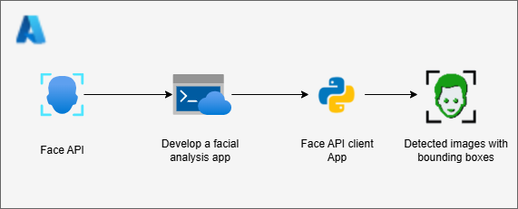
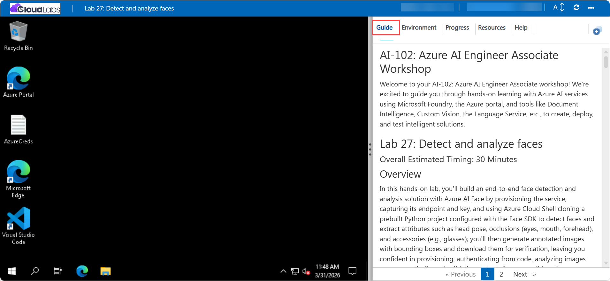

# AI-102: Azure AI Engineer Associate Workshop

Welcome to your AI-102: Azure AI Engineer Associate workshop! We’re excited to guide you through hands-on learning with Azure AI services using Microsoft Foundry, the Azure portal, and tools like Document Intelligence, Custom Vision, the Language Service, etc., to create, deploy, and test intelligent solutions.

# Lab 27: Detect and analyze faces

### Overall Estimated Timing: 30 Minutes

## Overview

In this hands-on lab, you’ll build an end-to-end face detection and analysis solution with Azure AI Face by provisioning the service, capturing its endpoint and key, and using Azure Cloud Shell cloning a prebuilt Python project configured with the Face SDK to detect faces and extract attributes such as head pose, occlusions (eyes, mouth, forehead), and accessories (e.g., glasses); you’ll then generate annotated images with bounding boxes and download them for verification, leaving you confident in provisioning, authenticating from code, analyzing images programmatically, and validating outputs for responsible, privacy-aware scenarios.

## Objectives

By the end of this lab, you will be able to:

1. **Provision an Azure AI Face resource:** Create the Face resource, and obtain the Endpoint and Key for secure API access.

1. **Configure a Python environment in Azure Cloud Shell:** Set up a virtual environment, install dependencies (including the Azure AI Vision Face SDK), and prepare the app configuration.

1. **Connect your application to the Face service:** Initialize a FaceClient with your endpoint and key using AzureKeyCredential for authenticated calls.

1. **Detect and analyze faces in images:** Invoke the detect API to identify faces and retrieve attributes such as head pose, occlusions, and accessories.

1. **Generate and review annotated outputs:** Produce images with bounding boxes around detected faces, download the results, and validate findings alongside console output.

1. **Test across varied scenarios:** Run the program on single and multi-person images to compare outputs and understand model behavior.

## Pre-requisites

- Familiarity with Python programming.

- Experience working in Azure Cloud Shell and using command-line tools.

## Architecture

The lab architecture demonstrates how Azure AI Face exposes a secure endpoint/key for face detection and attribute analysis.

1. **Azure AI Face Resource & Endpoint:** Managed service exposing Face APIs secured by keys; returns face rectangles and attributes (head pose, occlusions, accessories).

1. **Azure Cloud Shell:** Browser-based execution environment used to configure the app, manage dependencies, and run the Python client without local setup.

1. **Python Client Application (Face SDK):** Uses FaceClient from the Azure AI Vision Face SDK to call the detect API, log results, and render bounding boxes on output images.

1. **Input/Output Images:** Sample images are read from a local folder; annotated results (e.g., detected_faces.jpg) are generated and downloaded for validation.

## Architecture Diagram

## Explanation of Components

1. **Azure AI Face Resource:** Provides face detection and analysis (head pose, occlusions, accessories) through a secure endpoint and key.

1. **Azure Cloud Shell:** A browser-based terminal used to configure dependencies, clone the lab repository, edit environment settings, and run the Python app against the Face resource.

1. **Azure AI Face SDK (Python):** A client library that authenticates with the Face endpoint, detects faces in images, returns attributes and bounding boxes, and handles responses programmatically.

1. **Python Client Application:** A sample console app that loads the endpoint/key from .env, submits images for analysis, prints detected attributes with details, and generates annotated output images with bounding boxes for download and verification.

# Getting Started with lab

Welcome to your AI-102: Azure AI Engineer Associate workshop! We’ve prepared an interactive environment for you to explore generative AI concepts and work with Microsoft Azure services like Microsoft Foundry, Document Intelligence, Custom Vision, Language Service, etc. Let’s get started and make the most of this hands-on experience.

## Accessing Your Lab Environment
 
Once you're ready to dive in, your virtual machine and **Guide** will be right at your fingertips within your web browser.
 

## Lab Guide Zoom In/Zoom Out
 
To adjust the zoom level for the environment page, click the **A↕: 100%** icon located next to the timer in the lab environment.

### Virtual Machine & Lab Guide
 
Your virtual machine is your workhorse throughout the workshop. The lab guide is your roadmap to success.

## Exploring Your Lab Resources
 
To get a better understanding of your lab resources and credentials, navigate to the **Environment** tab.
 

## Utilizing the Split Window Feature
 
For convenience, you can open the lab guide in a separate window by selecting the **Split Window** button from the top right corner.
 

## Lab Progress

You can use the **Progress** tab to track your progress while working on the lab. A score will be provided after successful validation.

## Managing Your Virtual Machine
 
Feel free to **Start, Restart, or Stop (2)** your virtual machine as needed from the **Resources (1)** tab. Your experience is in your hands!
 

## Let's Get Started with Azure Portal
 
1. On your virtual machine, click on the Azure Portal icon as shown below:
 
   

1. In the sign-in window, kindly sign in using the provided Azure credentials

    - **Email/Username:** <inject key="AzureAdUserEmail"></inject>

        

    - **Password:** <inject key="AzureAdUserPassword"></inject>

        

1. If prompted to **Stay signed in?**, you can click **No**.

    

1. If a **Welcome to Microsoft Azure** pop-up window appears, simply click **Maybe later** to skip the tour.

    

## Support Contact
 
The CloudLabs support team is available 24/7, 365 days a year, via email and live chat to ensure seamless assistance at any time. We offer dedicated support channels explicitly tailored for both learners and instructors, ensuring that all your needs are promptly and efficiently addressed.
 
Learner Support Contacts:
 
- Email Support: cloudlabs-support@spektrasystems.com
- Live Chat Support: https://cloudlabs.ai/labs-support

Click on **Next** from the lower right corner to move on to the next page.

   

## Happy Learning !!
