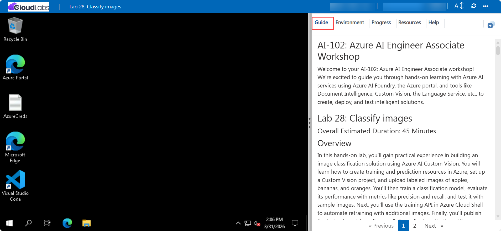

# AI-102: Azure AI Engineer Associate Workshop

Welcome to your AI-102: Azure AI Engineer Associate workshop! We’re excited to guide you through hands-on learning with Azure AI services using Azure AI Foundry, the Azure portal, and tools like Document Intelligence, Custom Vision, the Language Service, etc., to create, deploy, and test intelligent solutions.

# Lab 28: Classify images

### Overall Estimated Duration: 45 Minutes

## Overview

In this hands-on lab, you’ll gain practical experience in building an image classification solution using Azure AI Custom Vision. You will learn how to create training and prediction resources in Azure, set up a Custom Vision project, and upload labeled images of apples, bananas, and oranges. You’ll then train a classification model, evaluate its performance with metrics like precision and recall, and test it with sample images. Next, you’ll use the training API in Azure Cloud Shell to automate retraining with additional images. Finally, you’ll publish the trained model, configure a Python client application with your prediction resource, and run the app to classify new images. By the end of this lab, you’ll be proficient in training, deploying, and consuming a Custom Vision model and integrating it into real-world client applications.

## Objectives

By the end of this lab, you will be able to:

1. **Create Custom Vision resources:** Provision both training and prediction resources in Azure to support image classification.

2. **Set up a Custom Vision project:** Create a new project in the Custom Vision portal and configure it for fruit classification.

3. **Upload and tag images:** Add images of apples, bananas, and oranges to the project and assign appropriate tags for training.

4. **Train and evaluate a model:** Run a training iteration, review performance metrics like precision and recall, and validate the model’s accuracy.

5. **Test the model with sample images:** Use Quick Test to submit images and review classification probabilities.

6. **Use the training API in Cloud Shell:** Configure authentication, clone the repository, and run Python code to automate model retraining.

7. **Publish the trained model:** Link the model to your prediction resource and make it available for use in applications.

8. **Build and run a client application:** Configure a Python client app with prediction details, test classification on sample images, and view probability scores.

## Pre-requisites

* Basic understanding of **computer vision concepts**, including image classification and tagging.
* Familiarity with the **Azure portal**, including how to create and manage resources.
* Experience using **Azure Cloud Shell** for running Python scripts and managing environments.
* An active Azure subscription with permissions to create Custom Vision resources in the assigned resource group.
* Basic knowledge of **Python programming** and working in a terminal or shell environment.

## Architecture

The lab architecture demonstrates how Azure AI Custom Vision enables image classification by combining resource provisioning, model training, and client application integration:

1. **Custom Vision Training and Prediction Resources:** Provision two resources in Azure, one for training the image classification model and another for serving predictions through an endpoint.

2. **Custom Vision Portal:** Create and manage a project in the Custom Vision portal, upload and tag images, and train the classification model.

3. **Azure Cloud Shell:** Configure a development environment in Cloud Shell to install dependencies, clone code repositories, and run Python scripts for automated training and testing.

4. **Python Client Application:** Build and configure a Python app that connects to the published prediction resource, submits test images, and retrieves classification results with probability scores.

## Architecture Diagram

## Explanation of Components

1. **Custom Vision Training Resource:** Provides the environment to build, train, and manage an image classification model by uploading and tagging images.

2. **Custom Vision Prediction Resource:** Exposes a secure endpoint that allows client applications to submit images and receive classification results with probability scores.

3. **Custom Vision Portal:** A web-based interface to create projects, tag training data, train models, and publish them to the prediction resource.

4. **Azure Cloud Shell:** A browser-based terminal environment used to set up dependencies, clone the lab repository, and run Python scripts to interact with the Custom Vision services.

5. **Python Client Application:** A sample application that connects to the prediction resource, sends images for analysis, and retrieves classification results programmatically.

# Getting Started with lab

Welcome to your AI-102: Azure AI Engineer Associate workshop! We’ve prepared an interactive environment for you to explore generative AI concepts and work with Microsoft Azure services like Azure AI Foundry, Document Intelligence, Custom Vision, Language Service, etc. Let’s get started and make the most of this hands-on experience.

## Accessing Your Lab Environment
 
Once you're ready to dive in, your virtual machine and **Guide** will be right at your fingertips within your web browser.
 

### Virtual Machine & Lab Guide
 
Your virtual machine is your workhorse throughout the workshop. The lab guide is your roadmap to success.

## Lab Guide Zoom In/Zoom Out
 
To adjust the zoom level for the environment page, click the **A↕: 100%** icon located next to the timer in the lab environment.

## Exploring Your Lab Resources
 
To get a better understanding of your lab resources and credentials, navigate to the **Environment** tab.
 

## Utilizing the Split Window Feature
 
For convenience, you can open the lab guide in a separate window by selecting the **Split Window** button from the top right corner.
 

## Lab Progress

You can use the **Progress** tab to track your progress while working on the lab. A score will be provided after successful validation.

## Managing Your Virtual Machine
 
Feel free to **Start, Restart, or Stop (2)** your virtual machine as needed from the **Resources (1)** tab. Your experience is in your hands!
 

## Let's Get Started with Azure Portal
 
1. On your virtual machine, click on the Azure Portal icon as shown below:
 
   

1. In the sign-in window, kindly sign in using the provided Azure credentials

    - **Email/Username:** <inject key="AzureAdUserEmail"></inject>

        

    - **Password:** <inject key="AzureAdUserPassword"></inject>

        

1. If prompted to **Stay signed in?**, you can click **No**.

    

1. If a **Welcome to Microsoft Azure** pop-up window appears, simply click **Maybe later** to skip the tour.

    

## Support Contact
 
The CloudLabs support team is available 24/7, 365 days a year, via email and live chat to ensure seamless assistance at any time. We offer dedicated support channels explicitly tailored for both learners and instructors, ensuring that all your needs are promptly and efficiently addressed.
 
Learner Support Contacts:
 
- Email Support: cloudlabs-support@spektrasystems.com
- Live Chat Support: https://cloudlabs.ai/labs-support

Click on **Next** from the lower right corner to move on to the next page.

   

## Happy Learning !!