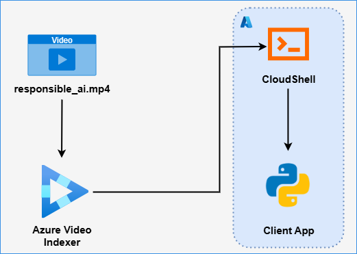
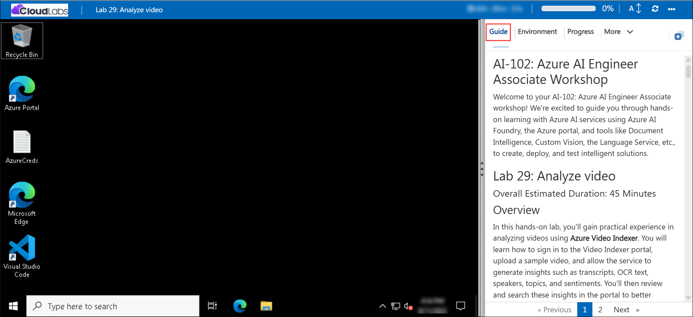

# AI-102: Azure AI Engineer Associate Workshop

Welcome to your AI-102: Azure AI Engineer Associate workshop! We’re excited to guide you through hands-on learning with Azure AI services using Azure AI Foundry, the Azure portal, and tools like Document Intelligence, Custom Vision, the Language Service, etc., to create, deploy, and test intelligent solutions.

# Lab 28: Analyze video

### Overall Estimated Duration: 45 Minutes

## Overview

In this hands-on lab, you’ll gain practical experience in analyzing videos using **Azure Video Indexer**. You will learn how to sign in to the Video Indexer portal, upload a sample video, and allow the service to generate insights such as transcripts, OCR text, speakers, topics, and sentiments. You’ll then review and search these insights in the portal to better understand the video’s content and context. Next, you’ll retrieve your account details and API key, configure a PowerShell script in **Azure Cloud Shell**, and use the **Video Indexer REST API** to authenticate and interact with your videos programmatically. Finally, you’ll extend the solution by embedding **Video Indexer widgets**, including the Player and Insights, into a simple HTML page, making video content and insights accessible outside the portal. By the end of this lab, you’ll be proficient in using Video Indexer both through the portal and via APIs, and in integrating video insights into custom applications. 

## Objectives

By the end of this lab, you will be able to:

1. **Upload and index a video in Video Indexer:** Sign in to the portal, upload a sample video, and trigger automatic indexing.

2. **Review extracted insights:** Explore transcripts, OCR text, speakers, topics, entities, and sentiments identified from the video.

3. **Search for insights within a video:** Use the portal to locate specific labels, keywords, or topics and navigate to their occurrences.

4. **Work with the Video Indexer REST API:** Authenticate using account credentials, request an access token, and retrieve video metadata programmatically.

5. **Obtain and manage API details:** Locate your account ID, subscription keys, and configure them for REST API access.

6. **Execute REST API calls from Cloud Shell:** Run provided PowerShell scripts to interact with the Video Indexer service and view JSON responses.

7. **Embed Video Indexer widgets:** Integrate the Player and Insights widgets into a web page to share videos and insights with others.

## Pre-requisites

* Basic understanding of **video analysis concepts**, including transcription, OCR, and entity recognition.
* Familiarity with the **Azure portal**, including navigating and managing resources.
* Experience using **Azure Cloud Shell** for running scripts and editing files.
* An active Azure subscription with permissions to access **Video Indexer** and related resources.
* Basic knowledge of **REST APIs** and using tools like PowerShell or cURL to make HTTP requests.
* General comfort with **HTML editing** to embed widgets into a webpage.

## Architecture

The lab architecture demonstrates how **Azure Video Indexer** enables video analysis by combining resource access, REST API integration, and client application development:

1. **Video Indexer Portal:** A web-based interface to upload videos, review insights, and explore features such as transcripts, OCR, topics, keywords, and sentiment analysis.

2. **Azure Cloud Shell:** Provides a browser-based environment to configure dependencies, clone the lab repository, and run PowerShell scripts for API interactions.

3. **Video Indexer REST API:** Exposes secure endpoints that enable authentication, video management, and retrieval of video insights programmatically.

4. **PowerShell Scripts:** Automates REST API calls from Cloud Shell, including authentication, video indexing, and querying insights.

5. **HTML Client Application with Widgets:** Embeds Video Indexer **Player** and **Insights** widgets into a web page, allowing interactive playback and insight exploration outside the portal.

## Architecture Diagram

## Explanation of Components

1. **Video Indexer Portal:** Provides a web-based environment to upload videos, run indexing, and review insights such as transcripts, OCR results, keywords, topics, and sentiments.

2. **Azure Cloud Shell:** A browser-based terminal environment used to clone the lab repository, configure scripts, and run PowerShell commands to interact with the Video Indexer REST API.

3. **Video Indexer REST API:** Exposes secure endpoints that enable authentication with an account ID and API key, allowing programmatic access to video indexing and insights.

4. **PowerShell Scripts:** Sample scripts used in Cloud Shell to authenticate with the REST API, manage videos, and retrieve JSON-based insights.

5. **HTML Client Application with Widgets:** A basic web app that embeds the Video Indexer **Player** and **Insights** widgets, enabling interactive playback and exploration of extracted insights outside the portal.

# Getting Started with lab

Welcome to your AI-102: Azure AI Engineer Associate workshop! We’ve prepared an interactive environment for you to explore generative AI concepts and work with Microsoft Azure services like Azure AI Foundry, Document Intelligence, Custom Vision, Language Service, etc. Let’s get started and make the most of this hands-on experience.

## Accessing Your Lab Environment
 
Once you're ready to dive in, your virtual machine and **lab guide** will be right at your fingertips within your web browser.
 

### Virtual Machine & Lab Guide
 
Your virtual machine is your workhorse throughout the workshop. The lab guide is your roadmap to success.

## Lab Guide Zoom In/Zoom Out
 
To adjust the zoom level for the environment page, click the **A↕: 100%** icon located next to the timer in the lab environment.

## Exploring Your Lab Resources
 
To get a better understanding of your lab resources and credentials, navigate to the **Environment** tab.
 

## Utilizing the Split Window Feature
 
For convenience, you can open the lab guide in a separate window by selecting the **Split Window** button from the top right corner.
 

## Lab Progress

You can use the **Progress** tab to track your progress while working on the lab. A score will be provided after successful validation.

## Managing Your Virtual Machine
 
Feel free to **Start, Restart, or Stop (2)** your virtual machine as needed from the **Resources (1)** tab. Your experience is in your hands!
 

## Let's Get Started with Azure Portal
 
1. On your virtual machine, click on the Azure Portal icon as shown below:
 
   

1. In the sign-in window, kindly sign in using the provided Azure credentials

    - **Email/Username:** <inject key="AzureAdUserEmail"></inject>

        

    - **Password:** <inject key="AzureAdUserPassword"></inject>

        

1. If prompted to **Stay signed in?**, you can click **No**.

    

1. If a **Welcome to Microsoft Azure** pop-up window appears, simply click **Cancel** to skip the tour.

    

## Support Contact
 
The CloudLabs support team is available 24/7, 365 days a year, via email and live chat to ensure seamless assistance at any time. We offer dedicated support channels explicitly tailored for both learners and instructors, ensuring that all your needs are promptly and efficiently addressed.
 
Learner Support Contacts:
 
- Email Support: cloudlabs-support@spektrasystems.com
- Live Chat Support: https://cloudlabs.ai/labs-support

Click on **Next** from the lower right corner to move on to the next page.

   

## Happy Learning !!